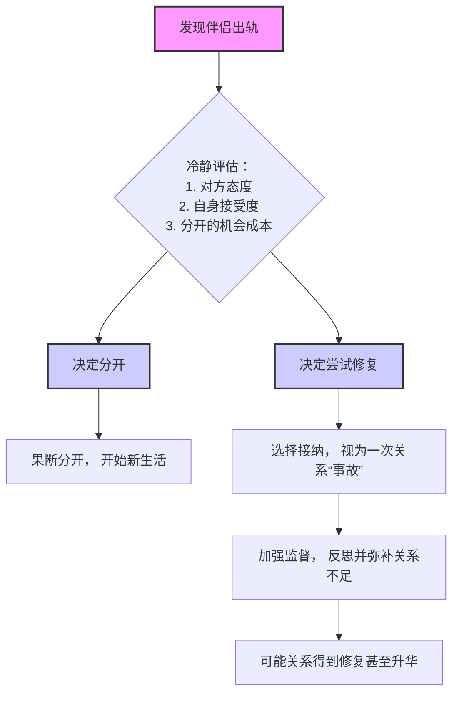

# 性心理分析：02：出轨的本质与应对

## 概述
在本节课中，我们将从性心理学的角度，分析“出轨”这一普遍社会现象的本质。我们将探讨出轨背后的生物本能、心理动机，并基于这些理解，提供一些维护亲密关系的思路和降低出轨风险的建议。

---

上一节我们概述了本节课的核心内容。本节中，我们来看看关于出轨的第一个常见疑问。

### 男人都喜欢出轨吗？
这是许多女性咨询者经常提出的问题。这个问题没有绝对的答案，因为每个人的选择不同。不过，我们可以通过数据来观察大致的趋势。

以下是基于一些调查的数据参考：
*   **潘绥铭教授团队（2015年）** 的长期调查显示：大约每3个丈夫中就有1个曾出轨，每7.5个妻子中就有1个曾出轨。
*   **腾讯问卷（样本量6万）** 的调查显示：60.2%的男性和38.1%的女性曾出过轨。

因此，结论是：**并非所有男性都喜欢出轨，但出轨的比例确实不低。同时，女性的出轨率也值得关注。** 出轨在某种程度上已成为一种社会常态。

这自然引出了我们的下一个问题。

### 出轨是因为道德滑坡吗？
出轨行为确实会造成伤害和背叛，因此是不道德的。绝大多数出轨者自身也明白这一点，并承受内心煎熬，但他们依然选择了出轨。

如果只有个别人出轨，我们可以归咎于个人道德问题。然而，当出轨成为一种大面积的社会现象时（如上述数据所示），仅用“道德滑坡”来解释就显得不够充分了。一味进行道德批判，可能无助于我们理解现象背后的复杂原因，甚至会增加自身的焦虑。

那么，除了道德视角，我们还能从哪个角度思考呢？答案是：**人性，特别是性心理的角度。**

### 从性心理看出轨：本能与制度
人类本身具有**多偶倾向**。这是深植于生物本能中的特性。
*   男性由于生理特点和社会文化原因，这种倾向表现得更明显，其天性中包含竞争和广泛传播基因的驱动。
*   女性同样有多偶倾向，但在历史中，由于生育的高风险和为后代寻求更好庇护的需要，对伴侣的选择更为挑剔。随着避孕技术发展和女性独立性提高，女性的多偶倾向也更多地显现出来。

两个具有多偶倾向的个体结合，要求一生只与一人保持亲密关系，这本身具有一定挑战性。在生活中，我们很难保证永远不会对伴侣之外的异性产生好感。

心理学上有一个概念可以解释亲密关系中的倦怠感：**柯立芝效应 (Coolidge Effect)**。
> **典故**：美国总统卡尔文·柯立芝和夫人参观农场。夫人听说公鸡一天交配数十次，便让农场主“把这事告诉总统”。总统听后问：“每次都是和同一只母鸡吗？”农场主答：“不，是和许多不同的母鸡。”总统于是说：“请把这个告诉第一夫人。”

这个效应描述的现象是：**哺乳动物在性行为后，会对原有配偶产生短暂倦怠；但如果引入新的配偶，性兴趣又会恢复。** 这在长期稳定的亲密关系中很常见，表现为性频率下降。而当新的、有吸引力的异性出现时，个体可能会重新焕发激情。**男女都会受到柯立芝效应的影响。**

如果说**多偶倾向**和**柯立芝效应**是出轨的潜在本能动机，那么**侥幸心理**则是促使行动的直接原因。当人们认为行为“可能不会被发现”时，侥幸心理就会滋生。

反观**一夫一妻制的婚姻**，它在一定程度上压抑了人类的多偶本能，但其制度设计本身较为粗糙：**缺乏有效的监督和奖惩机制**，主要依靠个人的信念和道德来维持忠诚。这种制度缺陷，为大面积侥幸心理的出现提供了土壤，从而引发了大量的出轨现象。

因此，一个核心观点是：**出轨是本能，忠诚是选择。** 许多出轨者最初并非不爱伴侣或彻底爱上了别人，多是出于新奇、刺激，并怀着“尝鲜后能回归”的侥幸心理。

为了更形象地理解制度监督的重要性，我们可以看一个现实案例：**香港廉政公署 (ICAC) 的成立**。在上世纪六七十年代，香港贪污腐败严重。1974年，完全独立于原有公务员体系的廉政公署成立，实现了真正有效的监督，从而极大地遏制了贪污。这个案例说明，**在缺乏监督的环境下，基于人性弱点的行为（如贪污、出轨）更容易泛滥。**

所以，从性心理和社会制度的角度看，**大面积的出轨现象，婚姻制度的缺陷所负的责任，可能大于个人的过错。**

了解了出轨的普遍原因后，我们来看看男女在出轨模式上的一些差异。

### 男女出轨的差异
男性和女性的出轨对象及动机存在一些常见差异，这反映了性心理的不同：

以下是基于咨询经验总结的一些常见模式：
*   **女性出轨对象**：更多集中在同事、朋友、同学或前男友等有情感基础的熟人之间。
*   **男性出轨对象**：更多涉及陌生人，随意性更高。
*   **女性出轨时机**：更多发生在与伴侣吵架、冷战等关系紧张时期。
*   **男性出轨时机**：与伴侣关系好坏关联度相对较低，即使关系和谐也可能出轨，有时甚至为了验证自身魅力而出轨。

因此，当发现伴侣出轨时，不必立即陷入彻底的自我批判，认为一定是自己哪里没做好。有时，这仅仅是因为对方遇到了“合适的机会”（天时地利人和）。特别是男性，其出轨对象可能条件远不如伴侣，这往往并非出于比较，而仅仅是“贪图新鲜感”。

听到这里，你可能会感到失望或无力。但我们的目的不是制造焦虑，而是理解本质后，更好地经营关系。接下来，我们将探讨如何降低伴侣出轨的几率。

### 如何降低伴侣出轨的几率？
基于前面的分析，我们可以从以下几个方面着手：

以下是几个核心建议：
1.  **承认出轨是人性的一部分**：这不是鼓励出轨，而是让你理性看待其可能性。这有助于你在关系出现问题时更早察觉并用心经营，而不是在事发后单纯指责。同时，这也能让你在万一面对事实时，不至于完全慌乱。出轨是常态，可怕的是因慌乱而将事情推向更糟。
2.  **增加关系中的“监督”与透明度**：弥补婚姻制度中监督机制的不足。注意，这不是指监控手机或行程，那会破坏信任。而是指：
    *   **增加高质量相处与沟通**。
    *   **共同规避高风险情境**（例如，避免伴侣长期单独与异性出差）。
    *   **考虑签订婚前/婚内协议**：在律师协助下，明确出轨可能带来的后果（如财产分割、抚养权归属），这能形成有效的震慑，压制侥幸心理。
3.  **减少对方的“补偿心态”**：如果一个人在婚姻中长期缺失某些需求（如价值感、亲密感、性满足），他/她可能向外寻求补偿。
    *   **关注对方的价值感**：尤其在对方事业受挫时，给予及时的欣赏和肯定。
    *   **提高双方的性收益**：将性生活视为一种“收益”（包括生理和心理满足）。如果性行为带来的总体体验是正向的、愉悦的，伴侣就更倾向于维持这段关系内的性活动。这需要双方保持开放沟通，共同学习和探索。

最后，我们来探讨那个最棘手的问题。

### 当伴侣出轨后，该怎么办？
首先，尽量冷静。记住，这未必是天塌下来的大事，可能是许多亲密关系都会经历的考验。

处理步骤可以概括为以下决策流程：

需要了解的是，**男性出轨往往与感情剥离度较高，回归家庭的可能性相对较大；而女性出轨通常身心投入更深，回归的比例相对较低。**

如果你选择修复关系，关键在于：
*   **建立个人内在独立**：**不要将安全感、价值感和归属感完全依附于对方。** 确保即使没有对方，你依然可以活得很好。这种内在的力量，是你在创伤中恢复、并理性做出选择（无论是离开还是继续）的根基。
*   **将危机转化为检验**：出轨可以成为一个残酷的“年审”，迫使双方审视关系中长期被忽视的问题。如果处理得当，经历考验后的关系有可能变得更加坚固和亲密。

---

## 总结
本节课中，我们一起学习了：
1.  出轨并非个例，而是一种有一定普遍性的社会现象。
2.  仅从道德角度批判难以理解出轨全貌，需要结合**人性（多偶倾向、柯立芝效应）** 和**制度缺陷（缺乏监督引发的侥幸心理）** 来分析。
3.  男女出轨在对象和动机上存在一些常见差异。
4.  降低出轨风险的方法包括：理性认知、增加关系透明度与“监督”、提升彼此在关系中的收益（特别是情感价值与性满足）。
5.  面对出轨，核心是保持冷静，评估后做出适合自己的选择。无论选择哪条路，**建立独立的内在自我**都是走出困境、获得新生的关键。

希望本次从性心理角度进行的分析，能为你提供看待“出轨”问题的新思路。