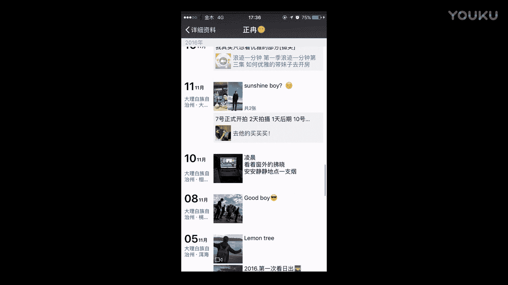

# 正冉装逼：十三：如何与女生合影 📸

在本节课中，我们将学习如何与女生合影，并将照片作为“预选”素材发布到朋友圈。课程将涵盖拍照技巧、话术、形象管理以及朋友圈展示策略，旨在帮助初学者掌握自然、得体的合影方法。

## 核心误区与正确方法

首先，需要避免一个常见误区。许多男生与女生合影时，总是自己手持手机进行拍摄。这种方式显得刻意且价值感低，女生会明显感觉到你是主动凑过去的。

正确的合影方法如下：当你和女生在一起时，你应该说：“我觉得你的拍照技术比较好，你来拍吧。” 使用这个话术，可以立即将手机交给女生，让她为你拍照。

在她拍摄时，你应该站在她的后方。这样做有两个好处：
1.  降低你的需求感。
2.  利用透视原理显得你的脸更小。

你可以让她多拍几张，并尝试不同角度。男生的表情必须到位。

## 进阶技巧与互动

在拍完自拍照后，还有一个方法可以顺势获取联系方式。你可以说：“我觉得你是女生，修图应该更在行。” 然后顺势将照片发给她，请她帮忙修图。这样，你就能自然地获取她的微信号码。

经过上述步骤，你得到了一张自拍照。由于自拍时可以看到屏幕中的自己，角度已经调整好，因此这张照片通常只需要加滤镜，无需过多修饰。

## 反面案例分析

然而，在网上搜索“Showgirl合影”，可以看到许多失败的例子。这些合影看起来非常不协调。

例如这张照片，两位女生妆容精致，穿着可爱性感，但中间的男生发型凌乱，下身穿着迷彩裤，上身搭配不当。整体画风极不和谐。

许多男生与这类女生合影都存在搭配不当的问题。

再看这张照片，男生脖子上挂着工作人员或参与者的证件，与身边四位女生的形象完全不符，显得很“low”。他穿着格子短袖衬衫（注意：衬衫不宜穿短袖款式），表情漫不经心，与身边同样随意的女生一起，使得整个画风显得很傻。

## 正确合影的核心原则

与女生合影，正如之前短片所讲，核心是让女生拿手机。这能显得你脸小，并且降低你的需求感。话术可以是：“你拿手机拍吧，找你最好的角度，我衬托你就好。”

主要目的是在她拿手机后，你不会显得需求感很强。避免像许多人合影那样，男生抱着手机冲过去，如同粉丝与明星合影，这会显得价值很低。

## 正面范例解析

以下通过我的朋友圈实例，展示正确的合影方式。

你可以看到，我与女生的合影都注重互动。

例如这张照片，是女生小雪拿手机拍摄的。

再看这张多人合影，是我拿的手机。我之所以选择与一群人合影，是为了避免他人误以为她是我的女朋友。展示我与视频部的朋友同事在一起，可以起到避嫌作用。

例如这张与女孩萱萱的合影，她拿着自拍神器，我只需在旁边互动即可。画风协调。

还有这张我、老吴和笑笑的三人合影，画风也不奇怪。两人与一个女生合影，同样能避免被误认为是情侣关系，起到避嫌作用。

与这个女孩合影时，我们也有一些互动。但最后还是要放上与一群人的合照，因为当时我们在拍摄东西。

我们的穿衣搭配看起来也不奇怪。

这样站在一起也是OK的。

这张则有点搞笑。

例如这张与笑笑的合影，虽然是我拿手机拍的，但后面有很多人作为背景。

最后我还是要放上与一群人的合照。我们俩的穿着看起来也挺搭配。

还有很多与女生的合影。例如这张，我的服装（白衬衫）与女生（白裙子）很配套。流程是：她拿手机拍一张，我拿手机拍一张，再让助理拍一张大全景，最后她再拿手机拍一张与助理的大全景。

这些图片不需要过多修饰，因为角度在自拍时已选好，效果很自然。

此时，你可以变换一些表情。例如与女生相视而笑、互动如搂肩开心大笑、一起对镜头搞怪、或假装生气。这些都是与女生合影的好方法。切记，合影不可太死板。

## 核心要点总结

本节课我们学习了与女生合影的几个关键点。

以下是必须遵循的核心原则：
1.  **必须与女生有所互动**。这是让合影显得自然、不生硬的基础。
2.  **双方服装搭配不能太奇怪**。风格应尽量协调，避免产生突兀感。
3.  **为了避嫌**。因为你还需要接触其他女生，不能让她们误以为合影女生是你的女朋友。因此，要多拍摄与一群人的合影。
4.  **朋友圈展示策略**。不要总是发布与同一个女生的合影。你必须与不同的女生合影，这样才能证明你只是因为工作等原因认识这些女生，她们并非你固定的追求对象。这样会让其他女生觉得你身边出现众多女性是合理的。

此外，你的表情也要做到位，切勿太死板。有时一个真诚的笑容就能感染很多人。

本节课我们一起学习了如何与女生进行自然、得体且有策略的合影，从操作方法、形象管理到展示逻辑都有了系统的认识。希望大家能够掌握并运用这些技巧。

