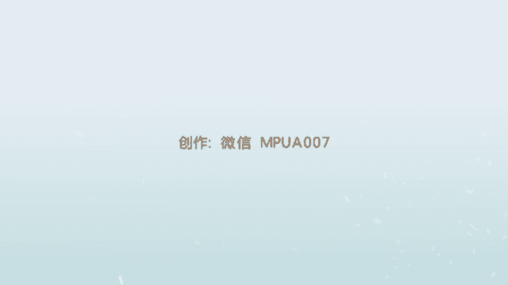
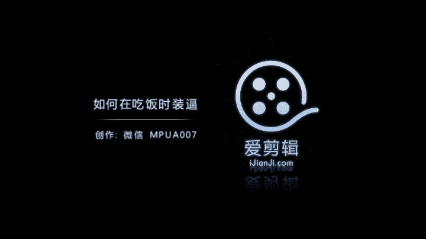

# 正冉装逼：第五集：如何在吃饭时装逼 🍽️

在本节课中，我们将学习如何在餐厅环境中拍摄和发布高质量的朋友圈内容，以提升个人形象。课程将涵盖从餐厅选择、拍摄构图到后期修图的完整流程，旨在帮助初学者掌握一种更高级、更自然的“装逼”技巧。

## 餐厅选择与环境

上一节我们介绍了课程的整体目标，本节中我们来看看如何选择合适的餐厅作为拍摄背景。

首先，要发布高质量的美食内容，必须选择一家环境不错的餐厅。我们目前所在的是一家环境良好的成都泰式餐厅。

你可以观察餐厅的周围环境，特别是灯光效果。良好的环境是拍摄成功照片的基础。

## 拍摄理念与构图

在选好餐厅后，我们来看看具体的拍摄理念。很多人在发布美食内容时，习惯为每一道菜单独拍照，并凑齐九张图发布朋友圈。

我们认为这种方式已经过时。因为将每道菜都拍照发布，可能会让人觉得你不常来这类餐厅，是在刻意炫耀。

我们的理念是：要表现得像是经常光顾这类餐厅。因此，拍照时应显得随意，无需拍摄每一道菜。

拍摄要点是：只拍一张包含菜品和人物的整体照片即可。构图要端正，可以选择正方形构图，将菜品和人物的半身都框进画面中。

拍摄时，人物可以坐在那里，头部稍微看向其他方向，不要直视镜头。

## 发布技巧

拍好照片后，我们来看看如何发布。发布朋友圈时，只需定位到这家餐厅。

懂行的人点击餐厅定位后，微信会自动链接到大众点评页面。对方就能看到这家餐厅的人均消费，从而了解餐厅的档次。

以下是需要避免的常见错误：
*   不要为每一道菜都单独拍照。
*   不要拍摄一张饭菜的照片，再拍一张自拍照，然后一起发布。这会显得很“low”。

最好的方法是：让菜品摆在你面前，你端坐在构图中央，请朋友或同伴帮你拍摄一张。

## 后期修图实战

现在，我们进入后期修图环节，将刚才拍摄的照片处理得更好。

我们选择了一张合适的照片进行修图。对于包含人脸的照片，一定要使用 **`FaceTune`** 这款应用。

我们打开 **`FaceTune`** 并导入照片。首先使用“平滑”功能处理皮肤瑕疵。

但“平滑”功能会削弱脸部的立体感，例如眉骨和鼻子的高光。因此，我们需要使用擦除工具，将需要保留高光和立体感的部位（如眉骨、鼻梁）还原出来。

处理完皮肤后，点击确认。接着，使用“细节”功能，涂抹眉毛和眼睛区域，让眼神显得更加锐利。也可以适当处理配饰（如项链），增加细节感。

保存初步处理后的照片。接下来进行色调调整。由于这张照片人物脸部背光，直接使用滤镜（如 **`VSCO`**）可能导致脸部过暗，效果不佳。

因此，我们决定使用另一款软件：**`MIX`** 滤镜大师。这是课程中首次介绍这款软件。

**`MIX`** 内置了大量滤镜，操作简单，可以直接套用。它也支持手动调整参数，功能与 **`VSCO`** 相似。

对于这张照片，我们不追求自然效果，而是想要一种夸张的风格。**`MIX`** 中有一个“素描”滤镜包，可以将照片处理成夸张的绘画效果。

在众多样式中，我们选择了一种比较喜欢的风格。保存应用滤镜后的照片。

由于滤镜效果在脸上留下了明显的纹理，我们再次打开 **`FaceTune`**，使用“修复”功能，去除脸上过于明显的杂色和花纹，让脸部看起来更干净。

至此，一张经过精心处理的照片就完成了。最终效果具有漫画感，色彩明亮，阴影关系被淡化，整体画面独特。

## 软件推荐与总结

本节课我们一起学习了餐厅拍照的全过程，并推荐了修图软件 **`MIX`**，它提供了丰富的滤镜可供选择。

最后，请务必记住就餐拍照的核心原则：**不要为每一道菜都拍照**。最好是让菜品摆在你面前，拍摄一张包含你本人的整体照片。这就是我们推崇的“无形装逼，最为致命”的方式。

如果大家有任何问题，可以在群内@我，或私信我的售后微信。我将在群里与大家交流修图、人生感悟等内容。

再见。

