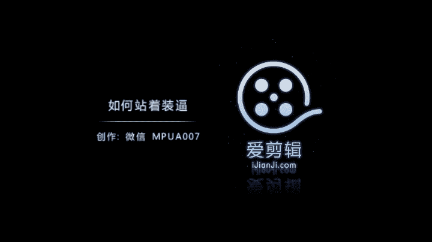

# 正冉装逼：第四集：如何站着装逼 📸

在本节课中，我们将学习如何在公共或私密场合通过摆姿势来拍出有质感的照片。我们将从选择环境、着装、拍摄技巧到后期修图，系统地讲解如何避免“游客照”，拍出具有“大片感”的照片。

## 环境与着装选择

上一节我们介绍了课程目标，本节中我们来看看拍摄前的准备工作：环境与着装。

许多人在户外拍照时，姿势显得呆板，例如直接站在原地拍照，效果不佳。要拍出大片感，需要专门的拍摄方法。

我们现在位于成都太古里，这是一个环境与装扮都不错的商圈。你可以在自己的城市找到类似的环境进行拍摄。

由于那边人很多，我不希望照片中出现杂乱的背景人物。因此，我选择了一个安静无人但环境很好的位置，即图中所示的通道。这里环境幽静，泛着幽幽蓝光，是我想要营造的氛围。

关于着装，在夏天，男生可以穿得干净整洁。例如，我外面穿了一件白色T恤，显得很阳光。许多女孩表示喜欢看男生穿白T恤。裤子我穿了一条黑色的收脚裤，可以在Zara买到。脚上穿了一双AG品牌的篮球鞋。

## 全身照拍摄技巧

上一节我们选择了合适的环境与着装，本节中我们来看看如何拍摄一张出色的全身照。

拍摄全身照或大背景照片时，背景要求很高，但对脸部要求较低。你可以通过穿衣风格和姿势来展现个人感觉。

拍摄时需要注意以下关键点：

以下是全身照拍摄的核心要点列表：
*   **脚部处理**：相框最底部不能切到你的脚，否则会有被肢解的感觉。同时，底部留空也不能太大，否则人会显得矮。
*   **最佳构图**：如果脚在某个位置，相框底部边缘最好在脚前方一点点，这样拍出来的效果最佳。

现在我们来拍一张。我让摄影师蹲下，做一个仰头看的动作，这样会显得身高比较高。

这是我们刚才拍到的照片。如图所示，脚底板最下面的边缘刚好在脚的最下方，这样整个人看起来特别高大。背景泛着幽幽的光，并有太阳光洒下。

如果你的个子不高，建议穿高帮鞋和收脚裤，这样可以拉长脚部曲线。再加上仰头看的动作，能显著拉高身高比例，使人看起来高大帅气。

这是在一条小通道里做的全身演示。如果要拍出文艺感的全身照，切记眼睛要少看镜头。可以看左、右、上、下甚至后方，但不要盯着镜头。盯着镜头会产生第二人称视角，让看照片的人感觉你在对视，容易“出戏”。应该营造第三人称视角，让他人感觉是在观察你的生活。

## 后期修图实战（VSCO）

上一节我们完成了拍摄，本节中我们进入修图环节，使用VSCO软件处理刚才在太古里小巷拍的照片。

在众多姿势中，我最满意的是仰头的那张照片。低头会显得人矮，而仰头能拉伸颈部和身体，显得更高，有1.9米的即视感。

现在讲解如何处理这张图。首先，打开VSCO软件并导入图片。

以下是使用VSCO修图的具体步骤：
1.  **基础调整**：我偏好手动调整而非直接使用风格化严重的滤镜，以使照片看起来更自然。点击最左边的原始图进行编辑。
2.  **对比度**：先将对比度加到**+2**，让颜色更鲜明。
3.  **曝光与清晰度**：曝光一般前期已设定好，通常不调。清晰度调到**+2**，不要太高以免影响皮肤。适当锐化让图片更清晰。
4.  **饱和度**：决定照片的色彩方向。往右颜色更浓，往左更素。这张图我往左调**-2**，走素雅风格。
5.  **高光与阴影**：不常用。如果过曝可用“高光减淡”，过暗可用“阴影补偿”提亮。本图两者都不需要。
6.  **色温与色调**：色温越右越偏黄/红，越左越偏蓝。本图往左调**-2**，营造偏蓝感觉。色调可稍往紫红色方向微调，让皮肤看起来更好。
7.  **肤色**：调整皮肤颜色。越右越黄，越左越红。我选择让皮肤稍红一点。
8.  **暗角**：一定要加暗角，可以突出人物主体。
9.  **保存**：调整完成后，保存到相册。

修图后的照片变得很阳光、干净，人脸很白、明亮。对比原图（很黄，有种黄黄的感觉），修过的图片色彩清晰，人脸白皙干净。

## 背面拍摄与后期技巧

刚才演示了如何拍正面照，现在我们来演示如何拍摄背面照。

拍背面和正面一样，需要抓住环境，并根据环境选择拍摄角度、站位和动作。

我们现在找到一片池塘。我在思考如何利用这片池塘拍出不错的照片。我想到一个好办法：背对着它拍摄。如果人面对池塘拍后面的水，会显得很傻。正确的方法是**人看着水，拍摄者拍人的背面和池塘**。

我站在池塘V字形的角上，让摄影师蹲下拍摄。可以将手机横拍以捕捉全景，但这样拍出来的人会显得比较扁。不过没关系，我们可以在后期将人修瘦。

我就这样站着，手不插袋。这张照片感觉不错，两边的池塘和杂人都很少，我站在屏幕中央。虽然我显得比较矮矬，但后期可以修出修长的感觉。

**核心原则**：如同“背靠山面朝海”，拍海或大型背景时，应背对它们，而不是将其当作背景墙去合影。

背对站立时也有技巧：不能驼背或东倒西歪。可以尝试一只脚在前一只脚在后，或者两只脚在后、脚尖垫起。从后面拍照时，机位要更低或更偏，因为背面拍摄容易显得人背厚、屁股大，从而显胖。这些问题可以通过后期修图解决。

## 后期修图实战（Facetune）

上一节我们拍摄了背面照，本节中我们使用Facetune软件来解决人物显胖的问题。

我在水池旁拍了几张照片，选择了构图呈对角线的几张。问题在于照片中的人看起来非常胖，屁股也很大，整个人显得又粗又短。而且这是一张长方形的图，更不利于展现身材。

没关系，我们使用之前教过的软件Facetune。

以下是使用Facetune修瘦身的步骤：
1.  打开Facetune，导入需要修改的照片。
2.  选择“重塑”功能中的“**镜头**”工具。
3.  使用该工具将图片**向内推压**，人物会立刻显得纤细很多，同时全景也得以保留。

经过调整，人物看起来瘦了很多，整个大全景也尽收眼底。

本节课中我们一起学习了如何通过选择环境、注意着装、运用正确的拍摄姿势（特别是全身照和背面照的要点）以及使用VSCO和Facetune进行后期修图，来拍出高大、帅气且有质感的“装逼”照片。记住，自然的环境互动、恰当的姿势和精细的后期处理是成功的关键。