# 正冉装逼：1：明确主题与基础修图 🎬

在本节课中，我们将学习如何拍摄并修饰一张有“逼格”的照片。核心在于理解照片的主题、构图与人物表现，并掌握基础的后期处理技巧。前期拍摄是基础，后期修图是润色。

## 明确主题 🎯

一张好的照片必须有一个明确且鲜明的主题。无论是表现人物、事物、故事还是情节，主题都必须清晰，让人一眼就能理解你想传达的核心。

## 主体与加分项的关系 🤝

想让照片给人留下深刻印象，你需要让照片中的主体（如人物）与加分项（如环境、道具）产生互动。这种互动能营造出“无形装逼最为致命”的效果。

## 构图的重要性 🖼️

如果只是随意留念，可以忽略构图。但若想用手机拍出“大片”效果，就必须注意对焦、光源、角度和构图。这些是提升照片质感的关键。

## 美化（修图）的作用 ✨

修图是照片后期处理的重要环节，但它并非最重要的一点。最重要的依然是前期的拍摄。修图的作用在于润色和优化，我会将修图技巧融入后续的具体案例中进行讲解。

---

上一节我们概述了拍出好照片的四个核心要点。本节中，我们来看看如何具体地“明确主题”。

### 主题的传达

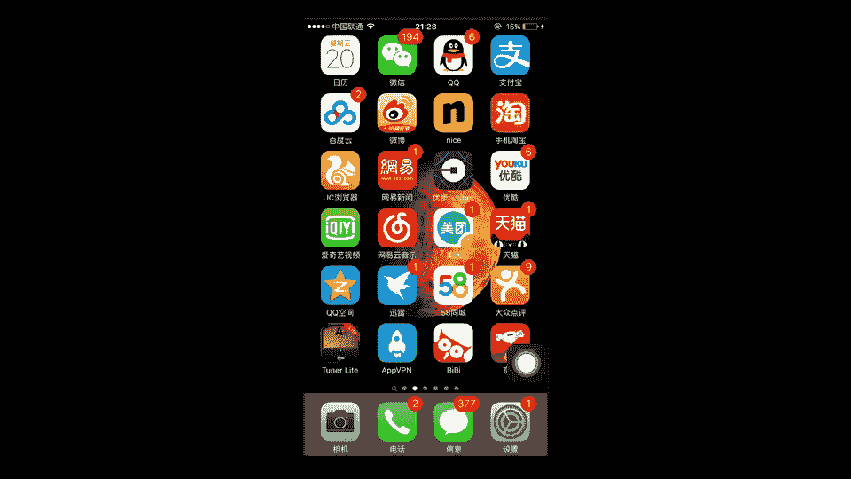

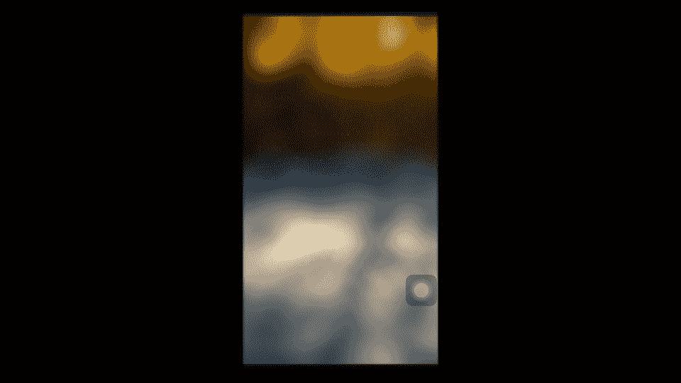

明确主题，意味着你要清晰地向观众（例如朋友圈的“妹子”）传达你想表现的“格调”。听起来有些抽象，我们通过实例来说明。

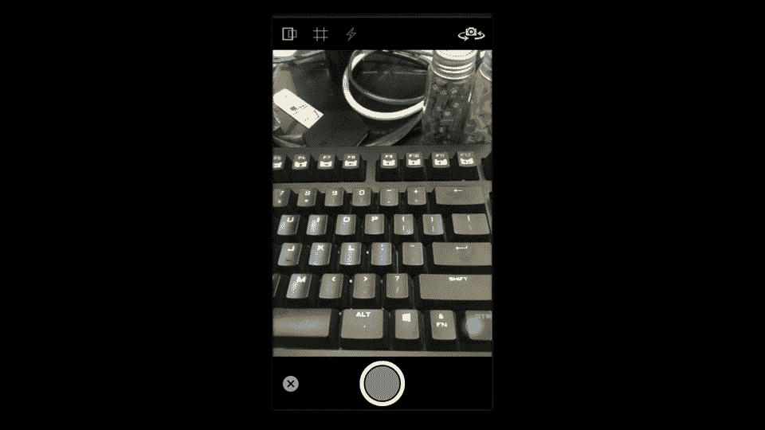

以下是几个明确主题的要点：

1.  **美食主题**：美食是一个很好的切入点。但需要注意，如果你走高端路线，朋友圈的定位就不能是人均消费几十元的大众餐厅，否则会显得“low”。如果走特色好玩路线，则要找有特色且消费不高的地方。
2.  **人物形象**：朋友圈中的人物形象至关重要。首先，外形（主要指穿衣打扮和个人风格）不能“挫”。拥有独特的风格（例如小清新混搭嘻哈风）能让你在他人眼中更有辨识度。
3.  **露脸的重要性**：朋友圈中一定要有自己的脸。表达方式可以是自拍或他拍，但男生频繁自拍可能显得怪异。建议多采用他拍，仅在有趣或恶搞时自拍。
4.  **肢体语言与景别**：朋友圈的照片应有不同的景别，以全面展示人物。
    *   **特写**：突出面部表情，刻画人物形象。如果长相出众，可多用；如果长相普通，则不宜过多。
    *   **近景**：取景到胸口或腹部，能很好地展示肢体语言和着装。
    *   **中景**：取景到大腿或小腿中部。**切记**，裁剪线不能在关节处，而应在躯干之间，否则人物会有被“肢解”的怪异感。中景能展示腿部姿态和裤子等服装。
    *   **全景**：人物全身入镜。这能完整展示身体、服装风格和肢体语言，对脸部的依赖减弱，整体辨识度更高。但需要找到简洁或大气的背景。

### 背景的处理

不同景别对背景的要求不同：
*   **特写**：背景务必干净整洁，避免复杂环境。
*   **近景/中景**：通常建议将背景虚化，以突出人物。
*   **全景**：背景可以复杂，但取景画面要干净，人物在环境中不能显得太“low”。

---

上一节我们讨论了如何通过主题和人物表现来构建照片的“格调”。本节中，我们来看看如何利用后期软件来实现背景虚化等效果，让主体更突出。

我将介绍两款软件：**Tadaa SLR**（用于精确背景虚化）和**Facetune**（兼具背景虚化与人像美化功能）。它们都是付费软件，总价约30元，但物有所值。

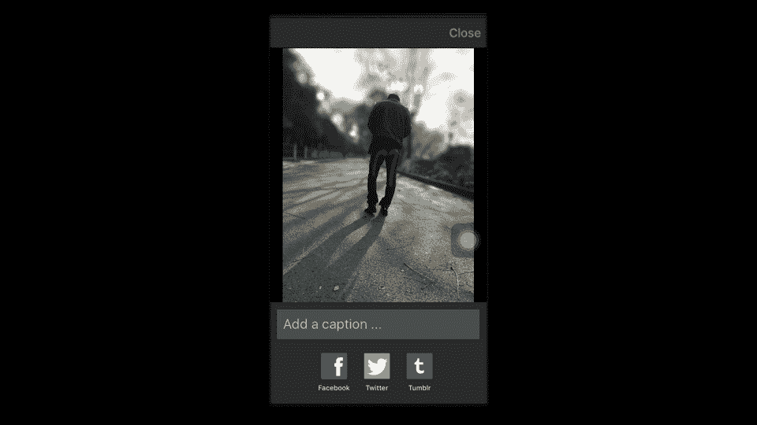

### Tadaa SLR 使用教程

以下是使用 Tadaa SLR 进行背景虚化的步骤：

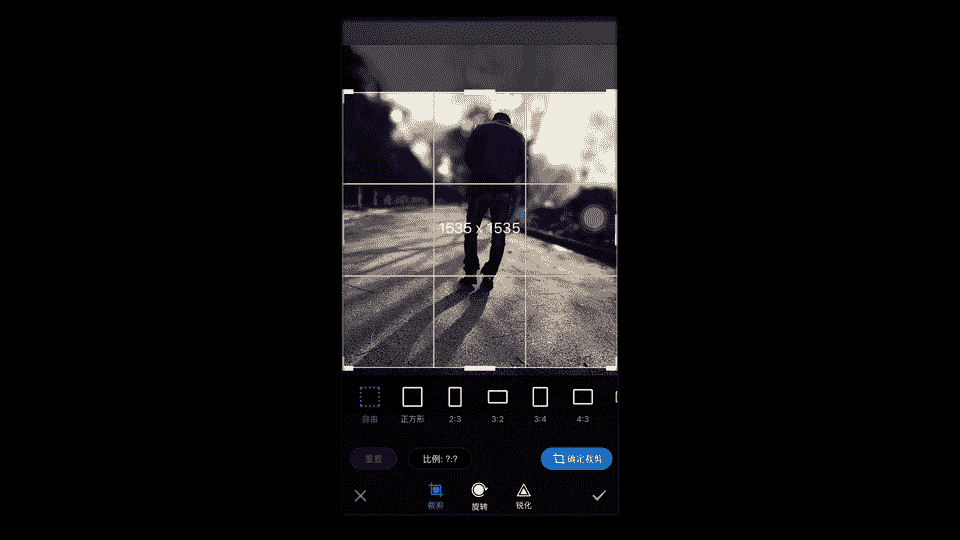

1.  打开 Tadaa SLR 应用。
2.  点击左下角的“×”按钮进入主界面。
3.  点击右下角相册图标，选择一张需要处理的照片（例如教程中提到的“浪哥”照片）。
4.  点击左下角的 **Mask** 按钮，并打开边缘识别功能（边缘按钮）。
5.  用画笔涂抹人物主体。软件会自动识别颜色相近的区域，但可能需要手动调整边缘细节（如放大图片进行精细涂抹）。
6.  主体涂抹完成后，点击 **Next**。
7.  在效果界面，选择 **Linear**（线性虚化）模式。
8.  调整虚化范围和强度，确保人物脚部与地面接触处是实的，避免人物“飘”在空中。
9.  点击完成，保存图片。

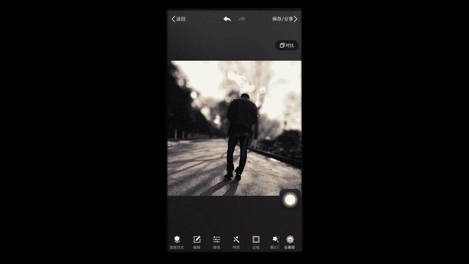

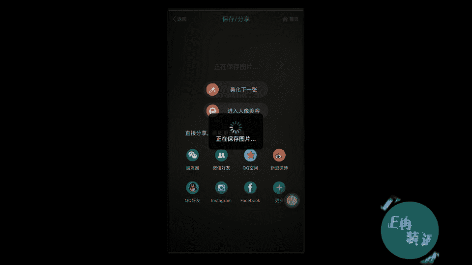

### 结合美图秀秀进行精修

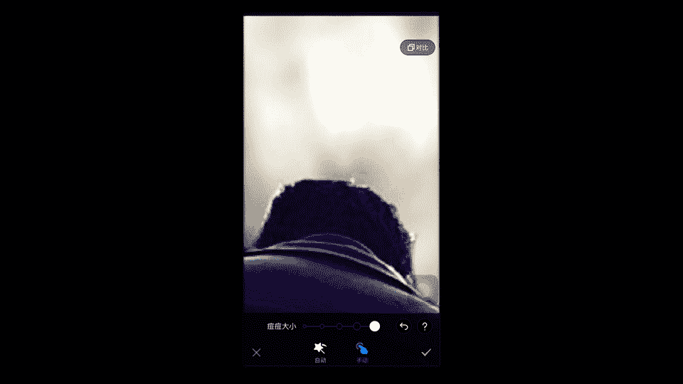

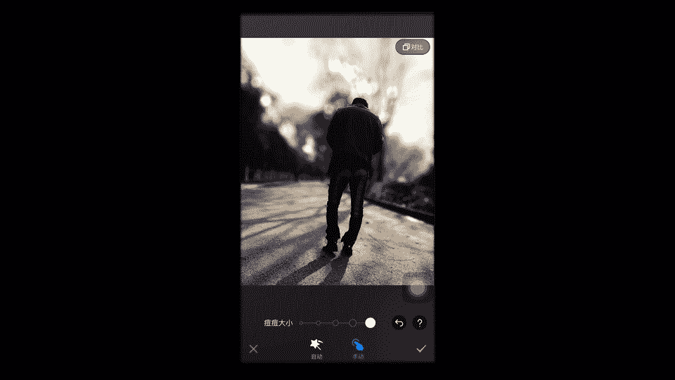

用 Tadaa SLR 处理后的图片，可以导入美图秀秀进行进一步美化：

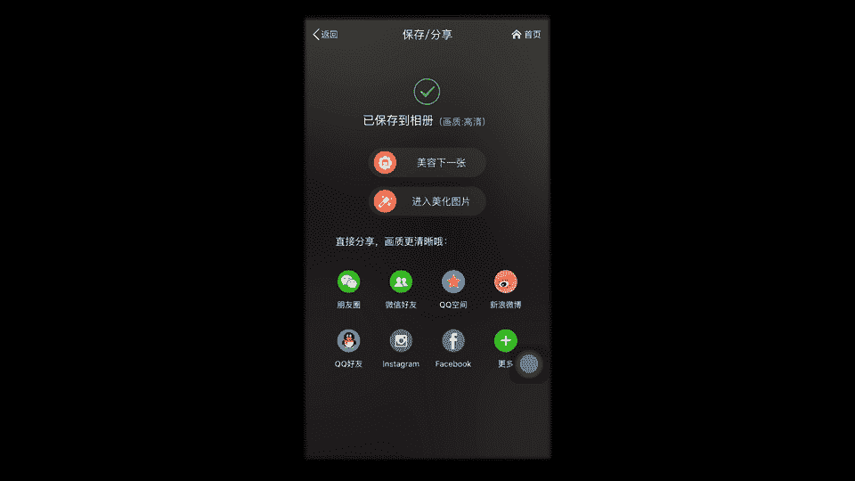

1.  在美图秀秀中打开处理后的图片。
2.  使用 **HDR** 效果增强清晰度（注意调整强度，避免颜色过重）。
3.  使用 **LOMO** 或 **淡雅** 等滤镜调整色调。
4.  利用 **裁剪** 功能，将图片调整为正方形构图，去除底部多余空间。
5.  进入 **人像美容** 功能，使用 **祛斑** 工具修复人物边缘的瑕疵。
6.  保存最终成品。

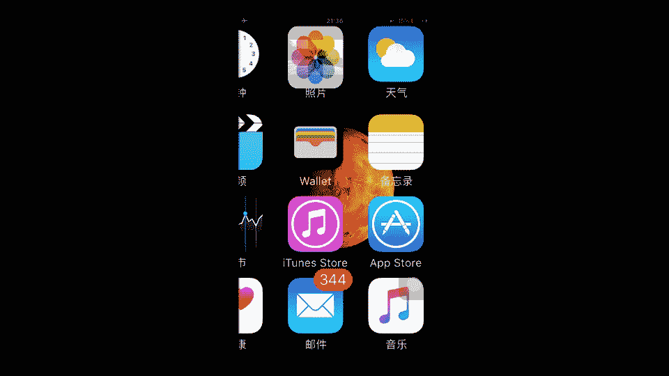

### Facetune 使用教程

以下是使用 Facetune 进行背景虚化和人像处理的步骤：

1.  打开 Facetune，导入照片。
2.  找到 **散焦** 或背景模糊工具，涂抹整个背景区域。如果人物部分也被模糊，没关系。
3.  使用 **橡皮擦** 工具，小心地将人物主体部分擦出来，使其恢复清晰。**特别注意**人物与背景的交界处，要精细擦拭，避免生硬的轮廓。
4.  经过多次模糊和擦除的调整，使人物从模糊的背景中凸显出来。
5.  保存图片。

### 使用 VSCO 进行色调调整

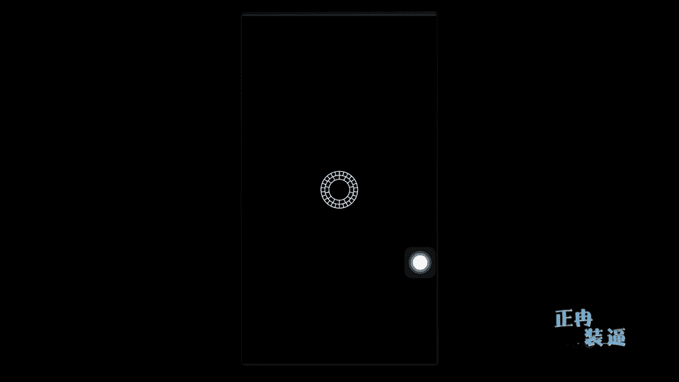

将 Facetune 处理后的图片导入 VSCO 进行调色：

1.  在 VSCO 中打开图片。
2.  选择合适的滤镜（例如针对公路照片的蓝绿色调滤镜）。
3.  进入 **工具** 进行微调：降低一点 **饱和度**，将 **色温** 向蓝色方向调整一点。
4.  添加一点 **暗角** 效果。
5.  以最大尺寸保存图片。

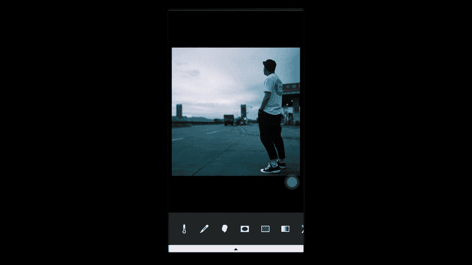

### 最终构图与保存

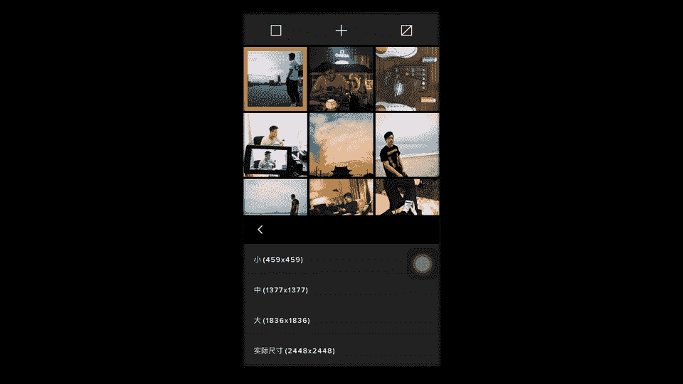

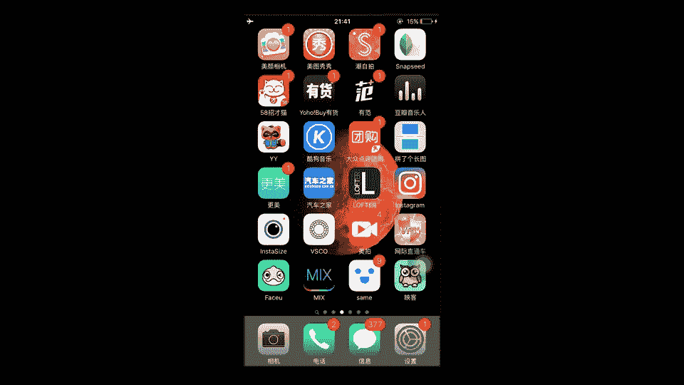

最后，再次使用美图秀秀进行最终构图：

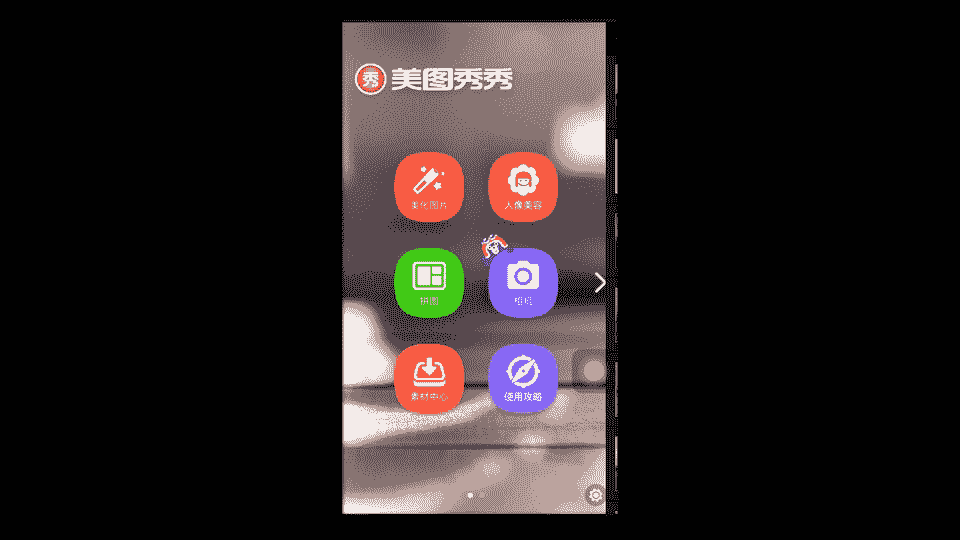

1.  在美图秀秀中打开调色后的图片。
2.  使用 **编辑** -> **比例**，选择正方形裁剪。
3.  **切记**裁剪时避免从关节处截断。例如，应从小腿中部裁剪，而不是膝盖。
4.  保存最终成片。

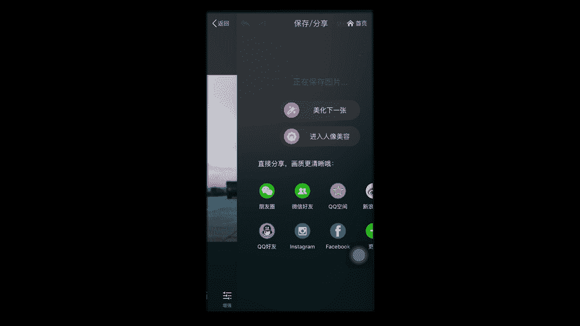

通过以上步骤，一张背景杂乱、主体普通的照片，就能变为背景虚化、主体突出、色调有“大片感”的优秀作品。

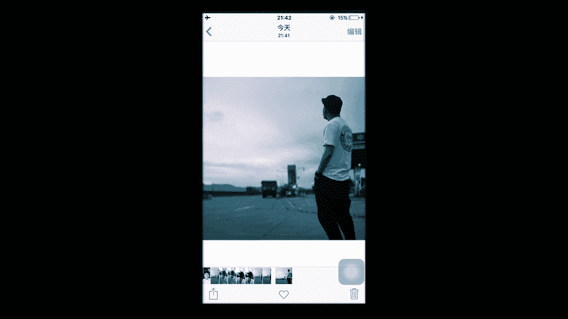

---

本节课中我们一起学习了如何为照片确立明确的主题，以及如何通过人物形象、景别和背景处理来强化主题。同时，我们详细演练了使用 Tadaa SLR、Facetune、VSCO 和美图秀秀等软件进行背景虚化、人像修饰和色调调整的完整流程。

记住，前期构思和拍摄是根基，后期修图是让作品更出色的重要手段。在接下来的课程中，我们将把这些大的知识点逐一拆解，深入探讨更多具体的拍摄与修饰技巧。

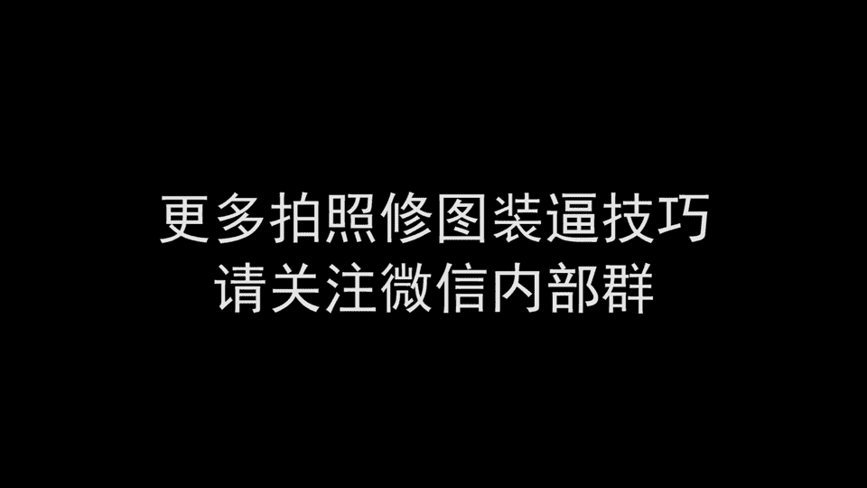

感谢观看第一集，敬请期待第二集。