# 正冉装逼：1：微信头像拍摄与精修指南 📸

在本节课中，我们将要学习如何为自己拍摄并精修一张高质量的微信头像。微信作为社交工具，头像在塑造个人形象、吸引他人注意方面起着至关重要的作用。我们将从拍摄前的准备、拍摄技巧，到使用手机软件进行精细修图，一步步带你打造出能代表个人风格的头像。

## 头像的重要性与选择原则

上一节我们介绍了课程概述，本节中我们来看看为什么微信头像如此重要。

微信是社交工具，无法做到现实中的面对面聊天。他人对你人品的判断，全部来自于头像、名字和朋友圈内容。在微信社交平台上，能代表个人形象的就是微信头像。

如果用微信聊天交友，只要不违反平台规则，使用任何头像都可以。但如果用个人号来吸引异性，就不能随便选择。必须选择一个符合个人风格（POA）的头像。

在微信世界里，他人唯一能记住我们个人风格的，就是我们的微信头像。很多时候，他人会因为对我们的头像产生好感，进而去看我们的朋友圈并了解我们。因此，微信头像必须认真选择，选择好后就不要轻易改变。

如果频繁更换头像或名字，他人就需要对我们进行再次记忆和重新认识。用微信吸引异性时，头像就是个人品牌的Logo，不能随便变更，必须选择一个适合的。

微信头像内容会引导他人联想微信号背后是一个什么样的人。很多时候，我们对某个网友是否有好感，并非来自于聊天，而是因为他的头像或朋友圈。有些头像会让人看了特别不舒服，甚至让人认为这类人不是好人。

浏览微信通讯录时，经常会因为对方的头像而记住他，当然也会因为反感的头像而讨厌他。在微信社交平台上，头像就代表自己。每个人出门都要把自己打扮得干干净净，微信头像也是同样的道理，要让别人看到并喜欢。

很多人去加异性的微信，一个成功的微信头像，很容易加到对方。在生活中，品牌Logo都经过专业设计，因为品牌Logo是一种记忆，是顾客对产品的信任。每次出门，人们也会精心打扮一番。对于头像，我的理解是你要拍出自己的风格，头像相当于人的第一印象。

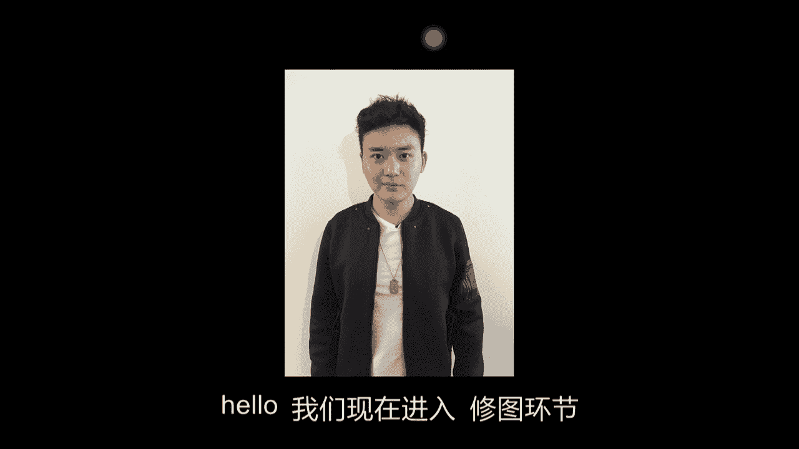

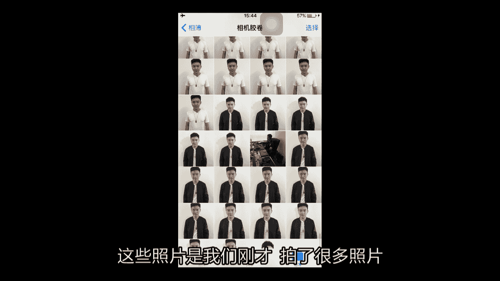

因为你每发一句话，对方就会看一次你的头像。如果你的头像很糟糕，估计对方聊两句就会和你说再见，估计你自己都看不下去。

## 拍摄前的准备与环境搭建

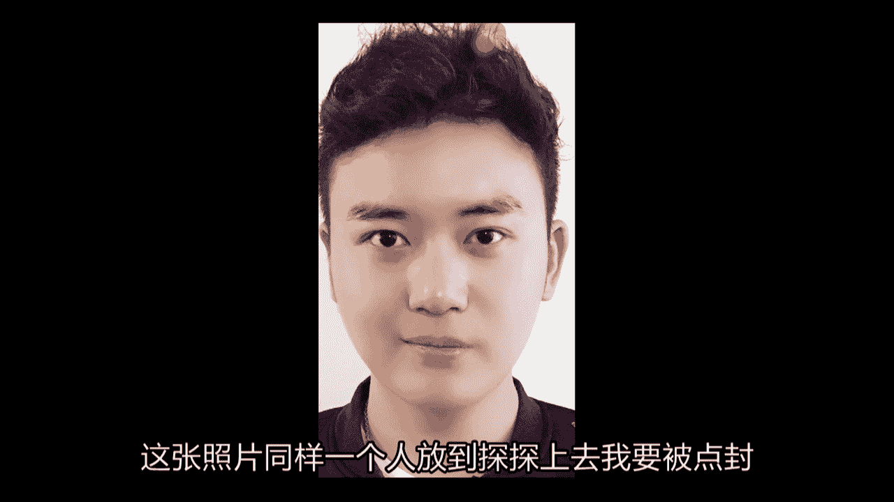

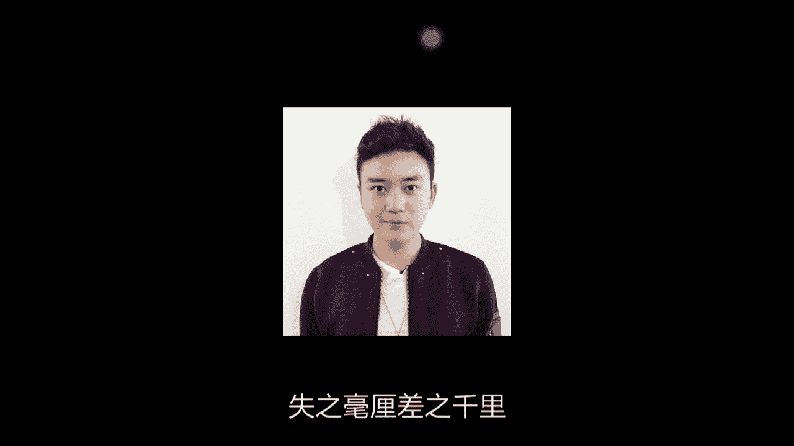

上一节我们了解了头像的重要性，本节中我们来看看如何为拍摄做准备。

我们开始头像的拍摄之旅。进入头像拍摄环节。像一些POA（如大姚、成群、老童）用作头像的，是他们生活中的自拍照片。随着课程深入，大家会慢慢学习到如何利用环境、角度和衣着拍摄那样的照片。

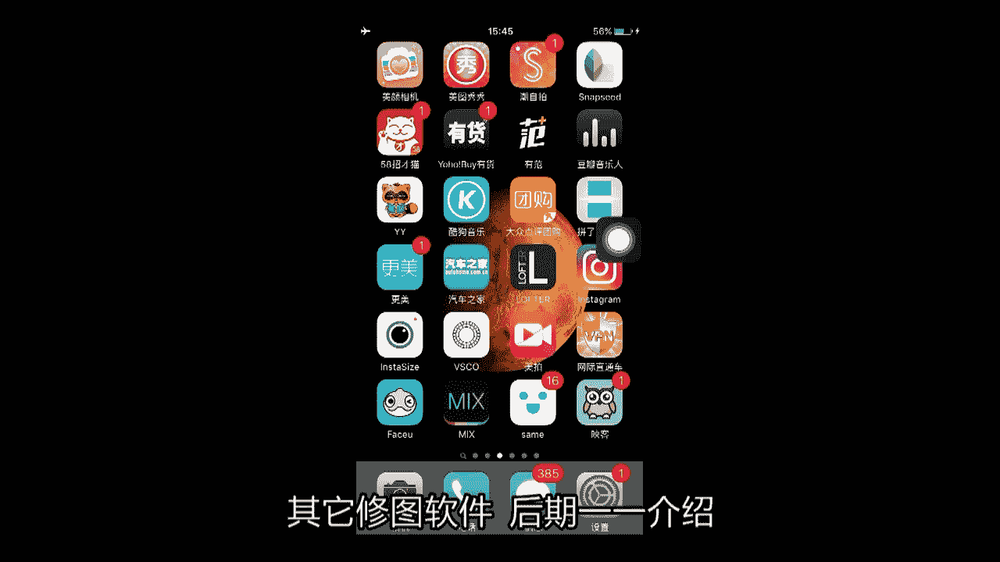

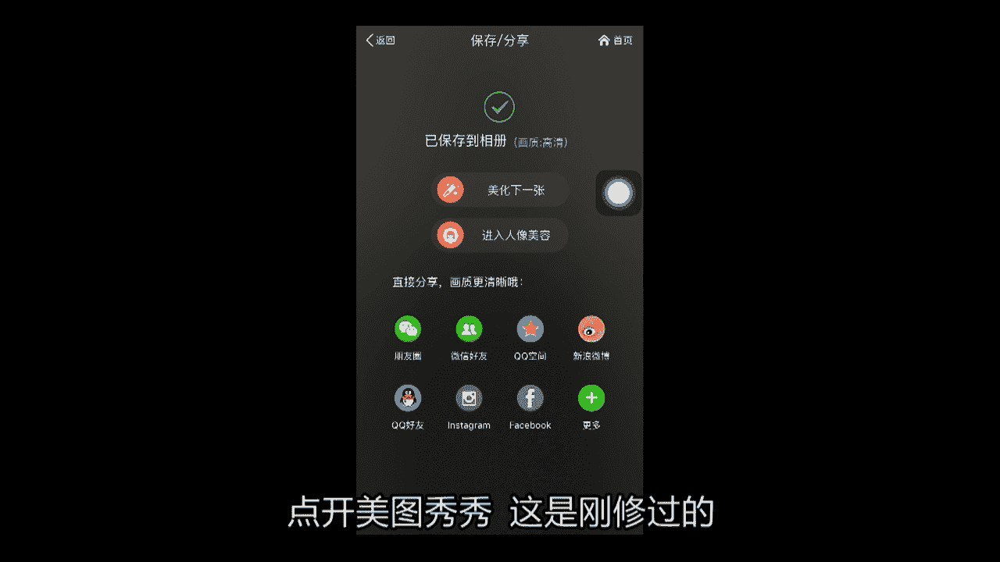

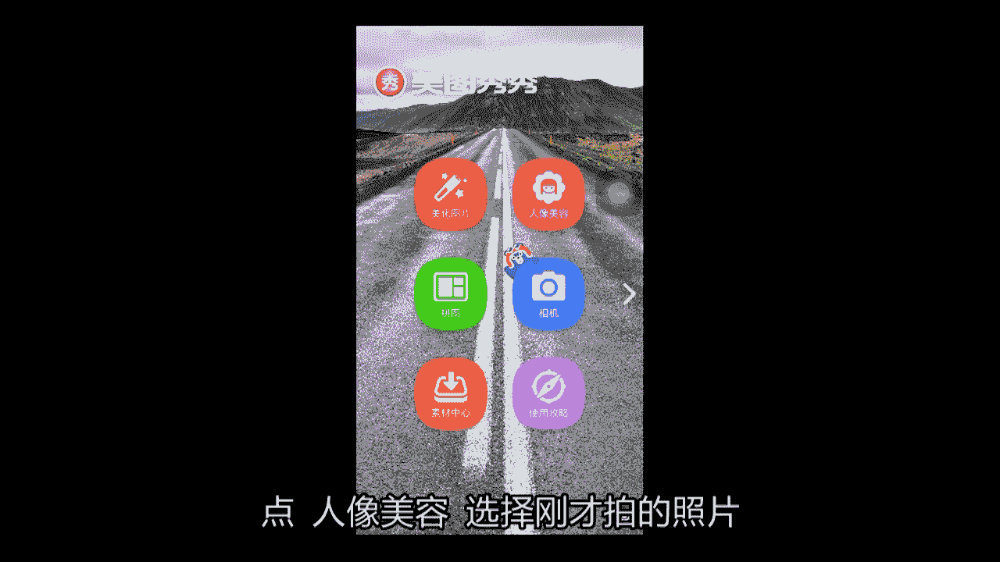

我们今天讲的是比较简单、我最喜欢用的照片类型：证件照风格的头像。比如“浪德”经常用的一张经过严重PS的头像，而我用的也是经过一些PS的头像。

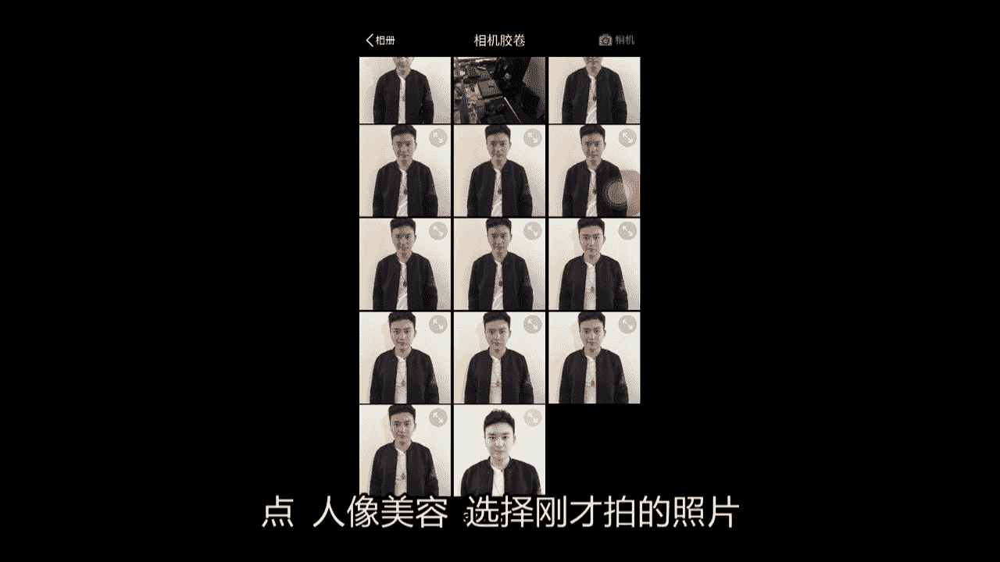

以下是拍摄前的具体准备步骤：

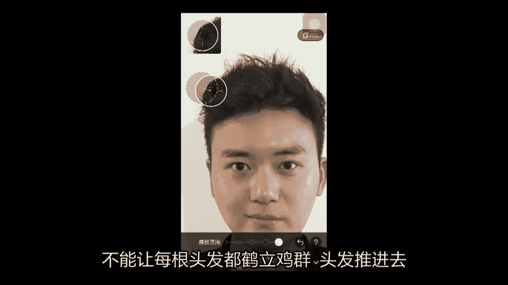

1.  **寻找背景**：首先，你要找到一堵白墙。如果找不到白墙，找灰色的墙也可以。
2.  **注意服装**：使用白墙时，千万不能穿白色衣服，否则整个人会和白墙融为一体。这时一定要穿一件其他颜色的衣服。比如我在这里借用了摄影师的一件黑色衣服。穿上后，肩膀轮廓会在白墙背景下脱颖而出。
3.  **布置灯光**：我们现在的灯光不好，像是照身份证照片的灯光，全是面光打过来，脸上没有太多阴影，整张脸很平面、很2D。但我的脸是3D的，我要让他人知道我的脸是3D形状，我不是卡通人物。这时我们要把灯关掉。
4.  **制造光影**：关灯后，我们需要一束光。可以从窗户那边打过来，正好加深这边的亮度，形成光影对比。这样一边脸比较亮，整个背后有了影子。

## 使用美图秀秀进行初步调整

上一节我们完成了拍摄，本节中我们进入修图环节，首先使用美图秀秀进行初步调整。

我们拍出了想要的照片，接下来进入修图环节。这些照片是我们刚才拍的，我选择了最后一张。拍出来大概是很丑的感觉。

经过修理后的图片，差距巨大。如果原图放到社交软件上，估计没人会点喜欢。但如果把修好的图放上去，估计会被点爆。这体现了科技的力量，以及会不会拍照、会不会修图带来的“失之毫厘，差之千里”的效果。

我们进入修图环节。首先，手机里一定要有两款软件：**美图秀秀**和**Facetune**。有这两个软件，基本上可以处理很多图片。其他修图软件，后期也会一一介绍。

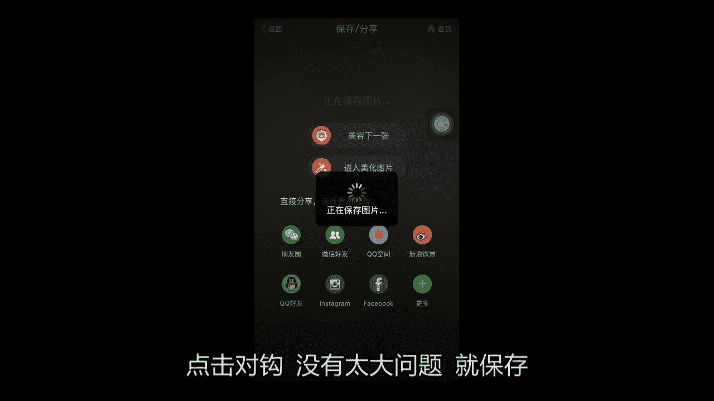

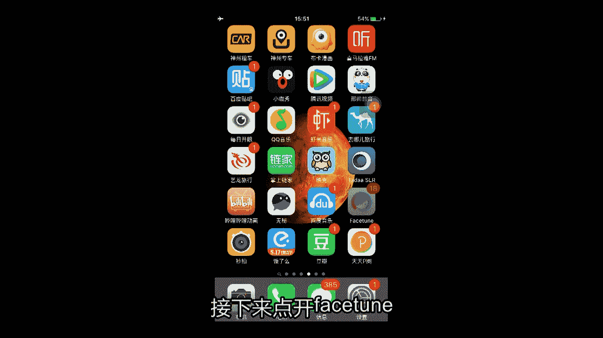

以下是使用美图秀秀的步骤：

1.  **打开软件并选择照片**：首先点开美图秀秀，进入“人像美容”，选择刚才拍的照片。
2.  **整体观察与发型调整**：打开照片后，我会整体看一眼自己，觉得哪里不对。首先我发现发型不对，现在的发型有一种平行四边形的感觉。我不喜欢，所以我点开软件最下面的“瘦脸瘦身”功能，把范围拉到最大。这个软件可以随意改造身体任何部位，改变其形状。我用来改变发型的形状，把凸出的头发推进去，把凹进去的地方推出来，最终变成一个我比较喜欢的圆形发型。
3.  **调整脸型**：接下来看脸有什么问题。我的脸这里凸出来了，我把它稍微往里推一下。另一边同样道理。因为我的笑是朝一边的诡异笑容，所以另一边显得比较肥，我把它往上提一下。这样就修改了一下脸型。
4.  **调整头肩比**：修改完脸型后，缩小图片看整体。我发现肩膀特别窄，因为衣服是M号，而我穿XXL，衣服不合身导致肩膀很窄，头很大。但头是越小越好，因为头小身体大，会显得人比较高挑，像吴亦凡和老外的感觉。很多老外穿西装很帅，因为他们是九头身，头小身体大，看上去特别舒适。如果头很大身体很小，就会显得人很窝囊。所以我们必须要让头变小，但头不可能拉小，所以要把身体放大，也就是肩膀。把肩膀尽量放宽。肩膀的宽度，尽量跟头部的宽度差不多，或者比头部再稍微宽一些，是比较合理的视觉享受。
5.  **调整嘴唇**：我还发现一个问题，继续点击“瘦身”。因为我是朝一边笑，所以嘴唇有点歪。这时我把嘴唇摆正，让嘴唇在中间位置。
6.  **保存图片**：调整完毕后，点击对勾，然后保存图片。

## 使用Facetune进行皮肤与细节精修

上一节我们用美图秀秀调整了轮廓和比例，本节中我们使用Facetune来处理皮肤质感与面部细节。

接下来我们点开Facetune。这张照片也是我刚才修理过的，我们不看，点击我们刚才保存的那张。

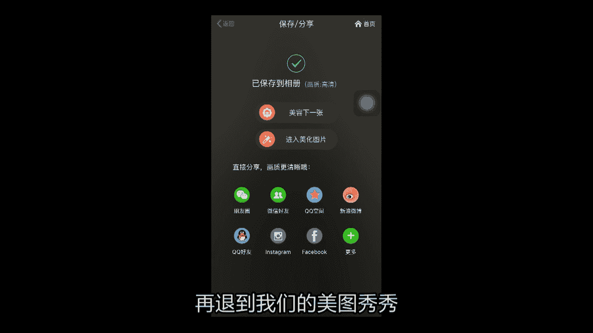

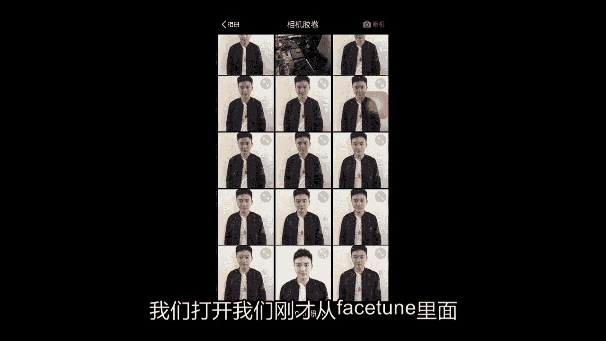

我发现脸上有很多高光地方，这是我脸上的油光，会显得很邋遢，要把它处理掉。脸上还有很多痘痘等皮肤问题。头像会把脸放大，所以不能让这些东西都出来。

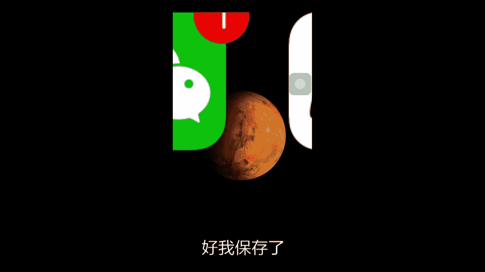

以下是使用Facetune的步骤：

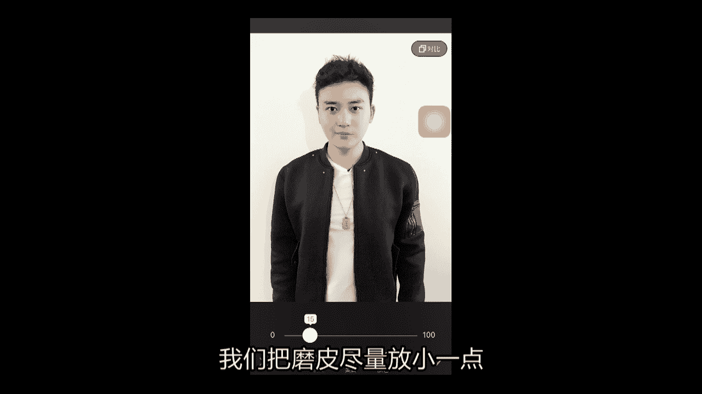

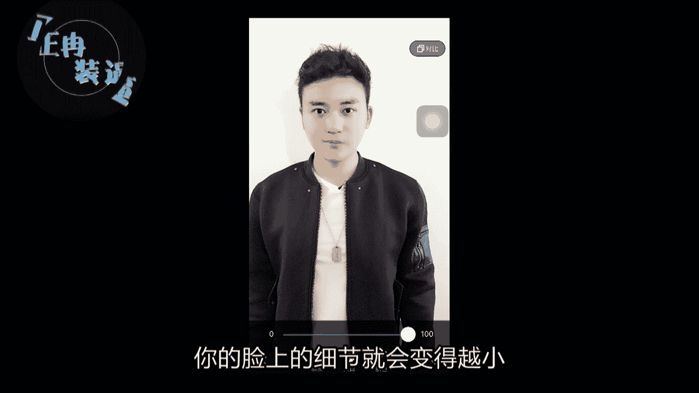

1.  **平滑皮肤**：点击左下角的“平滑”功能，把皮肤抹匀。千万不要抹到头发，只涂抹脸部，眉毛也要避开。痣可以涂一下，我一般不会去涂眼睛周围，因为眼睛周围颜色比较暗，会显得深邃。像黑色这种暗的地方，我都不去动它。法令纹要涂一下，因为法令纹会显得脸很老。像这种地方我都会涂，但要避开眼睛和鼻子。脖子等身体每一个露出来的部分都要去处理一下。处理完后，整个人就变得比较帅。
2.  **增强细节**：弄完平滑后，点击右上角的对勾，然后点击“细节”功能（倒三角符号）。用这个功能去涂抹眉毛，涂完眉毛整个脸上的精气神儿就出来了。再把眼睛的眼尾轻轻涂一下，千万不要涂太重。把上眼皮稍微涂一下，有点像女生画眼影的感觉。这样整个人的眼神就变得犀利，眼睛凸显了出来。
3.  **突出轮廓**：再把下巴和脖子的交界处涂抹一下，它会把你的下巴和脖子区别开，把整个脸凸显出来，感觉非常棒。
4.  **保存并返回**：点击右上角的小按钮保存，然后退出Facetune，回到美图秀秀。

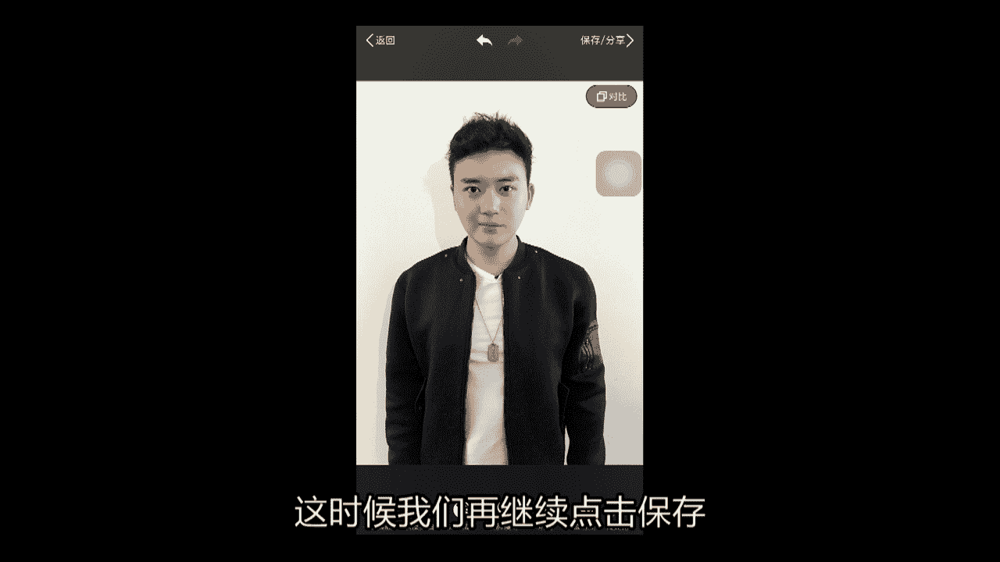

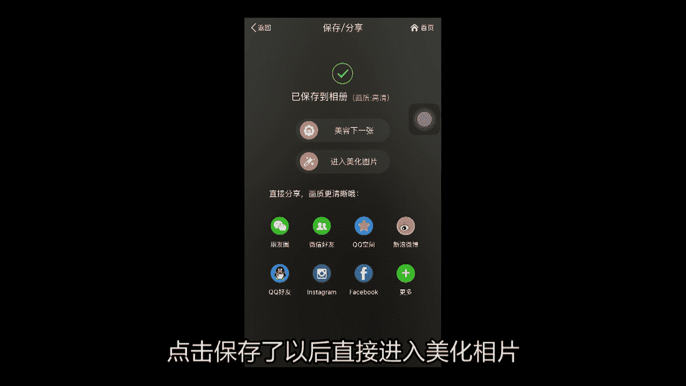

## 最终调色与构图裁剪

上一节我们处理了皮肤细节，本节中我们进行最后的调色、美白和构图裁剪，完成头像制作。

打开美图秀秀，找到从Facetune保存好的那张照片。

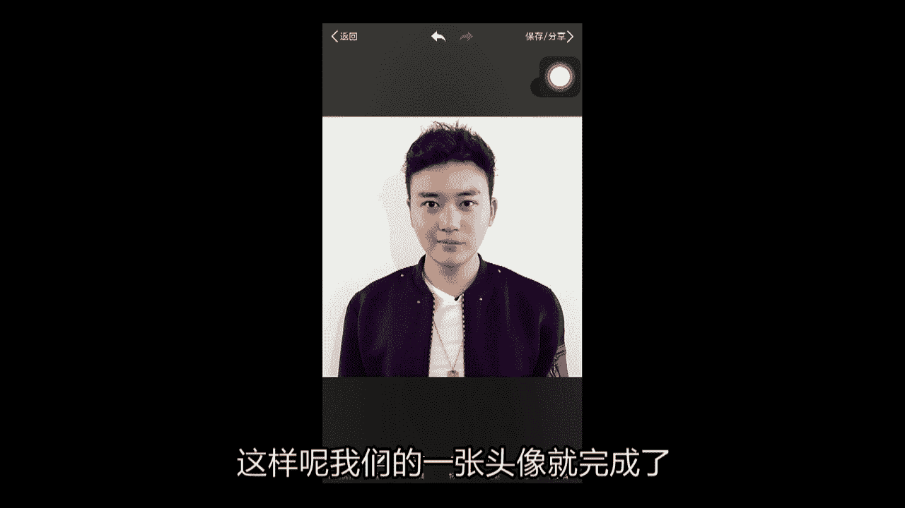

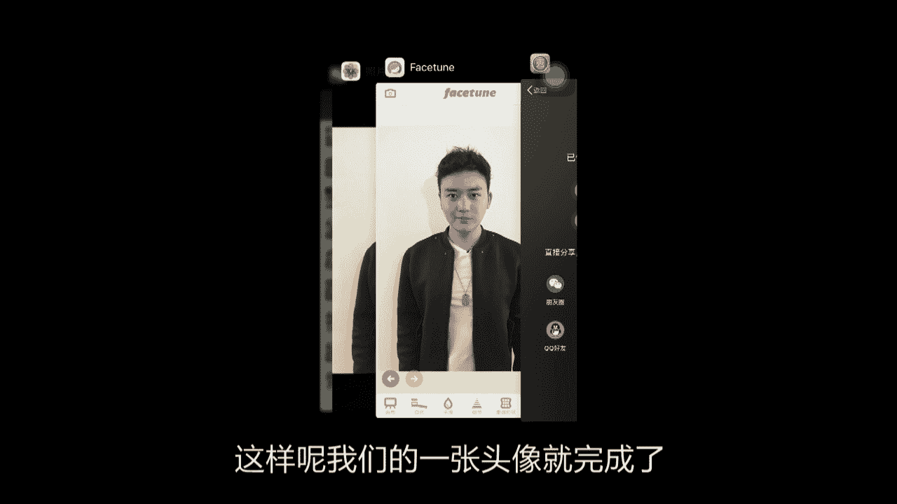

以下是最终调整步骤：

1.  **磨皮与美白**：点击“磨皮”和“美白”。把磨皮强度尽量放小一点，因为你擦得越大，脸上的细节就会变得越小。我们刚才打了光，所以把强度放到最小，这样脸上的阴影细节依然保留。点击“肤色”，把它往白色这边稍微拖一点。“美白”强度稍微往下降一点。点击对勾，整个图片就会变得比较白皙。
2.  **使用其他App增强质感**：保存后，可以进入其他照片编辑App（如“米画相片”）。点击“特效”，选择“Lomo”或“HDR”。HDR是把整个细节全部加深、凸显细节的选项。可以往上调一下，整个照片的颜色会变深，质感就显示出来了。
3.  **调整色调**：再点击“特效”，选择“Lowmon”下的“碧波”滤镜。如果往下调，画面会很黄；往上调，会有点蔚蓝色，显得人比较白皙。选择一个合适的位置。
4.  **构图与裁剪**：点击“编辑”比例，选择“正方形”。我们要打造一张正方形的照片，把它缩小。如果直接裁剪，两边的肩膀位置会显得很空白，不好看，因为要凸显你的脸。这时要把九宫格构图的框放小。最上面的第一根横线，大概在眼睛的位置。第二根横线，大概在肩膀的位置。头顶稍微留一点小空白，这时构图是比较合理的。点击裁剪，再点击对勾。
5.  **完成保存**：点击保存，我们的一张头像就完成了。

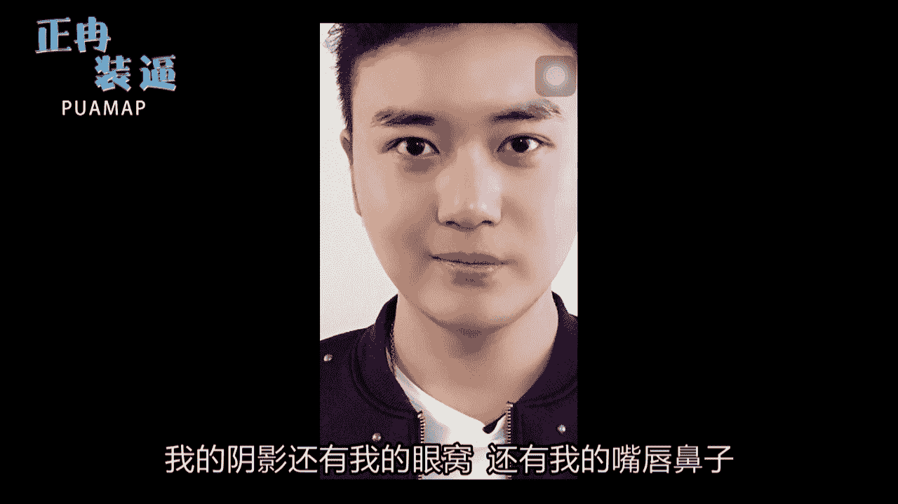

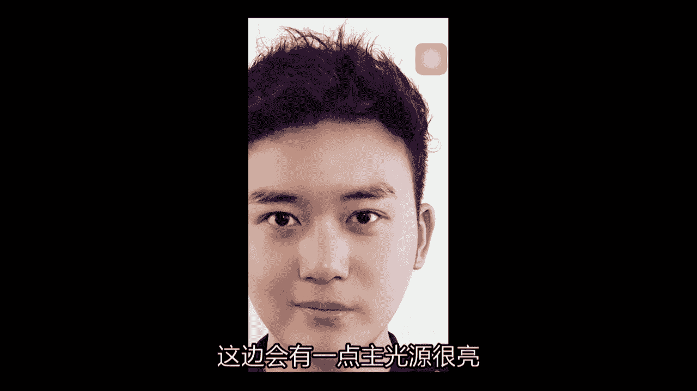

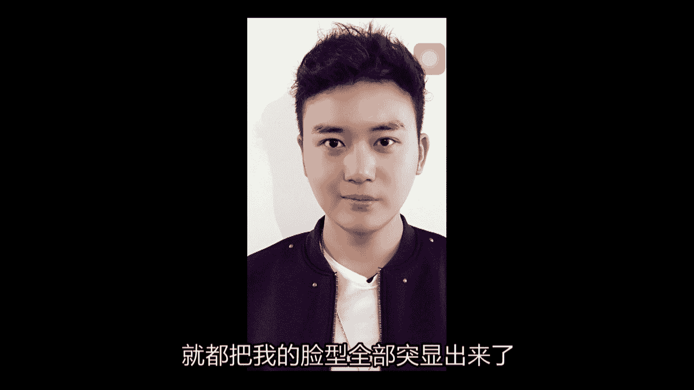

因为我们打了光，所以我脸上的阴影全部凸显了出来。我的右脸这边主光源比较白，左边是外面的辅光源。在我的鼻子、眼窝、嘴唇、脸的弧度这里都有阴影，另一边有主色调很亮，这都把我的脸型全部凸显了出来。在我的背后也有影子。

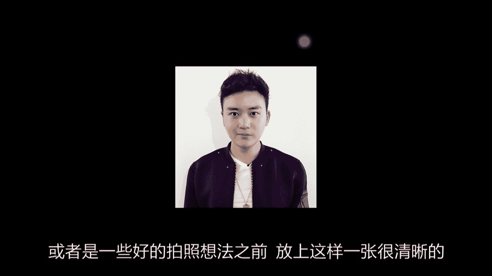

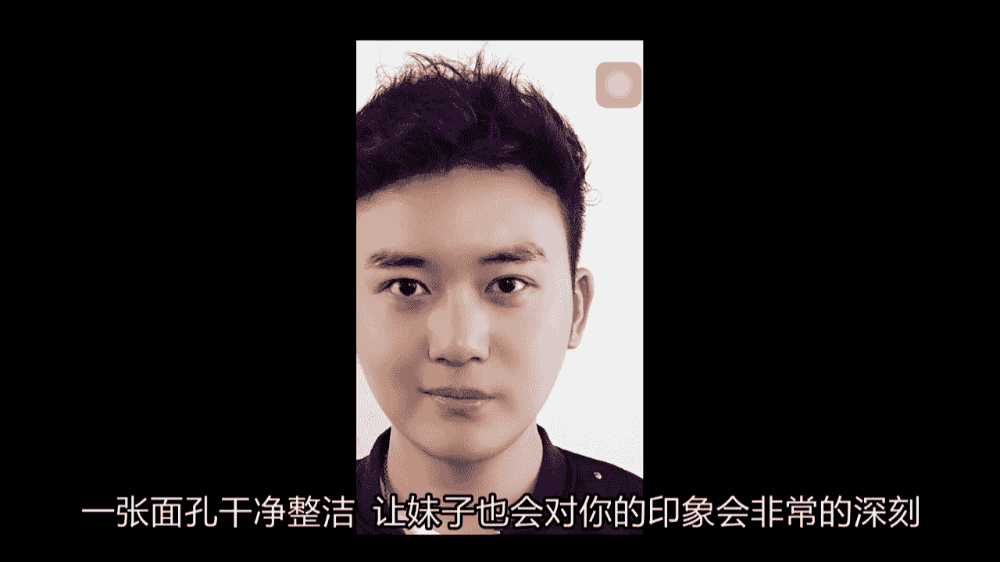

这样的一张照片，就是非常好的头像使用照片，这也是我推荐给大家的。因为大家在没有那么好环境、穿衣或拍照想法之前，放上这样一张清晰、面孔干净整洁的照片，他人也会对你的印象非常深刻，比较有好感。

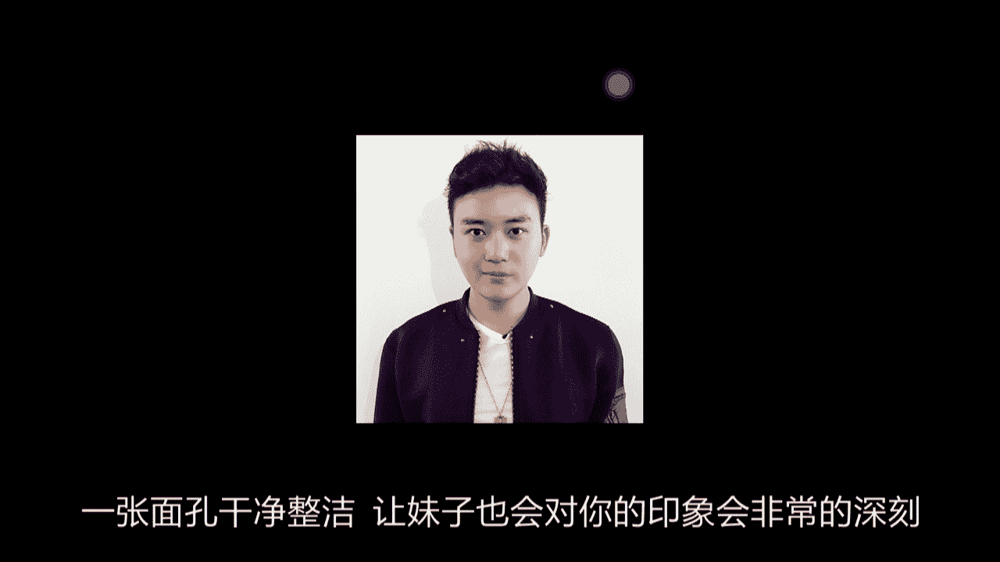

而且像这样使用证件照方式作为自己头像的男生毕竟还是少数。这样，在他人的脑海中也会留下一个非常深的印象。

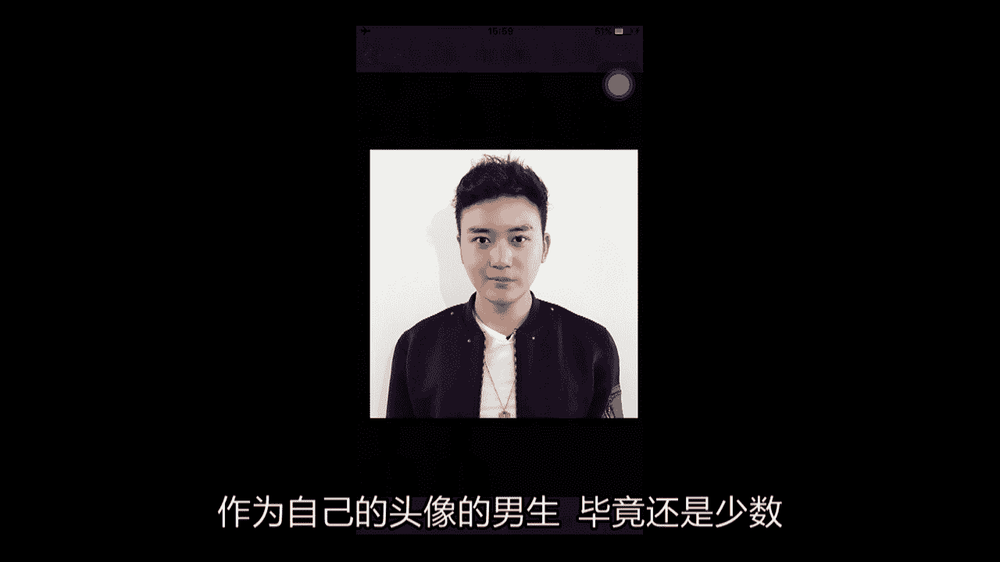

## 常见问题与注意事项

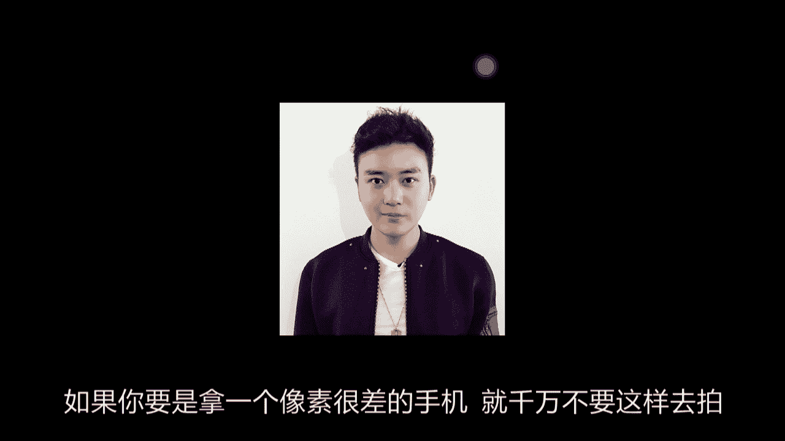

上一节我们完成了头像制作全流程，本节中我们总结一下制作过程中常见的几个问题。

今天关于头像的课程先到这里。我再补充一下，我看到很多朋友加了我微信后，也去模仿我的头像。他们主要有以下几个问题：

以下是三个常见问题及解决方法：

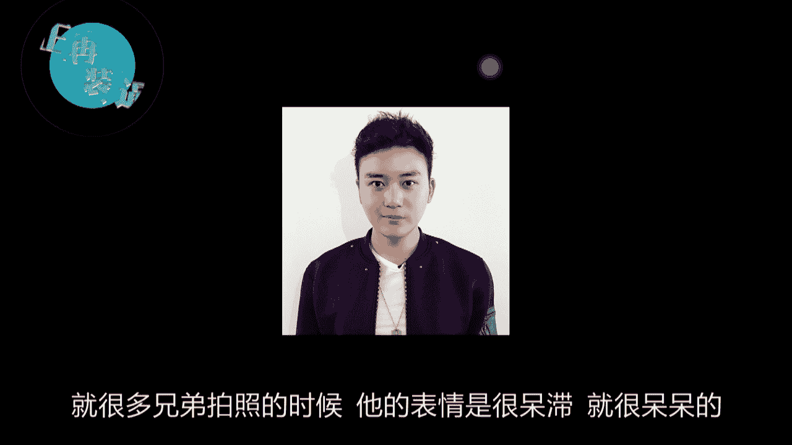

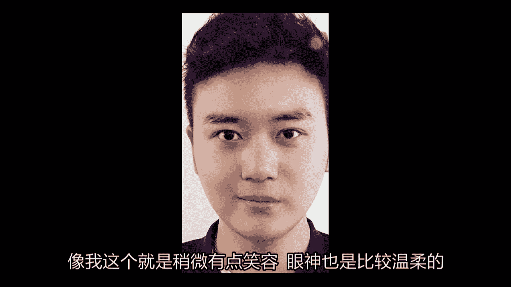

1.  **像素不清晰**：如果你要拍这样一张头像，手机的像素至少要在800万以上。我现在用的是iPhone 6，摄像头是800万。如果你拿一个像素很差的手机拍，拍出来就会显得很Low，整个人很模糊。如果你是安卓用户，修好照片后，可以传给使用苹果手机的朋友或同事，让他们在苹果手机上帮你设置微信头像。因为安卓和苹果有区别，安卓的微信客户端上传的图片本身可能就不清晰。发朋友圈也是一样的道理。
2.  **拍照表情呆滞**：很多朋友拍照时表情很呆滞。我的表情是稍微有点笑容，眼神也比较温柔加犀利。这样他人看到你的头像，会觉得你这个人目光和嘴角都传达出一种比较自信、简练的感觉。如果你是很呆板地对着镜头拍一张，别人会觉得你这人很刻板，头像就真的变成身份证照片了。
3.  **修图、背景与服装不讲究**：很多人可能拿美图秀秀随便照一张就放上去了，不注重背景。背景是那种泛黄的，也很Low，不干净不整洁。服装也不是很好。其实可以挂一个配饰，穿一件有拉链、有金属感的衣服，也是挺棒的感觉。

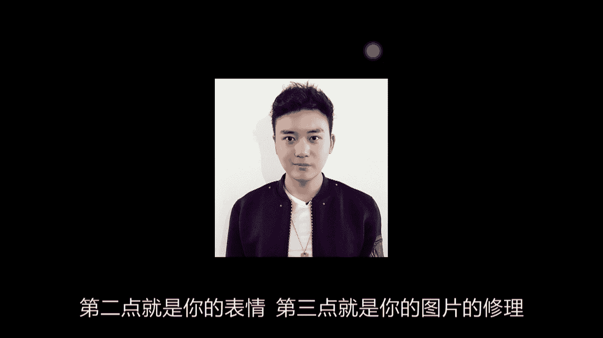

一共就这么三个问题：像素、表情、服装/环境/修图。只要你把这三个方面注意好，拍出一张好照片是不难的。

## 课程总结与作业

本节课中我们一起学习了如何拍摄和精修一张高质量的微信头像。

我们刚才已经看完了头像的拍摄，想必你已经对头像有了大概的认识。这一期我们有作业：如果你要在微信群里问各种拍照问题，首先我不会看你的问题，我会先看你的微信头像。如果你的头像是令我满意的、是你进行过设计和拍摄的，那我觉得我们可以进行下一步。如果你在微信群里问问题，结果你的头像还是一些花花草草或我认为不及格的，我会提出来，让你去重新拍摄完成头像。直到你把头像拍好以后，再让我们进入下一环节。

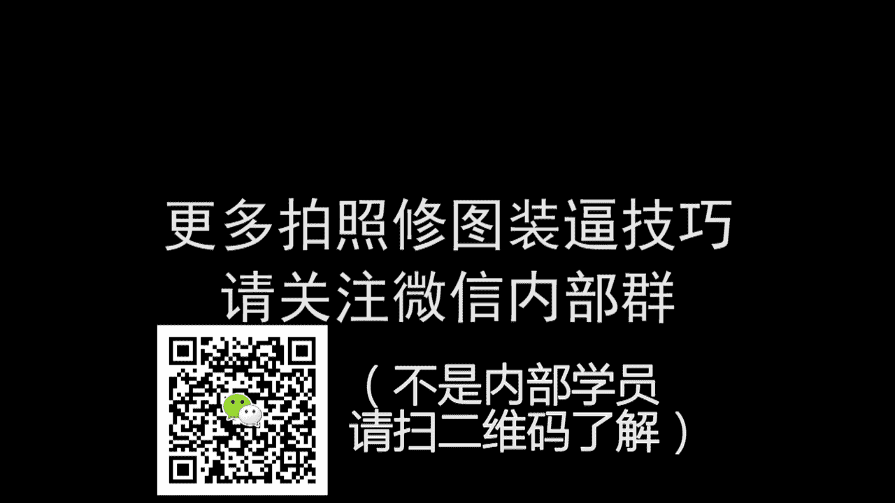

好了，我们这一期的头像拍摄已经讲完了，请期待我们的下一课。有什么问题的话，都在微信群里面艾特我，我尽量会在第一时间看到并且解答。