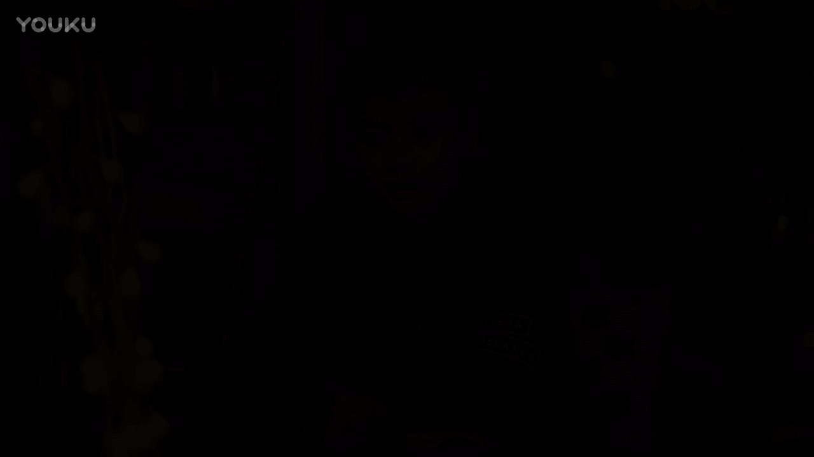
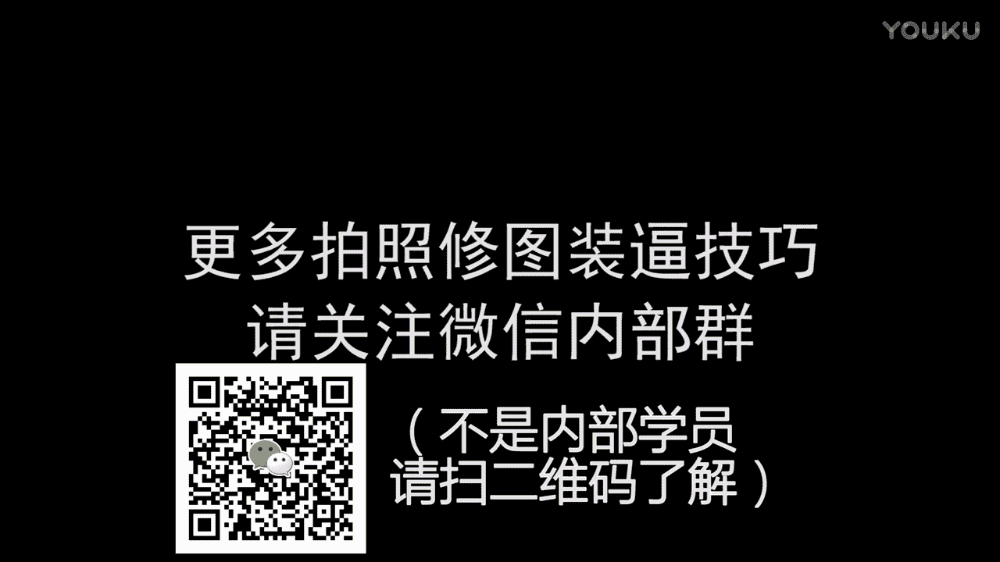

# 正冉装逼课程：第九集：高空咖啡馆

在本节课中，我们将学习如何在咖啡馆等文艺环境中拍摄并后期处理出具有意境的“装逼”照片。课程将涵盖手机与单反两种设备的拍摄技巧，以及使用VSCO等工具进行后期修图的完整流程。

## 环境与构图分析

上一节我们介绍了基础拍摄环境，本节中我们来看看如何在具体场景中应用。我们身处一家高空咖啡馆，面临玻璃反光、夜景难拍等挑战。但通过利用环境中的元素，依然可以拍出好照片。

咖啡馆内有两种主要色调：室内暖光与窗外冷色调的夜空。这构成了冷暖对比的视觉关系。主体（人物）与陪衬（咖啡、书籍）以及背景（城市夜景）共同营造了氛围。

以下是构建画面的三个核心关系：
1.  **冷暖光关系**：室内暖光与室外冷光形成对比。
2.  **主体与陪衬关系**：人物是主体，咖啡和书籍是陪衬物。
3.  **人物与环境关系**：人物的姿态和动作需与环境融合。

## 拍摄姿态与技巧

理解了环境构图后，我们来看看如何摆姿。在文艺咖啡馆拍照，核心要义是**自然**。你需要利用身边物品，让自己真正融入环境，而不是僵硬地摆拍。

以下是具体的姿态建议：
*   **利用道具**：可以手拿一本书，自然地阅读；或者端起咖啡杯，真正地品尝。
*   **避免刻意**：不要仅仅为了造型而假装看书或喝咖啡。你的注意力应该放在物品本身。
*   **保持放松**：肢体语言务必放松。可以慵懒地靠着椅子，或者托腮思考，避免正襟危坐。
*   **融入环境**：让姿态与周围的文艺氛围相匹配，例如在书架旁翻阅书籍。

## 手机拍摄与后期修图

我们首先使用手机进行拍摄。手机拍摄方便，但在复杂光线下可能面临色温不准等问题，这需要通过后期来修正。

以下是手机照片的后期处理步骤：
1.  **人像美化**：使用修图软件（如Facetune）进行基础美化。主要操作包括：淡化法令纹、微调脸型、平滑皮肤高光区域。代码式操作可概括为：`美化(去法令纹, 微调脸型, 平滑皮肤)`。
2.  **基础颜色校正**：将照片导入VSCO。由于原图偏红，需进行校正：
    *   增加清晰度和少许锐化以提升质感。
    *   将色温向蓝色方向大幅调整，以中和红色。
    *   微调色调，通常向绿色方向微调。
    *   降低饱和度，让颜色恢复正常。
3.  **添加滤镜与风格化**：在颜色校正后的照片上尝试不同的VSCO滤镜。不必将滤镜强度拉满，轻微添加即可为照片赋予文艺感。最终效果对比：从偏红、脸型不理想的原始照片，变为颜色自然、脸型精致、带有滤镜风格的文艺照片。

## 单反拍摄优势与后期

接下来我们看看单反拍摄。单反相比手机的主要优势在于：可营造**景深**效果增强画面层次，并且能在拍摄前手动设置**白平衡**等参数，从而获得更理想的原始照片，简化后期工作。

单反照片的后期处理流程与手机类似，但更为简洁：
1.  **人像美化**：同样，先进行必要的人像美化，步骤与手机修图一致。
2.  **滤镜微调**：将照片导入VSCO。因为前期色温控制得当，原图色彩通常已很不错。只需挑选一个合适的滤镜（例如，偏好某款胶片感滤镜），轻微施加即可。
3.  **效果对比**：单反原片质感已很好，后期仅需轻微添加滤镜营造“朦胧”或“小清新”的文艺氛围，就能得到最终成片。

## 课程总结

本节课中我们一起学习了在高空咖啡馆拍摄文艺照片的全过程。我们分析了环境中的冷暖光构图，学习了自然放松的拍摄姿态。通过对比手机和单反的拍摄，我们了解到**前期参数设置**（尤其是白平衡）对成片效果的重要性。在后期方面，我们掌握了从人像美化到颜色校正，再到添加滤镜风格化的一套完整流程。记住，自然融入环境是“装逼”照成功的关键，而良好的前期拍摄能让后期事半功倍。