# 正冉装逼课程：第八集：地铁无间道风格摄影与后期教程

在本节课中，我们将学习如何在地铁站拍摄并后期处理出具有“无间道”风格、充满城市孤独感与电影氛围的照片。课程将涵盖手机与单反的拍摄技巧、构图方法以及详细的后期修图流程。

## 概述：地铁站摄影的核心氛围

我们来到了地铁站。许多人可能每天都会乘坐地铁上下班。此时，我们依然需要一位“僚机”（拍摄伙伴）来帮助我们捕捉地铁特有的感觉。

这种风格追求的是城市中阴冷、孤独的氛围，但同时也要显得很酷，最终呈现出一组看起来走神、但效果很漂亮的照片。

## 第一部分：拍摄构图与姿势技巧

上一节我们介绍了拍摄的整体氛围，本节中我们来看看具体的构图与人物姿势。

### 构图要点

以下是关于构图的核心建议：

*   **拍摄半身照**：最好从侧面拍摄，不要构入人物的全身。最佳选择是拍摄半身照。
*   **展现纵深感**：在构图中，需要把地铁走廊的纵深感和空间感拍出来。

### 人物姿势参考

以下是几个可以尝试的姿势：

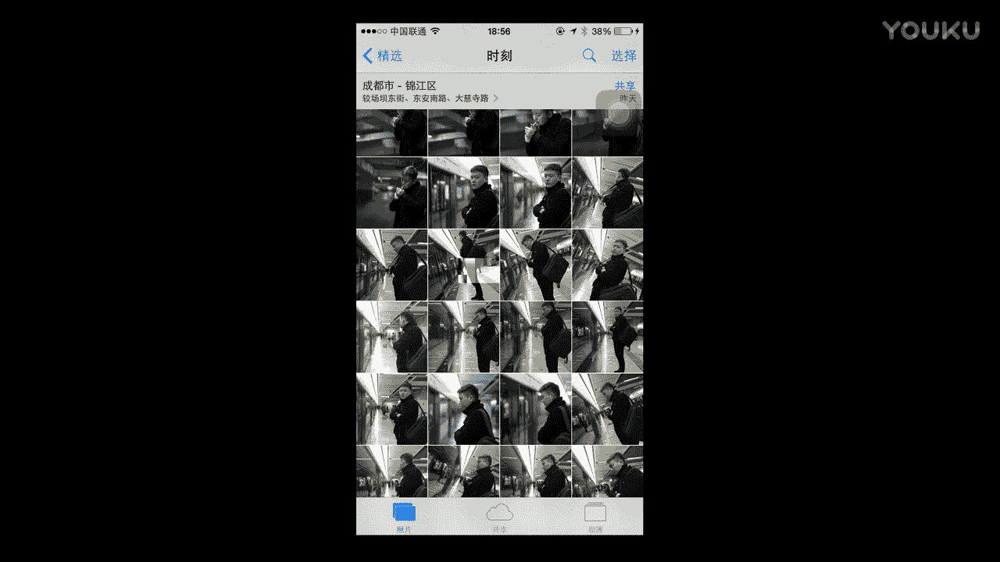

*   **放松状态**：可以保持一种很放松的感觉，例如简单地站着。
*   **侧头探视**：可以将头向右边探出去，增加画面的动态和故事感。

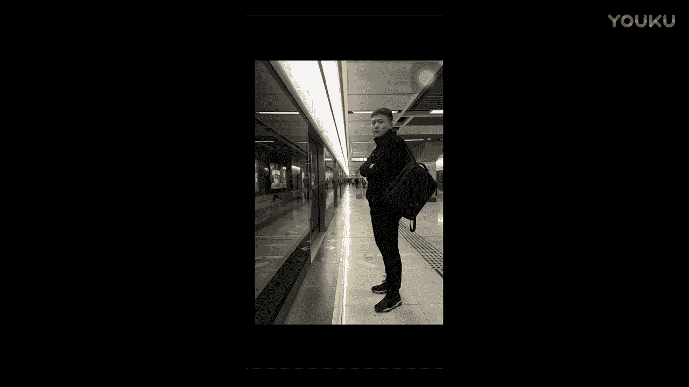

我们刚才已经用手机尝试拍摄并修图。现在，我们来查看单反相机的拍摄效果。

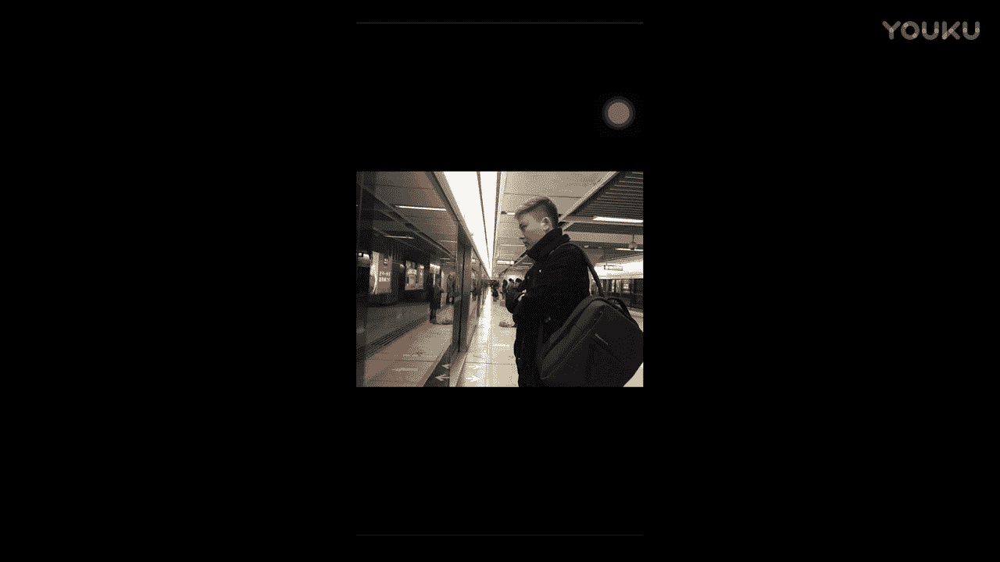

## 第二部分：单反相机拍摄详解

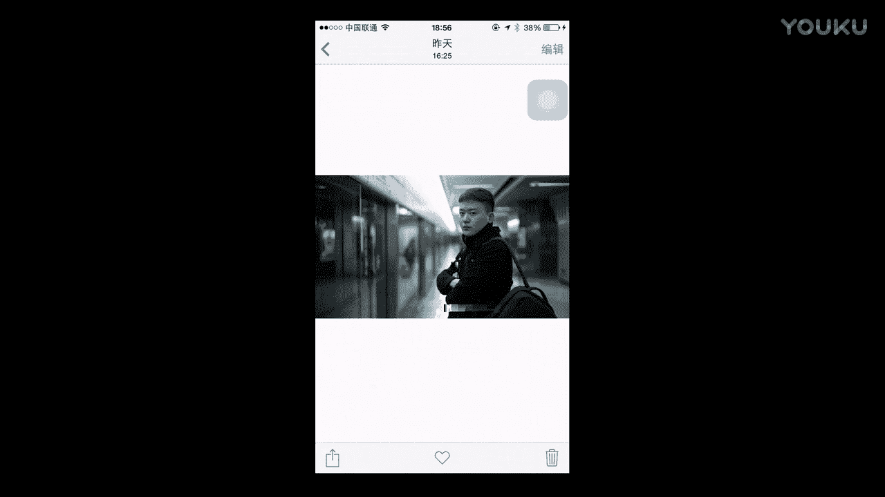

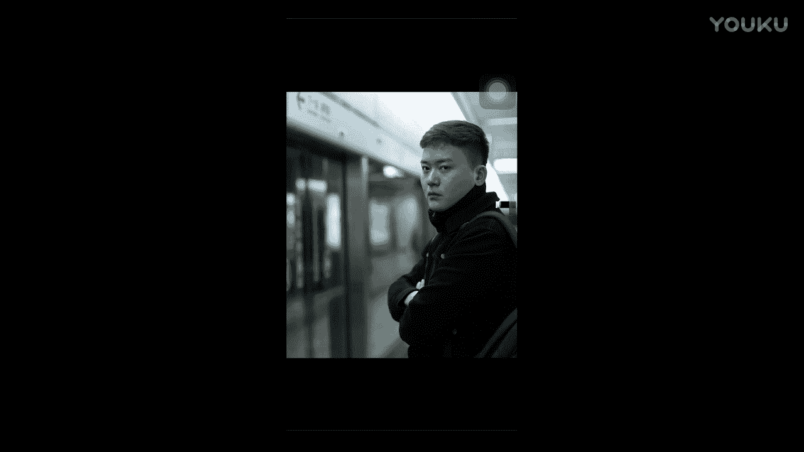

单反相机的好处在于可以营造**景深**效果，这是我们之前课程中也提到过的概念。景深公式可以简单理解为控制画面清晰范围的关键：

**景深 ∝ (光圈值, 对焦距离, 焦距)**

这次我们使用的仍然是50mm定焦镜头。

### 单反拍摄姿势

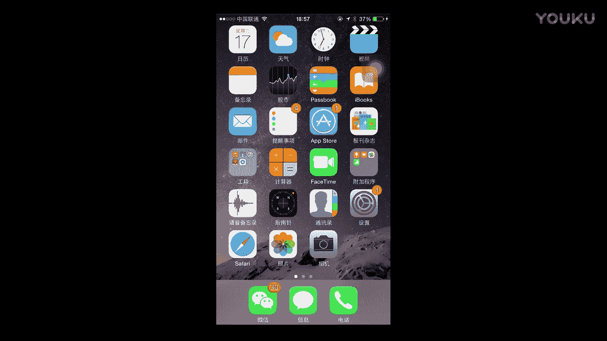

此时，人物姿势可以调整如下：

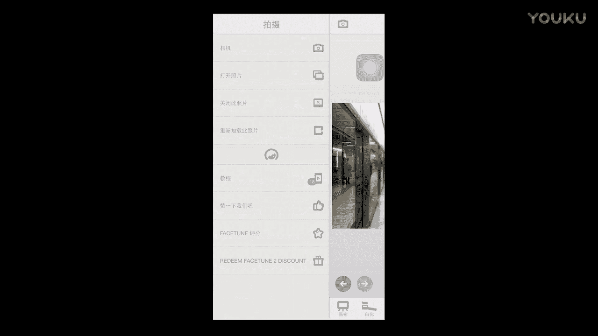

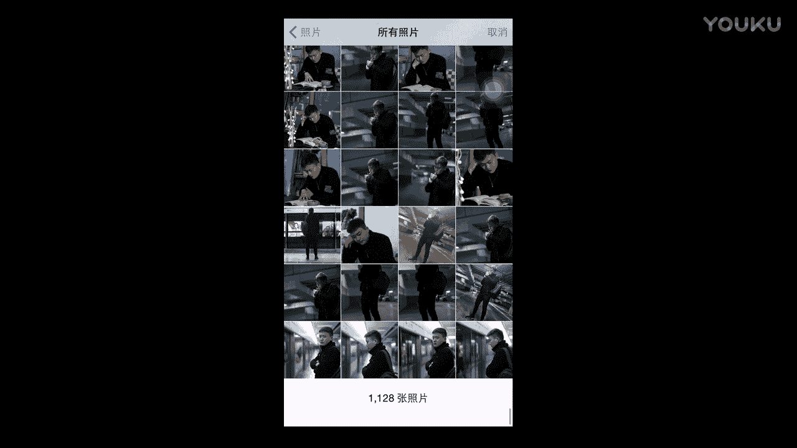

*   **视线与姿态**：眼睛可以朝前方看，头稍微低一点。
*   **手部动作**：两手可以抱在胸前。

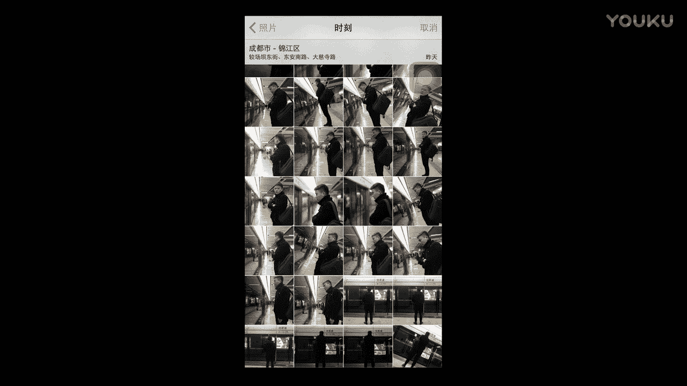

### 拍摄全身与背影

我个人还喜欢在地铁拍摄全身照，但通常拍摄的是背影。

拍摄时，需要使用横构图，以拍出列车的纵深感。人物可以孤独地站在那里。

## 第三部分：相机参数设置与区别

我们来看一下具体的拍摄参数。请注意，参数需根据实际光线环境调整，以下仅为参考。

### 近景（半身）拍摄参数

*   **镜头**：50mm定焦
*   **快门速度**：1/100秒
*   **光圈**：f/1.8
*   **感光度 (ISO)**：400
*   **色温**：3500K

### 远景（全身/背影）拍摄参数

*   **镜头**：24-105mm变焦
*   **快门速度**：1/80秒
*   **光圈**：f/4.0
*   **感光度 (ISO)**：1600

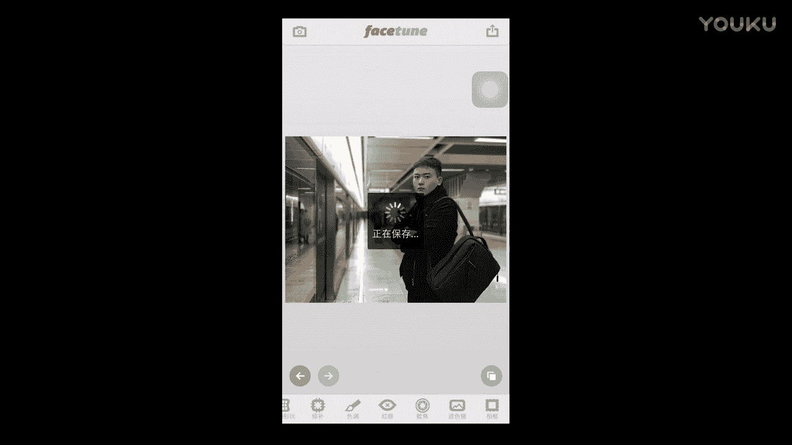

因为使用的镜头不同，所以参数设置也有差异。具体环境应根据现场光线的实际情况进行设置，不要一味照搬。

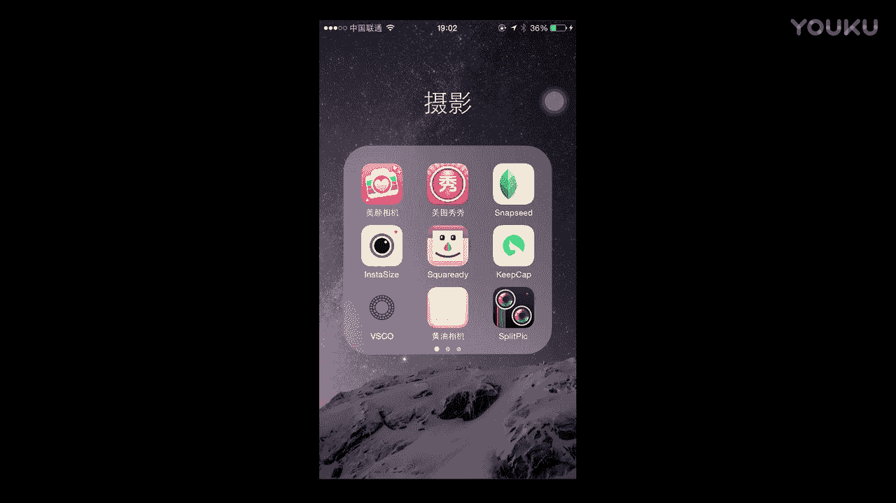

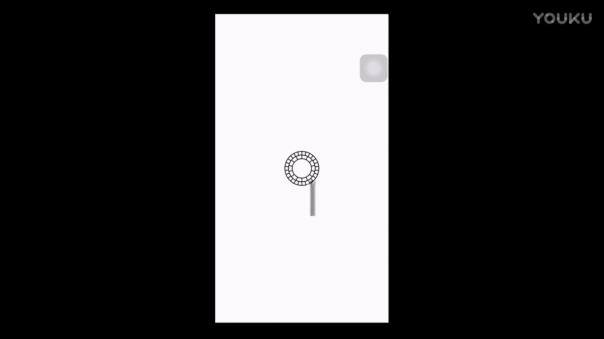

## 第四部分：后期修图实战教学

上一部分我们完成了拍摄，本节我们将进入核心的后期处理环节，让照片更具电影感和“逼格”。

我们首先从手机拍摄的照片开始修起。

### 第一步：使用 Facetune 进行人像精修

以下是使用 Facetune 处理人像的核心步骤：

1.  **磨皮**：使用磨皮功能。如果脸型较胖，重点抹去法令纹，这能在视觉上显瘦。注意保留必要的阴影（如下巴处），避免脸部失真。嘴角赘肉、黑眼圈等部位需要重点处理。
2.  **细节刻画**：使用“细节”工具，轻微涂抹眉毛，让眉毛更清晰。同样，涂抹衣服上的高光或纹理部分（如黑色衣服上的亮部），能增加身体的立体感。
3.  **背景虚化（散焦）**：为了提升逼格，需要虚化背景。使用“散焦”功能涂抹背景区域。如果误涂到人物，可以使用橡皮擦工具仔细擦除边缘，恢复人物的清晰度。这个过程需要耐心。

### 第二步：使用 VSCO 进行色调与氛围调整

将 Facetune 处理后的照片导入 VSCO 进行调色。

以下是手动调整的参数思路：

1.  **基础调整**：
    *   **清晰度**：适当提高，增加照片质感。
    *   **锐化**：轻微增加。
2.  **色彩调整**：
    *   **色温**：向蓝色方向微调，强化地铁的冷峻感。
    *   **色调**：向绿色方向微调一点。
3.  **氛围营造**：
    *   **暗角**：增加暗角，营造电影感。
    *   **颗粒**：添加少量颗粒，增加胶片质感。
    *   **褪色**：轻微增加褪色效果，让色彩更柔和。
    *   **对比度**：适当增加一格，强化光影。

### 第三步：最终裁剪成电影比例

在手机相册中，对调整好的照片进行编辑，将画幅比例裁剪为 **16:9**。这是营造电影感画面的最后一步关键操作。

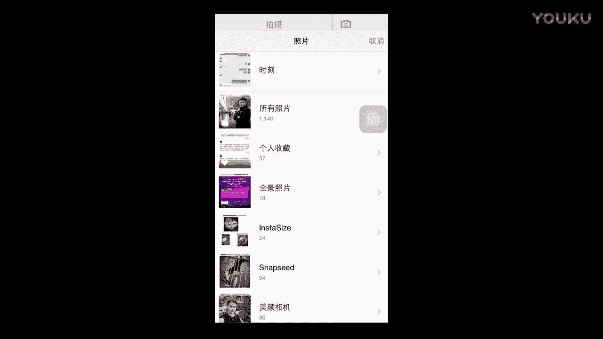

### 单反照片的后期流程

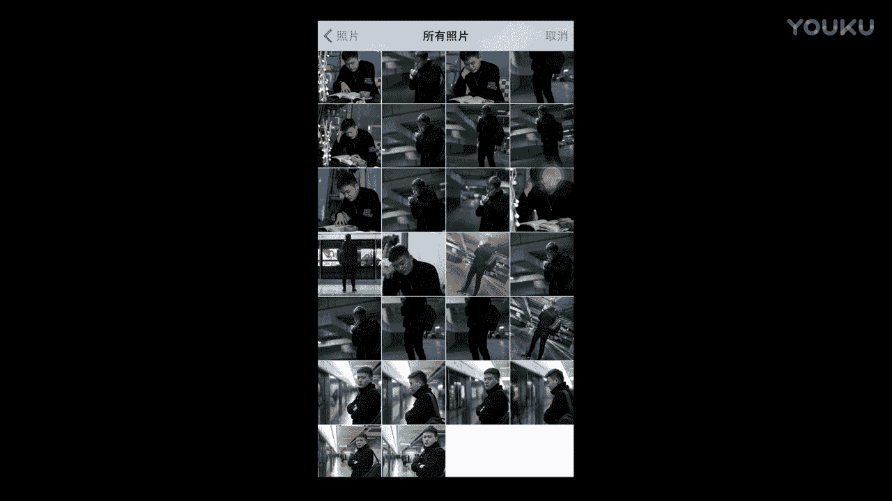

单反照片的后期流程与手机照片完全一致：

1.  使用 **Facetune** 进行同样的磨皮、细节修饰。
2.  使用 **VSCO** 进行色调调整。由于单反拍摄时已设置过色温，基础颜色可能更接近理想状态，但依然可以微调清晰度、颗粒、暗角等参数来强化风格。

## 总结与成果对比

本节课中，我们一起学习了如何在地铁站策划拍摄，并掌握了从拍摄到后期的完整流程。

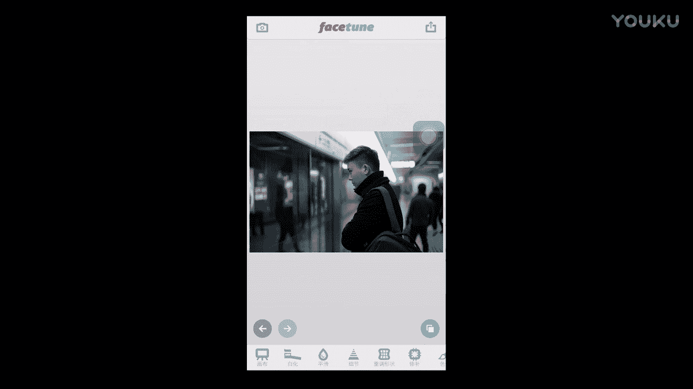

**核心区别回顾**：单反与手机拍摄的主要区别依然在于**景深**的控制能力。单反能轻松拍出背景虚化、主体突出的效果，而手机需要通过后期App（如Facetune的散焦功能）来模拟。

**行动建议**：希望兄弟们能够掌握这些技巧。现在，你就可以在回家路上，约上你的“僚机”，在地铁站里尝试拍摄一组属于自己的“无间道”风格大片了。