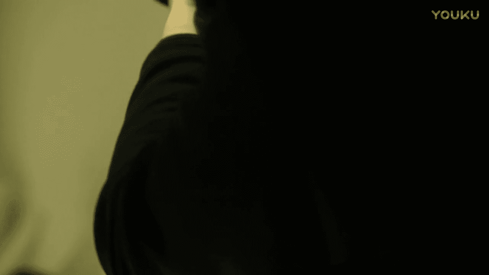
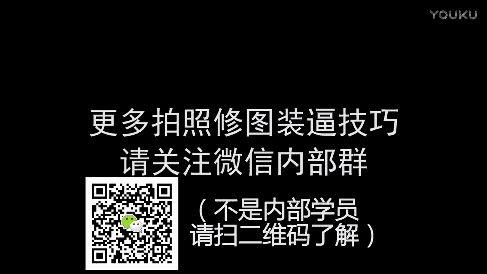

# 摄影入门：第六集：单反相机基础操作指南 📸

在本节课中，我们将学习单反相机的基础操作。课程将涵盖从安装镜头、认识关键部件，到理解曝光三要素（感光度、光圈、快门）和色温设置等核心知识。目标是帮助初学者快速上手，拍出比手机更具质感的照片。

---

## 单反相机：6.1：认识你的设备

上一节我们介绍了课程目标，本节中我们来看看单反相机的基本构造。

单反相机的拍照功能比手机更专业。对于只想拍摄展示面照片的新手而言，上手并不复杂。我手中这台是佳能5D3型号的单反相机。

单反相机通常由机身和镜头组成。购买时有组合套装，也可单独选购镜头。

以下是安装和拆卸镜头的步骤：
1.  安装镜头时，将镜头上的红点对准相机卡口上的红点。
2.  将镜头插入卡口，然后向左旋转，直到听到“咔哒”声锁定。
3.  拆卸镜头时，按住镜头释放按钮，同时向右旋转镜头即可取下。
4.  操作时需注意防止灰尘进入相机内部。

---

## 单反相机：6.2：开机与取景

成功安装镜头后，下一步是开机并选择取景方式。

相机侧面通常有一个电源开关，不同型号位置可能不同。佳能相机开关标有“OFF”和“ON”。开机后，很多新手会发现屏幕是黑的，这是因为相机默认使用光学取景器观察画面。

我建议新手先使用液晶屏取景。按一下机身上的相应按钮（通常是标有相机图标的按钮或“LV”键），即可切换到液晶屏实时显示模式。

---

## 单反相机：6.3：对焦与变焦

切换到液晶屏取景后，我们来看看如何让画面变得清晰。

屏幕上显示的几个参数很重要。镜头上较大的圆环是变焦环，用于改变拍摄范围。例如，向“广角”端旋转，拍摄范围变大，人物变小；向“长焦”端旋转，拍摄范围变小，能将远处人物拉近，但此时画面可能模糊。

要让画面变清晰，需要对焦。镜头上的对焦环（通常较小）用于手动调整焦点。镜头上还有一个对焦模式开关，用于选择自动对焦（AF）或手动对焦（MF）。

以下是两种对焦模式的操作：
*   **自动对焦（AF）**：半按快门按钮，相机会自动调整焦点，合焦后取景器中会有提示（如绿点或“滴滴”声）。
*   **手动对焦（MF）**：将对焦模式开关拨到MF，然后旋转对焦环，直到液晶屏上你想拍摄的主体变得最清晰。对于精细对焦，可以按放大镜按钮放大画面辅助操作。

---

## 单反相机：6.4：理解曝光三要素

对焦清晰后，画面可能仍然很暗或很亮。这涉及到控制光线进入相机的三个核心参数：感光度（ISO）、光圈（Aperture）和快门速度（Shutter Speed）。

**1. 感光度（ISO）**
感光度控制相机感光元件对光线的敏感程度。ISO值越高，相机对光越敏感，画面越亮，但噪点（画面杂色）也越多。
*   **公式参考**：`画面亮度 ∝ ISO值`
*   **建议**：光线充足时（如室外晴天），使用ISO 100-400；光线不足时可适当提高，但拍摄照片时建议尽量不超过ISO 1600，以控制噪点。

**2. 光圈（Aperture）**
光圈控制镜头进光孔的大小，用f值表示（如f/4.0）。**f值数字越小，光圈越大，进光量越多，背景虚化效果越强；f值数字越大，光圈越小，进光量越少，背景更清晰。**
*   **公式参考**：`进光量 ∝ 1 / f值` （例如，f/2.8的光圈比f/4.0大，进光更多）
*   **示例**：我使用的镜头最大光圈是f/4.0。将其调到f/22时，进光量极少，画面会非常暗。专门的人像定焦镜头光圈可达f/1.8甚至更大，虚化效果更好。

**3. 快门速度（Shutter Speed）**
快门速度控制光线进入相机的时间长短，单位通常是秒（s）或几分之一秒。
*   **公式参考**：`进光量 ∝ 快门开启时间`
*   **影响**：快门速度越慢（如1/30s），进光时间越长，画面越亮，但容易因手抖或被摄物移动导致画面模糊。快门速度越快（如1/500s），能定格快速运动的瞬间，画面更清晰，但进光量减少，画面会变暗。

---

## 单反相机：6.5：拍摄模式与色温设置

理解了曝光三要素后，我们来看看如何应用它们。

相机顶部有一个模式转盘。对于新手，可以尝试使用**P档（程序自动）**，相机会自动设置光圈和快门。但P档有时效果不理想，比如在复杂光线下可能过曝（画面泛白）或因为快门太慢而拍虚。

我推荐使用**M档（手动模式）**。在M档下，你可以根据环境光线，自由组合调整ISO、光圈和快门三个参数，从而获得理想的曝光效果。

除了曝光，颜色也至关重要，这由**白平衡（WB）** 控制。白平衡影响画面的色温，使照片颜色更准确或营造特殊氛围。
*   **操作**：按下WB按钮，可以选择自动、日光、阴天等预设，或使用自定义色温（K值）。
*   **规律**：**色温K值越低，画面越偏蓝（冷色调）；色温K值越高，画面越偏黄（暖色调）。**
*   **应用**：前期设置好想要的色温，可以让后期修图更轻松。例如，调高色温K值可以拍出暖黄复古感，调低K值则能营造冷峻的“审讯室”风格。

---

## 单反相机：6.6：如何拍出背景虚化效果

最后，我们来学习如何拍出具有“电影感”的背景虚化照片，这是手机摄影难以比拟的效果。

背景虚化（浅景深）能突出主体，增强画面纵深感。实现背景虚化主要依赖两个因素：
1.  **使用长焦距**：将镜头变焦环向长焦端推动（如从24mm推到105mm），焦距越长，背景虚化效果越明显。
2.  **使用大光圈**：将光圈值调小（如f/4.0调到f/2.8甚至f/1.8），光圈越大，背景虚化效果越强。

以下是对比示例：
*   **虚化效果**：使用长焦端（如105mm）配合较大光圈（如f/4.0）拍摄，人物清晰，背景明显虚化。
*   **平面效果**：使用广角端（如24mm）拍摄，整个画面几乎都清晰，类似于手机拍摄的效果，缺乏纵深感。

因此，如果主要想拍人像展示面，可以考虑购置**大光圈的定焦镜头**（如50mm f/1.8）。这类镜头光圈大，虚化效果好，且价格相对亲民。对于机身，佳能600D等入门型号也完全能满足展示面拍摄需求。

---

本节课中我们一起学习了单反相机的基础操作。我们从认识设备、安装镜头开始，逐步了解了开机取景、对焦变焦、控制曝光的三个核心要素（ISO、光圈、快门），以及如何设置白平衡和拍出背景虚化效果。掌握这些知识，你的单反摄影就算正式入门了。后续课程我们将深入实景，讲解更高级的拍摄技巧和相机设置。