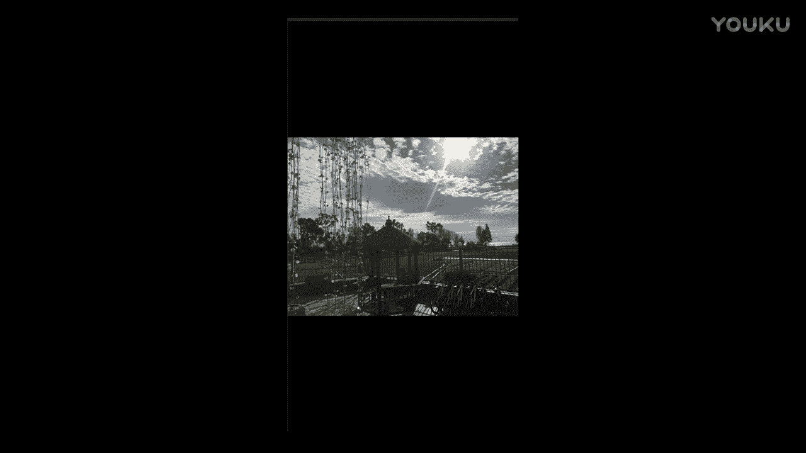
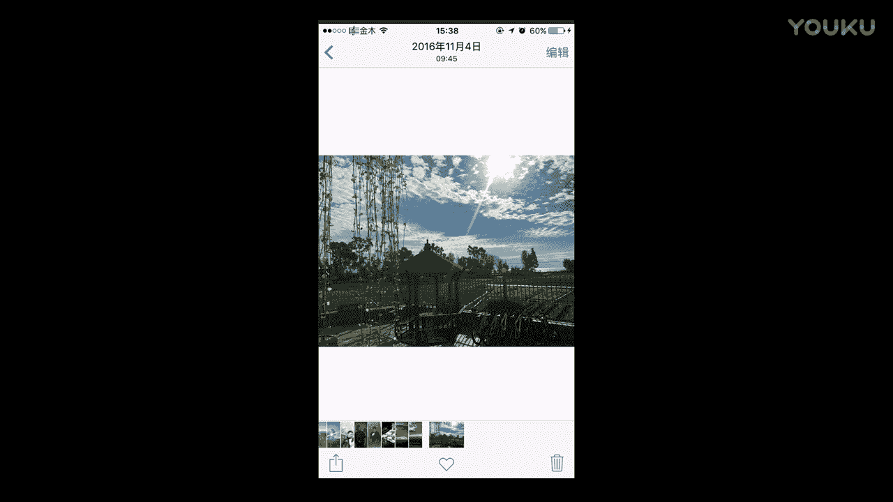
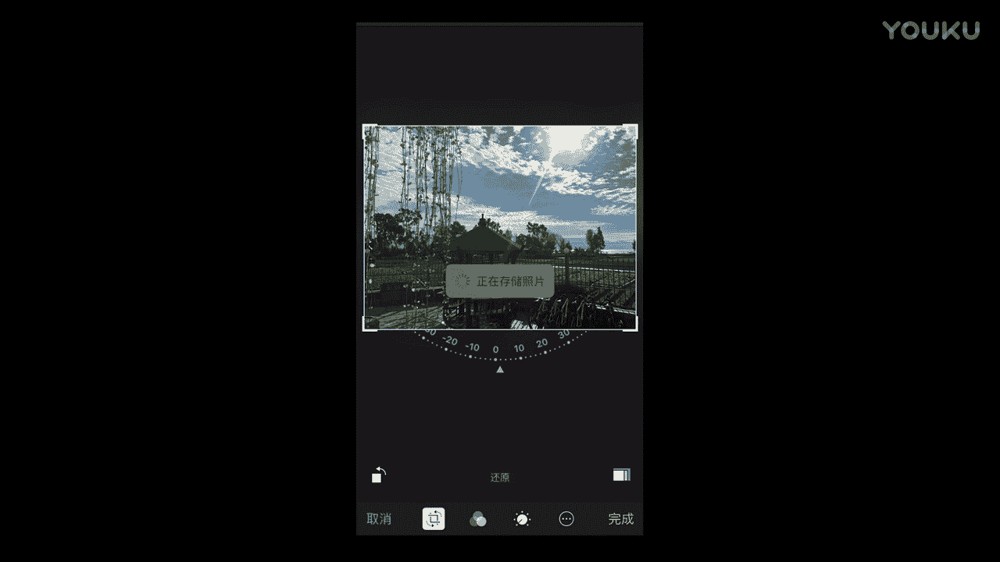
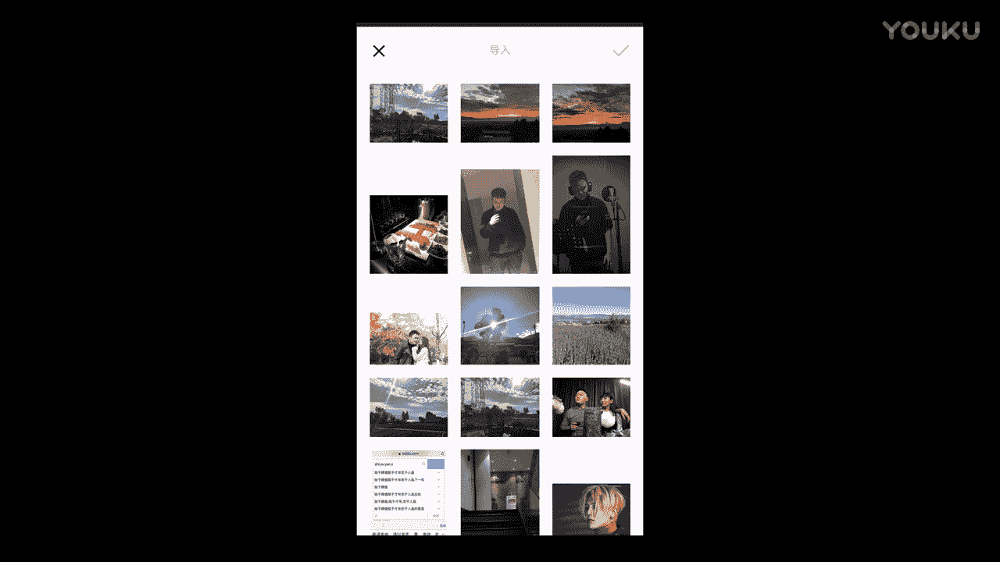
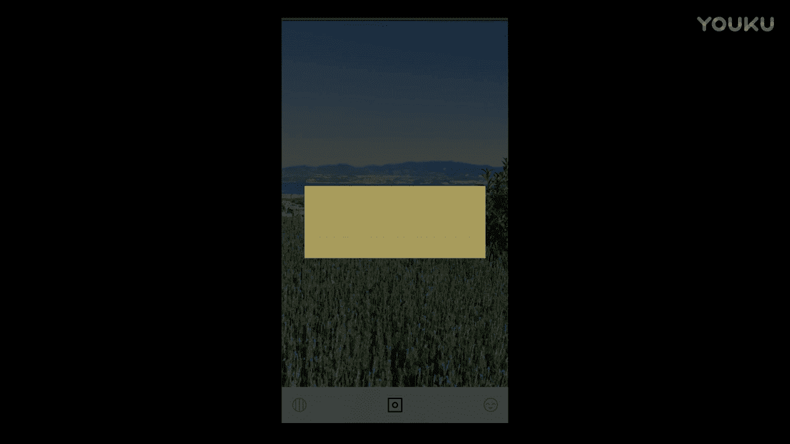
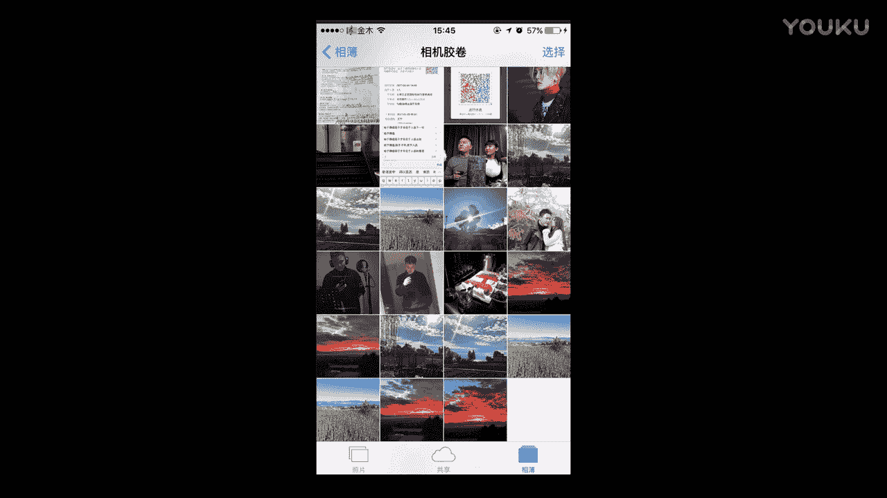

# 正冉装逼：1：如何修风景 🌄

在本节课中，我们将要学习如何使用手机修图软件（以VSCO为例）来修饰自然风光照片。我们将通过几个具体的例子，讲解如何调整照片的色彩、饱和度和构图，让风景照片焕然一新。

## 概述

自然风光照片的后期处理，核心在于恢复或增强其原有的色彩与氛围。由于拍摄时可能受光线、角度等因素影响，照片的色彩往往不够饱和，画面可能倾斜。我们将学习使用VSCO软件中的基本工具来解决这些问题。

上一节我们介绍了课程的整体框架，本节中我们来看看如何具体操作。

## 第一步：分析原图与导入软件

我们以一张逆光拍摄的风景照为例。原图中阳光、树叶、云彩和天空都存在，但由于是逆光拍摄，导致整体颜色不够饱和，画面也有些歪斜。

首先，我们打开VSCO软件，并选择要修饰的这张照片。

## 第二步：使用调整工具

打开照片后，我们点击左下角的菜单进入调整界面。以下是各个核心调整选项的介绍：

**1. 曝光**
这个参数类似于相机的光圈。数值调小，画面变暗；数值调大，画面变亮，过度调整会导致“过曝”，出现死白区域。对于当前照片，我们保持曝光值为 **0**。

**2. 对比度**
此功能会加深阴影，提亮高光区域，从而增强画面的明暗对比。本例中我们暂不调整。

**3. 清晰度与锐化**
这两个功能都能提升画面的细节和轮廓感。清晰度会使画面风格化更明显，我们**稍微增加一点**。锐化也**轻微提升**，以增加细节。

**4. 饱和度**
这是修饰风景照的关键。原图的天空不够蓝，草地不够绿。我们将**饱和度拉到最高**，天空和草地的颜色立刻变得鲜艳。

**5. 色温与色调**
调整饱和度后，可能需要用色温来平衡色彩。**色温值越低，画面越偏冷（蓝）；色温值越高，画面越偏暖（黄）**。为了让高饱和度的画面更自然，我们**将色温稍微向暖色调调整一点**。
色调则影响画面偏绿或偏紫。我们**将色调稍微向紫色方向调整一点**，让画面色彩更丰富。

调整完成后，对比原图与修饰后的图片，可以看到色彩发生了巨大变化。

## 第三步：修正构图与保存

在相册中查看刚保存的照片时，我们发现画面仍然有些倾斜。

这时，我们点击右上角的“编辑”功能，使用旋转工具将画面调正。调整过程中画幅会被裁剪一部分，但能保证画面中的元素是水平的，这是可以接受的。调整完成后点击“完成”即可保存。

## 其他风景照的快速处理

掌握了基本方法后，处理其他风景照就能举一反三。

**1. 常规风景照**
对于另一张常规风景照，我们快速应用相同的逻辑：提升清晰度、饱和度和色温，并可以**稍微添加一点暗角**来突出中心。

**2. 薰衣草田照片**
对于色彩本身就很漂亮的薰衣草田照片，我们可以先尝试使用滤镜。
以下是选择滤镜的考量：
*   如果照片是独立的，可以大胆尝试风格化的滤镜。
*   如果照片需要与人像组合，则需考虑滤镜对人肤色的影响。

我们选择了一个喜欢的滤镜，效果不错。也可以手动微调，**将色调向冷色调整一点**，并**增加一点对比度**，营造出不同的氛围。

**3. 夕阳晚霞照片**
处理夕阳照片时，色彩饱和度和色调是关键。
*   首先尝试滤镜，如果没有合适的，则使用原图。
*   **将饱和度提升到最高**，以强化晚霞的色彩。
*   调整**色调**，避免偏绿，使其偏向红色或紫色，以符合晚霞的意境。
*   将**色温向冷色（低）调整一点**，可以让天空的冷暖对比更分明，层次感更强。

通过以上调整，可以将原本平淡的晚霞照片，处理成具有强烈视觉冲击力或特定氛围（如“末日风”）的作品。

## 修图前后对比

以下是本节课中部分照片的修图前后对比，展示了调整带来的变化：

*   **逆光风景**：颜色从灰暗变为鲜艳。

*   **薰衣草田**：通过滤镜或手动调整，营造出小清新或朦胧感。

*   **夕阳晚霞**：强化色彩与对比，营造震撼或独特的氛围。

## 总结

本节课中我们一起学习了自然风光照片的后期修饰流程。核心要点在于：
1.  **分析原图**：找出色彩不饱和、构图不平等问题。
2.  **调整色彩**：重点使用**饱和度**、**色温**和**色调**工具来恢复和增强画面的色彩氛围。
3.  **增强质感**：适当使用**清晰度**和**锐化**来提升细节。
4.  **修正构图**：利用编辑功能中的**旋转**工具来摆正画面。
5.  **善用滤镜**：对于色彩较好的照片，可以尝试滤镜快速获得风格化效果，但需考虑后续使用的匹配性。

修图工具是为你服务的，最终效果取决于你的审美和想要表达的感觉。多加练习，你就能快速掌握这些技巧，让每一张风景照都展现出它应有的魅力。