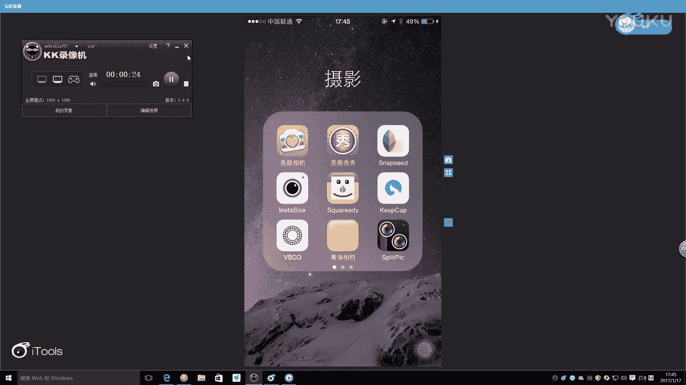

# 正冉装逼课程：第十二集：温泉文艺范 🏮

在本节课中，我们将学习如何在温泉酒店的环境中，通过巧妙的构图、姿势和后期修图，拍摄并制作出具有文艺感的照片。课程将分为三个主要场景进行讲解：酒店走廊、户外秋千和温泉池。

---

## 场景一：走廊光影与构图

上一节我们介绍了课程概述，本节中我们来看看如何在酒店走廊利用光影进行拍摄。

拍摄环境是背阴的走廊，光线较暗。为了获得更好的效果，需要寻找有阳光照射的区域。最终选择了一个有阳光的阳台作为拍摄点。

拍摄时需要注意以下两点：
1.  利用走廊的纵深感构图。
2.  避开环境中杂乱的物品（如毛巾）。

以下是拍摄的基本步骤：
*   寻找阳光能照射到的突出阳台作为背景。
*   确保相机保持水平，避免栏杆在画面中倾斜。
*   人物可以趴在栏杆上，进行一些自然的动作，例如拨弄头发、点烟或看手机。
*   如果手边有咖啡等道具，效果会更好。

拍摄完成后，通常需要从多张照片中选取最自然的一张进行后期处理。

---

## 场景二：照片裁剪与初步修图

在上一节我们完成了拍摄，本节中我们来看看如何进行照片的初步裁剪与面部修饰。

首先，在手机相册的编辑功能中，对选定的照片进行裁剪。采用 **4:3** 的比例，将人物置于画面中心偏下的位置，以保留庭院的景深。

接着，使用修图软件（如 **Facetune**）进行面部处理。处理流程如下：
1.  使用“平滑”功能处理皮肤瑕疵和阴影。
2.  使用“调整”功能微调脸型，使其更瘦。
3.  使用“细节”功能加深眉毛，让眼睛更有神。

处理完成后，将图片保存至相册。

---

## 场景三：滤镜调色与风格统一

上一节我们完成了面部修饰，本节中我们来看看如何使用滤镜进行整体调色，并使多张照片风格统一。

打开 **VSCO** 软件，导入修好的照片。调色步骤如下：
1.  首先尝试应用合适的滤镜（例如 **A6**）。
2.  如果滤镜效果过强，可以降低其强度。
3.  保存应用了第一层滤镜的图片。
4.  再次导入该图片，叠加第二层滤镜（例如 **G3**），并调整强度以达到理想效果。

通过叠加滤镜，可以使照片呈现出统一的文艺色调。将最终成品保存。

---

## 场景四：户外秋千场景拍摄

现在，我们转移到户外场景，学习如何在自然光下利用秋千进行拍摄。

选择正对阳光的秋千，阳光可以使脸部皮肤显得更白皙。拍摄时需注意：
*   让他人协助拍摄，以获得更好的构图和全景。
*   将秋千置于画面中央，后方可带入酒店建筑的屋顶作为背景点缀。
*   人物可以端一杯咖啡或拿一本书作为道具，并与摄影师沟通调整姿势。

拍摄同样遵循多拍精选的原则。

---

## 场景五：人像精修与构图再调整

本节中，我们对户外人像照片进行精修。

首先，使用 **Facetune** 处理面部：
1.  用“平滑”功能淡化法令纹等显胖的纹路。
2.  用“调整”功能自然地将脸型推瘦。
3.  用“细节”功能强化眉毛。

然后，再次使用相册的裁剪功能（**3:4** 比例），将人物在画面中的比例稍微放大，优化构图。

---

## 场景六：统一滤镜应用

为了使不同场景的照片在发布时风格一致，需要应用统一的滤镜。

在 **VSCO** 中导入修好的户外人像。
1.  应用与走廊照片相同的滤镜（如 **A6**），强度设置在 **4-5** 之间。
2.  保存图片。
3.  再次导入该图片，叠加第二层滤镜（如 **G3**），微调强度。

通过两次叠加滤镜，户外照片的色调与之前处理的照片达到了统一。

---

## 场景七：温泉场景拍摄技巧

最后，我们来到温泉场景，学习两种不同的拍摄思路。

**思路一：展现背影（规避身材短板）**
如果对自己的身材不够自信，可以拍摄背影。双手展开，模仿“大鹏展翅”的姿势，能拍出具有氛围感的照片，若有纹身则效果更佳。

**思路二：拍摄正面特写**
拍摄正面时，可以借助道具提升格调，例如一杯带有柠檬片的冷饮或一副墨镜。拍摄时需与摄影师沟通，寻找能显脸尖的角度。

---

## 场景八：温泉人像后期处理

对选定的温泉正面人像进行后期处理。

处理流程与之前一致：
1.  使用 **Facetune** 进行适度磨皮和脸型微调。
2.  加深眉毛。
3.  在 **VSCO** 中叠加两层相同的滤镜（**A6** 与 **G3**），使色调与其他场景照片统一。

最终，通过后期处理，照片质感得到了显著提升。

---

## 总结

本节课中我们一起学习了在温泉酒店拍摄文艺风格照片的全流程。关键点包括：寻找有利的光线和简洁的背景；拍摄时多尝试姿势并沟通；后期通过 **Facetune** 修饰面部，并通过 **VSCO** 叠加滤镜来统一和提升照片色调。掌握这些步骤，你也能在社交平台上分享出独具格调的照片。