# 正冉装逼：15：用手机拍摄酷炫打斗短片 🎬

在本节课中，我们将学习如何仅使用手机，从策划、拍摄到剪辑，完成一段酷炫的10秒打斗短片。视频已成为个人展示的主流形式，掌握这项技能非常实用。

## 概述：拍摄前的准备

上一节我们提到了视频的重要性，本节我们来看看拍摄一段酷炫打斗戏的具体步骤。首先，你需要做好以下三项准备。

以下是拍摄前必须准备的事项：

1.  **人员**：至少需要三人。一人负责拍摄，两人作为演员进行对打。
2.  **场景**：选择一个有纵深感的场景，例如一条走廊，这能增强画面的电影感。
3.  **设备**：一部智能手机。如果环境光线不足，可以打开现场的灯光进行补光。

## 核心概念：轴线原则

在开始设计镜头前，必须理解一个核心概念：**轴线原则**。

**轴线** 是指两个主要演员之间一条假想的连接线。为了保证观众对空间方向的连贯理解，所有机位都应设置在这条轴线的**同一侧**进行拍摄。

除非为了制造特殊的混乱或转折效果，否则应避免“越轴”拍摄，即让摄像机跑到轴线的另一侧去。

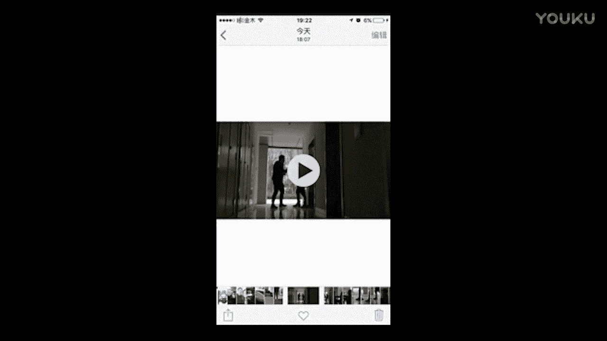

## 分镜头设计与拍摄

理解了轴线原则后，我们就可以开始设计具体的打斗动作和拍摄镜头了。我们将使用一个机位，通过多次拍摄不同景别的画面，后期剪辑在一起。

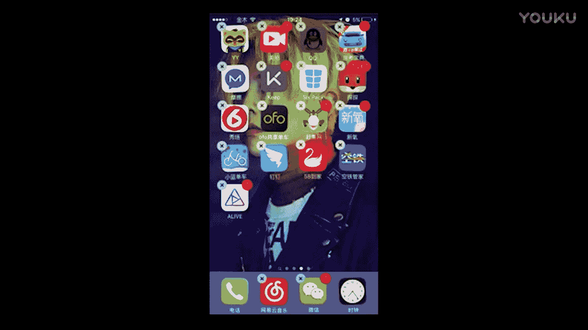

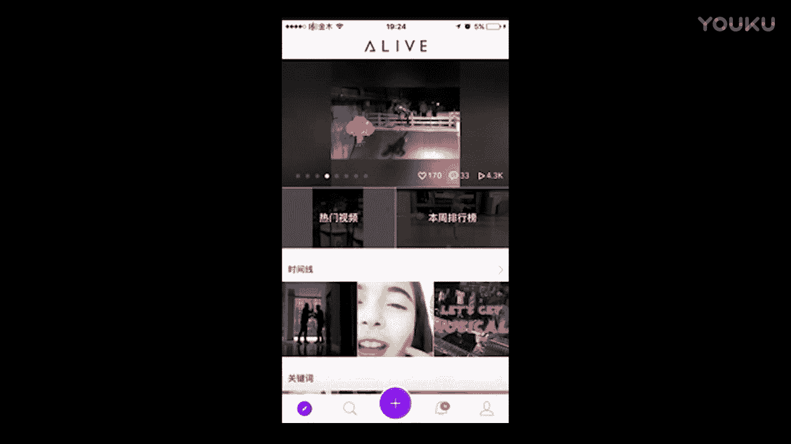

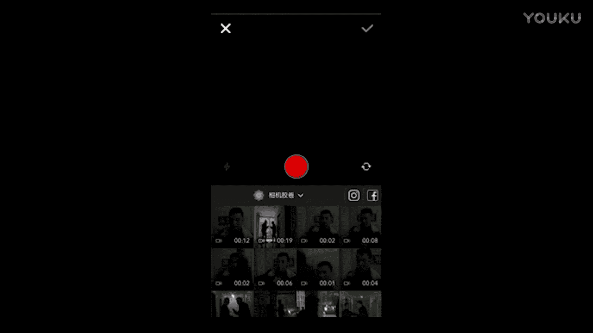

以下是我们的分镜头拍摄清单，每个镜头前都有一句简单的动作描述：

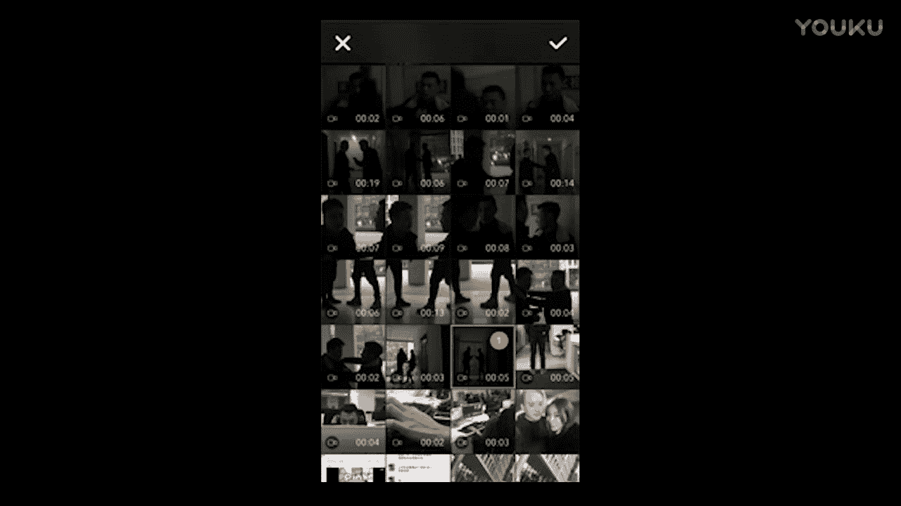

*   **镜头一（全景）**：摄像机在走廊尽头，随着两人打斗缓缓后退或前进，展现环境与整体动作。
*   **镜头二（中景）**：拍摄上半身。对手抓住主角衣领，将其推撞到墙上，主角抬脚反击。
*   **镜头三（特写）**：摄像机贴近地面，跟随主角踢出的脚部动作，从抬起至落下。
*   **镜头四（过肩镜头）**：在轴线同一侧，从主角身后拍摄其出拳击打对手的动作。
*   **镜头五（反应镜头）**：切换机位，拍摄对手反击，将主角再次打回墙边的画面。
*   **镜头六（全景）**：主角使用“手机”当作道具枪进行反击。对手中枪后仰倒地。
*   **镜头七（特效镜头）**：拍摄打火机在枪口处点火的特写，配合对手后仰的动作，模拟开枪火花。
*   **镜头八（定场镜头）**：打斗结束，主角走到镜头前，做一个帅气的收尾动作（如点烟），露出正脸。

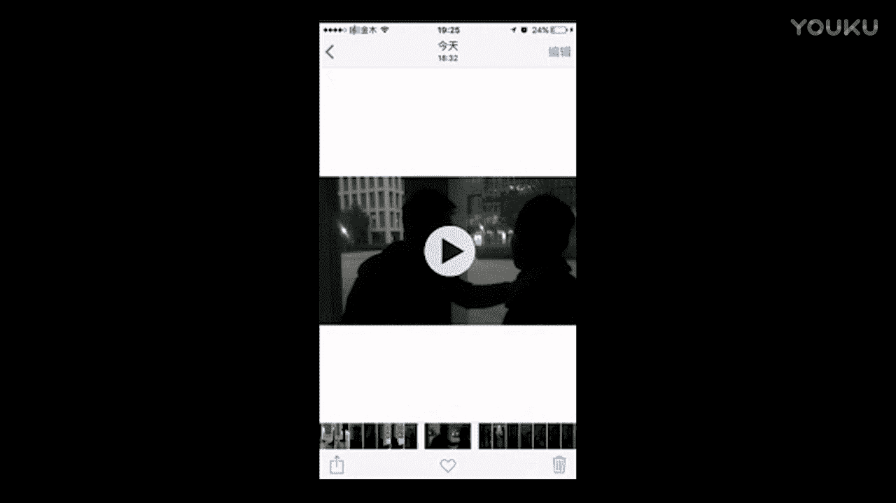

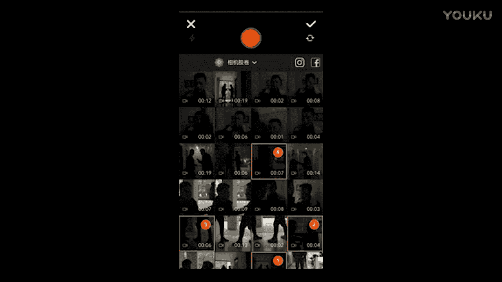

**拍摄技巧提示**：
*   演员的站姿应避免双腿并拢重叠，稍微打开会更自然有力。
*   手机录制无法后期加音效，拍摄时最好有人现场配打斗音效（如挥拳、撞击声）。
*   利用环境制造效果，例如在被打时用手指遮挡镜头光源，可以制造光线闪烁的冲击感。

## 后期剪辑实战

所有镜头拍摄完毕后，下一步是将它们剪辑成一个连贯的短片。我们使用一款名为 **Live**（图标左下角有数字“1”）的手机剪辑软件。

以下是使用Live软件进行剪辑的步骤：

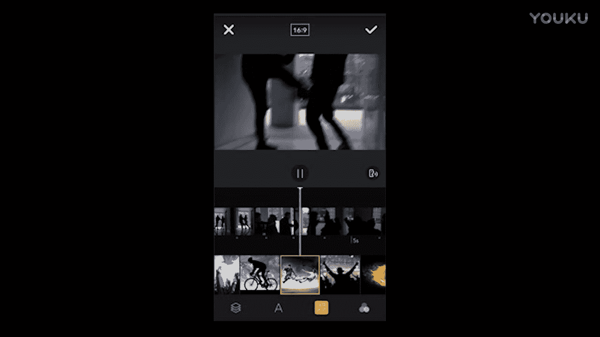

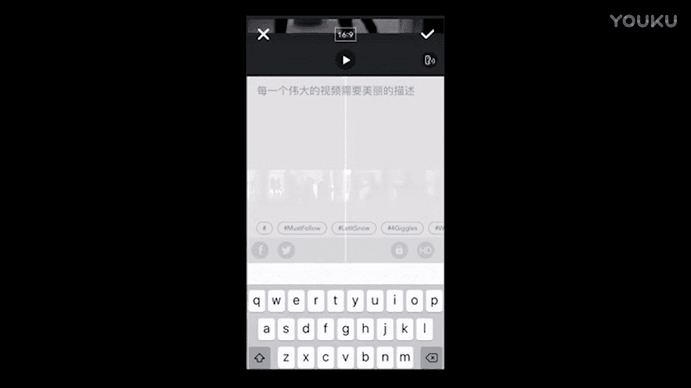

1.  **导入素材**：打开Live App，点击底部加号，选择“从相册导入”，将拍摄好的所有视频片段按顺序选中添加。
2.  **粗剪**：进入剪辑界面，使用剪切工具（剪刀图标）。原则是保留动作的**动势起始帧**，剪掉中间不必要的准备和停顿部分。例如，一个出拳动作，只保留拳头开始移动和击中目标的瞬间。
3.  **添加滤镜**：剪辑完成后，可以为视频统一添加一个滤镜，提升画面质感。
4.  **添加背景音乐**：选择一段软件自带的或本地的、节奏感强的音乐，让视频更具感染力。
5.  **导出视频**：点击完成，将视频保存至相册。**务必确保最终成片时长在10秒以内**，以适应微信朋友圈视频的时长限制。

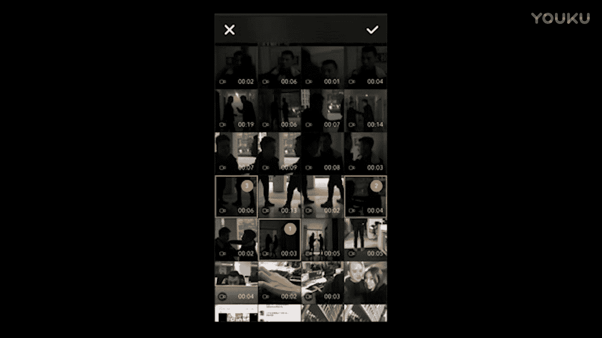

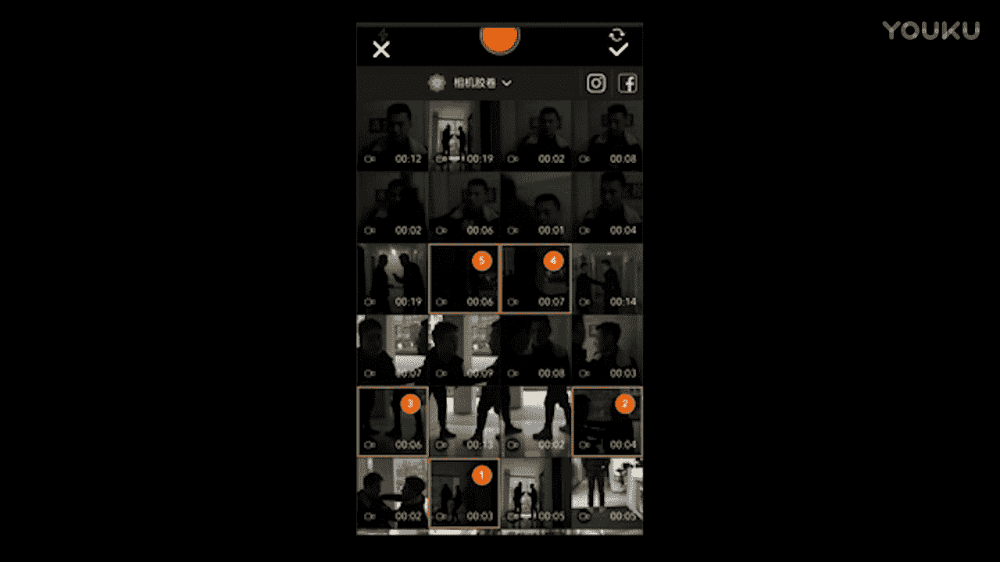

## 总结

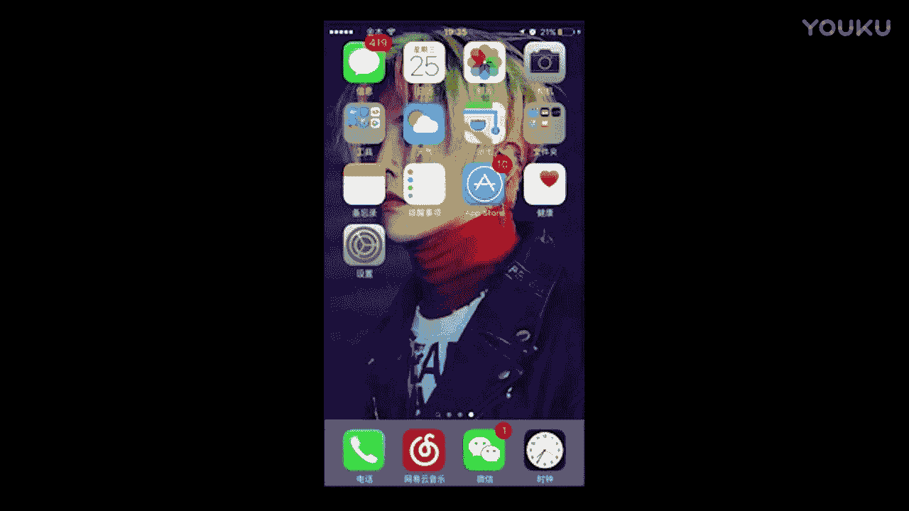

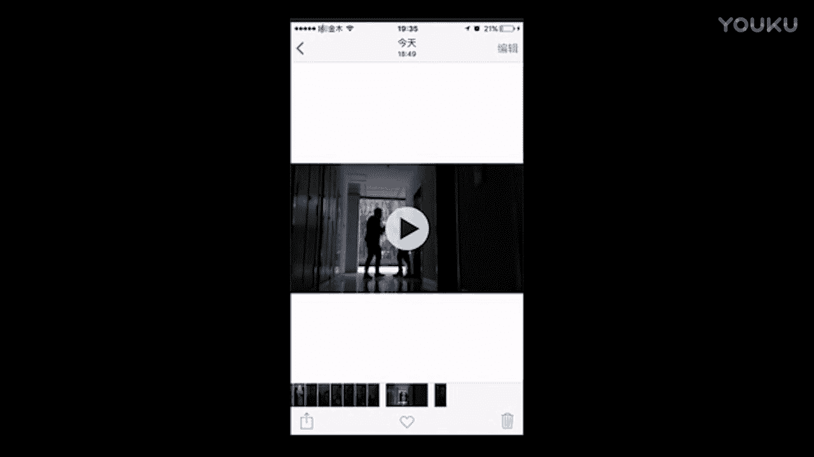

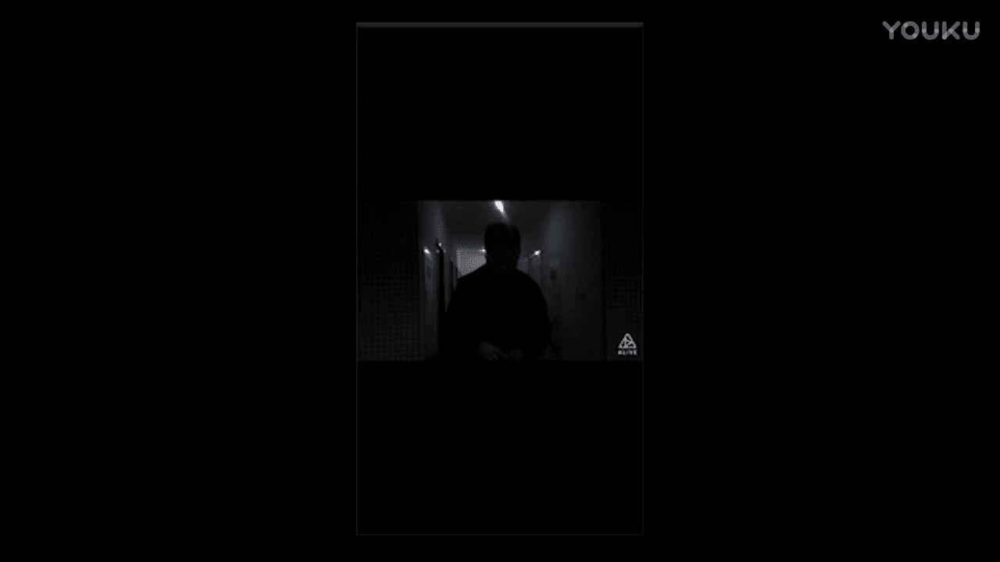

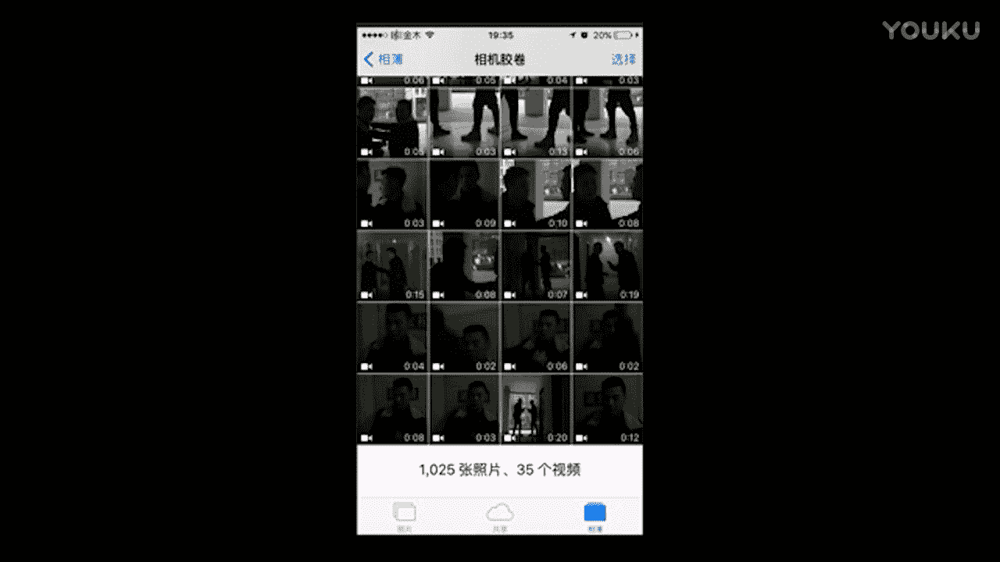

本节课我们一起学习了用手机制作酷炫短片的完整流程。我们从**轴线原则**这一核心概念出发，完成了**人员场景准备、分镜头设计拍摄、以及使用Live App进行剪辑**的全过程。记住，关键在于多拍不同景别的素材，并在剪辑时大胆取舍，只保留最具动感和冲击力的画面片段。现在，你可以尝试拍摄并制作属于自己的10秒酷炫短片了。