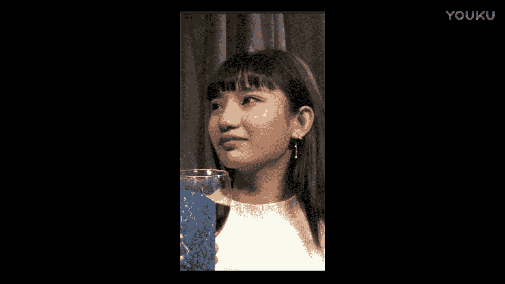
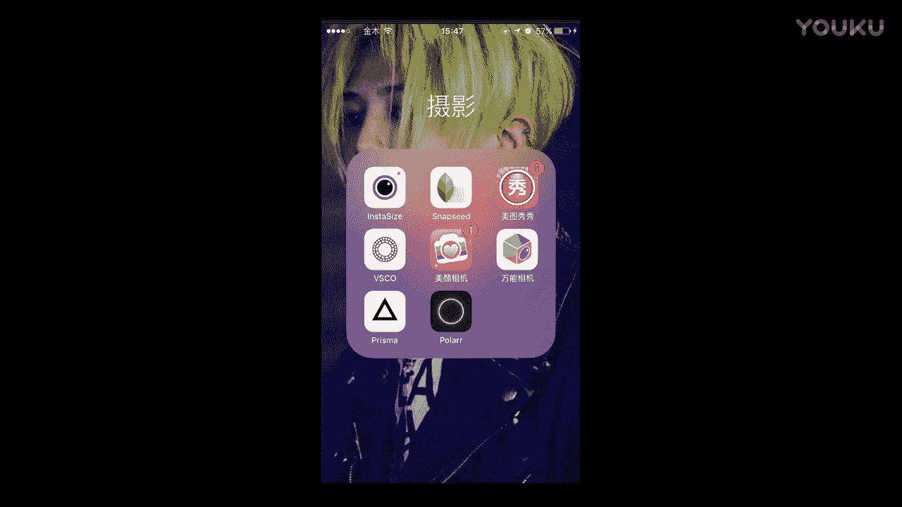
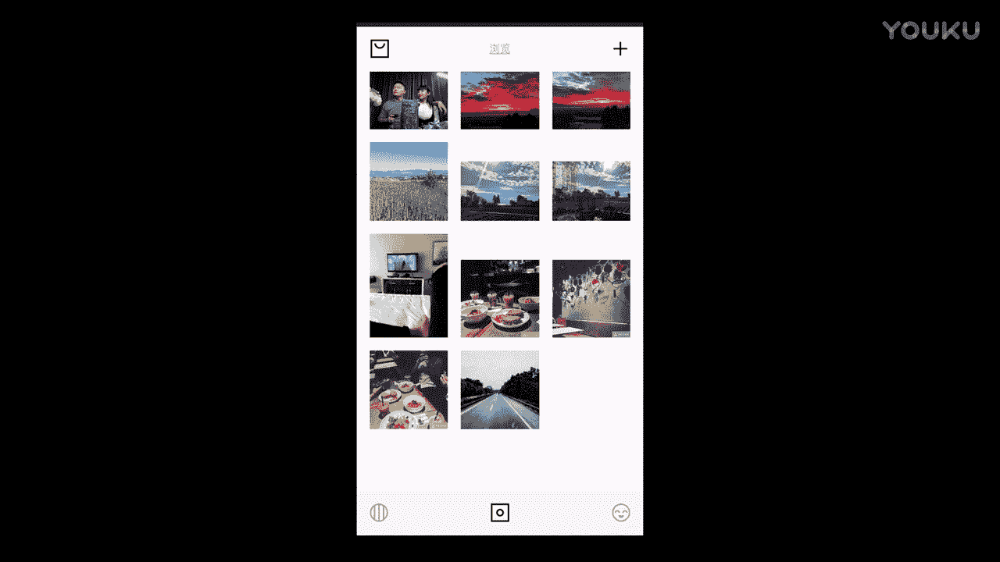
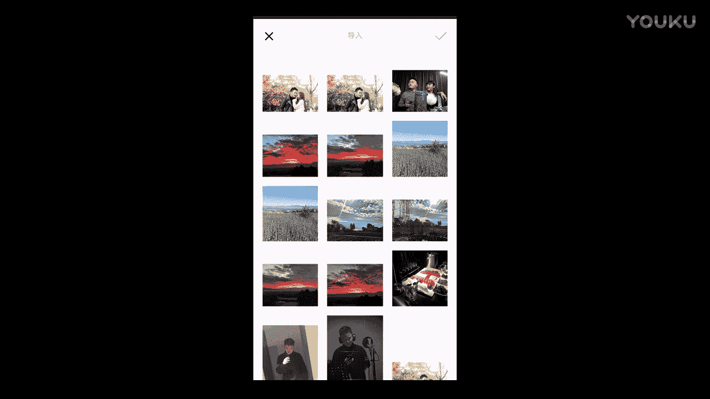
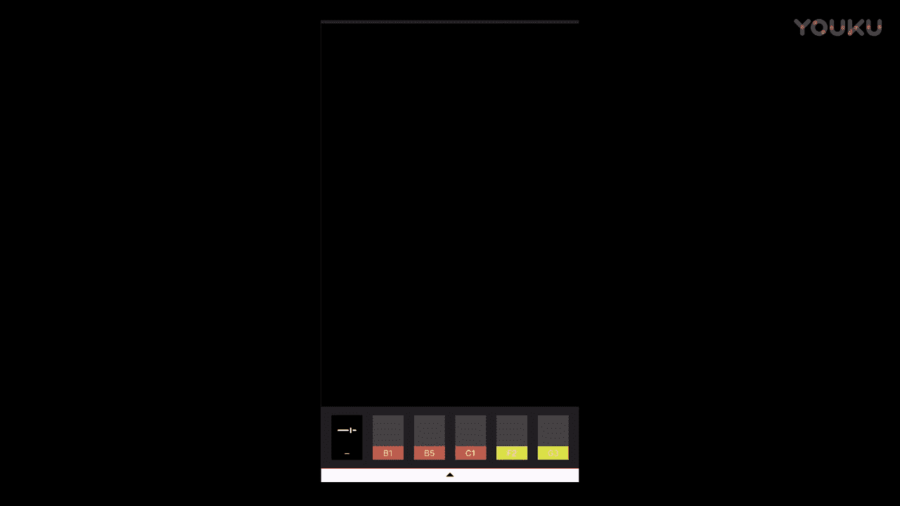
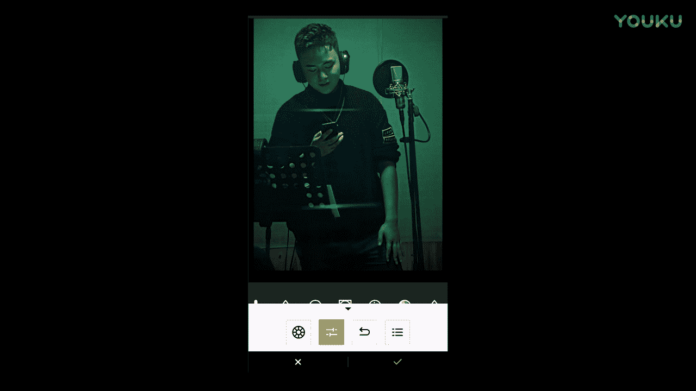
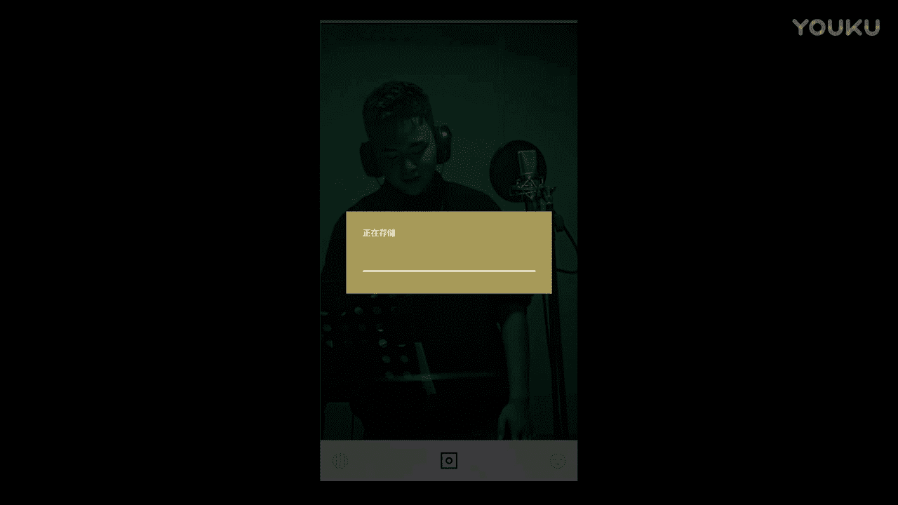
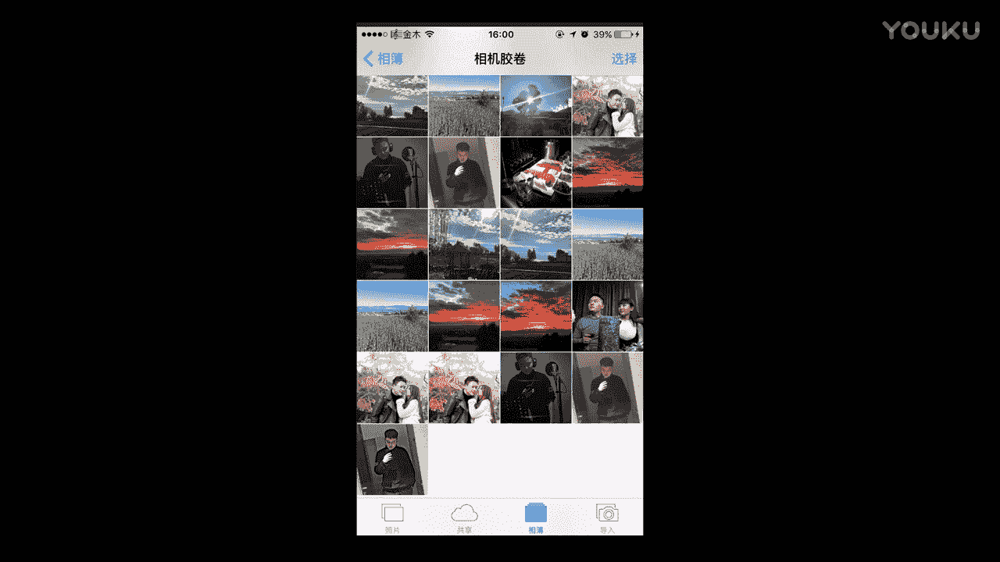
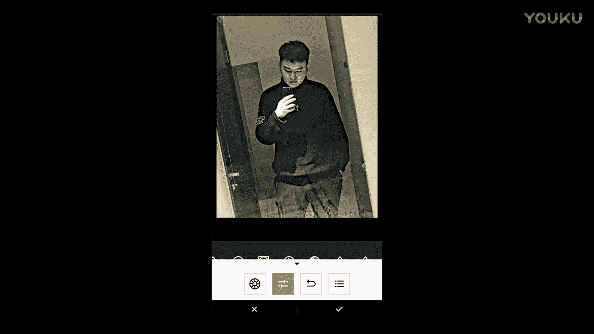

# 正冉装逼：10：人像后期处理教程 📸

在本节课中，我们将学习如何对人像照片进行后期处理。我们将从调整肤色、修饰面部细节，到应用不同风格的滤镜，系统地讲解人像修图的核心技巧。课程将使用简单直白的语言，确保初学者能够轻松跟上。

---

## 概述

上一节我们介绍了风景照片的修图方法。本节中，我们来看看人像照片的后期处理。人像修图的核心在于保持肤色的自然，同时根据需求调整整体色调和细节。

## 肤色调整：基础与核心

处理人像时，肤色是关键。风景照片可以随意调整色调，但人像涉及肤色，需要谨慎处理。

以下是调整肤色的基本步骤：

1.  **轻微增加清晰度**：`清晰度 +10`
2.  **调整色温**：如果原图偏暖，可向冷色调（蓝色）方向微调，例如 `色温 -5`。
3.  **中和肤色**：通过微调“色调”滑块，向绿色方向稍作偏移，可以中和皮肤中的红色，使肤色更自然，例如 `色调 +3`。
4.  **使用对比**：调整后，肤色会更健康，人物与背景的层次感会增强。

*调整前后的对比效果*

## 面部细节修饰

说完整体色调，我们进入面部细节的修饰。如果无法使用专业的“FaceTune”软件，可以使用“美图秀秀”等工具。

以下是使用美图秀秀修饰面部的流程：

1.  **瘦脸**：使用“瘦脸”功能，注意画笔大小不宜过大，以免修图痕迹过重。
2.  **除皱**：使用“祛痘祛皱”功能处理细纹，需手动点涂，注意保持自然。
3.  **局部提亮**：使用“亮眼”功能，加深眉毛、眼睛，并提亮衣服饰品等细节，增加画面质感。

*面部修饰前后对比*

## 自然风格人像调色

修饰完面部后，我们为照片调色。对于追求自然感的人像，调色不宜过度。

以下是打造自然风格人像的调色思路：

1.  **检查曝光**：确认原图曝光是否准确，通常无需大幅调整。
2.  **微调对比与清晰度**：`对比度 +5`，`清晰度 +5`，轻微提升即可。
3.  **分离人物与背景**：稍微提亮阴影，让人物从背景中凸显出来。
4.  **定调整体色调**：将色温稍微调冷（`色温 -3`），色调稍微调绿（`色调 +2`），营造沉静氛围。
5.  **添加颗粒感**：可少量添加噪点（`颗粒 +10`），增加胶片质感。

*自然风格调色前后对比*

## 高风格化人像处理

最后，我们探索一种高风格化的人像处理方式，适合想要突出个性或艺术感的照片。

以下是创造高风格化效果的步骤：

1.  **大幅提升清晰度**：将清晰度拉到较高值，例如 `清晰度 +50`，强化线条和纹理。
2.  **增强对比度**：`对比度 +15`，让明暗对比更强烈。
3.  **调整色调**：色温偏冷（`色温 -10`），色调偏绿（`色调 +5`），形成独特的色彩风格。
4.  **添加暗角与颗粒**：添加适量暗角，并增加颗粒感（`颗粒 +20`），强化画面氛围。

*高风格化处理前后对比*

## 总结

本节课中我们一起学习了人像后期处理的完整流程。我们从**肤色调整**这一核心开始，学习了如何让肤色更自然健康。接着，我们探讨了使用工具进行**面部细节修饰**的方法。然后，我们分别讲解了打造**自然风格**和**高风格化**人像的调色思路与具体步骤。记住，人像修图的精髓在于平衡，既要美化画面，又要保持人物的真实与生动。