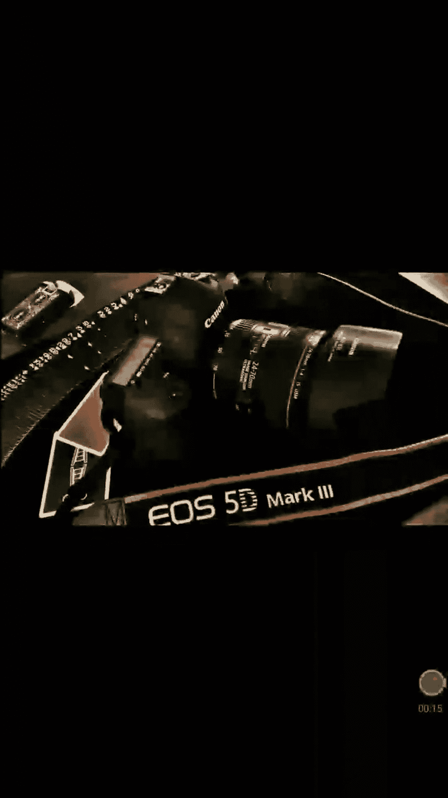
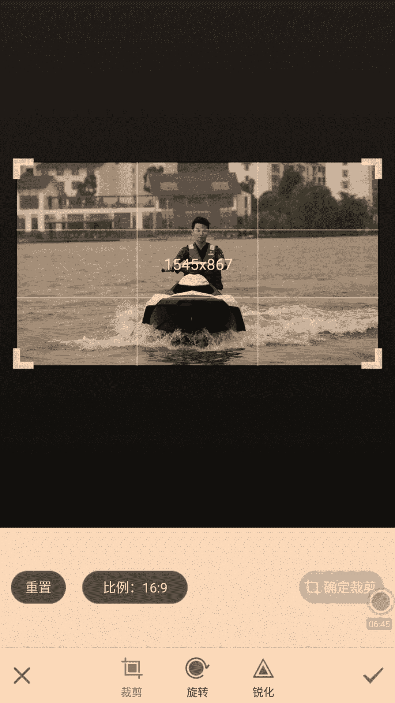
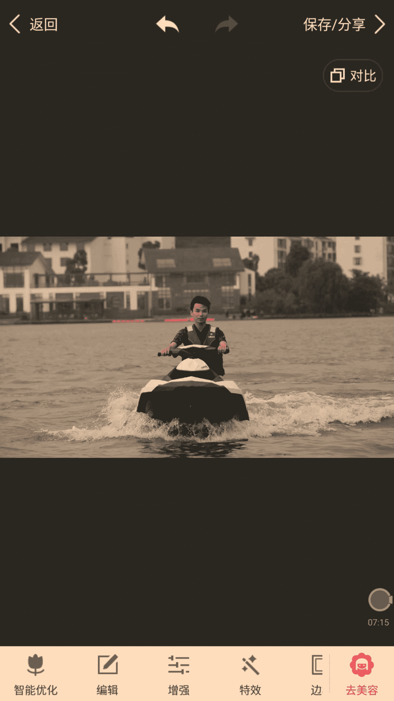
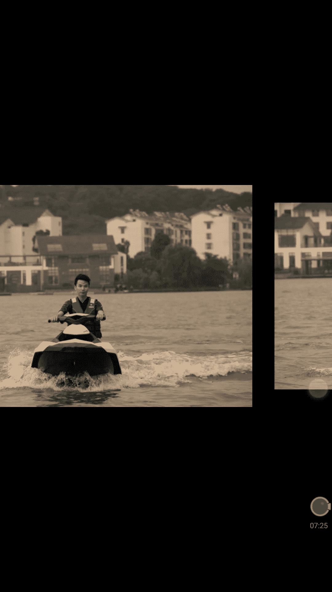
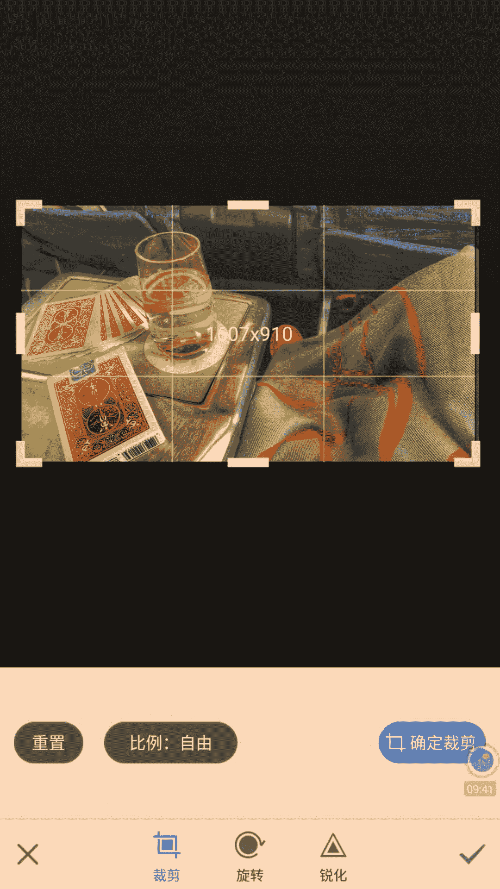

# 修图黑科技：第一节：基础构图与剪裁构图 📸

在本节课中，我们将要学习摄影与修图中最基础也是最重要的一环——构图。好的构图是呈现一张好照片的基石。通过学习本节内容，你将掌握如何通过简单的构图技巧，让手机拍摄的照片瞬间提升质感与格调。

很多朋友都使用手机拍照，但常常感觉拍出的照片杂乱、主体不突出、缺乏美感。这通常是因为没有掌握构图的方法。构图虽然是一种感觉，但也有很多可以学习和遵循的规则。本节将为你详细讲解两种简单易懂的构图方法：**基础构图**与**剪裁构图**。

---

## 一、 构图的核心：关键点与关键线

上一节我们提到了构图的重要性，本节中我们来看看如何具体操作。首先，我们需要理解一个核心工具：**构图线**。

在拍照时，建议你打开相机设置中的“网格线”或“构图线”功能。屏幕上会出现横竖交叉的格子，形成四个交叉点。

这四个交叉点被称为**关键点**。构图的核心原则之一，就是将照片中重要的主体放置在这些关键点上。

**关键点公式**：`照片主体 ≈ 关键点位置`

让我们通过一个例子来感受。下图是一张原图，构图较为普通。

经过调整构图后，照片的感觉完全不同。注意人物位置的变化，它被移动到了关键点上。

为什么第二张图感觉更好？在第一张图中，关键点上没有主体，视线找不到落脚点。而在第二张图中，两个关键点都落在了人物身上，你的注意力会自然而然地被引导至主体，照片因此显得主题明确、大气磅礴。

---

## 二、 第二种构图法：关键区域构图

除了将主体放在关键点上，还有另一种非常有效的方法：将主体放置在**四个关键点所围成的中心区域**，并保持主体与左右关键点的距离大致相等。

以下是这种构图法的操作思路：
1.  主体位于画面中心区域。
2.  主体与左右两侧的关键点距离保持均衡。

这种方法尤其适合主体本身具有一定宽度或体积的情况。

---

## 三、 实战演练：剪裁构图法

很多时候，我们拍下的照片构图并不理想。没有关系，我们可以通过后期剪裁来拯救它，这就是**剪裁构图法**。

我们将使用**美图秀秀**软件进行演示。首先，导入一张构图不佳的照片。

可以看到，原图构图歪斜，关键点上没有主体。

以下是使用剪裁构图法拯救这张照片的步骤：

**第一步：选择画面比例**
在剪裁工具中，将比例设置为 **16:9**。这是一个非常通用且具有电影感的画面比例，能有效提升照片格调。

**第二步：调整剪裁框，应用关键区域构图**
1.  将剪裁框缩小，使摩托艇（主体）大致位于四个关键点围成的中心区域。
2.  由于摩托艇正在向右转弯，可以有意让画面右侧留白稍多，左侧稍紧，营造出向右运动的动态感和想象空间。
3.  将上方的横线（构图线）对准人物的眼睛或眉毛附近，这是视觉重心所在。

**第三步：确认并完成**
完成剪裁后，对比原图，效果立竿见影。

原图视线分散，不知重点何在。而剪裁后的照片，观众的注意力会第一时间聚焦在人物身上，主题鲜明，富有动感。

---

## 四、 构图的应用与直觉培养

构图的核心目的是**控制观众的注意力**。就像一位女士可以通过妆容和衣着引导他人关注她的脸庞或身材一样，我们可以通过构图来决定观众第一眼看到什么。

无论是拍摄人物、风景还是食物，这个原则都适用。例如下面这张甜点图，在拍摄时就已经运用了构图线，将甜品的“焦点”部位对准了关键点。

多观察、多练习这些构图原则，你会逐渐培养出良好的构图直觉。即使在拍摄时没有做好构图，也可以在后期通过剪裁来弥补。

---

## 课程总结

本节课中我们一起学习了：
1.  **构图的重要性**：它是好照片的基础，能有效提升照片的质感和表现力。
2.  **基础构图法**：利用**关键点**，将照片主体放置在构图线的交叉点上。
3.  **剪裁构图法**：通过后期剪裁，将主体置于**关键点之间的中心区域**，并可通过调整左右空间来营造动态感。
4.  **构图的本质**：是**引导和控制观众视线**的工具。

记住核心口诀：**主体放点上，或置区域间；左右留空间，动态自然现。**

下节课，我们将学习一个更进阶的“黑科技”技能——**变形构图**，它能让你的构图能力更进一步。我们下节课再见！