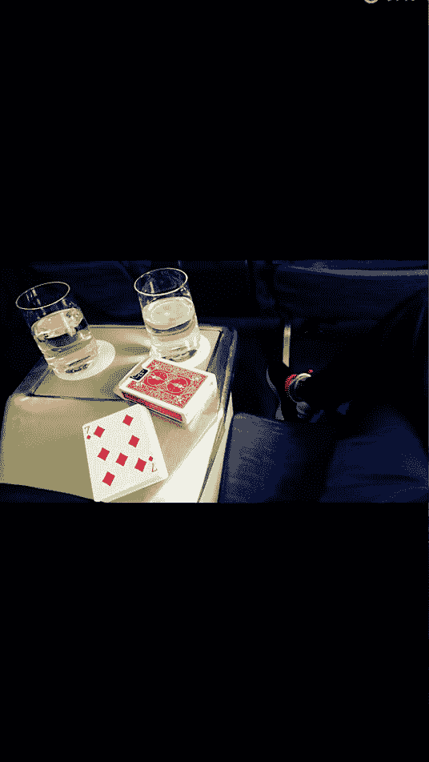

# 修图黑科技：第七节：局部美白 🎨

在本节课中，我们将学习一种利用“去黑眼圈”功能实现局部美白的黑科技技巧。这种方法能自然地提亮肤色，解决面部与身体其他部位（如手部）亮度不一致的问题。

## 概述

上一节我们介绍了基础的祛痘方法。本节中，我们来看看如何解决照片中面部肤色暗沉、与身体其他部位亮度不协调的难题。我们将使用一个意想不到的工具——“去黑眼圈”功能，来实现精准且自然的局部美白效果。

## 操作步骤

以下是实现局部美白的详细步骤。

1.  **基础调整**
    首先，对整体照片进行基础亮度调整。例如，使用“自然”滤镜，并将强度设置为70%。

2.  **处理瑕疵**
    使用上节课教授的祛痘功能，去除面部的汗珠或其他明显瑕疵。

3.  **应用“去黑眼圈”功能**
    这是核心步骤。选择“去黑眼圈”功能，将其作为局部美白工具使用。

4.  **精细涂抹**
    需要耐心地操作。用画笔仔细涂抹需要提亮的皮肤区域，例如脸颊、额头、下巴。注意避开头发、眉毛、眼睛、鼻孔和嘴唇等部位，因为这些地方变亮后会显得不自然。

5.  **效果对比与调整**
    涂抹完成后，对比处理前后的效果。如果觉得某些区域（如额头）提亮程度不足，可以重复涂抹一次以增强效果。

## 原理与技巧

这个方法的原理在于，“去黑眼圈”功能的算法设计是**淡化黑色区域**。当将其应用于肤色暗沉处时，它并非简单粗暴地提亮，而是智能地**减淡黑色素**，从而实现一种非常自然的美白与提亮效果，类似于局部的磨皮。

使用时有几个关键技巧：
*   **避开深色区域**：不要涂抹头发、眼珠等本身应是深色的地方，否则会显得虚假。
*   **追求自然**：该功能的优势在于算法自然，不会让肤色过曝或失真。
*   **灵活应用**：此功能不仅可用于面部美白，也可用于提亮照片中其他杂乱的暗部区域。

## 效果对比

通过对比可以清晰看到差异：
*   **仅基础修图**：面部依然暗沉，与手部亮度差距明显。
*   **基础修图 + 局部美白**：面部肤色变得干净、明亮，与手部的亮度过渡更自然，整体观感更协调。

## 总结

本节课中，我们一起学习了一个修图黑科技：**利用“去黑眼圈”功能实现局部美白**。我们掌握了从基础调整、瑕疵处理，到核心的“以黑眼圈工具作美白笔”进行精细涂抹的全过程。关键在于理解其**淡化黑色**的原理，并注意**避开非皮肤区域**以保持自然。这个技巧能有效解决肤色不均问题，让照片细节更加干净、协调。