# 修图黑科技：第三节：食物与景色修图大法 🍽️🌄

在本节课中，我们将学习如何为食物和风景照片进行修图，使其更具风格和吸引力，而不是显得普通。核心在于理解构图原理，并运用工具突出照片的主题。

## 理解构图：修图的基石

上一节我们介绍了修图的基本流程，但在开始修图前，必须明白照片的“底子”至关重要。我们之所以没有先讲如何拍照，是因为你需要先理解什么样的照片是美的，才能去构造和拍摄好的照片。拍摄只是瞬间的事情，关键在于前期的构思、寻找角度和填充画面。

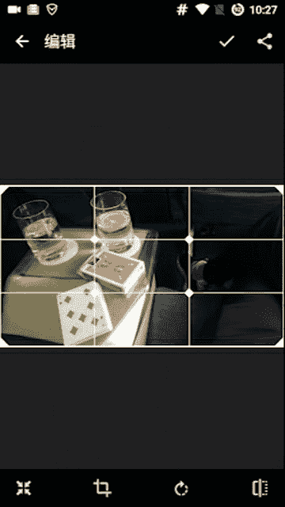

以下是理解构图核心的方法：

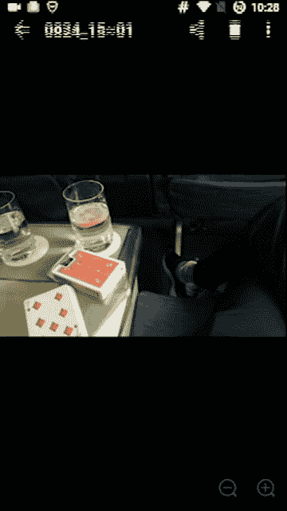

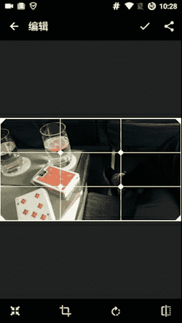

我们可以通过“构图线”来引导观众的视线。一张照片通常有两个核心的视觉焦点。例如，观察一张柱子的照片，你的目光会自然集中在柱子上，因为构图线的两个核心点都落在了柱子上。

再举一个有趣的例子。观察一张带有数字“7”和“柠檬水”牌子的照片。在原始构图中，你的第一注意力会被数字“7”吸引。

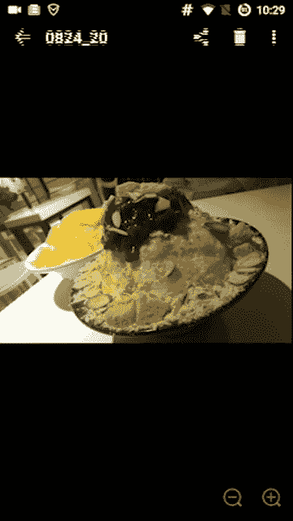

但如果我们按比例进行裁剪，将画面聚焦在“柠檬水”牌子上。

裁剪后，你的第一注意力就会转移到“柠檬水”牌子上。这是因为构图线的两个重心点现在分别落在了“水”和“牌”上。

这是一个非常关键的原理。只有理解了这种构图方式，你才能更好地通过裁剪等方式，在修图时突出你想表达的重点。无论是食物还是景物，都需要一个明确的主题。如果观众看你的照片时不知道你想表达什么，那就失败了。因此，我们要通过构图来控制观众第一眼看到的位置。

## 基础修图流程：从原图到初步优化

本节中我们来看看具体的修图操作。首先，原图需要尽可能清晰。以下是一些用手机拍摄的原图示例。

如果你的照片背景不是白色，而是偏黄、偏暗等暖色调，或者偏蓝等冷色调，可以遵循以下流程。我们以一张背景偏黄的食物照片为例。

以下是初步优化步骤：

1.  **使用美图秀秀的HDR特效**：在美图秀秀中打开照片，选择“特效”中的“HDR”。将强度调整到**70**左右，然后确认。
2.  **使用智能优化**：接着点击“智能优化”，通常选择“自动”模式。对于美食照片，自动模式效果比较稳定。

完成这两步后，照片会比原图更有色泽。但此时还远未达到“有逼格”的要求，这仅仅是完成了从0到60分的基础工作。

## 进阶风格化处理：使用Snapseed

为了将照片从60分提升到90分，我们需要使用Snapseed进行风格化处理。将初步优化后的照片导入Snapseed。

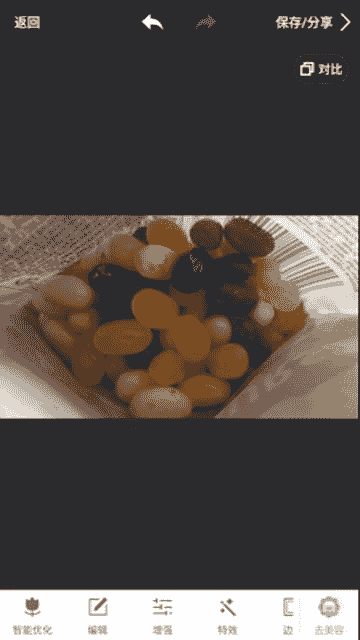

对于食物照片，我偏好使用“戏剧效果”滤镜，通常选择**戏剧2**。人物照片则更适合**戏剧1**。应用滤镜后，照片风格会立刻增强，但可能显得对比过于强烈，缺乏食欲。

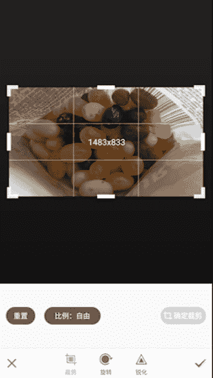

这时，我们需要进行关键调整：**突出关键点的颜色**。在Snapseed中，上下滑动屏幕找到“饱和度”选项。饱和度控制颜色的鲜艳程度，**饱和度越低，照片越接近黑白；饱和度越高，颜色越鲜艳、越暖**。

观察这张照片，其构图关键点落在红色的食物上。因此，我们的修图目标就是**突出红色**，以增强食欲。如果红色不够突出，照片就缺乏吸引力。

我们需要微妙地调整饱和度，大约提升到**8**或**9**左右，让红色变得鲜艳，但又不至于让其他部分（如手部）也过度变红。对比原图与调整后的效果，你会发现红色被突出后，食物立刻显得更有张力，更能勾起食欲。

这个原理的核心是：**找到构图的关键点，并强化关键点上你想要突出的颜色**。如果想让观众注意的元素不在关键点上，可以通过之前学习的裁剪或变形工具，将其移动到关键点上。

## 实践案例：拯救有缺陷的构图

我们来看一张有构图缺陷的照片。这张照片是竖拍的，且上方留空过多，下方的糖果也没有完整展现。

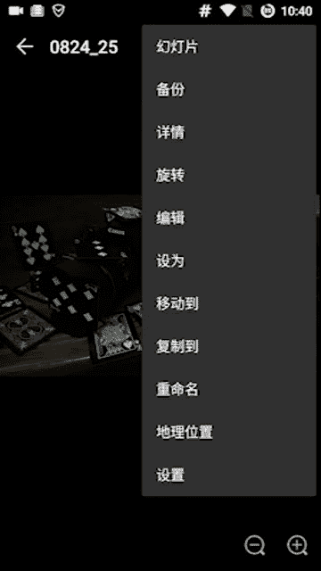

首先，我们需要旋转照片，将其调整为横向，这样看起来更舒适。然后进行精细裁剪，裁掉上下多余的部分，让画面更紧凑。

裁剪后，画面看起来更合理了。接下来分析构图关键点。

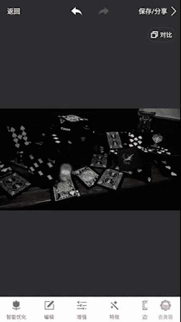

关键点落在绿色的糖果上。因此，我们的修图目标是**突出绿色**。

再次遵循基础流程：在美图秀秀中使用HDR特效，绿色会加深。然后使用智能优化。这里智能优化将背景从偏黄调整为更白，这反而更好，因为**白色背景与绿色糖果的对比更强烈**，更能突出绿色。

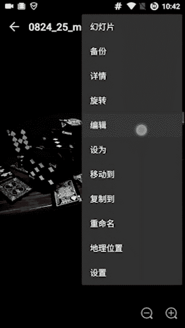

完成基础优化后，照片已经鲜艳很多。接下来使用Snapseed进行进阶处理。应用“戏剧效果”滤镜，并微调参数，进一步强化绿色与周围颜色的对比。对比原图、美图秀秀优化后的图以及Snapseed处理后的最终图，效果差异非常明显。

原理始终如一：**放大关键点的颜色**。只有理解了如何让食物看起来更美味、让景物更好看，你才能有针对性地调整参数，而不是机械地复制流程。

## 风格化探索：突出主题与营造氛围

修图不仅可以突出具体物体，还可以营造整体氛围。我们以一张暗色系的景物照片为例。

这张照片的关键点在于“相机”和“扑克牌王牌”。我们先用美图秀秀处理：HDR特效可以让细节更清晰，智能优化则能增强“王牌”与背景的对比，让视觉重心凸显出来。

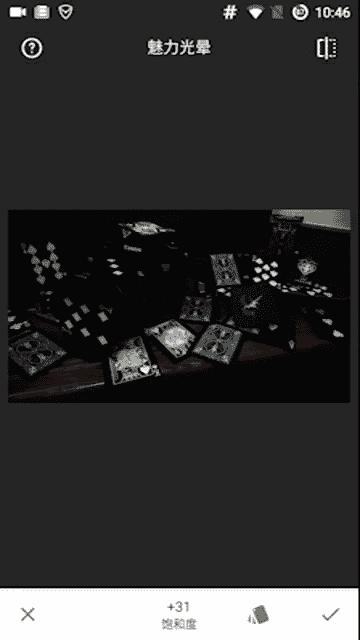

基础优化后，照片的重心（相机和王牌）变得明确。接着用Snapseed提升质感。对于这种场景，使用“戏剧效果1”并降低滤镜强度，避免背景出现不自然的蓝色。同时适当增加饱和度。

处理后的照片，各个元素（楼梯、相机、王牌）之间有了更明显的分层，主题更加突出。

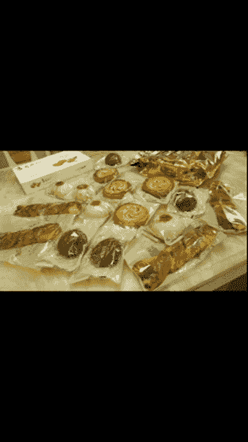

此外，还有另一种修图思路：**营造强烈的风格感**。我们可以尝试增强黑白对比，让照片呈现出一种昏暗、风格化的视觉效果。这种处理下，观众的重点不再是某个具体物体，而是整体画面强烈的对比所带来的视觉冲击。

这两种风格代表了不同的修图目标：**第一种是突出主题，引导视线到关键物体；第二种是营造氛围，强调整体的风格和感觉**。理解这一点，你就能自由选择滤镜和调整方式来表达你的意图。

## 核心原理总结：控制视觉焦点

修图的奥秘远不止调色那么简单。其核心在于**控制观众的视觉焦点，表达你想传达的内容**。

无论使用什么滤镜或工具，都要问自己：这张照片的关键点在哪里？我想突出什么？例如，一张有四个关键点的照片，通过特定的色调调整，你可以将观众的注意力完全集中在其中某一个点上。

Snapseed中的“晕影”功能是一个强大的“黑科技”。它可以给照片四周加上暗角，**强制性地将视觉中心向画面中间收缩**。当你增强晕影强度时，观众的注意力会越来越集中在画面中心。

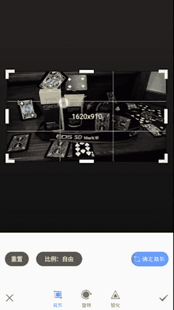

再看一个颜色对比强烈的例子。一张防晒霜的照片，关键点落在黄色的瓶身上。

通过基础优化（HDR、智能优化），可以让黄色部分变亮，与暗下来的背景形成对比，从而牢牢锁住视觉焦点。

在进阶处理时，要时刻记住目标：**强化关键点与背景的差异**。可以尝试Snapseed中的“戏剧效果”、“魅力光晕”、“复古”等滤镜，或者使用“突出细节”来加强结构。选择的标准是：哪种方式能最好地实现你的目标——或调亮主体，或压暗背景。

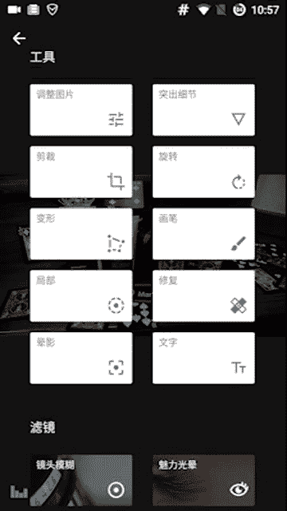

最终，通过综合调整亮度、饱和度和晕影，我们可以让观众的视线被牢牢锁定在想要突出的主题上。

## 课程总结

本节课中，我们一起学习了食物与风景修图的核心方法。关键在于理解构图，找到照片的视觉关键点，并通过修图工具（如美图秀秀的HDR与智能优化，Snapseed的滤镜、饱和度、晕影等）来强化关键点的颜色或对比，从而引导观众视线，突出照片主题或营造特定氛围。真正的修图是用脑子思考“我想表达什么”，然后选择合适的技术去实现它，而不是无脑套用滤镜。掌握这个原理，你就能在短时间内修出具有个人风格和感染力的照片。

下节课我们将讲解人像修图的技巧，包括正脸五官的修饰与侧脸意境的营造。