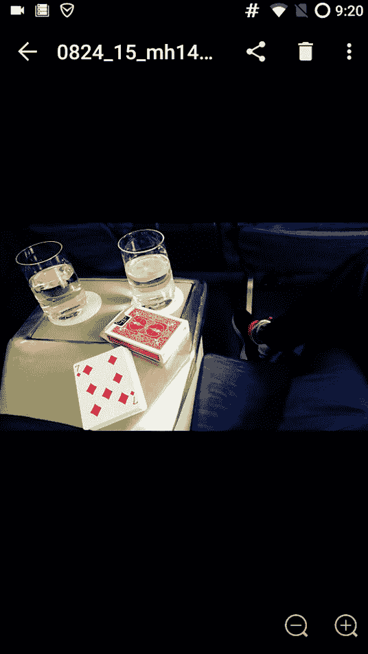
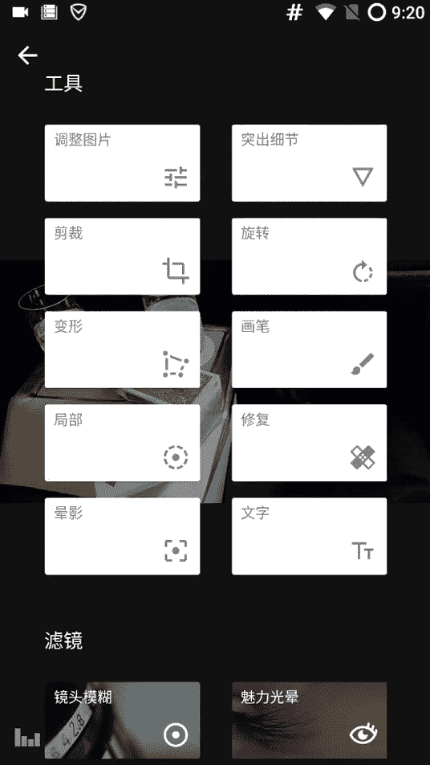
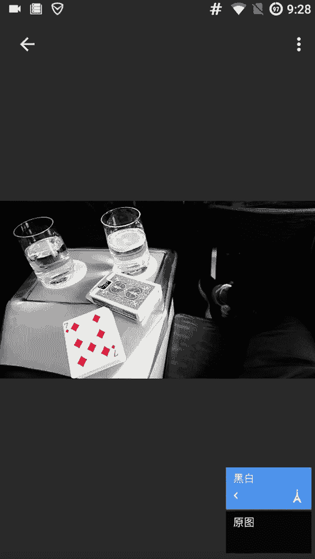
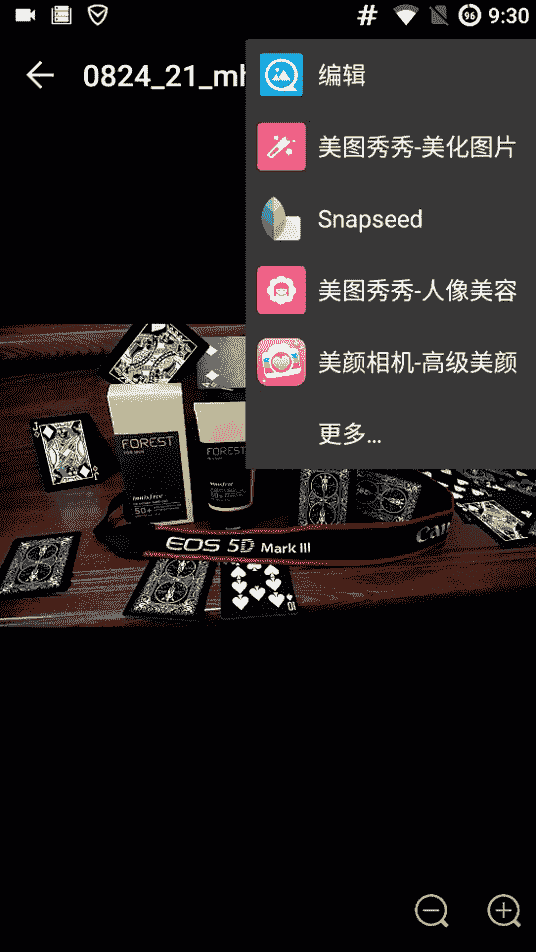
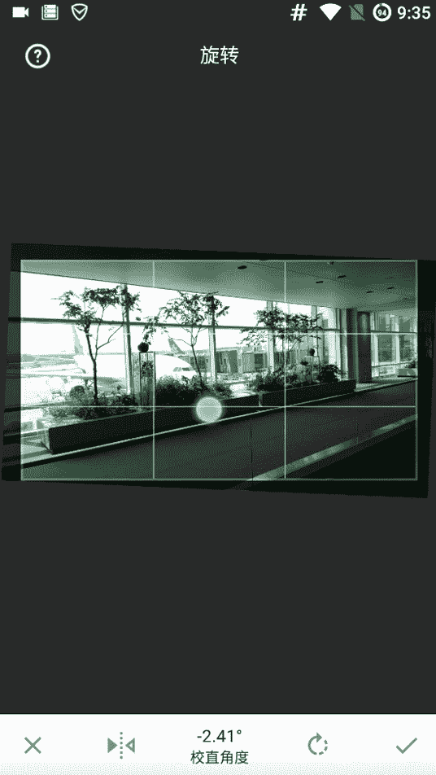
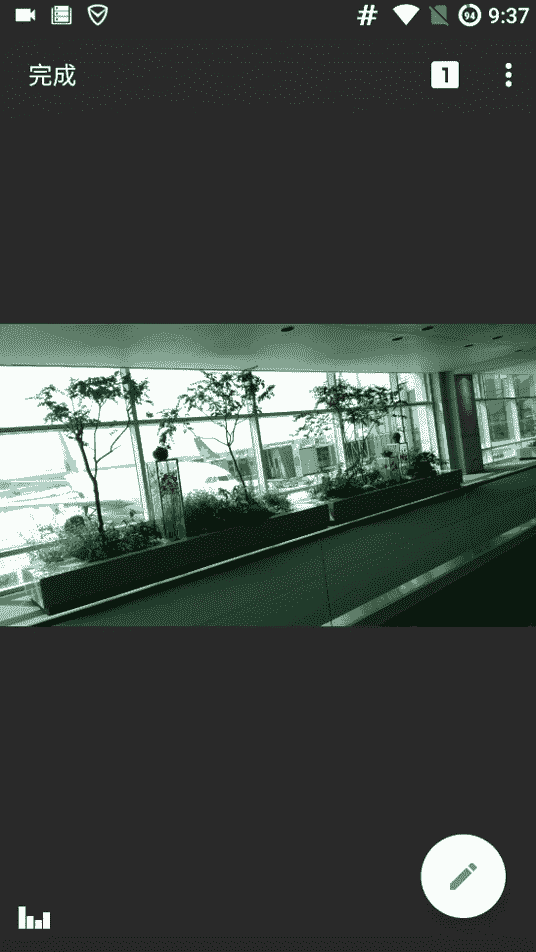

# 《修图黑科技》：第五节：图层黑科技 🎨

在本节课中，我们将要学习一个强大的修图“黑科技”——图层功能。通过图层，我们可以为图片的不同部分应用不同的效果，从而创造出极具视觉冲击力和专业感的作品。

## 概述：什么是图层？

上一节我们介绍了基础的构图与修图方法。本节中，我们来看看一个能极大提升修图自由度的功能——图层。简单来说，图层就像一张透明的玻璃纸，我们可以在上面添加各种效果（如黑白、滤镜），并控制这些效果应用到图片的哪些区域。

## 图层基础：从黑白效果开始

我们以一个实例开始。首先，对一张图片进行基础处理：使用HDR和智能优化功能。

处理完成后，我们进入Snapseed，尝试为其添加一个“中性黑白”效果。

此时，图片整体变成了黑白。界面右上角会显示数字 **`1`**，这代表我们添加了一个效果图层。点击这个数字，即可进入图层管理界面。

## 理解图层蒙版与效果强度

在图层管理界面，我们可以看到当前添加的“黑白”效果。点击该效果，会出现几个选项：
*   **垃圾桶图标**：删除此效果。
*   **调节图标**：调整此效果的参数。
*   **中间画笔图标**：这就是**图层蒙版**功能，也是本节的核心。

点击画笔图标后，界面会变为红色蒙版视图。这里的红色区域代表效果（此处是黑白效果）所应用的范围。

蒙版下方有一个强度滑块，其值从 **`0`** 到 **`100`**。
*   **`强度 = 100`**：效果完全应用（蒙版为纯红色）。
*   **`强度 = 0`**：效果完全不应用（蒙版为透明）。
*   **`强度 = 25, 50, 75`**：分别代表应用25%、50%、75%强度的效果。

我们可以通过涂抹来修改蒙版，从而控制效果的应用区域。以下是操作逻辑：
*   用红色（强度>0）画笔涂抹：为涂抹区域**添加**效果。
*   用灰色（强度=0）画笔涂抹：为涂抹区域**擦除**效果。

## 实战应用一：突出单一色彩

理解了原理后，我们进行实战。目标是让一张扑克牌图片中，只有红色的“方片7”保持彩色，其余部分变为黑白，以突出视觉中心。

操作步骤如下：
1.  为整张图片添加一个“黑白”效果图层。
2.  进入该图层的蒙版界面。
3.  将画笔强度设为 **`0`**，然后仔细涂抹“方片7”的红色区域，将其从黑白效果中“擦除”出来。
4.  精细处理边缘，确保过渡自然。

完成后的效果是：背景变为黑白，而红色的牌面格外醒目，视觉冲击力极强。

## 实战应用二：局部应用戏剧化效果

图层功能不仅能做黑白，还能应用任何滤镜。例如，我们有一张人像，希望背景具有“戏剧2”滤镜的夸张质感，但人脸保持正常肤色。

操作步骤如下：
1.  为整张图片添加“戏剧2”效果。
2.  进入该图层的蒙版界面。
3.  用强度为 **`0`** 的画笔，将人脸和皮肤区域仔细擦除，使这些区域不应用“戏剧2”效果。

这样，我们就实现了背景夸张而人物肤色自然的高级修图效果，这是普通滤镜软件无法做到的。

## 进阶技巧：多重效果与反向选择

图层功能更强大之处在于可以叠加多个效果，并为每个效果指定不同的应用区域。

以下是为冰淇淋图片创造独特效果的步骤：
1.  **添加并定位第一个效果**：添加“戏剧”效果，然后在蒙版中，只涂抹冰淇淋部分，让效果仅作用于冰淇淋，使其更具立体感（3D效果）。
2.  **添加第二个效果**：再添加一个“复古”效果图层。
3.  **使用反向选择**：在“复古”效果的蒙版中，点击左下角的**反向选择图标**。原本蒙版是全部应用（红色），反向后变成全部不应用（透明）。
4.  **精确定位第二个效果**：此时，用强度为 **`100`** 的红色画笔涂抹背景区域。这样，“复古”效果就只应用在背景上，而冰淇淋不受影响。

通过这种方式，我们在一张图片中实现了**冰淇淋突出、背景氛围化**的多重效果组合。

## 附加技巧：利用旋转优化构图

在结束前，补充一个构图黑科技：Snapseed的“旋转”工具。它不仅能校正水平，还能通过选择不同的参考线来改变画面的“感觉”。

操作路径：**工具 -> 旋转**
软件会自动检测线条并给出对齐建议。我们可以手动微调，选择让画面与不同的元素（如天际线、建筑边缘）平行，从而获得最舒适、专业的构图视角。

## 总结

本节课中我们一起学习了Snapseed中强大的图层（蒙版）功能。我们掌握了：
1.  **图层蒙版**的基本概念：用红色区域控制效果的应用范围。
2.  **效果强度**（0-100）的调节意义。
3.  **突出单一色彩**的经典应用。
4.  **局部应用滤镜**以解决人像修图的常见问题。
5.  **叠加多重效果**并分别控制其作用区域的高级技法。
6.  利用**旋转**工具辅助优化构图。

掌握图层，你就掌握了精细化、创意化修图的钥匙，能够远超普通滤镜软件的效果，创造出真正独一无二的作品。下节课我们将继续探索其他修图黑科技。