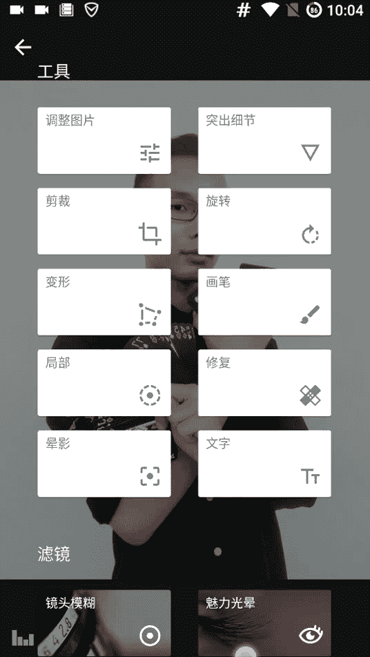
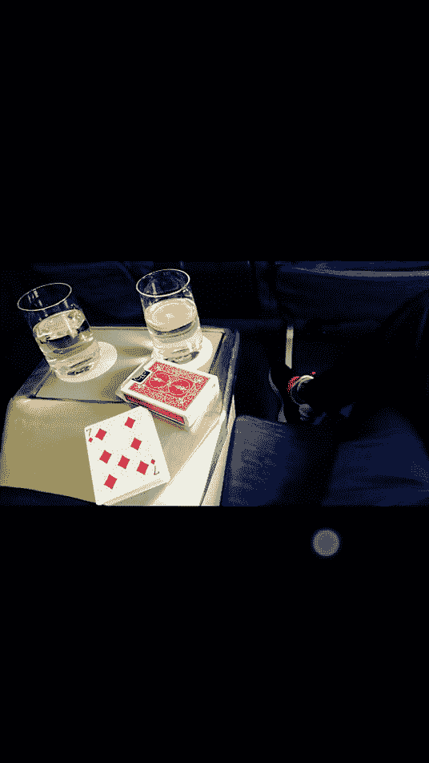
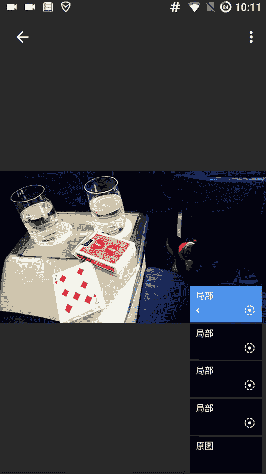
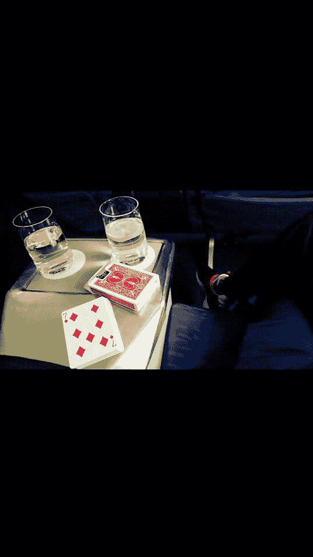

# 修图黑科技：第八节：局部优化 🎨

在本节课中，我们将学习如何使用“局部优化”功能，对照片的特定区域进行精细调整，从而解决杂色问题、净化画面并突出照片主体。

上一节我们介绍了图层效果的应用，本节中我们来看看如何利用局部调整工具进行更精准的修图。

---

## 概述：什么是局部优化？

局部优化功能允许你对照片的特定颜色区域进行独立调整，例如亮度、对比度和饱和度。其核心在于智能算法，它能识别并主要影响你选定的颜色范围，而不会过多干扰画面其他部分。

## 解决边缘杂色问题

在修图过程中，照片边缘有时会出现不和谐的杂色。以下是如何使用局部优化功能解决此问题的步骤。

以下是操作步骤：
1.  点击调整界面中的 **加号 (+)** 按钮，添加一个局部调整点。
2.  将调整点拖动到存在杂色的区域（例如绿色的边缘）。
3.  **长按并移动**调整点，注意观察外圈的色环。色环颜色变化表示算法正在识别选定区域的颜色范围。
4.  使用**双指手势**可以扩大或缩小调整的影响范围。屏幕上**红色覆盖的区域**代表当前调整会影响的区域。
5.  将调整点的**亮度滑块向右拖动**，提高该区域的亮度。随着亮度提高，边缘的青色杂色会逐渐消失。

通过对比原图与调整后的图片，可以看到杂色被有效去除，画面变得干净。

## 核心应用：净化画面与突出主体

局部优化不仅能去污，更能通过调整局部参数来净化整体色调并突出视觉重心。

### 1. 净化局部脏色

如果画面中有局部颜色显得脏污（例如一块黄斑），可以按以下步骤处理：
1.  在黄斑区域添加一个局部调整点，并确保色环对准黄色。
2.  适当**提高亮度**，**降低对比度**，并**显著降低饱和度**。
3.  观察调整范围（红色区域），确保它精准覆盖需要净化的区域，而不会影响周围干净的白色部分。

经过调整，原本发黄的区域会变得干净、明亮，整个画面的整洁感得到提升。

### 2. 突出照片主体与亮点

我们可以添加多个局部调整点，来强化照片中的重点元素。

以下是增强主体的方法：
1.  在需要突出的红色主体上添加调整点，确保色环对准红色。
2.  适当**增加亮度、对比度和饱和度**，使该颜色更鲜艳、更扎眼。
3.  可以**缩小影响范围**，让效果更集中。
4.  重复此过程，为画面中的其他重点元素（如数字、鞋子上的红色）添加类似的局部调整。

通过这种方式，能在画面中营造“万绿丛中一点红”的视觉效果，有效引导观众视线，突出照片主旨。

### 3. 效果叠加与精细控制

局部调整效果是可以叠加的。如果对某个区域的第一次调整不满意，可以在同一区域附近添加第二个调整点进行微调，例如进一步降低饱和度和对比度，直到画面达到理想的干净状态。

## 局部优化与图层效果的选用场景

理解不同工具的适用场景，能帮助你做出更好的选择。

*   **局部优化**：更适合需要**突出事物本身美感、颜色或主旨**的照片。它通过对亮度、对比度、饱和度的基础调整，实现画面净化与重点强化。
*   **图层效果**：更适合需要**营造整体氛围、风格或高级感**的照片。它通过应用滤镜来改变画面的整体质感与情绪。

例如，想让食物颜色更诱人，用局部优化；想给街景照片加上复古胶片感，则用图层效果更合适。

## 实践技巧与注意事项

为了获得最佳修图效果，请记住以下要点：
1.  **精准控制色环**：添加调整点时，长按移动以让色环对准目标颜色，这是控制影响范围的关键。
2.  **调整手机亮度**：修图时，将手机屏幕亮度调至最高，有助于更准确地判断色彩和细节。
3.  **多加练习**：工具的使用心得需要通过不断实践来积累。多尝试，感受不同参数带来的变化。

---

## 总结

本节课中我们一起学习了“局部优化”功能的核心用法。我们掌握了如何利用它**消除照片边缘杂色**、**净化画面中的脏色区域**，以及通过**多个调整点的叠加**来**突出照片主体与视觉亮点**。记住，局部优化擅长于对画面进行基础而精准的调整，是提升照片洁净度与突出核心元素的强大工具。