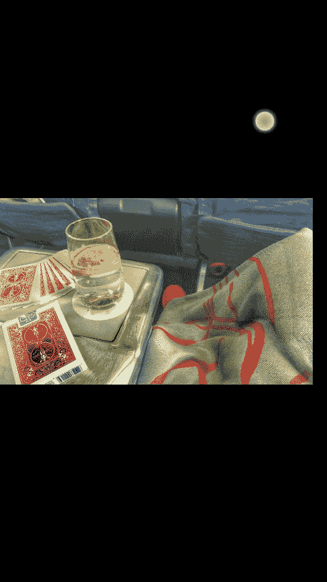

**修图黑科技：第六节：杂质去除**

在本节课中，我们将学习一个非常实用的修图技巧，即利用美图秀秀的“祛斑祛痘”功能来高效去除照片中的各种杂质和瑕疵。这个功能操作简单，效果出色，是快速美化照片的利器。

---

### 功能定位与对比

上一节我们介绍了人像美容的基础操作，本节中我们来看看一个被巧妙应用的“黑科技”功能。

“祛斑祛痘”功能的核心原理类似于Photoshop中的**内容识别填充（Content-Aware Fill）**，以及Snapseed中的**修复（Heal）**工具。它通过智能算法分析点击区域周围的像素，自动生成填充内容以覆盖瑕疵。

以下是不同软件中类似功能的对比：
*   **美图秀秀**：操作最便捷，算法针对小面积杂质优化出色。
*   **Snapseed**：修复工具效果良好，但算法在某些情况下不如美图秀秀的自然。
*   **Photoshop**：功能最强大且可控（`编辑 > 内容识别填充`），但操作相对复杂。

因此，对于日常快速去除照片中的小瑕疵，推荐优先使用美图秀秀的“祛斑祛痘”功能。

---

### 操作步骤详解

了解了功能原理后，我们通过实际案例来学习具体操作。以下是使用“祛斑祛痘”功能去除杂质的完整流程。

1.  **打开功能**：在美图秀秀中打开照片，进入“人像美容”模块，找到并点击“祛斑祛痘”功能。
2.  **识别瑕疵**：仔细查看照片，识别需要去除的杂质，例如皮肤上的汗滴、衣物上的污点、背景中的无关物体等。
3.  **点涂去除**：调整笔刷大小至略大于瑕疵点，直接在瑕疵部位进行点击。软件会自动处理。
4.  **处理较大瑕疵**：对于面积较大的杂质，可能需要在其不同部位多次点击，逐步消除。
5.  **检查效果**：处理完成后，缩小视图检查整体效果。即使放大后略有修补痕迹，在正常视图下通常难以察觉。

---

### 应用场景与总结

我们通过点涂操作去除了汗滴、污渍和背景杂点。这个功能的适用场景非常广泛。

本节课中我们一起学习了如何利用美图秀秀的“祛斑祛痘”功能，智能、快速地清除照片中的各类小瑕疵。其核心优势在于**算法智能、操作简单**，能有效提升照片的整洁度和美观度。记住这个技巧，当你觉得照片中有任何“让人不爽”的小东西时，都可以尝试用它来修复。

---

