# 形象课：第10节：服装单品的理想搭配

在本节课中，我们将学习男士衣橱中各类核心单品的理想搭配方法。我们将从背心、T恤、衬衫、毛衣、马甲、夹克、外套等基础单品入手，详细讲解它们的搭配技巧、注意事项以及与不同风格的适配关系。课程的核心在于掌握细节，通过巧妙的组合与配饰运用，提升整体造型的质感与时尚度。

---

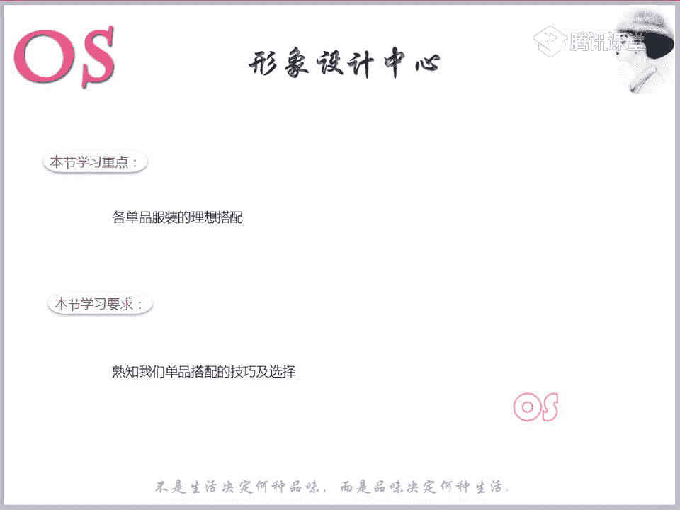

## 背心：夏季的百搭利器

上一节我们介绍了服装款式的风格，本节中我们来看看具体单品的搭配。首先从夏季常见的背心开始。

背心因其清透、轻薄和透气的特性，是男士夏季出街或度假的实用单品。它既可作为内搭，也可单穿，非常百搭。

以下是选择与搭配背心的要点：
*   **颜色选择**：黑白灰是保险的选择。带有几何、卡通或字母标语的印花款式也可考虑，但需结合个人风格。
*   **风格适配**：例如，卡通印花的背心更适合**阳光前卫型**或年轻的**自然型**风格男士。关键在于思考“哪些风格可以穿这件衣服”，而非“这件衣服是什么风格”。
*   **版型与场合**：除非在健身房，否则避免选择过于紧身的款式，合体或适度宽松为佳。背心属于休闲单品，适合休闲或度假场合，切勿在正式职业场合单穿。
*   **搭配建议**：
    *   **单穿时**：最佳搭配是**短裤**（如五分裤），协调度更高。务必加入配饰（如项链、手表、帽子）以画龙点睛。
    *   **叠穿时**：可作为内搭，与马甲、衬衫、夹克、针织衫甚至休闲西装搭配。色彩选择需参考个人风格及后续的色彩搭配课程。

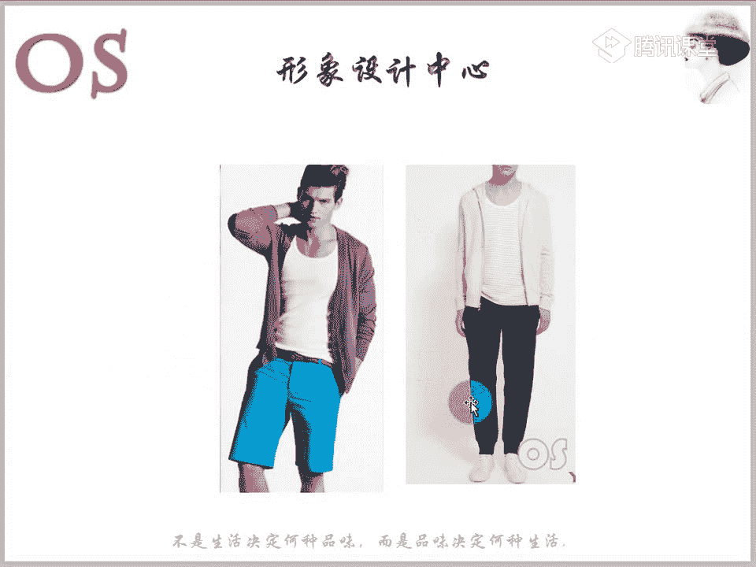

---

## T恤：休闲装扮的核心

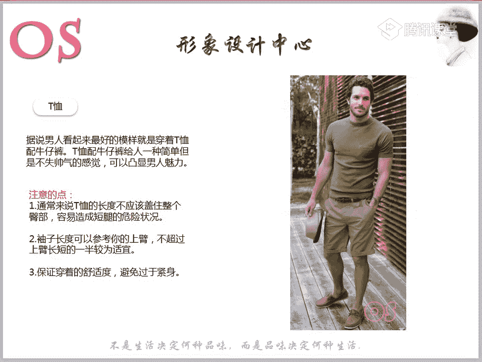

T恤是男士休闲装扮中不可或缺的单品。搭配牛仔裤简单帅气，但需注意细节。

### T恤的选择要点

以下是选择T恤时需要关注的三个关键尺寸：
*   **衣长**：下摆**不能盖住整个臀部**，最佳长度是不要超过裤子前门襟拉链的中间位置，以免显腿短。
*   **袖长**：袖子长度**不应超过上臂长度的一半**，可以短于或刚好一半，避免显手臂短。
*   **松紧度**：保证舒适，**避免过于紧身**。合体或微宽松为佳，切忌紧裹身体。

### 基础色T恤搭配

以下是四种基础色T恤的搭配策略：
*   **白色T恤**：**最百搭**。可单穿，可作任何外套的内搭，并能提亮整体造型，增加层次感。
*   **灰色T恤**：中性色，适合大多数人，能凸显身材曲线。但出汗时汗渍明显，需注意内搭背心或使用止汗产品。
*   **黑色T恤**：显瘦，深受喜爱。但天气炎热时可能显得不够清爽。搭配时，**夏装（裤子）建议选择浅色**（如米色棉麻裤）来平衡，避免全身深色带来的压抑感。
*   **海军蓝T恤**：与黑色相似，但更显轻松。搭配浅色牛仔裤或米色系裤子非常合适。

图案选择（如条纹、花卉）需严格参照个人风格。例如，**自然型**、**前卫型**适合条纹；**戏剧型**可选对比强烈的大条纹。

### T恤的进阶搭配技巧

T恤的搭配方式多样，以下是几种经典组合：
*   **搭配外套**：可与马甲、衬衫、夹克、西装、针织衫搭配。
*   **裤装推荐**：最推荐**锥形裤**和**直筒裤**，尤其是锥形裤，显腿长、比例好且百搭。
*   **西装+T恤+牛仔裤**：这是非常帅气的休闲组合。所有风格都可尝试，只需根据自身体型和风格选择合适的西装材质与版型。
    *   **关于牛仔裤**：**古典型**人士穿牛仔裤需注意提升质感。选择**纯色、无抛光处理、深色、面料硬挺精细**的款式（如图一），年轻古典型人士也可驾驭。
*   **制造层次感**：白色T恤作为内搭，在领口、袖口或下摆处**露出一道白边**，能极大增强整体层次感和时尚度，尤其在与深色外套搭配时效果显著。
*   **领型选择**：
    *   **V领**：能拉长颈部线条，有显高显瘦效果，适合脸圆、脖子短或身材偏胖的男士。但不适合脖子过长或肩膀单薄的人。
    *   **圆领**：经典安全，适合大多数人。脖子长的人更适合圆领。
    *   **Polo衫**：材质通常更硬挺，解开两颗扣子能形成V领效果，有视觉收缩感，适合偏胖的男士，且可在一般职业场合穿着。

---

## 针织衫：春秋季的层次担当

针织衫包括高领毛衣、圆领/V领毛衣、开襟毛衣等，是叠穿的好帮手。

*   **高领毛衣**：选择面料**薄而精细**的款式（如优衣库款式）。可单穿，也可与衬衫、卫衣叠穿，外面再搭配西装、夹克或大衣，时尚且适合多数场合。
*   **圆领/V领毛衣**：内搭首选衬衫，也可搭配T恤。外搭各种外套。
*   **开襟毛衣**：内搭衬衫或T恤，也可内搭高领毛衣。若想提升正式感，内搭衬衫为佳。
*   **毛衣+衬衫细节**：衬衫与毛衣的搭配，通过调整细节能改变风格：
    *   衬衫扣子**全扣**，领子露出或放入，显得斯文、学院风。
    *   解开1-2颗扣子或将领子拉出，显得**随性**。
    *   扣子全扣且领子放入毛衣内，显得**利落、优雅**。
*   **花色原则**：当**毛衣有花色**时，衬衫选**素色**；当**衬衫有花色**时，毛衣选**素色**。若两者皆有花色，则需在色彩或图案元素上有共通性。

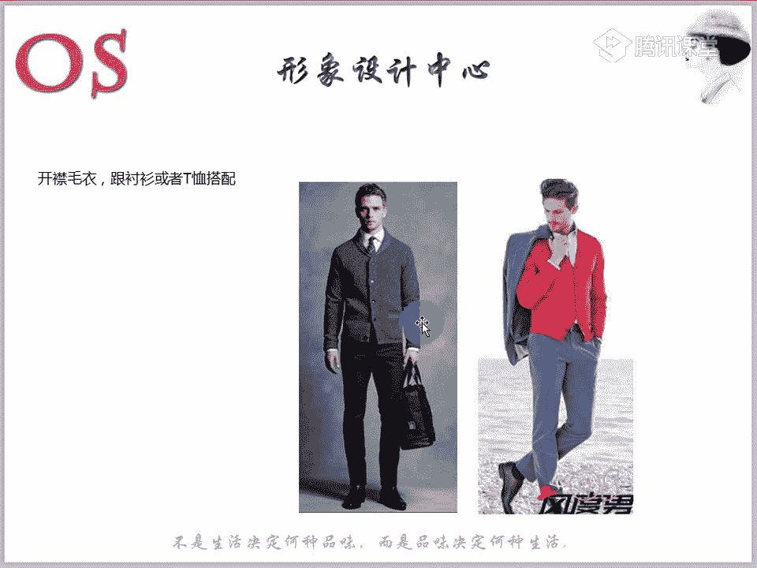

---

## 衬衫：正式与休闲的桥梁

衬衫是男士衣橱的核心，可进行大胆叠穿（如背心+衬衫+夹克）。

### 衬衫下摆塞与不塞

这取决于衬衫长度和场合：
*   **塞进去**：正装衬衫或下摆较长、圆弧较大的休闲衬衫适合塞进裤子，显得利落正式。
*   **放出来**：下摆较短、接近水平线的休闲衬衫适合放出来，更符合休闲场合。长度参考T恤原则，**不宜过长**，以免显矮。

### 衬衫作为内搭

作为毛衣内搭时，通过扣子和领子的不同处理，能营造不同风格（如前文所述）。

---

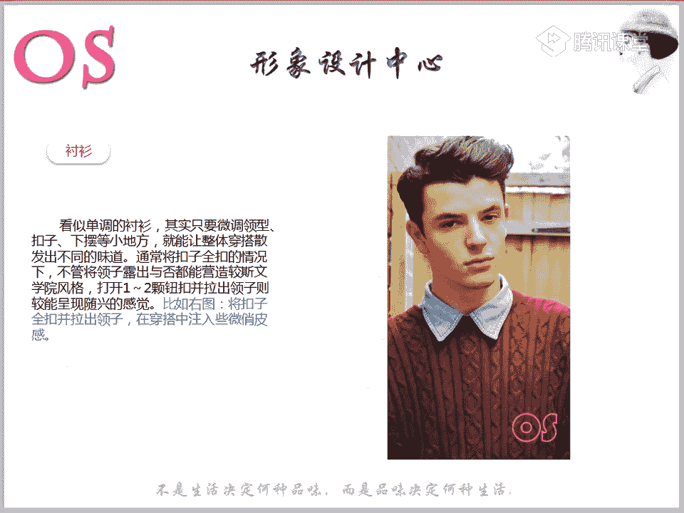

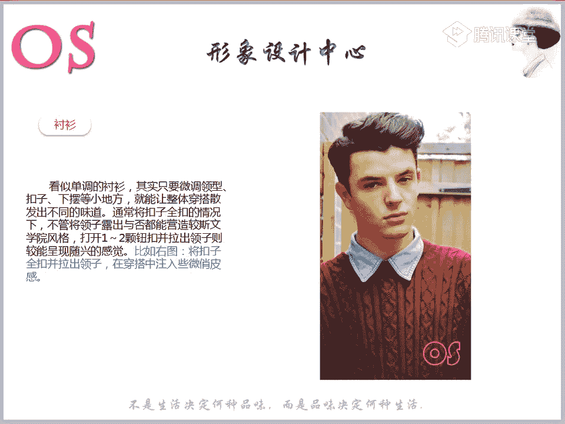

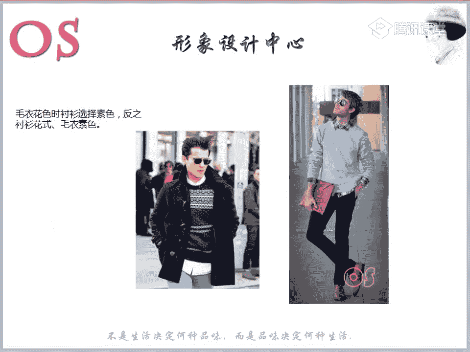

## 马甲：画龙点睛的层次高手

马甲能显著提升造型的层次感和时尚度。

*   **款式与搭配**：
    *   **超短款马甲**：适合小个子男生。
    *   **内搭**：搭配T恤时，马甲材质可选柔软休闲的；搭配衬衫时，则需注重质感与精细度。
    *   **外穿**：例如在衬衫和西装外，穿一件羽绒马甲，保暖且有型，进入室内脱下即可，适合通勤。
*   **搭配示范**：羽绒马甲内搭格纹衬衫，冷时可中间加一件卫衣，层次丰富。**建议选择纯色或深色马甲来搭配格纹衬衫**，以提升质感。
*   **质感提升**：随着年龄和经济能力增长，可适当投资有品牌的单品（如包、部分服装），提升整体质感。

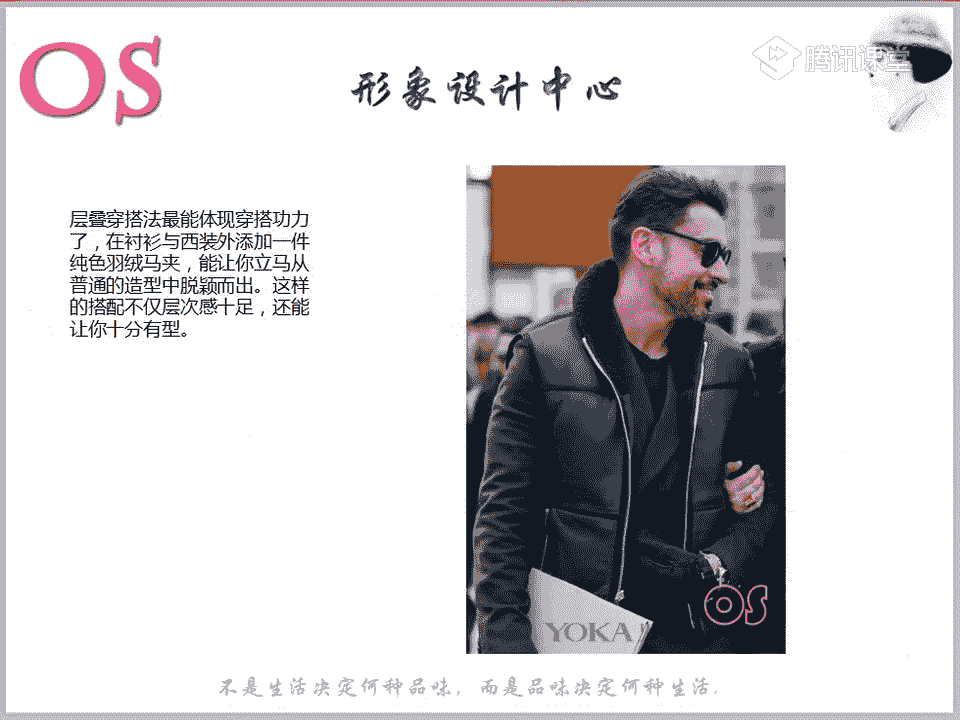
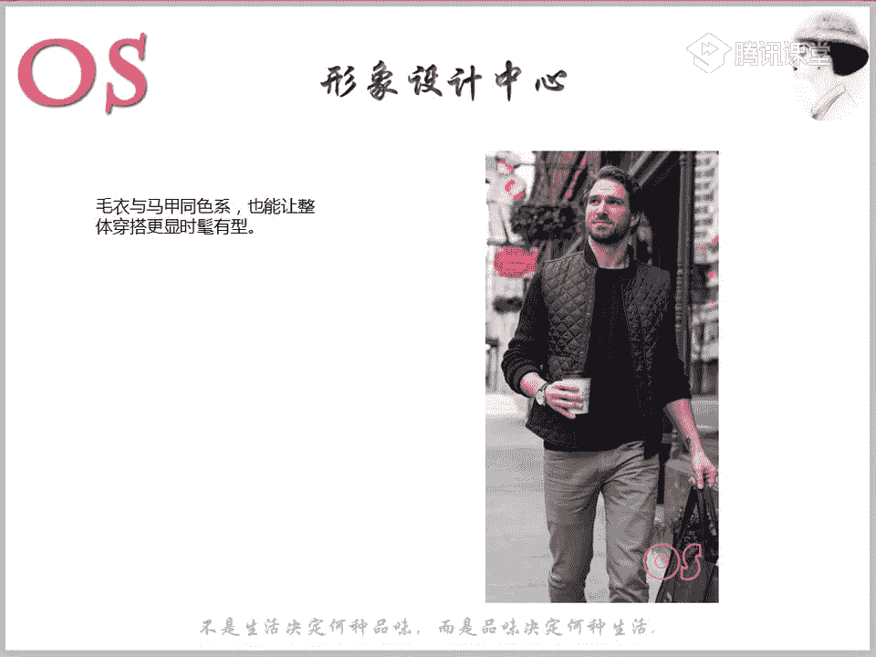

---

## 外套类：夹克、羽绒服、风衣与大衣

### 夹克

种类繁多（西装款、运动款、牛仔、机车皮衣等），搭配方式多样。**多尝试叠穿**，如夹克内搭配西装、衬衫、T恤等，能创造丰富造型。始终需结合自身体型（如利用第三节课的修饰技巧）和个人风格进行选择。

### 羽绒服/棉服

内搭可选择毛衣、衬衫、T恤等。款式选择需符合个人风格，例如**古典型**应避免过多口袋等复杂设计。

### 风衣

春秋季通勤实用单品，上班休闲皆可。内搭以正装为主，T恤亦可。**裤装建议搭配小直筒或锥形裤**，避免上下都宽松显矮胖。

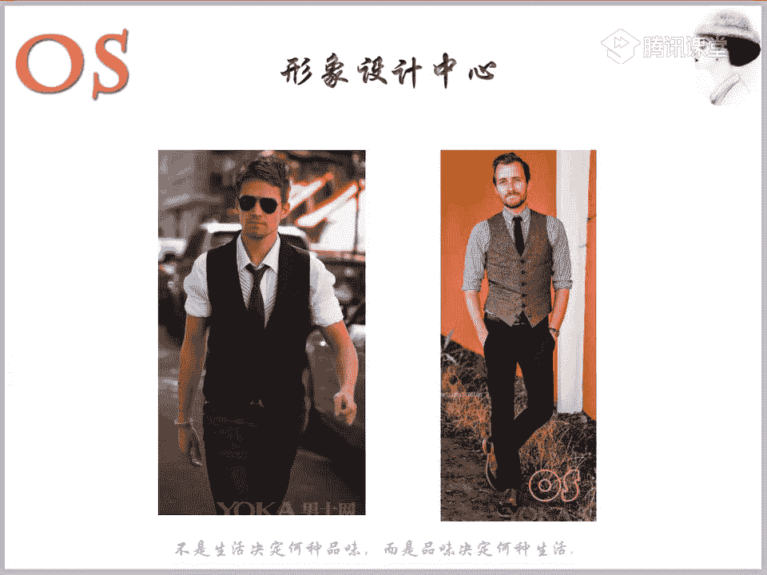

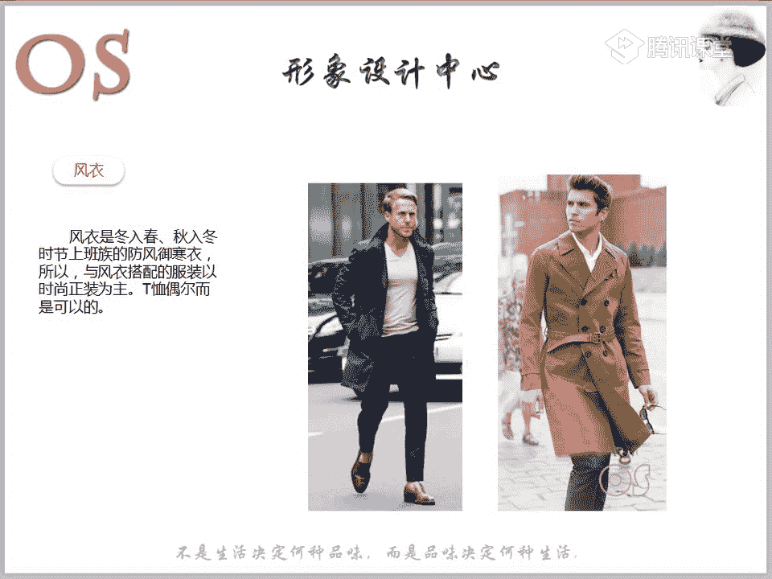

### 大衣

根据风格选择款式。内搭可进行层叠搭配（如高领毛衣、衬衫+毛衣、T恤等）。**个子矮或偏胖的男士**：
*   选择**量感小、版型短**的款式。
*   选择**面料平整、挺括、肌理感弱**的材质。
*   可将装饰细节上移，以引导视线，显高显瘦。

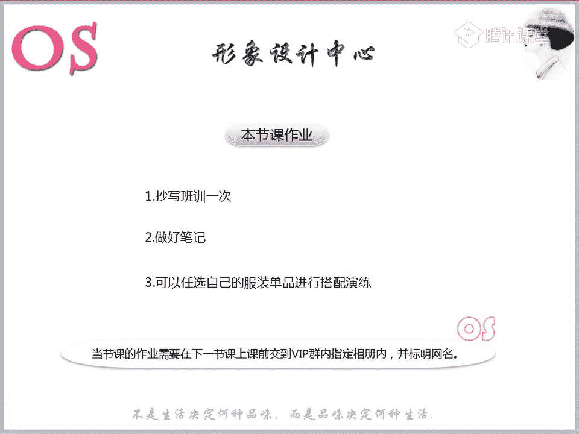

---

## 总结与作业

本节课我们一起学习了男士主要服装单品的理想搭配方法。核心在于**关注细节**：例如利用T恤白边制造层次、巧用叠穿、根据风格选择牛仔裤的质感、把握衬衫下摆和领子的处理方式等。

**课后作业**：
1.  整理并抄写本节课的精华笔记。
2.  从自己的衣橱中，选择符合个人风格的单品进行一套搭配演练。
3.  将你认为搭配得最出色的一套造型拍照，并上传提交。

请记得及时完成作业，将知识转化为实践。我们下节课再见！