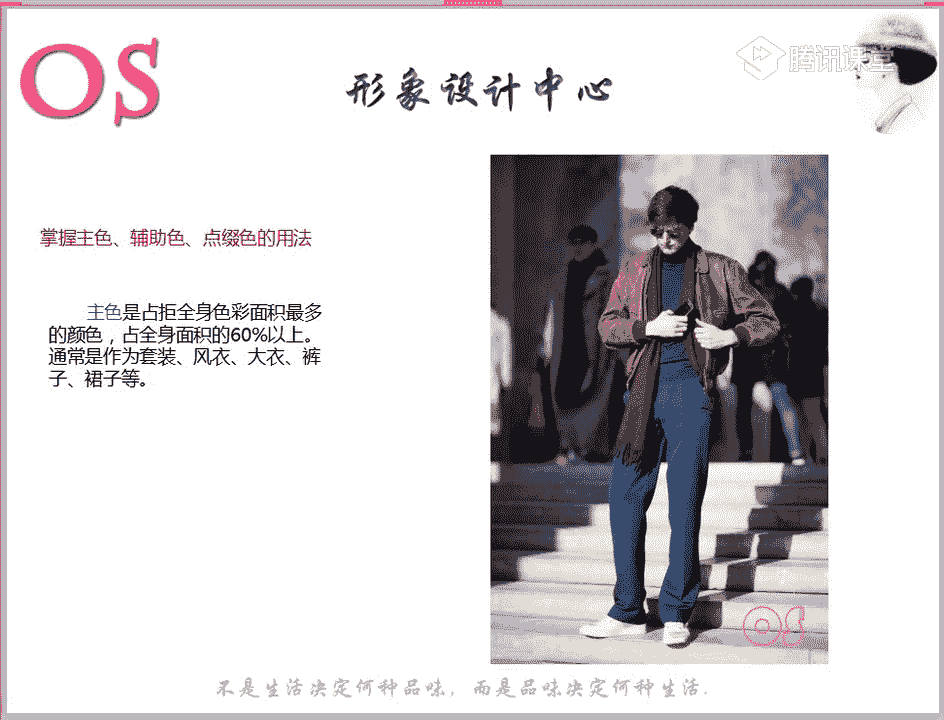
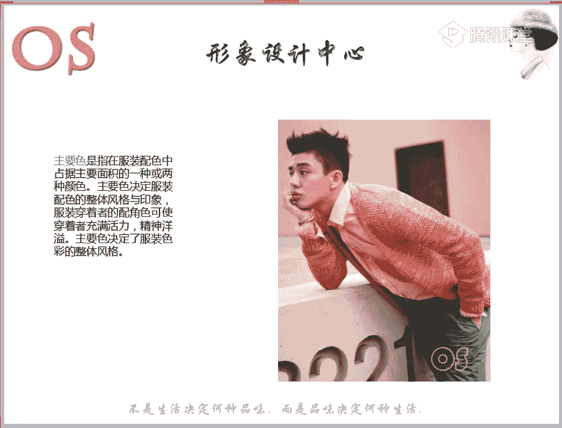
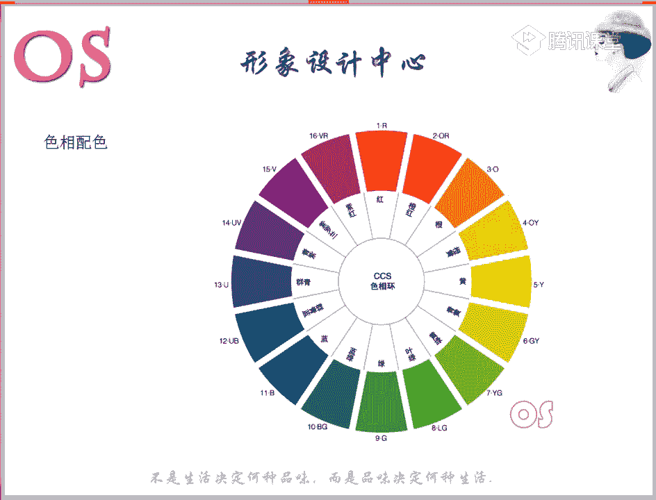

# OS男士形象VIP班《形象课》：第11节：服装配色原则 🎨

在本节课中，我们将要学习服装配色的核心原则与实用技巧。上一节我们介绍了四大季型的用色范围，本节中我们来看看如何将这些色彩进行有效搭配，以塑造和谐、得体的整体形象。

## 概述

本节课的核心是掌握服装配色的角色划分与两种基本配色方法：色相配色与色调配色。我们将学习如何通过控制色彩的主次关系，并结合个人季型与场合需求，实现理想的视觉效果。

## 配色基础概念

配色是指两种或两种以上颜色的组合搭配。其目的是为了达成更好的视觉效果和特定的穿着意图。

明确配色要求，是进行任何色彩搭配的根本依据。

## 配色的角色

如同小说或电视剧中有主角和配角，服装配色也有明确的角色之分。只有做到各色各就其位、主次分明、层次清晰，才能搭配出完美的视觉效果，充分展现服装与人、与环境的和谐。

### 1. 主色

主色指在整套服装配色中占据面积最大的颜色，通常占全身面积的**60%**以上。它决定了服装配色的整体风格与印象。

*   **常见载体**：套装、大衣、风衣、长裤、长裙。
*   **要点**：主色并非特指某个单一色相，也可能指一组具有相似调性的颜色，它们共同构成了整体的视觉感受。

### 2. 辅助色

辅助色是与主色搭配的颜色，约占全身面积的**40%**左右。它与主色共同构成服装的基础色调。

*   **常见载体**：上衣、衬衫、背心、毛衣。
*   **要点**：辅助色用于衬托主色，丰富搭配层次，但不应喧宾夺主。

### 3. 点缀色

点缀色是指在色彩组合中占据面积较小（约**5%-15%**）、但视觉效果醒目的颜色。它起到画龙点睛的作用。

*   **常见载体**：领带、丝巾、口袋巾、鞋、包、腰带、首饰、袜子。
*   **要点**：点缀色通常选择与主色/辅助色对比强烈的鲜艳色彩，用于提亮整体造型或制造视觉焦点。

## 配色技巧：呼应法

在配色中添加重复的呼应色，能使色彩在上下或左右产生关联，让整体配色融为一体。

以下是运用呼应法的要点：
*   当服装中某一单品的色彩较复杂时，可以从中选取一个颜色，作为其他配饰（如鞋、包、领带）的颜色。
*   例如，裤子的颜色与毛衣中的某个色块呼应，鞋子的颜色与衬衫的某个颜色呼应。
*   这种方法安全且能体现搭配巧思，尤其适合希望造型出彩的男士。

## 配色方法总览

服装色彩的搭配方法可归纳为两大类：**色相配色**与**色调配色**。

### 色相配色

以**色相环**为基础的配色方法。根据所选色相在色相环上的角度关系，可分为以下几种：

#### 90度以内的色相配色
使用色相环上相邻或靠近的颜色进行搭配。
*   **效果**：稳定、统一、温和。
*   **适合季型**：春季型、冬季型（可适当使用）。

#### 90度左右的色相配色
使用色相环上呈90度角左右的颜色进行搭配。
*   **效果**：活泼、动感、有一定对比度。
*   **适合风格**：前卫风格等。

#### 90度以外的色相配色（对比色配色）
使用色相环上相距较远的颜色进行搭配，对比强弱取决于具体角度。
*   **效果**：鲜明、强烈、戏剧化。
*   **技巧**：可使用黑、白、灰等无彩色作为“隔离色”置于对比色之间，以降低冲突感，使搭配更和谐。隔离色需与底色产生明度差。

> **重要提示**：夏季型与秋季型的人不适合表现强烈的色相感，因此应谨慎或避免使用色相配色法。

### 色调配色

以**色调**（色彩的明度与纯度关系）为基础的配色方法。根据所选色调在色调图上的位置关系，可分为以下几种：

#### 同一色调配色
在同一色调内，选择不同色相进行搭配。
*   **效果**：高度统一、协调。
*   **示例**：中色调的红色搭配中色调的蓝色。

#### 类似色调配色
使用色调图上相邻的两个色调进行搭配，色相可以相同或不同。
*   **效果**：和谐、有细微层次变化。
*   **示例**：浅色调的粉色搭配亮色调的粉色（色相同）；或浊色调的紫色搭配暗色调的绿色（色相不同）。

#### 对比色调配色
使用色调图上间隔较远的色调进行搭配。间隔一个色调为弱对比，间隔两个或以上为强对比。
*   **效果**：对比感强，富有张力和现代感。
*   **黄金法则**：当**色调对比强**（距离远）时，应选择**色相接近**的颜色；反之亦然。这能确保搭配在变化中保持和谐。

## 实用小贴士

1.  **鲜艳色的搭配**：当穿着颜色鲜艳的单品时，最安全的方法是搭配黑、白、灰等无彩色，易于驾驭且显得高级。
2.  **显高技巧**：鞋子的颜色与裤子的颜色相似或一致，在视觉上具有延长腿部线条、显高的作用。腿型不修长者应慎选高帮鞋。
3.  **视觉焦点管理**：若想突出某件鲜艳单品（如一双亮色鞋），其他部分的色彩应尽量低调，以起到衬托作用。

## 总结

本节课我们一起学习了服装配色的核心体系。我们首先明确了配色的根本依据是**明确要求**——考虑**个人季型**与**穿着场合**。接着，我们掌握了配色的三大**角色**（主色、辅助色、点缀色）及其面积控制。最后，我们深入探讨了两种基本的配色方法：**色相配色**与**色调配色**，并了解了它们各自适用的效果与人群。

记住核心原则：**明确配色要求，是做任何配色的依据**。在实践中，多观察、多尝试，结合自身条件灵活运用这些原则，你就能逐渐掌握色彩的语言，穿出属于自己的风格与自信。