# OS男士形象VIP班《形象课》：第1节：色彩季型分析

在本节课中，我们将要学习男士形象设计中一个至关重要的基础板块——色彩季型分析。我们将系统地了解四季色彩理论，掌握不同季型（春、夏、秋、冬）的用色特征与配色规律，帮助你找到最适合自己的服装色彩范围。

## 课程概述

本节课的核心是理解“四季色彩理论”并将其应用于个人形象塑造。我们将首先介绍该理论的来源与发展，然后深入分析人体肤色与色彩三属性的关系。课程的重点在于详细拆解春夏秋冬四种季型的视觉特征、适合的服装用色范围以及在不同场合下的配色技巧。学习本课后，你将能够更科学地选择服装色彩，提升整体形象。

---

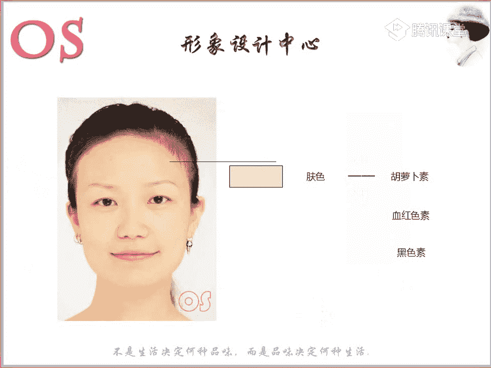

## 四季色彩理论简介

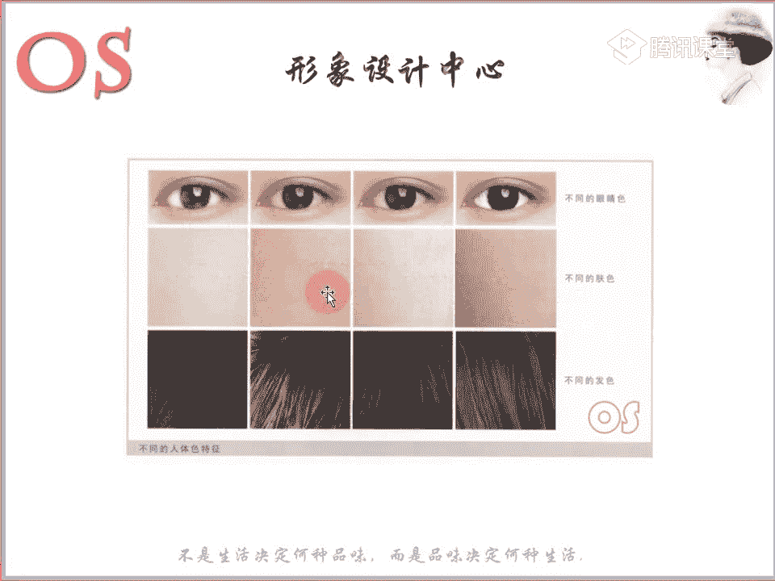

上一节我们概述了课程内容，本节中我们来看看整个形象设计体系的基石——四季色彩理论。

四季色彩理论是当今国际时尚界的重要话题。它由美国的“色彩第一夫人”卡罗尔·杰克逊女士发明，后经日本的佐藤太子女士调整，使其更适合亚洲人。该理论于1998年由于西蔓女士引入中国。

个人形象咨询行业在中国的发展大致经历了几个阶段：1998年至2000年是启蒙阶段，2000年至2002年是技术传播阶段，2003年行业初步形成，2003年至2010年处于发展壮大期，2011年后逐渐形成文化产业。目前，这仍是一个前景可观的新兴行业。

---

## 人体色与肤色研究

了解了理论的背景后，我们需要明确研究的核心对象——人体色，而其中最关键的是肤色。

为什么说皮肤是研究人体色的主要对象？因为人体的发色、唇色甚至眼球色都可以通过染发、化妆或佩戴有色隐形眼镜来改变，唯有肤色是相对稳定且占人体表面积最大的部分。因此，肤色是判断个人色彩季型的根本依据。

肤色之所以因人而异，主要取决于皮肤中三种色素的含量：**胡萝卜素**、**血红素**和**黑色素**。胡萝卜素比重大会使肤色倾向自然黄调，血红素比重大则倾向粉调，而黑色素比重大则会导致肤色偏黄黑或偏暗。

---

## 色彩三属性与肤色属性

既然色彩有属性，我们的肤色同样具备类似的属性，这为我们分类奠定了基础。

色彩具有三个基本属性：**色相**、**明度**和**纯度**。
*   **色相**：指色彩的相貌名称和冷暖倾向。
*   **明度**：指色彩的明暗程度。
*   **纯度**：指色彩的鲜艳度或饱和度。

相应地，我们的肤色也具有这些属性：
1.  **肤色的色相（冷暖）**：分为冷肤色和暖肤色。这不是单纯由白皙或暗黄决定的，而是一种视觉倾向。
2.  **肤色的明度**：指肤色的深浅、明暗程度。
3.  **肤色的纯度**：指肤色的饱和程度，是鲜艳还是柔和。

穿对色彩冷暖至关重要。暖肤色的人穿暖色调服装，肤色会显得均匀、和谐；若穿冷色调，则容易产生肤色与服装分离的不协调感。反之，冷肤色的人穿暖色调服装，会显得肤色浑浊、不清澈。穿错明度或纯度同样会产生问题，例如低明度肤色穿高明度衣服会显黑，低纯度肤色穿高纯度衣服会显得肤色暗沉。

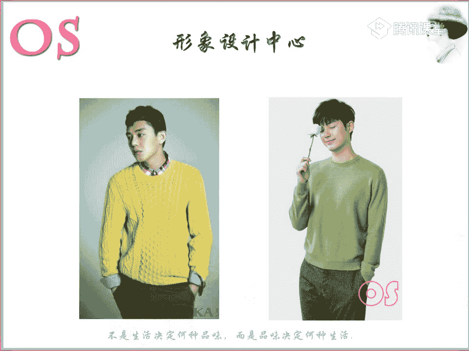

男士的四大季型（春、夏、秋、冬）在色相（冷暖）、明度和纯度的适合范围上都有显著区别。

---

## 各季型用色特征详解

掌握了理论基础，接下来我们进入核心环节，逐一剖析春夏秋冬四种季型的详细特征与用色规律。

我们将按照冷暖分组进行讲解：先讲同为暖色调的春季型和秋季型，再讲同为冷色调的夏季型和冬季型，以便于大家对比理解。

### 春季型

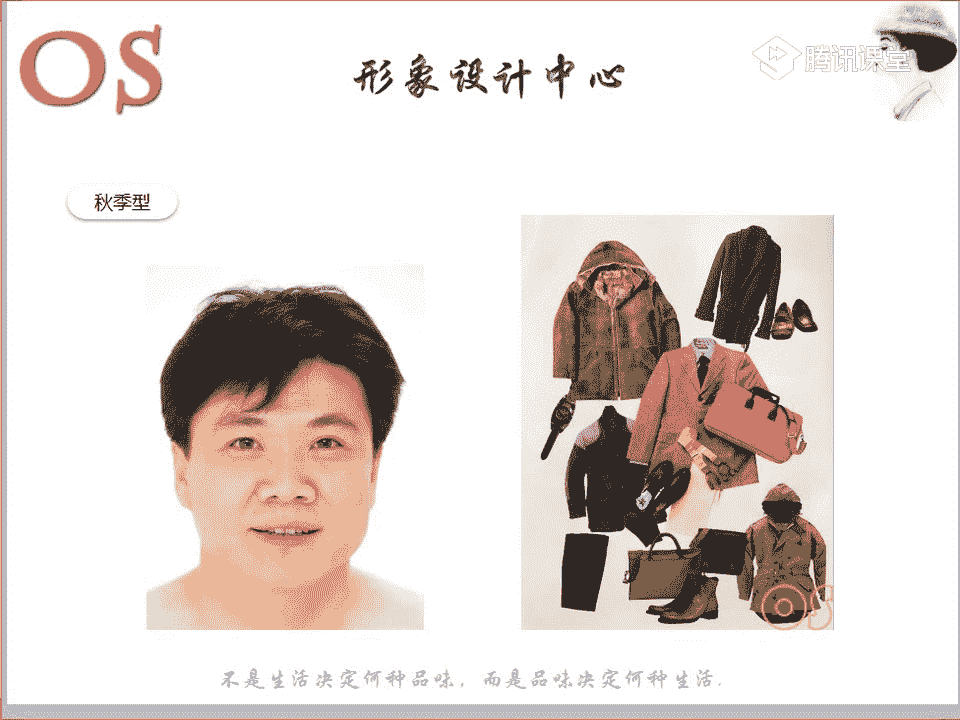

**人体特征**：发色常为棕色系，眼球色可能泛棕，眼白部分略带湖蓝色，眼神明亮。皮肤白皙中透着珊瑚粉或桃粉色的红润感，整体给人朝气、生动、年轻的感觉。

**整体用色特征**：适合**浅淡、鲜明、生动、活泼**的暖基调色彩群。服装明度较高，纯度也属于中偏高范围。

以下是春季型在不同场合的着装要点：

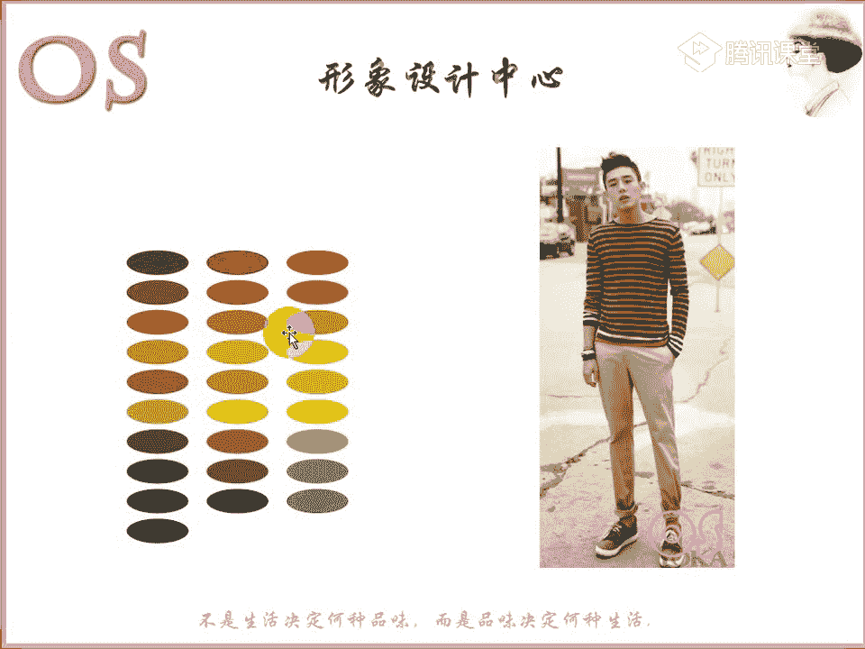

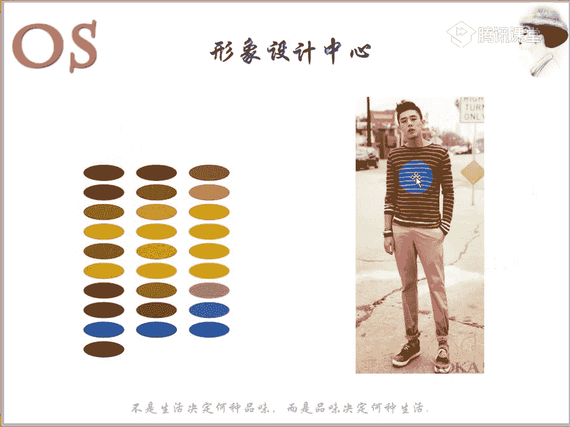

*   **职业装**：
    *   **西装色**：可选择驼色、棕色、浅灰色或饱和度略高的蓝色。在非常严肃的场合，可使用黑色或藏蓝色，但一般场合建议尽量回避。
    *   **衬衫色**：选择浅淡、明快的色彩，即高明度、低纯度的颜色。
    *   **领带色**：可选择色彩群中明亮、鲜艳的颜色作为点缀。
*   **休闲装**：尽量选择色彩群中明亮的颜色，可与驼色、棕色系或暖军绿色搭配。
*   **搭配规律**：适合突出**色相感**（即颜色分明，黄是黄，绿是绿），可采用清晰对比的搭配。不适合陈旧、暗浊的色彩。
*   **鞋袜**：颜色最好与裤子一致，或采用渐变搭配。
*   **饰品**：适合亮黄金、泛黄的铂金或银色镶嵌饰品。
*   **眼镜**：适合金丝边、浅棕或浅橙色镜框。
*   **染发**：如染发，适合棕黄色调。
*   **需回避**：以蓝色为基调的冷色、暗淡的色彩、灰调较强的显旧颜色。

### 秋季型

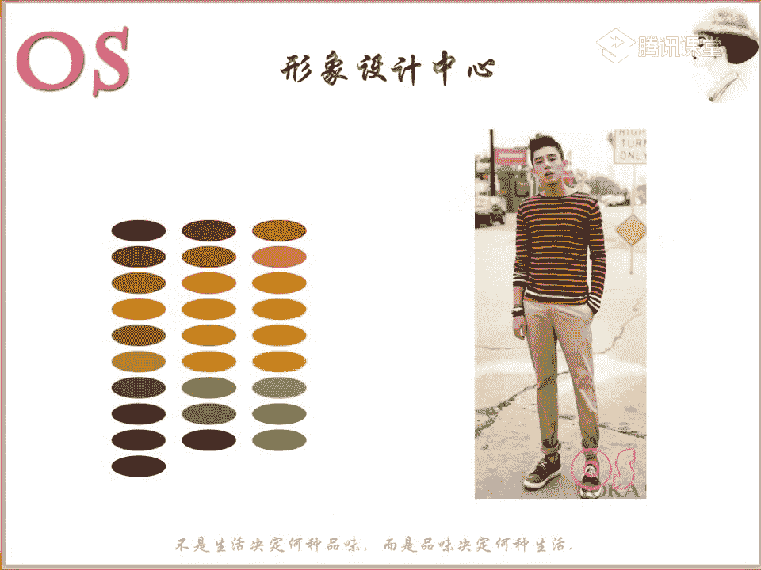

**人体特征**：发色为浓重的棕色，眼球呈暗棕色，眼白带湖蓝色，眼神沉稳。皮肤如瓷器般的象牙色或橙黄色，质地比春季型更密实，脸颊不易出现红晕。整体给人沉稳、成熟、浑厚的感觉。

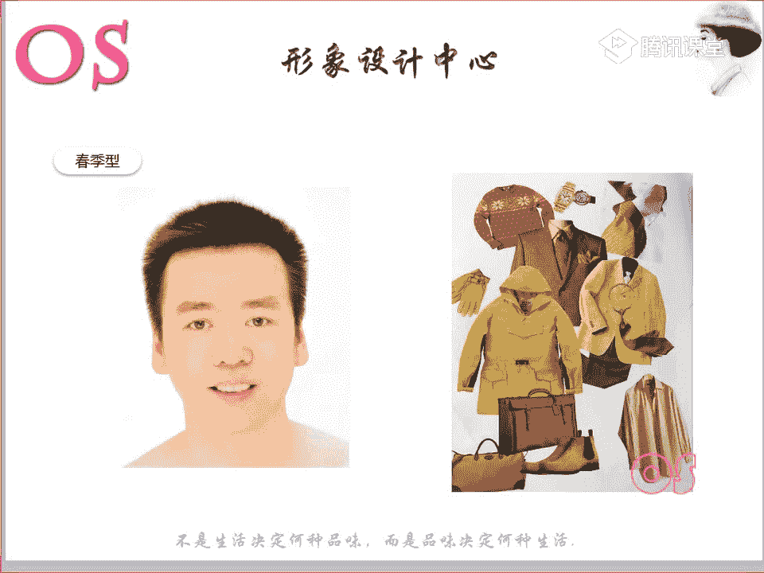

**整体用色特征**：适合**浓郁、浑厚**的暖基调色彩群。适合**浊色调**（加灰）和**暗清色调**（加黑），纯度中偏低，不适合纯度太高的色彩。

以下是秋季型在不同场合的着装要点：

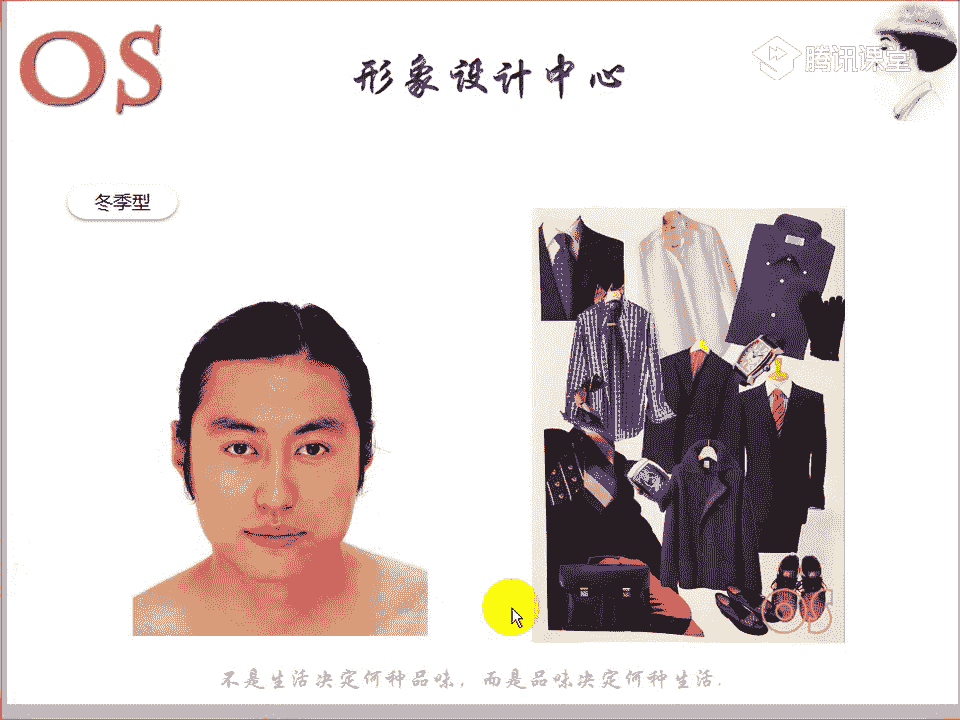

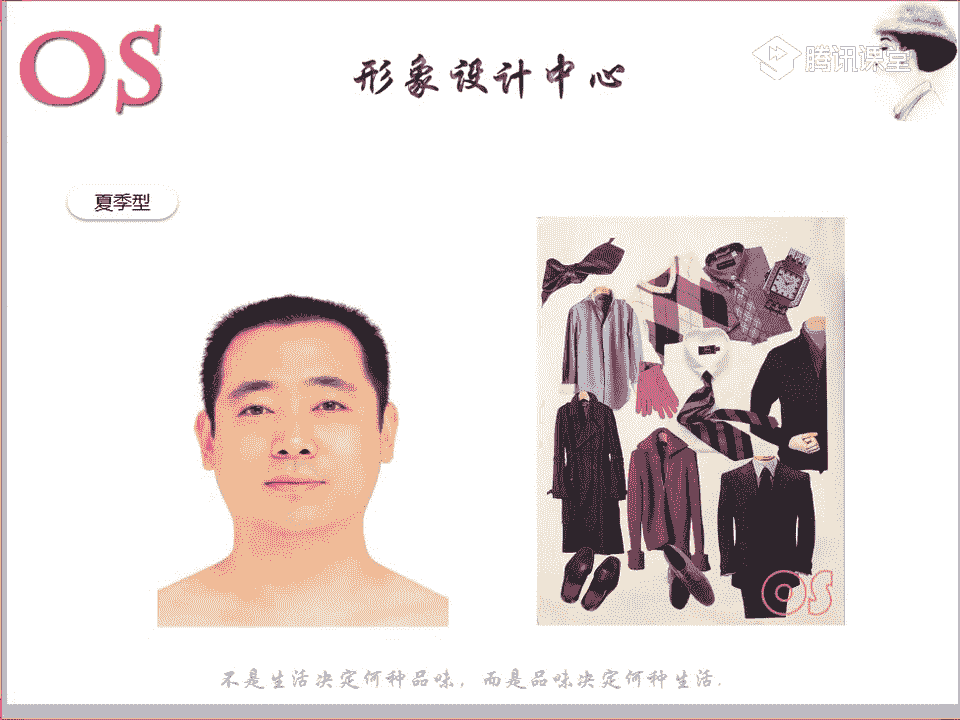

*   **职业装**：
    *   **西装色**：适合棕色、深毛蓝色、橄榄绿等深色调暖色。尽量避免黑色、灰色或饱和度高的蓝色。
    *   **衬衫/领带色**：以黄色为基调，选择雅致而稳重的色彩。
*   **休闲装**：可选择色彩群中浓郁的颜色，鲜艳色可与棕色系搭配。
*   **搭配规律**：更适合**渐变搭配**，回避搭配出明显、鲜艳的色相感。
*   **鞋袜**：颜色应与裤子一致，或采用渐变搭配。
*   **饰品**：适合金色或银色镶嵌饰品。
*   **眼镜**：适合深棕色、金色边框或树脂边框眼镜。
*   **染发**：适合棕色、铜色或金红色调。
*   **需回避**：以蓝色为基调的冷色、过于浅淡的色彩、大面积使用高饱和度色彩。

### 夏季型

**人体特征**：发色泛黑或深棕，眼球呈玫瑰棕色或深棕色，眼白为柔白色，眼神稳重而柔和。皮肤泛青，密实度较低，脸颊易出现淡淡粉晕。整体给人温和、亲切、雅致的感觉。

**整体用色特征**：适合**柔和、浅淡、恬静**的冷基调色彩群。适合穿着以蓝色为底调的浅淡颜色。

以下是夏季型在不同场合的着装要点：

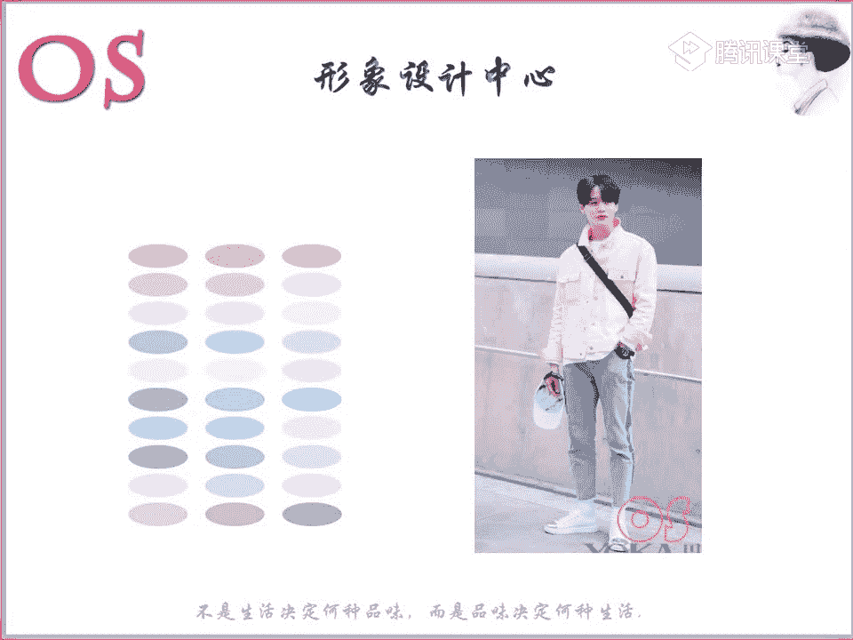

*   **职业装**：
    *   **西装色**：适合蓝灰色、灰蓝色、灰色等冷色。
    *   **衬衫色**：适合浅灰色、蓝色、紫色、淡粉色等柔和颜色。
    *   **领带色**：选择色彩群中浅淡、柔和、雅致的色彩。
*   **休闲装**：选择柔和清爽的颜色，与蓝灰色、灰蓝色、灰色、乳白色搭配。
*   **搭配规律**：适合**渐变搭配**，不适合表现强烈的色相感，应回避沉重的搭配感觉。
*   **鞋袜**：颜色应与裤子一致，或采用渐变搭配。
*   **饰品**：适合哑光银色、铂金或钻石类饰品。
*   **眼镜**：适合冷灰色树脂框或银质金属边框。
*   **染发**：适合灰色、酒红色、紫红色调。
*   **需回避**：所有的暖基调色彩、深浓重的颜色、饱和度过高的色彩。

### 冬季型

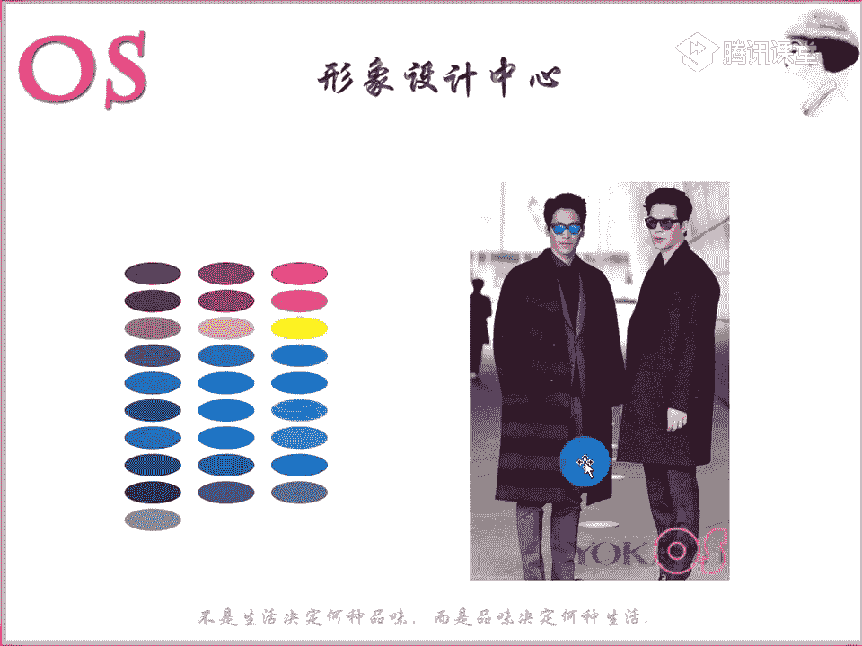

**人体特征**：发色浓黑，眼球色黑或深棕，眼白是冷白色，眼神锋利。面部五官与肤色对比强烈，皮肤为发青的黄白色，质地密实，脸颊不易出现红晕。整体给人个性分明、醒目、有重量感和气场强大的感觉。

**整体用色特征**：适合**纯正、饱和、大胆、强烈**的冷基调色彩群，也适合黑、白、灰等五彩色。

以下是冬季型在不同场合的着装要点：

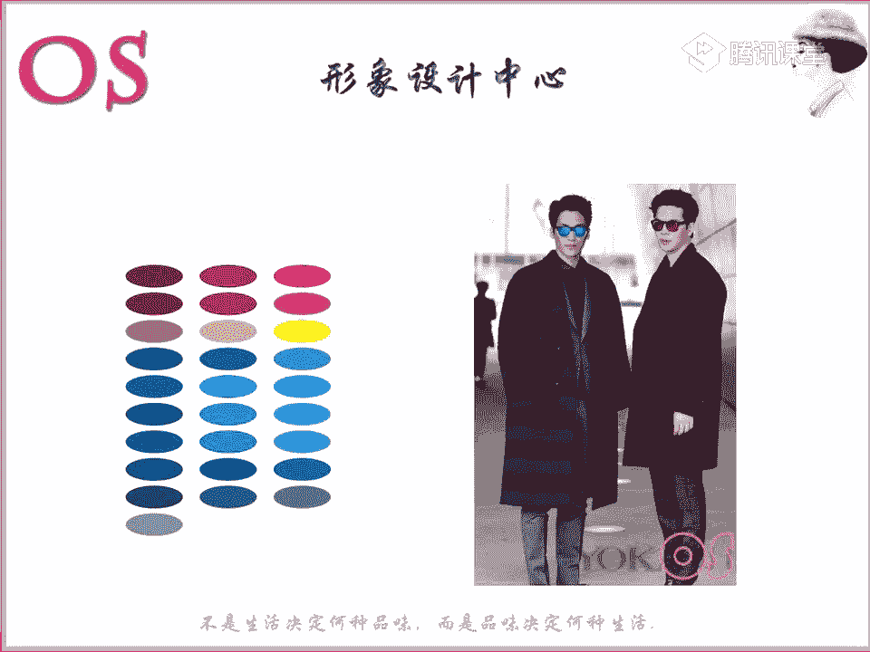

*   **职业装**：
    *   **西装色**：适合黑色、灰色、藏蓝色等深色调冷色。
    *   **衬衫色**：适合白色或明亮的冰色系（如冰粉、冰蓝）。
    *   **领带色**：选择色彩群中明亮、鲜艳的颜色。
*   **休闲装**：可选择色彩群中鲜艳、高饱和度的颜色，与黑色、白色、灰色或冰色系搭配。
*   **搭配规律**：适合**对比配色**，可以表现强烈的色相感。可以大量使用五彩色搭配。
*   **鞋袜**：颜色应与裤子一致，或采用渐变搭配。
*   **饰品**：适合亮银色、钻石类饰品。
*   **眼镜**：适合银边框或黑色边框眼镜。
*   **染发**：黑色最佳，也可尝试灰色、葡萄紫、酒红色、紫红色。
*   **需回避**：浊色调（加灰）色彩。

---

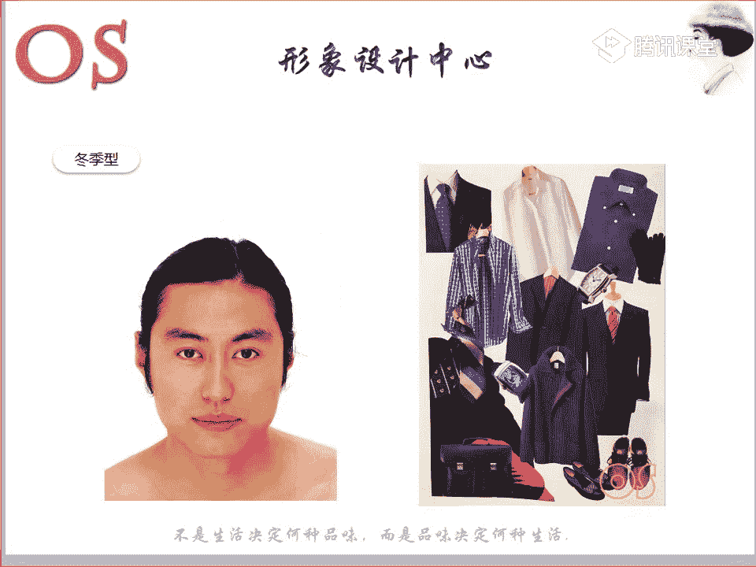

## 课程总结与作业

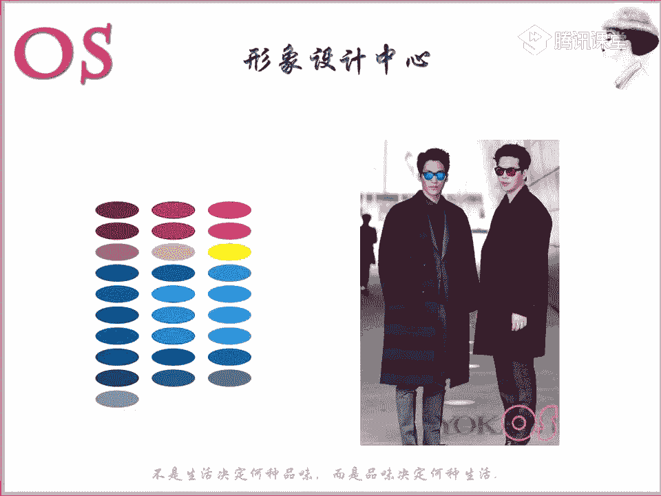

本节课中，我们一起系统学习了色彩季型分析的核心知识。我们从四季色彩理论的起源讲起，明确了以肤色为研究根本的原因，并理解了色彩三属性如何对应到肤色属性上。随后，我们深入剖析了春季型、秋季型、夏季型和冬季型四种季型的人体特征、整体用色感觉以及具体的职业、休闲着装方案、搭配规律和饰品选择等。

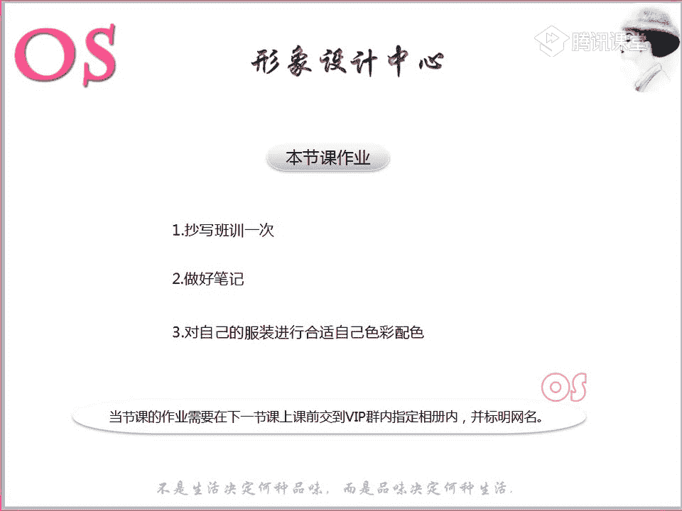

简单总结关键区别：
*   **春季型**：暖色调，用色**浅淡鲜明**，适合对比，突出色相感。
*   **秋季型**：暖色调，用色**浓郁浑厚**，适合渐变，回避鲜艳色相。
*   **夏季型**：冷色调，用色**柔和浅淡**，适合渐变，回避沉重感。
*   **冬季型**：冷色调，用色**纯正强烈**，适合对比，可多用黑白。

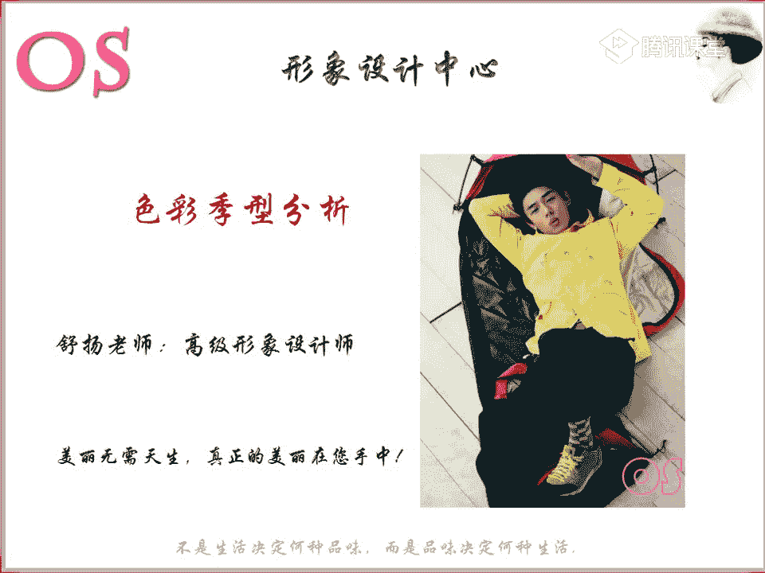

**课后作业**：
请根据你自身的诊断季型（或选择一种你感兴趣的季型），从衣柜中搭配出一套符合该季型用色规律的服装（色彩正确即可），拍照上传。顾问班同学也可以为模特搭配，或在网上寻找符合某一季型穿搭的图片进行分析上传。通过实践来巩固本节课的知识。

（注：本教程根据原始语音内容整理，已去除语气词，并严格遵循了所有格式与内容要求。）