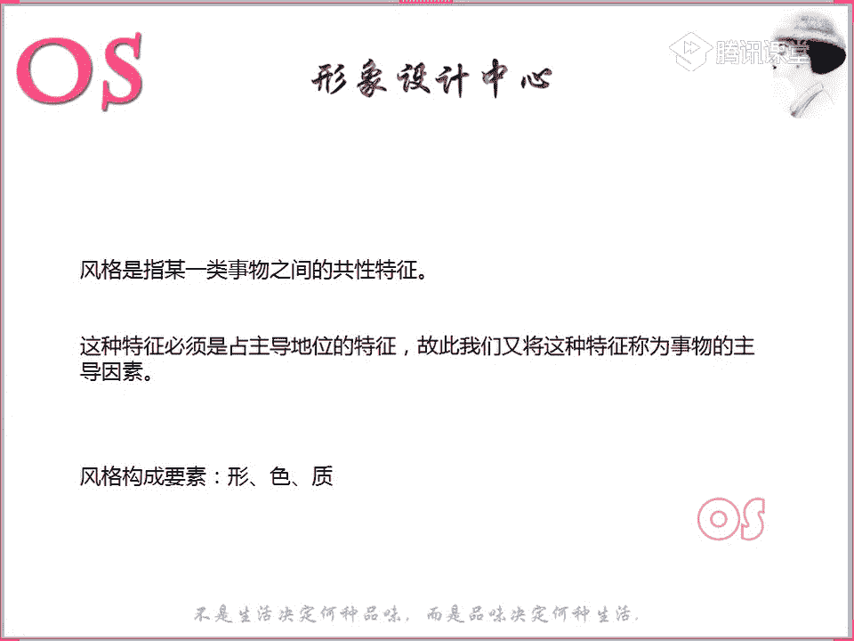
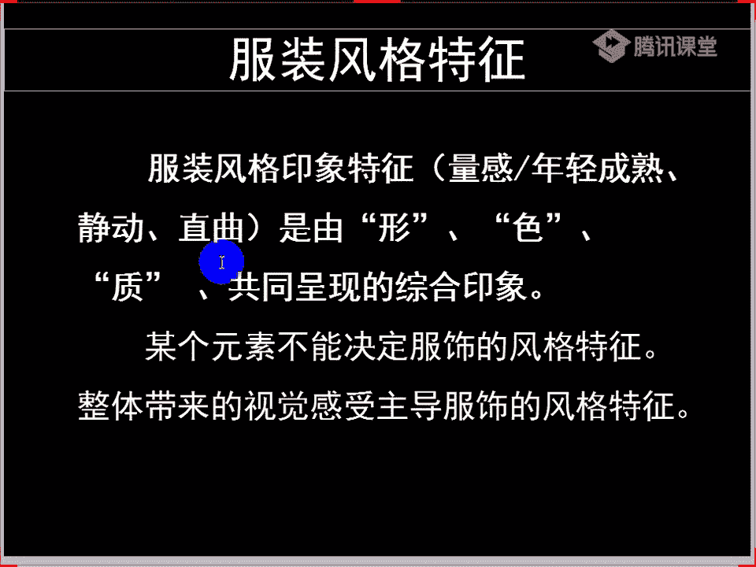
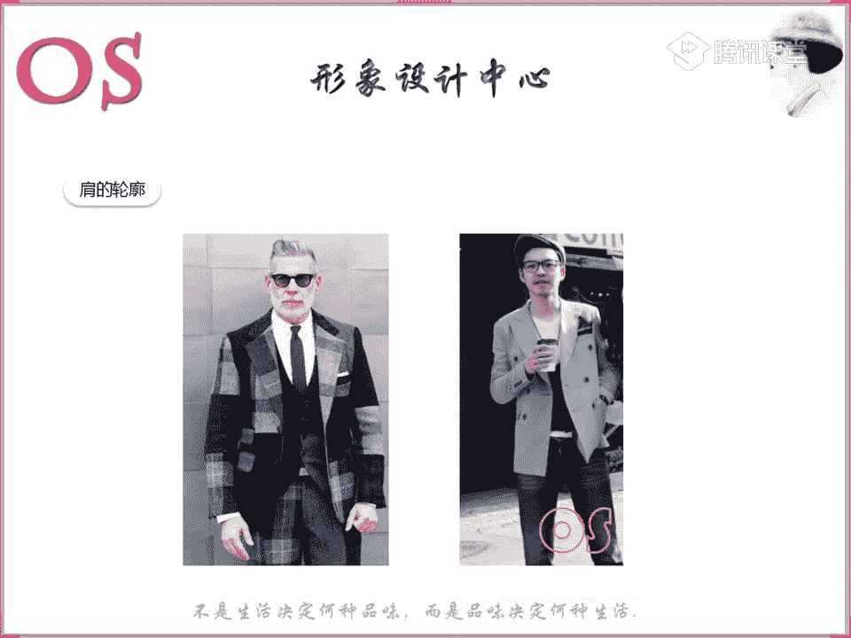
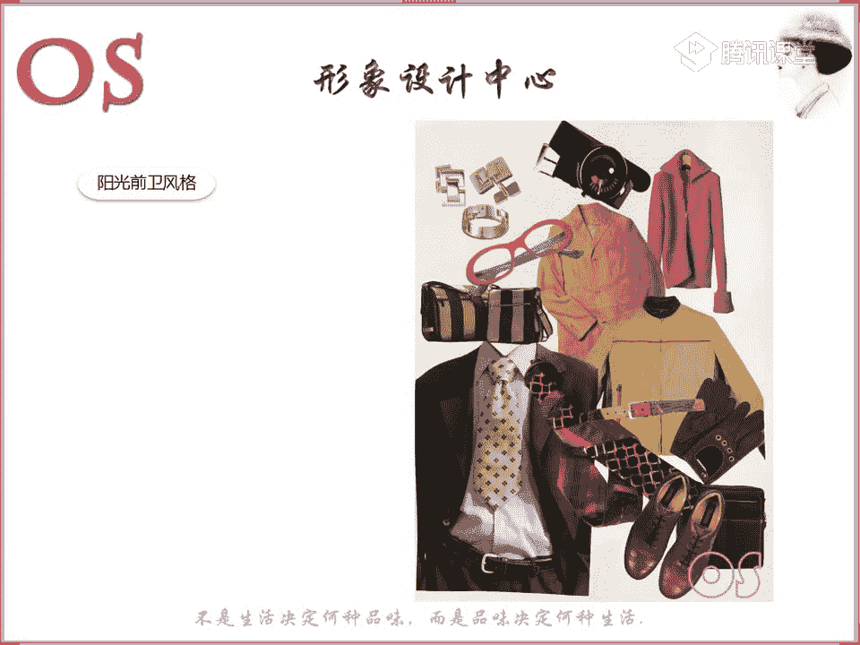

# 形象课：13：款式风格认知 👔

在本节课中，我们将要学习服装风格的认知。我们将理解风格的定义、构成要素，并学习如何通过分析服装的“量感”、“轮廓”和“形态”来判断其风格归属。掌握这些知识后，你将能够更准确地为不同风格的人挑选合适的服装，并在搭配时更加灵活。

## 什么是风格？

上一节我们介绍了课程的整体目标，本节中我们来看看风格究竟是什么。

风格指某一类事物之间的共性特征。这种特征必须占据主导地位，因此也被称为事物的“主导因素”。这种共性可能来源于色彩、图案、形状等多个方面。

例如，观察两个卧室的图片，你会发现它们给人的感觉截然不同。第一个卧室色彩活泼、装饰童趣；第二个卧室则显得素雅、淡雅。这种不同的视觉感受，正是由房间内各种事物（如床品、装饰、色彩）的共同特征所营造的。

因此，风格的构成要素可以总结为三个核心：**形（款式）、色（色彩）、质（材质）**。这三者共同作用，才能形成一种特定的风格。

> 某个单一元素不能决定服饰风格的特征。必须考虑整体带来的视觉感受，才能主导服饰风格的特征。

## 风格的印象特征

理解了风格的定义后，我们来看看如何具体分析和描述风格。风格的印象特征主要从三个方面来把握：**量感**、**轮廓**和**形态**。

### 1. 量感：年轻与成熟

量感是指物体给人的轻重、大小、粗细、宽窄、厚薄、强弱等综合感受。它并非实际的物理尺寸，而是由颜色、材质、体积等因素综合影响下的视觉感受。

我们可以从三个方面来体会量感：
*   **量感小**：显得年轻、灵动、精致。
*   **量感中**：显得均衡、稳重、适中。
*   **量感大**：显得成熟、大气、有存在感。

**举例说明：**
*   **服装廓形**：短款窄版的牛仔外套量感小；长款宽松的牛仔外套量感大。
*   **服装细节**：西装中，T型（欧式）西装廓形量感大；领子面积大的设计量感也大。
*   **配饰与色彩**：包包的大小、鞋子的体积、色彩的深浅（深色量感重，浅色量感轻）都体现了量感。

### 2. 轮廓：直与曲

轮廓指的是组成服装的各要素所呈现的直曲综合状态。在男装中，大部分剪裁为直线型，以符合男性身材线条，但也有表现曲线感的设计。

以下是判断服装直曲的几个要点：
*   **肩部**：肩部与袖子接近90度夹角的为直线型；肩部线条圆润自然的为曲线型。
*   **领子**：线条硬朗的领型（如枪驳领）偏直；线条柔和的领型（如青果领）偏曲。
*   **面料**：硬挺、不易起皱的面料（如某些西装面料）有直线感；光滑、柔软的面料（如丝质、柔软针织）有曲线感。
*   **图案**：条纹、方格等几何图案有直线感；圆点、花朵等流线型图案有曲线感。

### 3. 形态：动与静

形态指的是服装给人的生动或平静的感受。在男装中，形态的判断不如女装明显，但依然可以通过以下要素分析：
*   **图案与色彩**：图案复杂、色彩鲜艳（纯度高）的服装偏“动”；图案简洁、色彩低调的服装偏“静”。
*   **材质**：有光泽度的材质（如皮革、缎面）偏“动”；哑光、弱光泽的材质偏“静”。
*   **设计细节**：设计层次丰富、有跳跃感的服装偏“动”；设计简洁、没有过多装饰的服装偏“静”。

> 在男装中，形态的判断主要依据**图案**、**色彩**和**面料**。

## 男士风格解析

掌握了风格的印象特征后，我们将其应用到具体的男士个人风格上。以下是几种主要风格的解析：

### 戏剧风格 🎭
*   **量感**：中到大。长相成熟，存在感强。
*   **轮廓**：偏直，但可驾驭一些曲线元素。
*   **形态**：偏动。
*   **服装要点**：适合成熟、大气、夸张、摩登、有视觉冲击力的服装。整体造型醒目，有威慑力。

### 自然风格 🌿
*   **量感**：中到大。五官棱角不分明，神态随意。
*   **轮廓**：偏直。
*   **形态**：偏静。
*   **服装要点**：适合潇洒、亲切、随意、不过度设计的服装。材质肌理感可以偏强，体现自然感。

### 古典型 👔
*   **量感**：中到大。五官端正、均衡，气质严谨。
*   **轮廓**：偏直。
*   **形态**：居中（动静皆可，偏静更佳）。
*   **服装要点**：适合端正、知性、高贵、合体、精致的服装。注重面料品质和穿搭的规整度，避免失衡感。

### 浪漫型 💖
*   **量感**：中到大。五官柔和，眼神性感。
*   **轮廓**：偏曲。
*   **形态**：偏动。
*   **服装要点**：适合华丽、性感、风度翩翩、面料精细的服装。可多运用感性色彩和曲线设计。

### 前卫风格（新锐/阳光） 🔥
*   **新锐前卫**：
    *   **量感**：中到小。五官清晰，骨感明显。
    *   **轮廓**：偏直，可混搭曲线元素。
    *   **形态**：偏动。
    *   **服装要点**：适合时尚、锐利、有设计感、对比度强的服装。
*   **阳光前卫**：
    *   **量感**：小。长相显年轻，有学生气。
    *   **轮廓**：偏曲。
    *   **形态**：偏静。
    *   **服装要点**：适合活泼、可爱、调皮、个性化的服装。随着年龄增长，可借鉴年轻化的古典、自然等风格的着装。

## 风格判断实战练习

理论需要结合实践。下面我们通过分析具体服装，来练习如何判断其适合的风格。

**核心原则**：始终从**形、色、质**三个要素综合判断，整体考量服装的**量感、轮廓、形态**。

**例题分析：**
1.  **服装A**：量感小、形态动、轮廓偏直。**适合风格**：前卫风格（新锐/阳光）。
2.  **服装B**：量感大、形态静、轮廓偏直。**适合风格**：戏剧风格、自然风格。
3.  **服装C**：量感大、图案感性、领型曲线、色彩适合（如白色）。**适合风格**：浪漫风格。（注意：古典型不适合，因其廓形大、有失衡感，且不够精致。）

> 切记：不要只思考“这件衣服是什么风格”，而要思考“哪些风格的人可以穿这件衣服”。这种思维能让你的搭配更灵活。

## 总结

本节课中我们一起学习了服装风格的认知。我们首先明确了风格是某一类事物的共性特征，由**形、色、质**三要素构成。接着，我们学习了分析风格的三个印象特征：**量感**（大/中/小）、**轮廓**（直/曲）和**形态**（动/静）。然后，我们将这些特征应用到具体的男士风格（戏剧、自然、古典、浪漫、前卫）解析中。最后，通过实战练习，我们巩固了如何综合判断一件服装适合的风格类型。

希望你能将本节课的知识运用到实际的服装挑选和搭配中，逐步建立起清晰的风格判断体系。