# 形象课：1.14：衣橱管理 🧥

在本节课中，我们将学习如何系统性地管理个人衣橱。我们将回顾之前课程中关于个人形象设计的知识，并将其应用于衣橱整理。通过掌握衣橱管理的原则、要素和具体方法，你将能够打造一个高效、整洁且完全符合个人需求的衣橱系统，从而在未来的购物中目标更明确，避免浪费。

## 衣橱管理的原则与要素

上一节我们回顾了个人形象设计的整体知识，本节中我们来看看衣橱管理的核心原则与要素。衣橱管理并非简单的收纳，而是基于色彩、场合和效率的系统规划。

### 1. 基础色占比原则
衣橱中应有至少三种基础色（中性色），它们应占据衣橱服饰的 **70%**。这些颜色百搭，且在职业场合中能表达稳重与严谨。

**公式：** `衣橱色彩构成 = 70% 基础色 + 30% 点缀色`

基础色通常包括：黑、白、灰、咖啡色、深棕色、深蓝色、藏蓝色等。这些色彩在生活中搭配率最高。剩余的 **30%** 可以是鲜艳的颜色，用于帽子、鞋子、袜子、内搭或外套，作为点缀。

### 2. 重质不重量原则
衣服的价值不在于数量多少，而在于穿着频率和时长。一件高品质、常穿的衣服，其单次穿着成本可能远低于一件廉价但不常穿的衣服。

**计算方法：**
`单次穿着成本 = 衣服价格 / 穿着总次数`

例如：
*   一件900元的外套，每月穿2次，每年穿10个月，年穿20次。单次成本为45元。
*   一个400元的胸针，每月戴4次，每年戴11个月，年戴44次。单次成本约为9元。
*   一件150元的衬衫，只穿1次就不喜欢了。单次成本为150元。

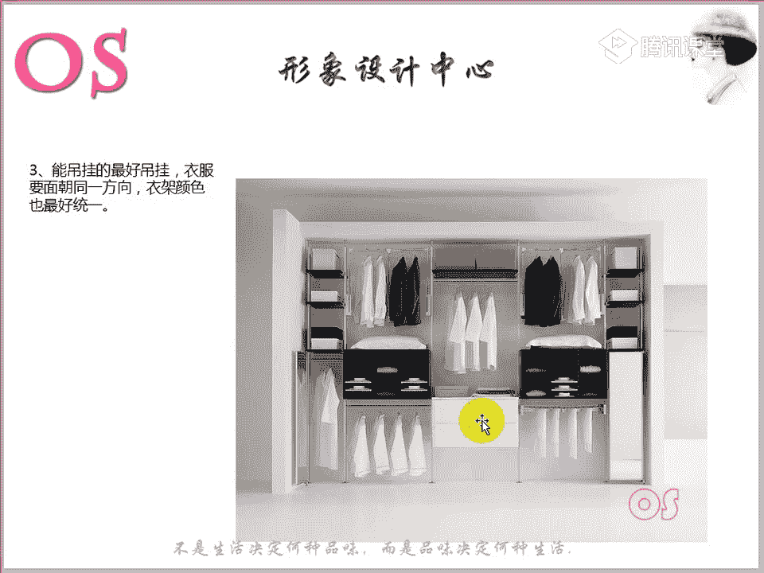

因此，购买时应注重衣服的利用率和搭配可能性。

### 3. 悬挂收纳原则
能悬挂的衣服尽量悬挂，并保持所有衣服面朝同一方向，使用颜色统一的衣架。这不仅能保持衣物版型，方便熨烫，也能让衣橱看起来更整洁，便于每日挑选。

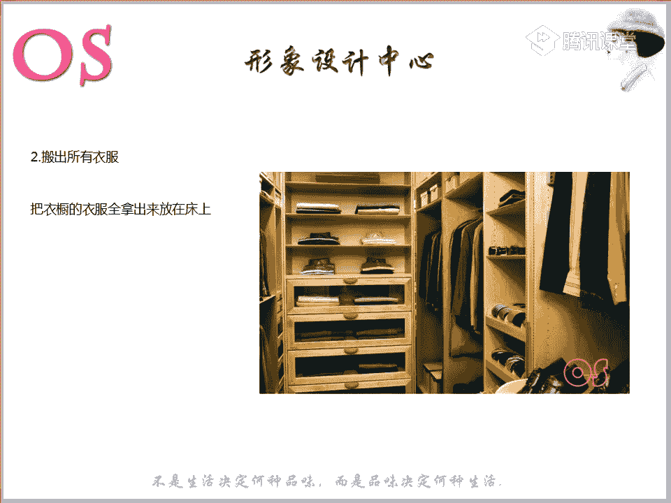

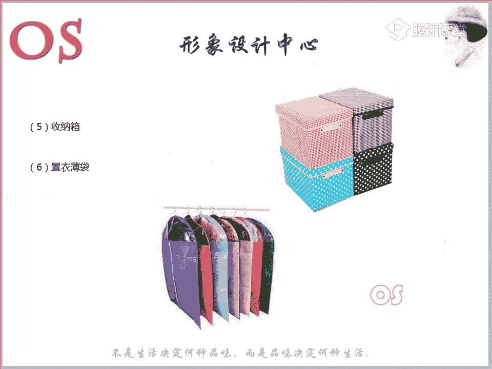

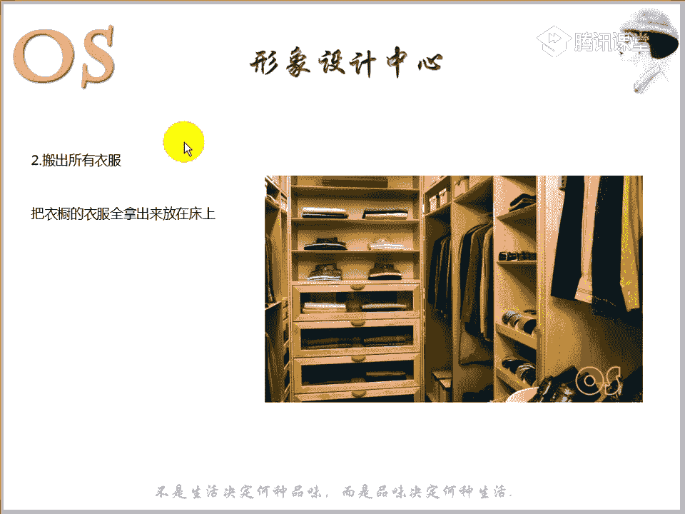

### 4. 分类悬挂原则
衣物应按长短、深浅、厚薄、季节、风格和场合进行分类悬挂。若想进一步提升整洁度，可按色系排列（如绿色系、蓝色系放一起）。

## 衣橱管理的方法

了解了核心原则后，我们来看看如何一步步实践衣橱管理。以下是具体的操作步骤。

### 第一步：准备工具
工欲善其事，必先利其器。整理前需要准备好以下工具：
*   **细塑料衣架**：用于悬挂轻薄的衬衫、T恤。
*   **厚塑料/植绒衣架**：用于悬挂有一定重量的外套和毛衫，防止肩部变形。
*   **木质衣架**：用于悬挂最重的风衣、大衣。
*   **裤架**：专门用于悬挂裤子。
*   **收纳盒/箱**：用于存放换季或不常穿的衣物。
*   **防尘罩/袋**：用于保护悬挂的衣物，防潮防尘。

### 第二步：清空衣橱
将所有衣物从衣橱中取出，平铺在床上或干净的地面上。这一步确保你能全面审视自己所有的衣物，避免遗漏。

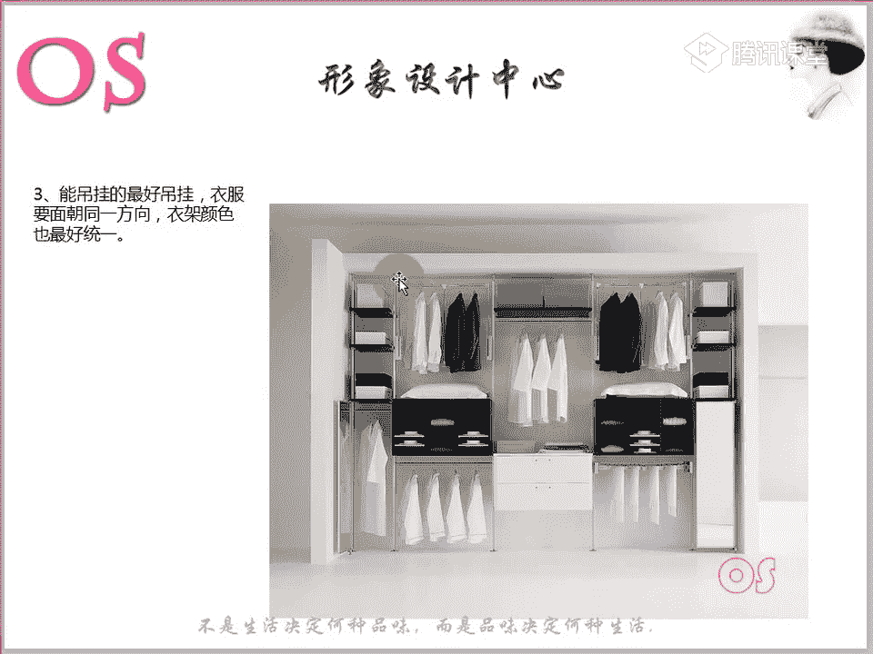

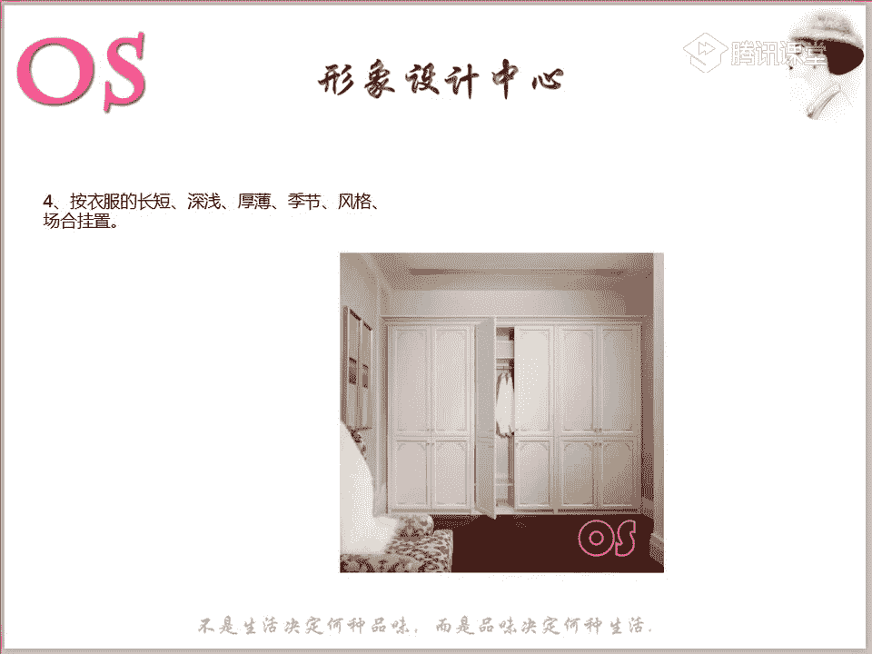

### 第三步：分类处理
这是整理的核心环节。请严格按照以下类别进行筛选：

以下是需要挑出来考虑处理的衣物类别：
1.  **超过一年未穿过的衣服**。
2.  **不合身、不符合自己季型与风格的衣服**。
3.  **已过时、感觉穿不出去的服装**。
4.  **不适合当前工作性质与社会角色的服装**。
5.  **有无法弥补的瑕疵或污渍的服装**。

以上五类衣物使用价值较低，可以考虑捐赠或回收。

6.  **无法与其他衣物搭配的单品**。将其单独归为一类。

### 第四步：重组搭配
将筛选后留下的、适合且常穿的衣物进行搭配组合。

**核心方法：1比3搭配法**
即一件下装应能搭配三件上装，或一件上装应能搭配三件基础色下装。通过这种方式，有限的衣物可以组合出更多的造型。

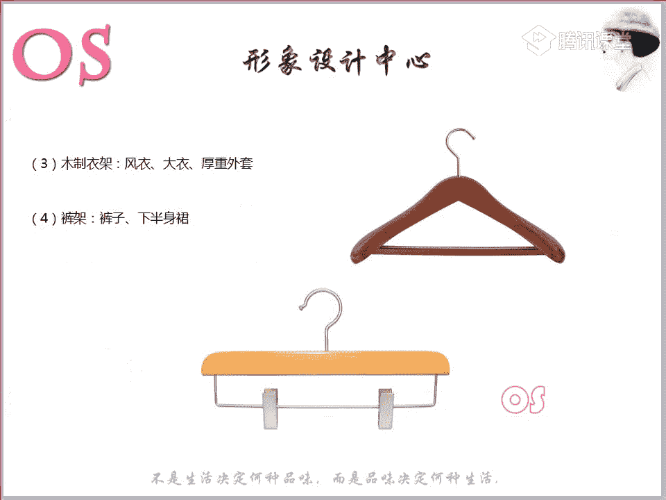

**操作建议：**
在搭配时，可以尝试不同组合并拍照存档。按场合（工作、休闲、约会）或色系建立电子相册，方便日后快速参考。在搭配过程中，你会更清楚地发现缺少哪些单品（如特定颜色的内搭、一条腰带等），将其记在购物清单上，以便日后有目的地购买。

### 第五步：收纳归位
将最终留下的衣物，按之前提到的分类悬挂原则（按场合、季节、色系等）挂回衣橱。

**其他收纳技巧：**
*   **针织衫/毛衣**：建议折叠存放，防止悬挂变形。厚重毛衣可用宽衣架悬挂。
*   **配饰**：腰带用专用挂钩；围巾可折叠平放或用裤架悬挂；领带、皮带、手表等小件物品可用抽屉内的收纳盒分类存放。
*   **鞋子**：勤于擦拭保养，不常穿的放入鞋盒。避免连续两天穿同一双鞋。
*   **家居服/棉质T恤**：可折叠收纳，但每叠最好不要超过6件，以免压皱下层衣物。
*   **活用空间**：在柜门内侧安装挂钩或支架，用于悬挂皮带、领带、背包等配件。

## 针对不同衣橱类型的整理建议

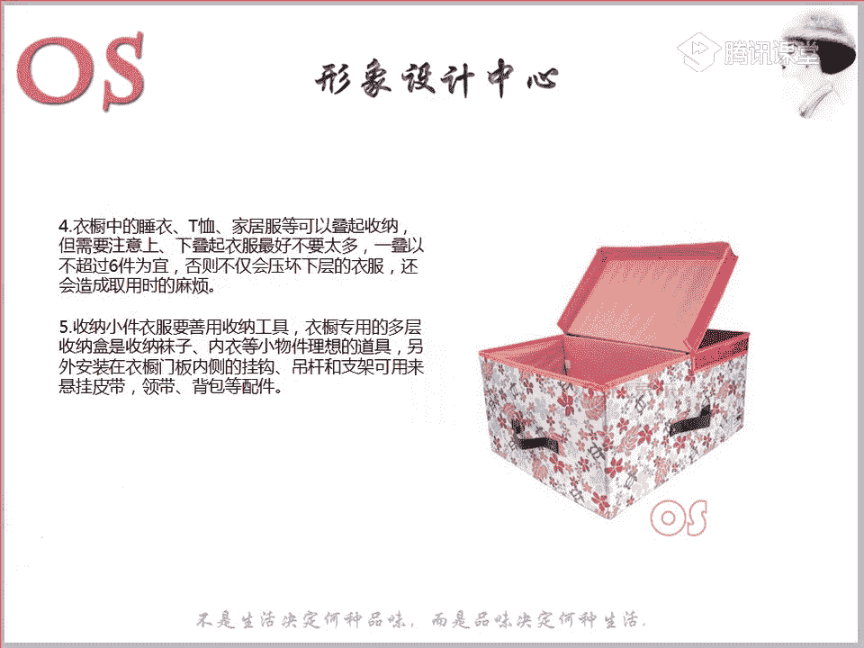

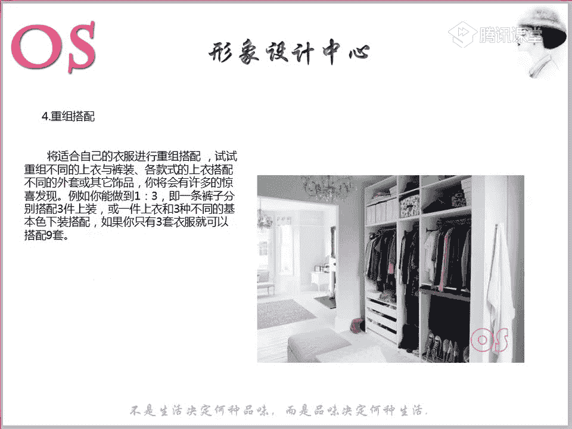

在整理过程中，你可能会发现自己的衣橱属于以下某种类型。以下是针对性建议：

以下是三种常见的衣橱类型及整理策略：
*   **爆满型**：衣服极多。建议分批次整理，淘汰率可能高达 **2/5**。整理期间暂停购衣，先充分利用现有衣物进行搭配。
*   **精简型**：衣服很少，款式保守。鼓励在符合自身季型与风格的前提下添置新衣，并尝试在色彩和款式上有所突破，增加多样性和时尚元素。
*   **混乱型**：各种风格颜色混杂，缺乏主线。必须坚决淘汰不适合的衣物，建议淘汰 **1/3**。此后购物需极度理性，强烈以“适合”为导向，多参考适合自己风格的图片，提升审美。

## 针对不同购物性格的购衣建议

了解自己的购物习惯，能更好地执行衣橱管理计划。

以下是三种购物性格及应对策略：
*   **冲动型**：看到喜欢就买。应对方法：严格按需求购物；采用“冷静期”策略（如将商品放入购物车等待一两天再决定）；有意识地构建 **70/30** 基础衣橱。
*   **理智型**：购物前纠结、权衡良久。应对方法：充分准备，提前规划好搭配方案；鼓励在适合自己的范围内进行风格突破和多种场合的尝试。
*   **随和型**：易受环境和导购影响。应对方法：根据实际需求和承受能力制定购物计划；多试穿，增加对服饰的亲身感受和认知。

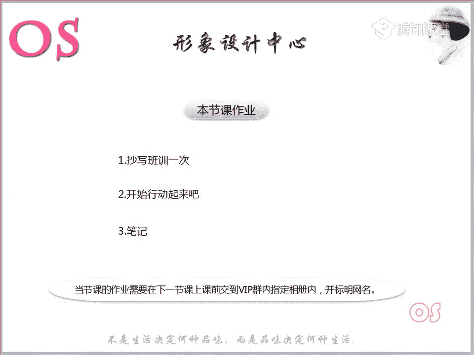

---

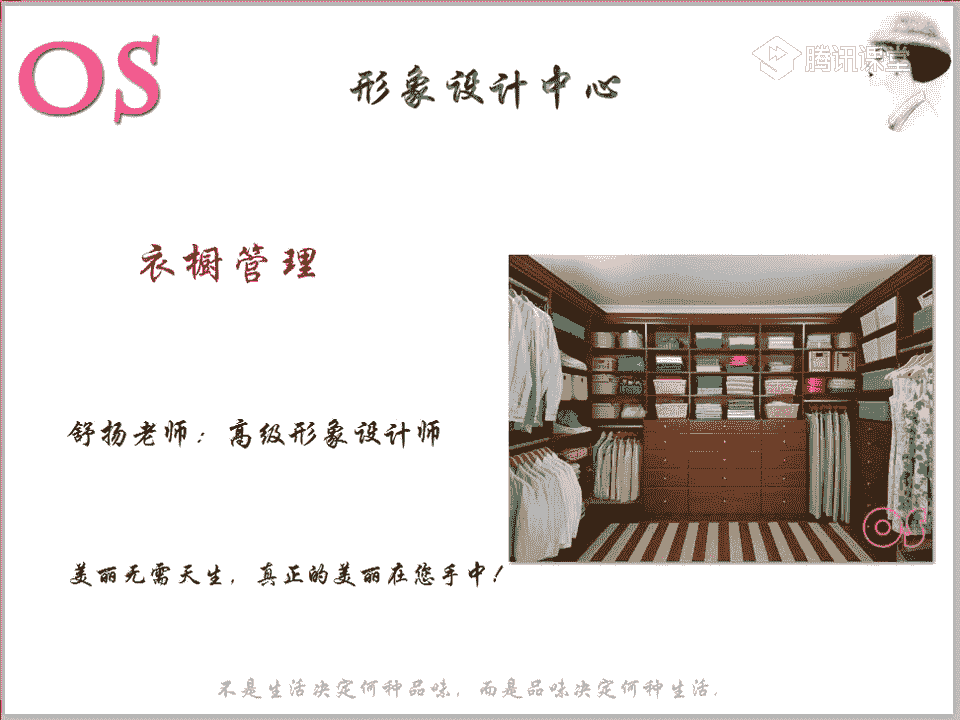

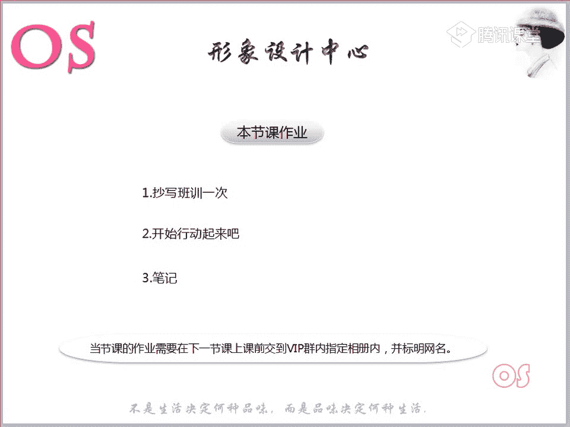

本节课中我们一起学习了衣橱管理的系统性方法。我们从 **70/30色彩原则** 和 **重质不重量** 的理念出发，逐步掌握了从清空、分类、重组到收纳的完整流程，并了解了针对不同衣橱类型和个人购物习惯的优化策略。请利用周末时间，开始你的衣橱整理实践。记住，形象的提升是一个渐进的过程，当你开始有意识地管理衣橱，你对自己风格的认知和驾驭能力也会随之日益精进。