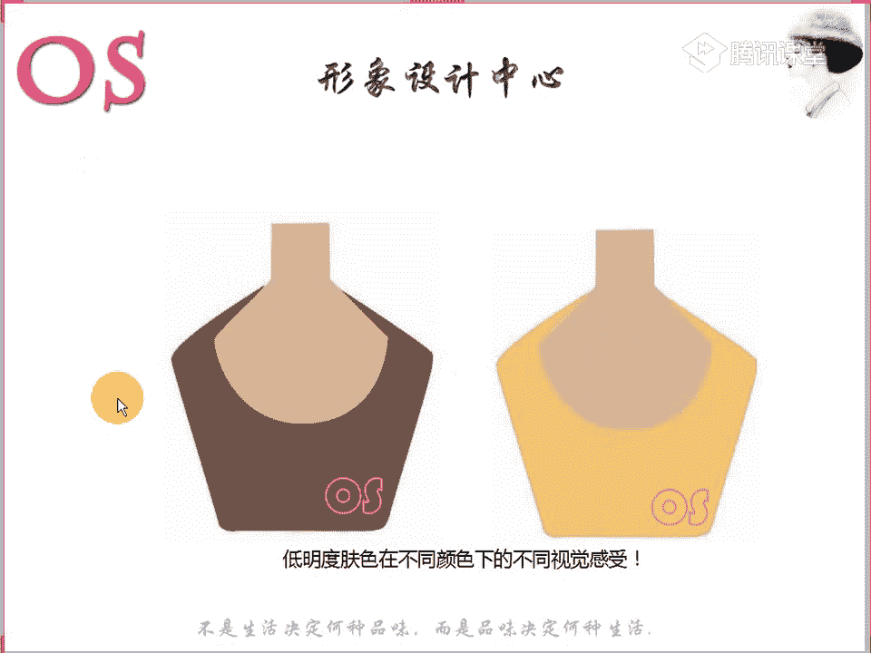
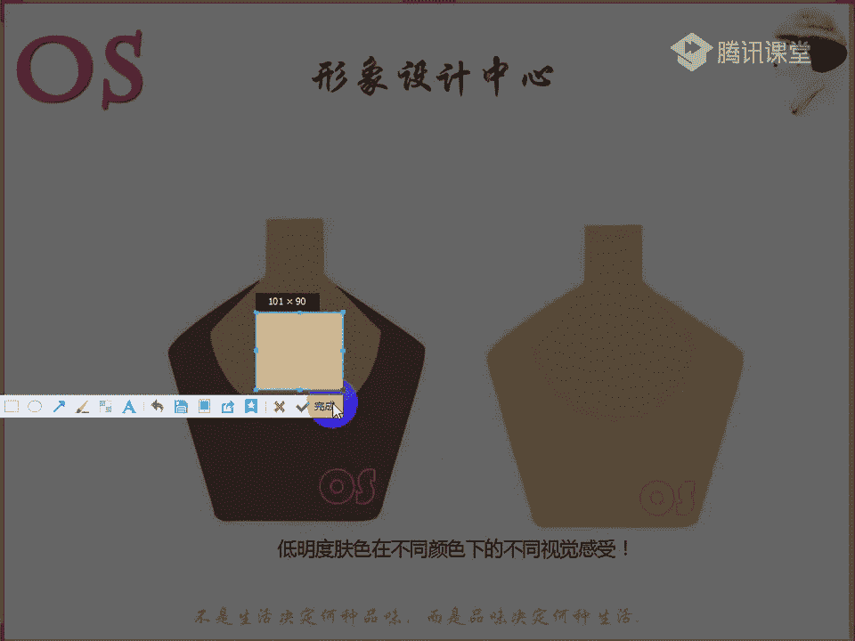

# 03OS男士形象VIP班《形象课》：第1节：个人形象的价值

## 概述
在本节课中，我们将要学习个人形象的核心价值与构成要素。我们将从概念、要素到具体实践，系统地了解个人形象如何影响他人对我们的第一印象，以及如何通过内外兼修来塑造一个得体、有影响力的形象。

---

## 个人形象的概念与重要性
个人形象并非仅仅是外在的穿着打扮，它是一个人内在修养、气质、思想文化与外在长相、神情、动作的综合体现。高质量的人生等于体力、智力与形象力的总和，而形象力在其中扮演着至关重要的角色。

当我们初次见到一个人时，第一印象在短短几秒钟内就已形成。这个印象中，**55%** 来源于外表形象（如服装、面貌、体型、发型），**38%** 来源于行为外表（如声音、手势、姿势、动作），仅有**7%** 来源于真才实学。这意味着，在他人没有机会深入了解我们之前，我们的外在表现和行为举止几乎决定了他们对我们的全部判断。

因此，永远没有第二次机会去改变一个人的第一印象。一个良好的形象可以为你带来更多的机会，其价值有时甚至超过文凭。

---

## 个人形象的构成要素
个人形象是一个整体，由显性因素和隐性因素共同构成。显性因素指外在可直接观察的部分，而隐性因素则包括内在的修养、生活方式、社会角色等。要塑造完美的形象，必须两者兼顾。

以下是构成个人形象的几个核心要素，我们将逐一进行探讨。

### 1. 色彩
色彩是塑造外在形象的首要因素。男士的色彩季型分为**春、夏、秋、冬**四大类，其中春季型和秋季型属于暖色调，夏季型和冬季型属于冷色调。

皮肤的色彩主要由**血红色素**、**胡萝卜素**和**黑色素**的比例决定。判断个人色彩季型时，主要以皮肤为研究对象。色彩的三属性包括：
*   **冷暖**：分为冷肤色与暖肤色。
*   **明度**：指色彩的明亮程度。皮肤明度低的人适合深色，高明度则适合浅色。
*   **纯度**：指色彩的鲜艳程度。高纯度肤色适合鲜艳的颜色，低纯度肤色则适合柔和、灰调的颜色。

选择错误的色彩会让人显得肤色暗沉、精神不佳。正确的用色则能使人肤色均匀、气色红润、整体和谐。

### 2. 个人风格
风格是个人形象个性的最直接体现。它由服装的**形（款式）、色（颜色）、质（面料）** 来共同表达。穿对风格，能最大化展现个人魅力；穿错风格，则会显得别扭、不协调。

例如，自然型风格的男士适合肌理感强、休闲感十足的服装（如美式西装），而戏剧型风格的男士则能驾驭线条硬朗、存在感强的款式（如欧式T型西装）。认清自己的风格，是选择合适服装的基础。

### 3. 体型轮廓
体型是服装的载体。不同的体型（如瘦高型、矮胖型等）在选择服装的款式、线条和版型时有不同的要求。只有结合自身体型特点选择的服装，才能起到扬长避短、优化整体轮廓的作用。

### 4. 发型
发型是男士的“第二张脸”，对整体形象有画龙点睛的作用。可以根据不同场合和服装风格来调整发型。一个合适的发型能极大地提升颜值和精气神。

打理发型需要一些技巧和工具：
1.  使用**直板夹**或**卷发棒**烫出需要的弧度。
2.  使用**发蜡**抓捏、塑造发型纹理和层次。
3.  使用**发胶**进行最终定型，保持造型持久。

建议多向专业理发师请教学习，熟能生巧。

### 5. 场合着装
男士着装非常注重**品质、场合与风格**。在不同社会场合（如职场、面试、相亲、休闲），需要呈现与之相符的着装。错误的场合着装会传递混乱的信息，甚至让人产生距离感。

---

## 个人仪容仪表
仪容仪表不仅指服装，更包括个人身体部位的清洁与修饰，这是尊重自己与他人的表现。

### 面部护理
*   **清洁**：根据肤质（油性、干性、混合性）选择早晚是否使用洗面奶。油性皮肤建议早晚清洁。
*   **基础护理**：洁面后，应使用**爽肤水**和**乳液**进行基础保湿，尤其在干燥季节。
*   **定期检查**：注意清洁眼角、鼻孔分泌物，饭后检查牙齿是否有食物残留。

### 毛发管理
*   **剃须**：除非有特殊宗教信仰或风格需要，建议每日剃须，保持面部整洁清爽。
*   **修眉**：杂乱的眉毛会给人邋遢的印象。定期修理眉形（男士适合剑眉），能使五官更清晰立体。眉毛颜色过淡者，可使用眉笔进行自然填充。

### 手部与细节
*   **指甲**：保持指甲短而整洁，切忌留长指甲，尤其是指甲。
*   **手部护理**：定期使用护手霜，保持手部肌肤滋润。
*   **口腔异味**：注意口腔卫生，定期检查。食用气味重的食物后，可咀嚼口香糖或使用漱口水。

### 行为礼仪（简述）
*   **递接名片**：双手递送，名片正面朝向对方。接名片时亦用双手，接过后可轻声念出对方姓名或公司以示尊重，然后妥善收好。
*   **公共礼仪**：乘坐电梯时遵守“先下后上”原则；乘坐扶梯时靠右站立；上下楼梯时，陪同客户应遵循“上楼梯客在前，下楼梯客在后”的原则，以示保护与尊重。

---

## 总结
本节课我们一起学习了个人形象的价值与核心构成要素。我们认识到，形象是一个由**外在表现（色彩、风格、体型、发型、场合着装）** 和**内在修养及行为礼仪**共同构建的系统工程。良好的形象始于对自我的清晰认知，并体现在每一个细节之中。

对于男士而言，着装不仅是穿衣服，更是穿出**秩序、逻辑与影响力**。从今天起，请树立起重视个人形象的意识，并在接下来的课程中，跟随老师一步步学习，通过实践作业来巩固知识，实现真正的改变。

**课后作业**：
1.  抄写一次班训。
2.  用你自己的话，简单概述你对“个人形象”概念的理解。
请将作业标注网名，上传至VIP群内指定的课程相册中。