# OS男士形象VIP班：第3节：体型修饰 🧥

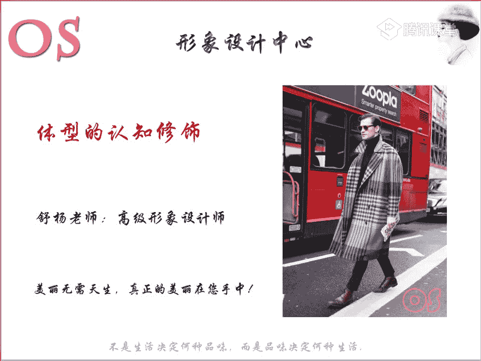

在本节课中，我们将要学习体型与服饰搭配的规律。课程将分为三个重点：首先，学习如何判断自己的体型；其次，理解服装如何通过视觉错觉修饰身材；最后，针对不同体型，掌握具体的着装技巧。通过本节课，你将能够找到与自己体型相匹配的着装方法。

## 体型分类与判断

上一节我们介绍了课程的整体框架，本节中我们来看看男士体型的分类。体型与服饰的关系非常重要。对于体型基本标准的男士，可以自如地按照规律装扮自己。但生活中标准体型的人不多，对于体型不标准的男士，需要通过一些手段进行调整，使体型在视觉上接近标准。因此，了解男士体型的分类和判断方法，是本节课的第一个学习重点。

男士体型主要分为五大类。

以下是五大体型的特征：

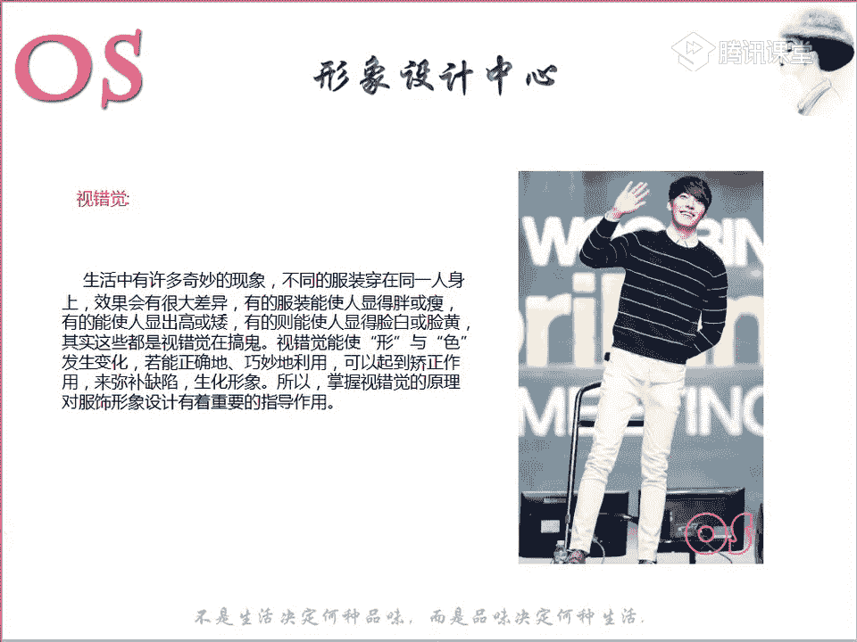

1.  **倒三角体型（健硕型）**
    *   这是非常标准的男性体型，特征是**肩宽 > 臀宽**。
    *   整体呈现健壮感，胸肌和肩部肌肉线条明显，身体有厚度。
    *   代表人物：彭于晏。

2.  **窄小体型**
    *   特征是**个子不高，肩部窄，显得单薄**。
    *   肩围、腰围、臀围的宽度相似，差距不大。
    *   代表人物：何炅。

3.  **瘦高体型**
    *   特征是**个子高，但整体偏瘦**。
    *   肩部、腰部、臀部的宽度也较为相似，但缺乏倒三角体型的厚度和宽度。

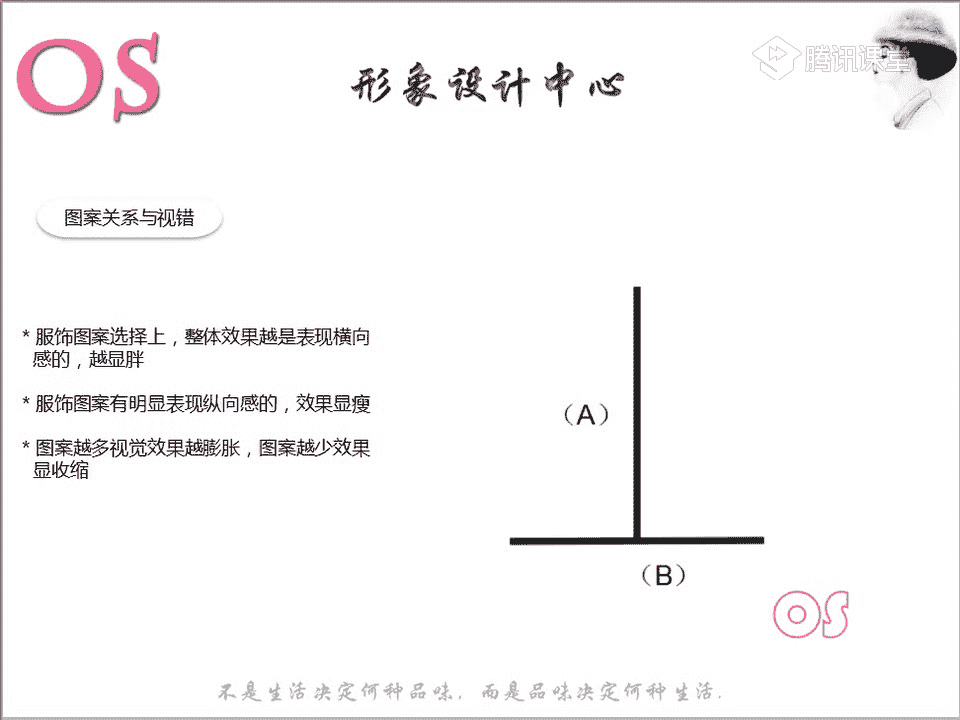

4.  **肥胖体型**
    *   特征是**肩围、腰围、臀围都很圆润，身体厚重敦实，有重量感**。
    *   整体非常敦实，可能高也可能矮。

5.  **三角形体型**
    *   特征是**个子不高，身体中部（腰腹）比较厚重，但不如肥胖体型敦实**。
    *   关键判断标准：**肩宽 < 臀宽**。
    *   代表人物：郭德纲。

## 视觉错觉原理与应用

了解了体型分类后，我们需要理解服装修饰身材的核心原理——视觉错觉。服装的作用是粉饰身材，主要利用视觉错觉原理。人的眼睛像照相机一样客观，如果身材有缺陷而不通过服饰引导，缺陷就会被直接看到。反之，通过服装调整视觉捕捉到的信息，就能将身材向更完美的方向呈现。

视觉错觉能让形状与色彩发生变化，正确巧妙地使用可以弥补缺陷。掌握这个原理对形象设计有重要指导作用。

以下是基于视觉错觉的四大修饰原则：

*   **图案与视错**
    *   **原理**：图案的走向影响视觉感受。纵向感强的图案显瘦显高，横向感强的图案显胖显矮。
    *   **条纹特例**：
        *   竖条纹密集时显胖，稀疏时显瘦。
        *   横条纹密集时显瘦，稀疏时显胖。
        *   斜条纹相对保险，粗细影响不大。
    *   **其他图案**：图案越复杂、色彩越丰富、排列越规则，膨胀感越强。应选择图案简单、色彩少、排列不规则的款式。

*   **服装廓形与视错**
    *   **原理**：服装的外轮廓线条影响视觉。
    *   **公式**：
        *   廓形越**外放**、越不流畅 → 视觉效果越**显胖、显矮**。
        *   廓形越**流畅**、垂感越**垂直** → 视觉效果越**显瘦、显高**。
    *   应选择外轮廓流畅、剪裁垂直的服装。

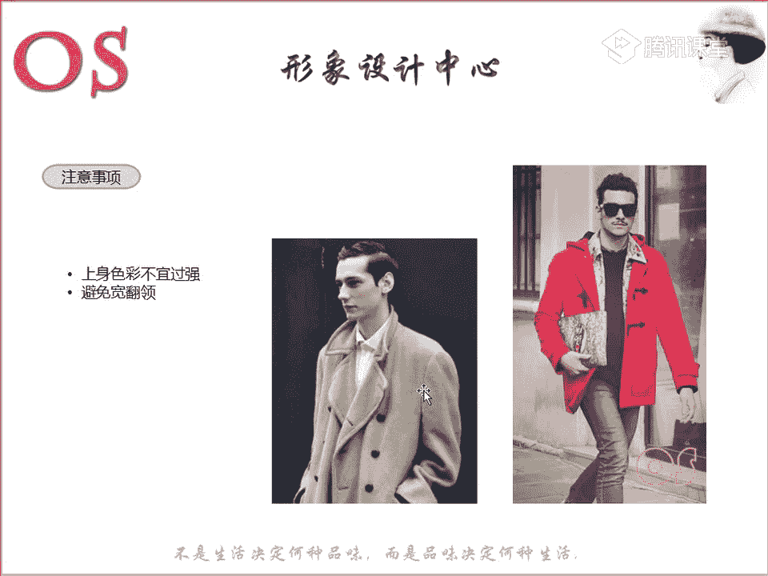

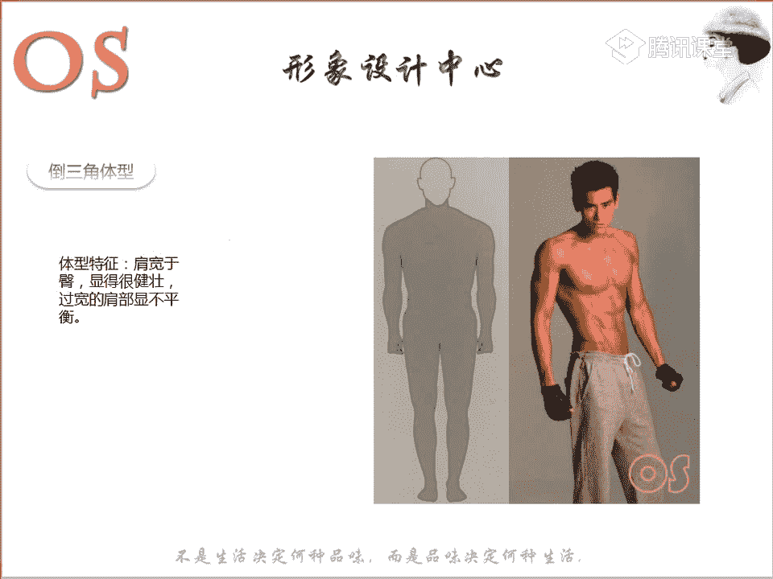

*   **色彩与视错**
    *   **原理**：色彩有膨胀和收缩两种视觉效果。
    *   **公式**：
        *   **膨胀色（显胖）**：无彩色中的白色、浅灰色；有彩色中**高明度、高纯度、暖色相**的颜色。
        *   **收缩色（显瘦）**：无彩色中的黑色、深灰色；有彩色中**低明度、低纯度、冷色相**的颜色。
    *   色彩需与服装的廓形、材质结合运用才能达到最佳效果。

*   **材质与视错**
    *   **原理**：面料质感影响视觉体积感。
    *   **膨胀材质（显胖）关键词**：柔软、厚重、有光泽、肌理感强（如粗棒针织、棉麻、裘皮）。
    *   **收缩材质（显瘦）关键词**：挺括、薄、平滑、哑光（如西装面料、真丝、高密度细针织）。
    *   应根据身材需求选择合适材质。

## 各体型修饰技巧

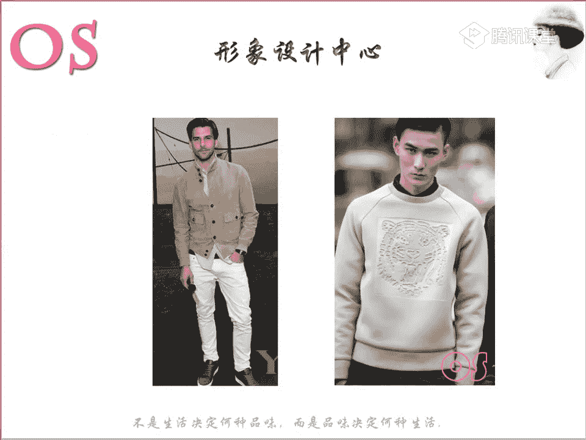

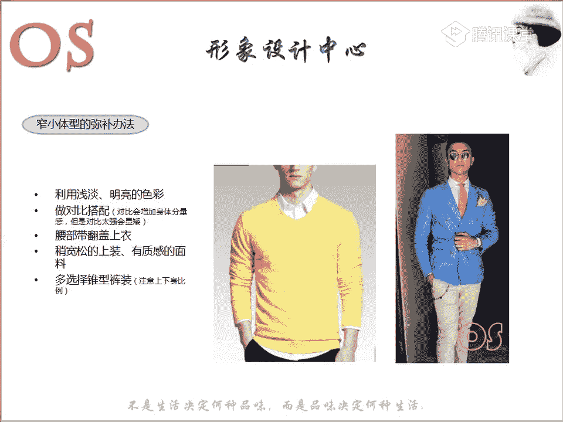

掌握了视错原理后，我们就可以针对不同体型进行具体修饰。以下是五大体型的着装技巧。

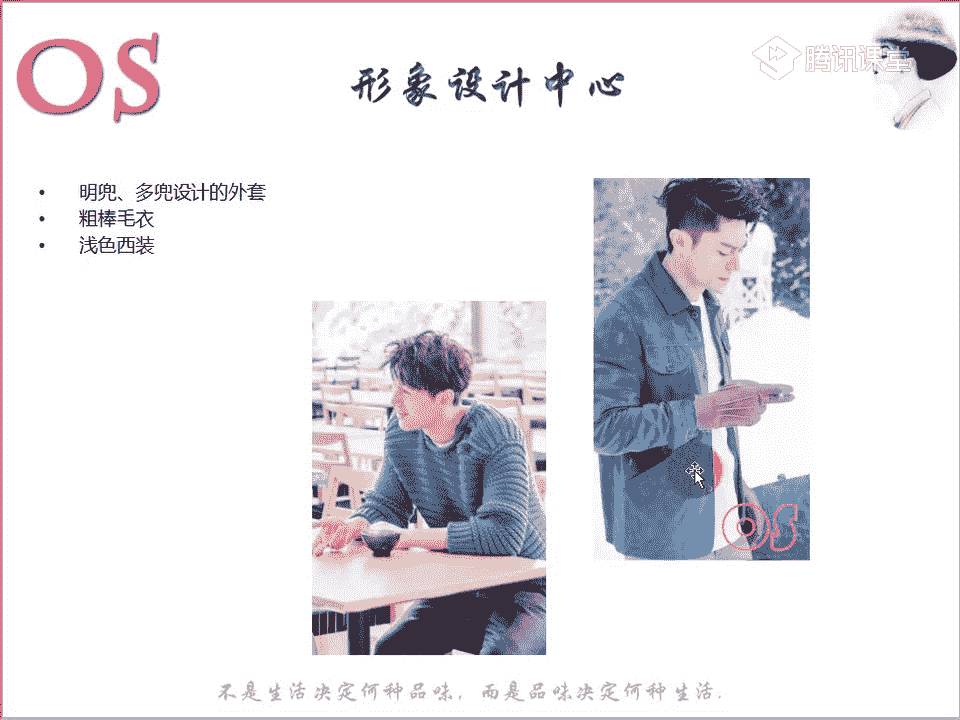

*   **倒三角体型修饰**
    *   **目标**：平衡上下半身，避免上宽下窄过于夸张。
    *   **方法**：
        1.  上半身选用**收缩色、收缩材质、流畅廓形**。
        2.  脖子周围可用鲜艳色点缀，吸引视觉中心。
        3.  选择腰部有**带盖或口袋**的上衣，增加腰部量感。
        4.  下半身可多用**膨胀色或鲜艳色**，丰富下半身。
    *   **避免**：上半身色彩过强、图案过大；宽大的翻领；肩部过多设计。

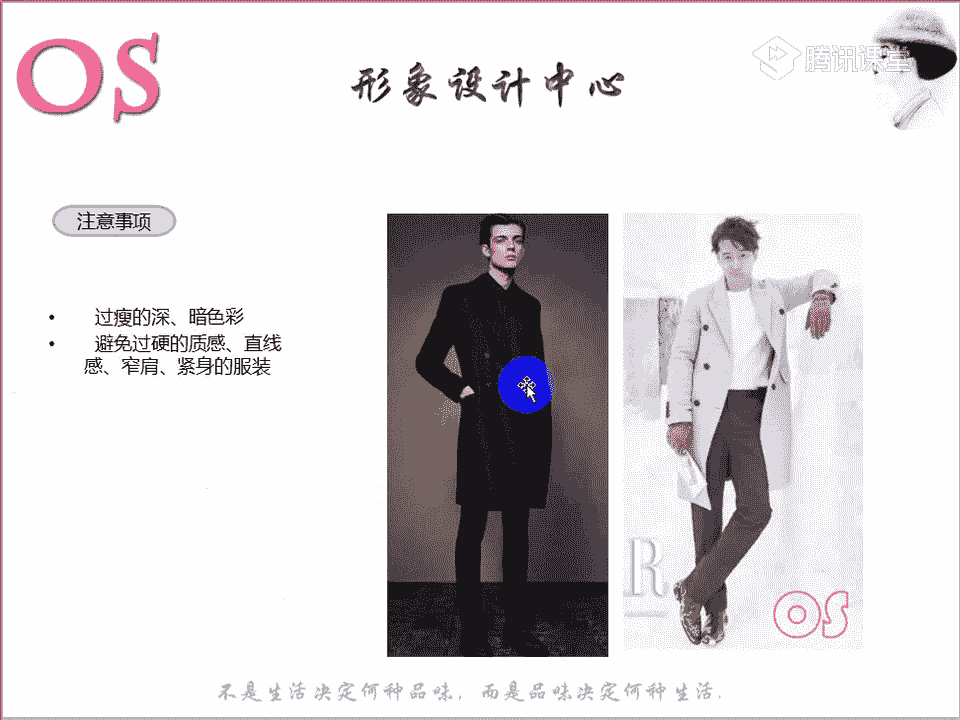

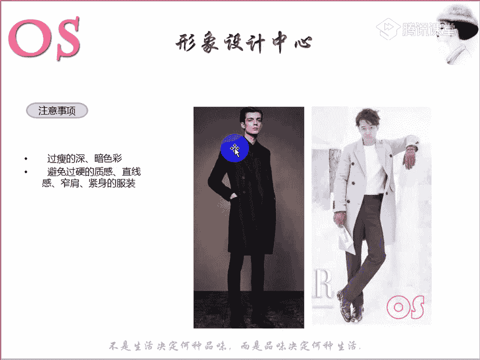

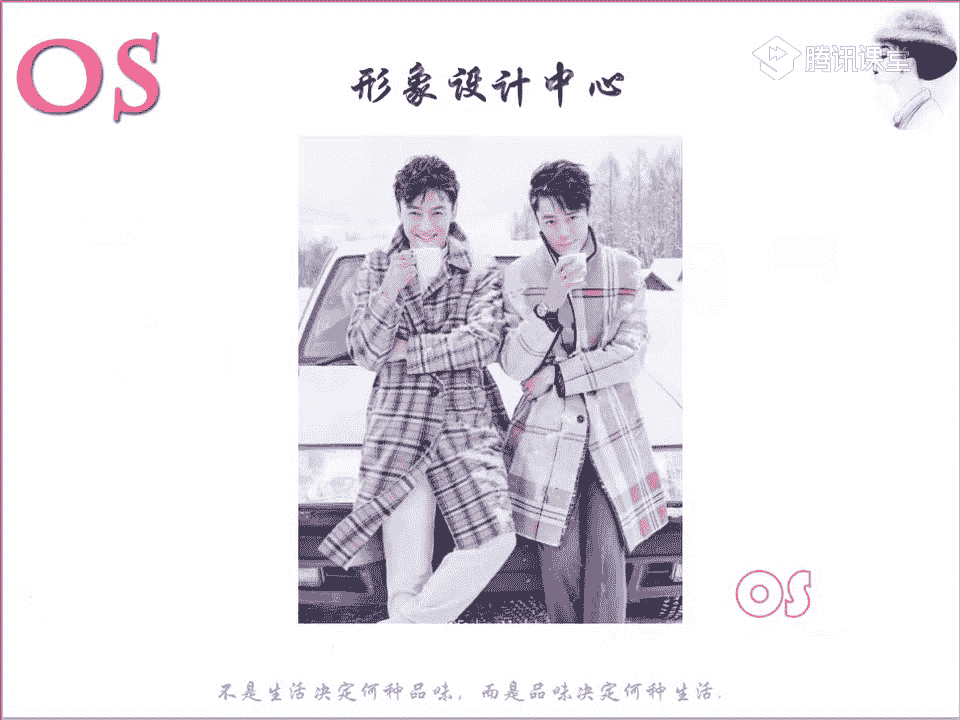

*   **窄小体型修饰**
    *   **目标**：增加量感与高度，避免更显瘦小。
    *   **方法**：
        1.  多穿**浅淡明亮的膨胀色**。
        2.  可进行**弱对比**色彩搭配。
        3.  选择**稍宽松、有质感（膨胀材质）** 的上装。
        4.  多穿**锥形裤**。
    *   **避免**：过于深暗的色调；过于紧身或过于宽松的服装。

*   **瘦高体型修饰**
    *   **目标**：增加量感与宽度，避免更显单薄。
    *   **方法**：
        1.  多用**浅淡倾向的膨胀色**。
        2.  可运用**对比色搭配**（即使显矮也无妨，以增加量感为先）。
        3.  选择**横向线条、肌理感强、多装饰细节**的外套。
        4.  可穿**有轻微垫肩**的服装，向T型靠拢。
    *   **避免**：过瘦的版型；过深的颜色；过于紧身的裤子。

*   **肥胖体型修饰**
    *   **目标**：整体收缩，显瘦显利落。
    *   **方法**：
        1.  大面积使用**收缩色**，并结合**收缩材质和流畅廓形**。
        2.  身体主干部分（胸腹臀）颜色**偏深**。
        3.  色彩搭配尽量**统一或渐变**，避免强对比。
        4.  多穿**V领、衬衫领型不宜过小**。
        5.  配饰选择**竖式**。
    *   **避免**：上身色彩过于鲜艳丰富；肩部或腹部有横向线条；柔软贴身的材质。

*   **三角形体型修饰**
    *   **目标**：塑造上宽下窄的T型视觉感。
    *   **方法**：
        1.  上半身用**强烈一点的色彩（膨胀色）**，下半身用**收缩色**。
        2.  面料选择**平整、硬挺、垂直感强**的。
        3.  可利用**围巾**等增加肩部分量感。
    *   **避免**：上下身色彩对比过强；过于柔软下垂的面料。

## 课程总结与作业

本节课中我们一起学习了男士体型的五大分类、视觉错觉的原理及其在服装图案、廓形、色彩、材质上的应用，并针对每种体型给出了具体的修饰技巧。

**本节课作业**：
1.  抄写班训，整理课堂笔记。
2.  **实操练习**：根据对自己的体型判断，寻找或搭配出符合该体型修饰技巧的服装图片（可从杂志剪贴或网络搜索），进行整理，以加深理解并为日后购物提供参考。

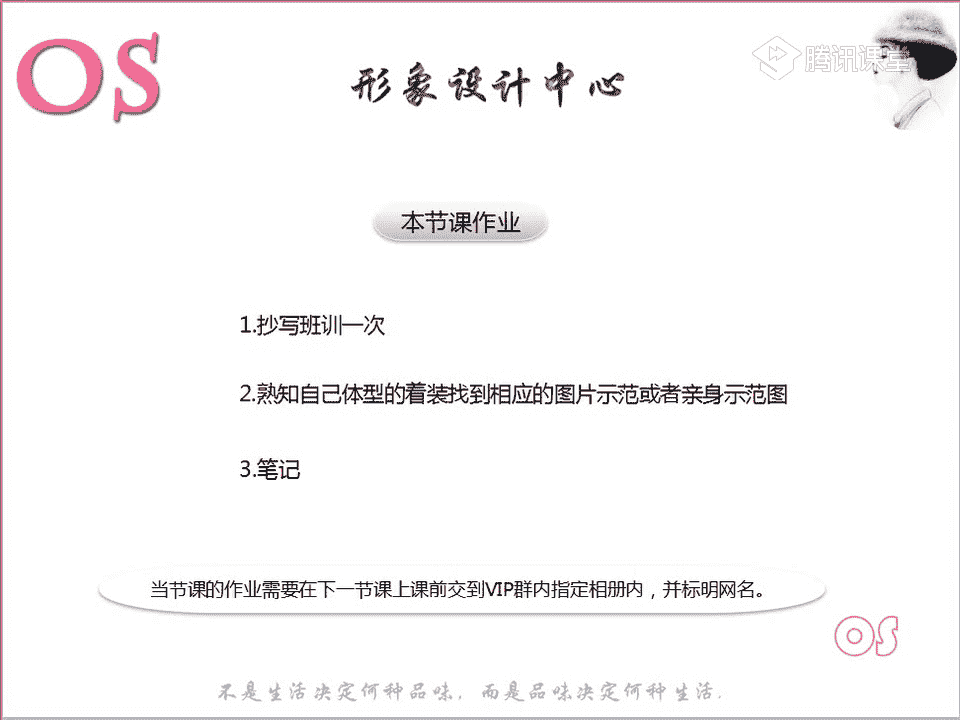

希望大家能将所学知识付诸实践，通过恰当的服饰搭配，展现出更佳的个人形象。