# 03OS男士形象VIP班《形象课》：第4节、场合着装常识 👔

在本节课中，我们将要学习男士在不同年龄段和不同社会场合下的着装原则与技巧。着装不仅是个人品味的体现，更是社会角色和场合需求的表达。我们将从年龄和场合两个维度出发，帮助你构建清晰、得体的着装体系。

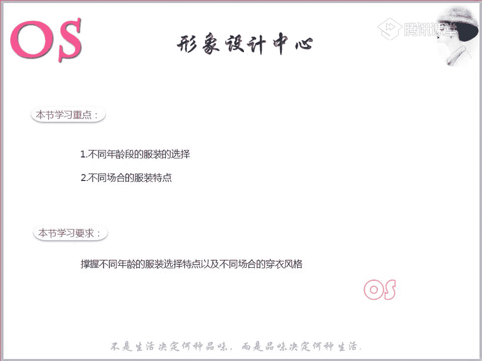

---

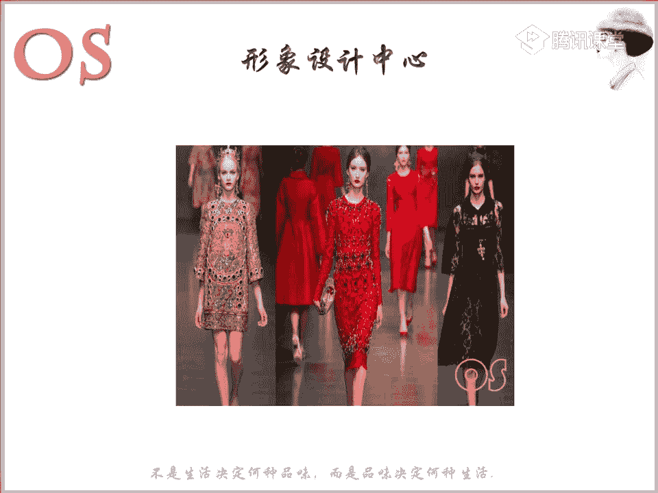

## 一、 课程核心：年龄与场合的双重考量

上一节我们介绍了形象设计的整体框架，本节中我们来看看如何将理论应用于实践。男士着装需同时考虑两个核心因素：**年龄**与**场合**。

我们的形象由内在（隐性）和外在（显性）因素共同构成。**年龄**属于重要的隐性因素，它会直接影响服装色彩、款式和材质的选择。而**场合**则是决定我们外在表达的关键显性因素。本节课的学习重点就是掌握这两个知识点。

**本节课要求**：掌握不同年龄段的穿搭要点，并学会在不同场合协调出适合自己的着装风格。

---

## 二、 男士着装的底层逻辑

在深入细节前，我们需要理解男士与女士在着装关注点上的根本区别。

*   **女士**：非常重视**感情色彩**，追求能带来情感满足的色彩和符合个人风格的款式。
*   **男士**：着装逻辑的优先级不同，其关注点依次为：
    1.  **品质感**：服装的质感是否与个人气质、材质相协调。
    2.  **场合**：着装是否符合所处环境的要求。
    3.  **风格**：服装是否契合个人风格。
    4.  **颜色**：在满足以上三点后，最后才考虑颜色。

因此，对男士而言，场合和品质优先于色彩。

---

## 三、 不同年龄段的着装指南

以下是针对各个年龄段的详细穿搭建议，请注意其中的变化与核心原则。

### 1. 20-30岁：大胆尝试，明亮为主 🎯

这个年龄段通常刚步入社会，皮肤状态、身材和精气神都处于最佳时期。

*   **核心建议**：可以大胆尝试流行款式和色彩，无需过于顾忌个人风格的严格限制。
*   **色彩**：建议多穿着**明亮、鲜活、浅淡**的色彩。可以大面积使用或小面积点缀鲜艳色。
*   **社会入门禁忌**：虽然休闲场合可以自由发挥，但一旦进入**职场**，必须遵守职业场合的着装规范（下文详述）。这是从校园到社会的关键转变。
*   **材质与剪裁**：对材质要求相对宽松，但建议根据自身风格（如古典风格需注重精细剪裁）选择合体款式。
*   **增加亮点**：可以运用双肩包等配饰增加时尚元素。

**关键感受**：整体着装呈现**年轻化、活泼、动感、鲜艳**的特点。

### 2. 30-40岁：平衡志气与成熟 ⚖️

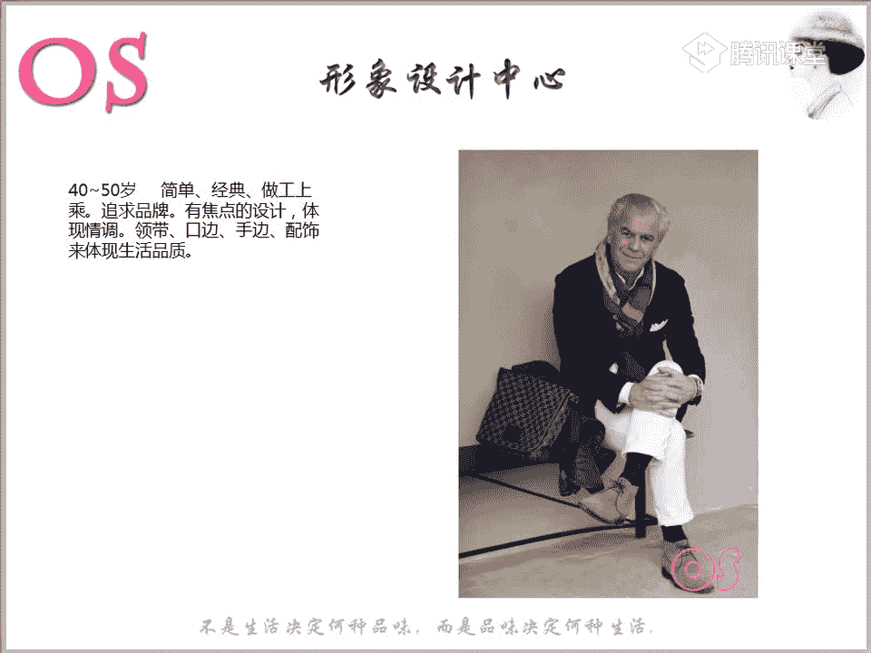

此阶段社会角色可能发生变化（如步入中层管理），皮肤和身材开始走向成熟，生活重心更多偏向职场。

*   **核心建议**：在追求**职业感、精致感、品质感**的同时，需**适当加入流行元素**，在志气与成熟间找到平衡。
*   **如何加入流行元素**：
    *   选择带有**印花**的精致衬衫。
    *   选择在经典西装上加入**拉链、特殊扣子**等设计细节的款式。
    *   参考范例：韩剧《鬼怪》中男主角孔刘的着装，完美诠释了该年龄段的平衡之道。
*   **风格体现**：不同风格男士在此阶段有不同表达。例如，浪漫风格男士可选择领型柔和、面料柔软的服装；前卫风格男士则可大胆运用流行元素。

**关键感受**：整体着装应体现**稳重、精致**，同时不乏**时尚度**。

### 3. 40-50岁：简约经典，凸显情调 ✨

此阶段通常事业稳定，有不错的收入，着装应体现生活品质。

*   **核心建议**：选择**简单、经典、做工上乘**的款式。服装本身越简单越好，通过**焦点设计**和**配饰**来体现情调与感性。
*   **如何制造亮点**：
    *   **配饰**：运用围巾、领带（可带粉色、金色等感性色彩）、袖扣、手表等。
    *   **内搭与细节**：选择法式领毛衣、在西装口袋加入方巾等。
    *   **搭配变化**：在一般职业场合，可用毛衣搭配西装，替代衬衫，增加柔软感。
*   **材质**：服装材质必须优质，以体现生活品质。

### 4. 50-60岁：经典之上，加入舒适 🛋️

如果仍在工作，需在经典款式中融入舒适感。

*   **核心建议**：在经典款式中加入**舒适感**。
*   **如何实现**：通过调节**款型**来实现。例如，年轻时穿剪裁合体的英式西装，此阶段可改为宽松舒适的**H型美式西装**。或者将西装面料的马甲换成**针织马甲**。
*   **若已退休**：则以**舒适、自然**为主，完全按照个人风格穿着，但需注意款式不宜过于束缚。

### 5. 70岁及以上：舒适自然，浅淡提气 🌅

此阶段以舒适为首要目标。

*   **核心建议**：在遵循舒适自然风格的基础上，**色彩上尽量选择浅淡色调**。
*   **原因**：随着年龄增长，皮肤对色彩的驾驭度降低。浅淡色彩能显得人气色更好，精神更佳。

---

## 四、 不同场合的着装法则

理解了年龄的影响后，我们来看看如何应对不同的社会场合。场合是男士着装的指挥棒。

### 1. 职业场合 👨‍💼

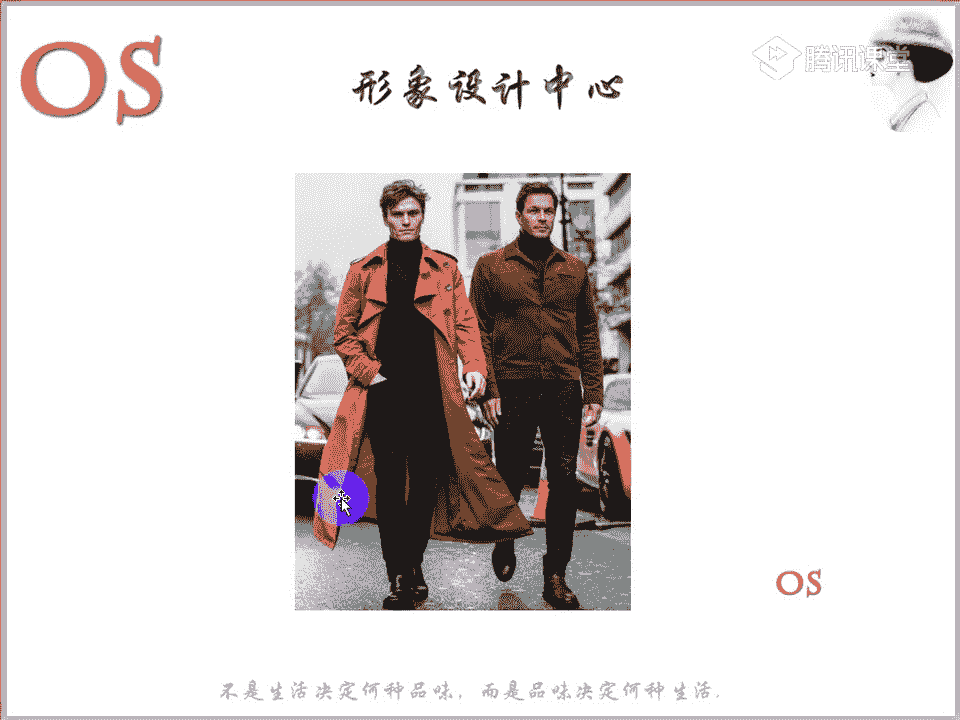

所有与工作相关的场合都属此类，可细分为三种：

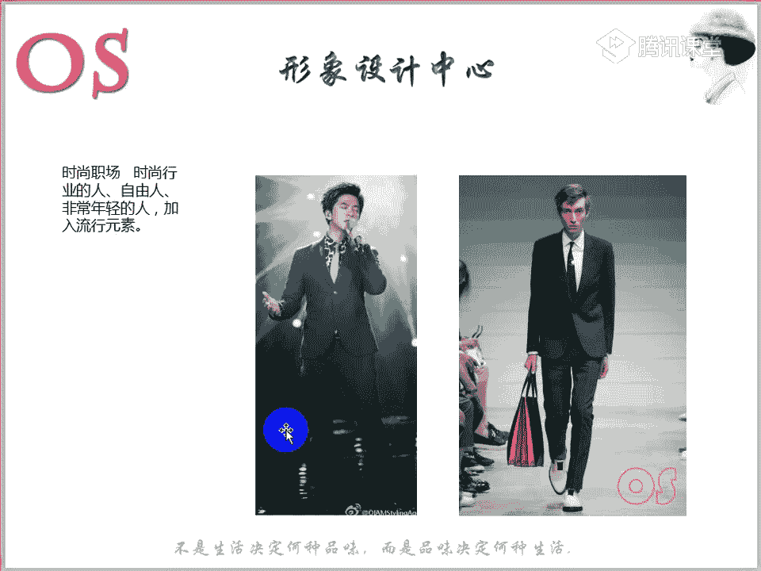

#### A. 严肃职业场合
适用于：企业高管、老板、律师、国家单位人员等。
*   **款式**：必须**成套穿着**经典款式，廓形清晰利落。
*   **色彩**：以**深色调**为主，如藏蓝、黑色。可使用暗条纹、暗格纹，但上下装图案需一致。
*   **禁忌**：
    *   衬衫避免使用**袖扣**（过于社交化）。
    *   鞋子选择系带皮鞋，避免**镂空雕花**款式。
    *   避免**短袖衬衫**。
*   **外套**：天冷时可搭配剪裁简洁的**大衣**或**风衣**（选择西装放大版款式，避免过多设计）。
*   **材质**：西装尽量选择**精纺羊毛**等精致面料。

#### B. 一般职业场合
适用于：国内大多数对着装无硬性要求的公司员工、职场新人。
*   **核心**：不要将办公室当作秀场，**避免突出个性**，体现**平和感**。
*   **色彩**：以**浊色**（加入灰色的颜色）为主，低调稳重。
*   **款式**：可通过以下方式体现休闲感：
    1.  选择廓形相对模糊的休闲西装。
    2.  **正装+休闲单品**混搭：如上身正式衬衫/西装，下身搭配休闲布裤（**避免牛仔裤**）。
*   **注意**：上半身应保持相对正式，下半身可休闲。

#### C. 时尚职业场合
适用于：形象设计师、发型师、时尚编辑等时尚行业从业者。
*   **核心**：可以多体现**自由感**，大胆**加入流行元素**，凸显个性与时尚度。
*   **做法**：色彩可以鲜艳，衬衫可选夸张印花，可通过领带、袜子等配饰制造亮点。因为你的着装本身就是专业能力的体现。

### 2. 休闲场合 🎬

工作时间外所处的场合，可细分为四种：

#### A. 都市休闲
适用于：看电影、逛商场、朋友聚会等具有都市文化气息的场合。
*   **核心**：**大胆突出个性**。
*   **做法**：结合自身**年龄、风格、色彩季型**，穿着最适合自己的服装。可以进行混搭（如西裤配球鞋、戴帽子等）。

#### B. 约会场合（特殊休闲）
适用于：初次约会或相亲。
*   **核心**：介于“一般职业”的平和感与“都市休闲”的个性感之间。**既不能完全丢弃个性，也不能过分强调**。
*   **做法**：在都市休闲基础上，结合一般职业场合的着装思路。选择**柔和色彩**的衬衫（如浅绿、淡粉、天蓝），款式可稍有特点但不宜夸张。目标是塑造**平易近人、好接触**的暖男形象。

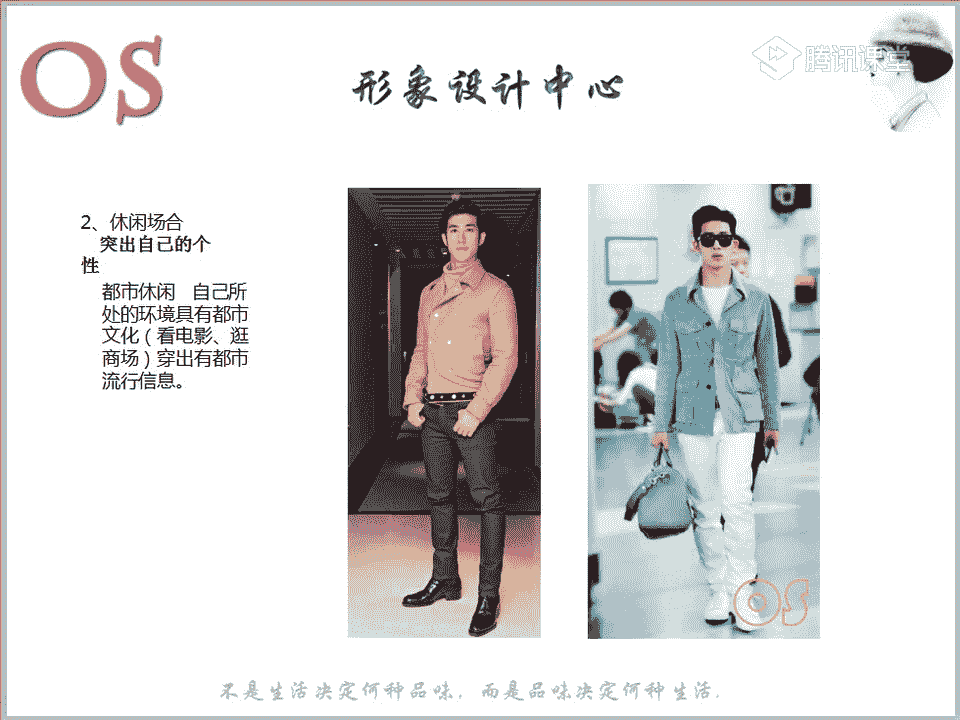

#### C. 运动休闲
适用于：健身房、户外郊游、运动旅游等。
*   **核心**：穿着需具有**运动感**，方便活动。
*   **单品**：连帽夹克、高尔夫球衫、棉质T恤、运动长短裤等。
*   **色彩**：户外活动时可选择鲜艳色彩体现活力。
*   **重要提醒**：运动装备**局限性大**，并非所有风格的人都适合。切勿将典型的运动装穿到都市休闲场合中（如古典风格男士穿运动装很难好看）。

#### D. 居家休闲
适用于：家庭内部。
*   **核心**：以**最轻松舒适**的状态为主。
*   **单品**：睡衣、宽松毛衣、衬衫、T恤、睡袍等。

### 3. 社交场合 🥂

根据正式程度分为三种：

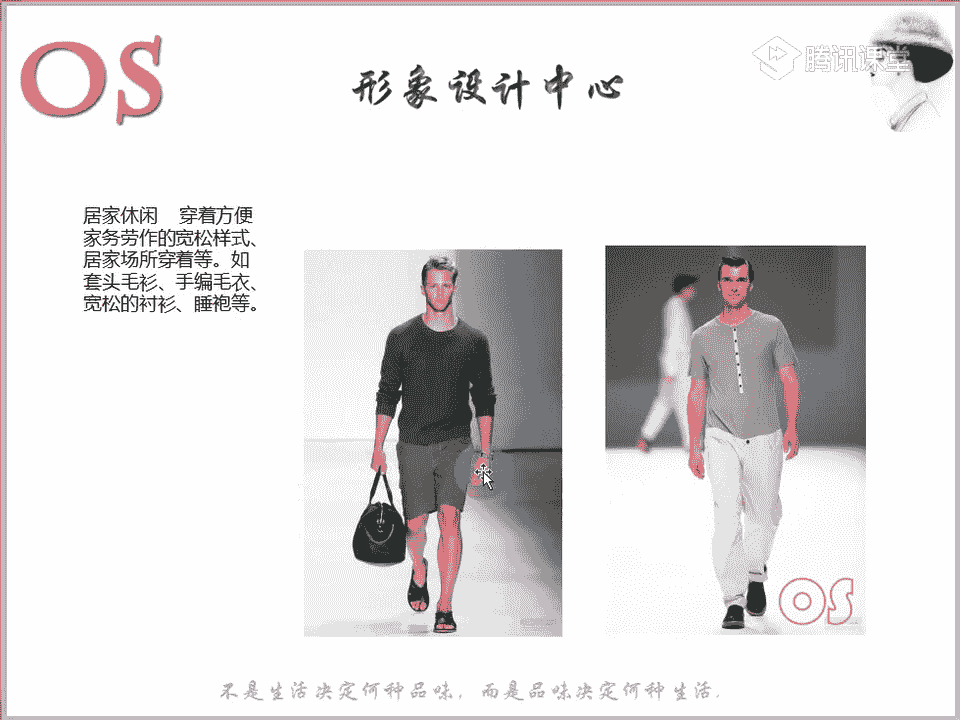

#### A. 正式社交
适用于：电影节、大型正式酒会等（请柬会注明着装要求）。
*   **着装**：需穿着**燕尾服、塔士多礼服（吸烟装）**等正式礼服。（后续课程详解）

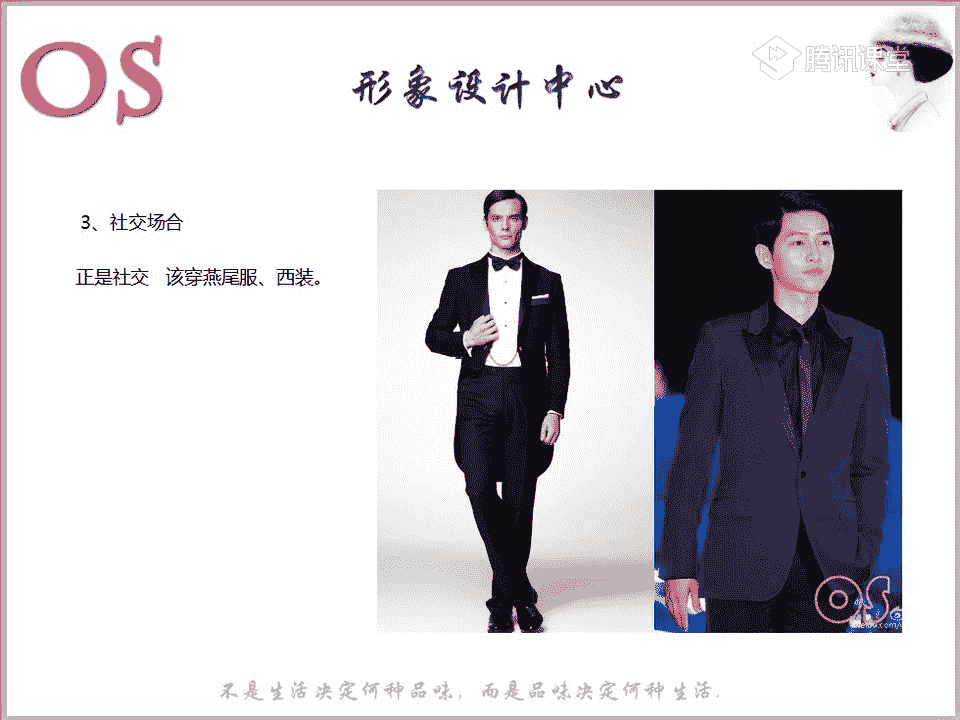

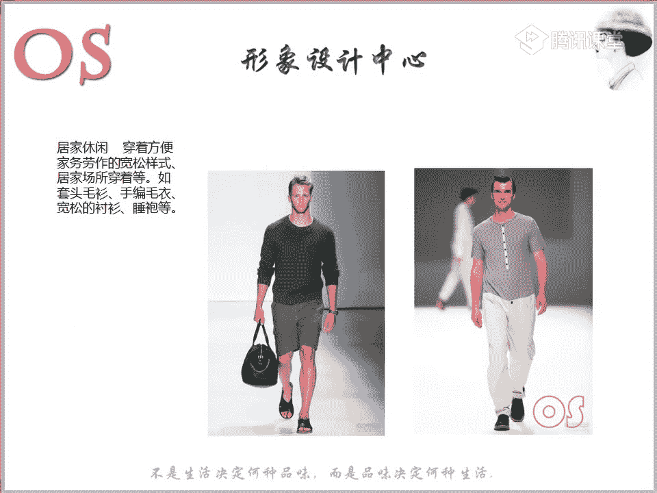

#### B. 一般社交
适用于：管理层做客、小型高端聚会等。
*   **着装**：以合体的**西装**为主。
*   **材质**：选择**带有光泽感**的面料，以增加华丽感和重视度。

#### C. 时尚社交
适用于：时尚行业人士的聚会、交流会等。
*   **核心**：**大胆突出个性**，以时尚流行为主。
*   **做法**：结合个人风格，运用鲜艳色彩和流行元素。

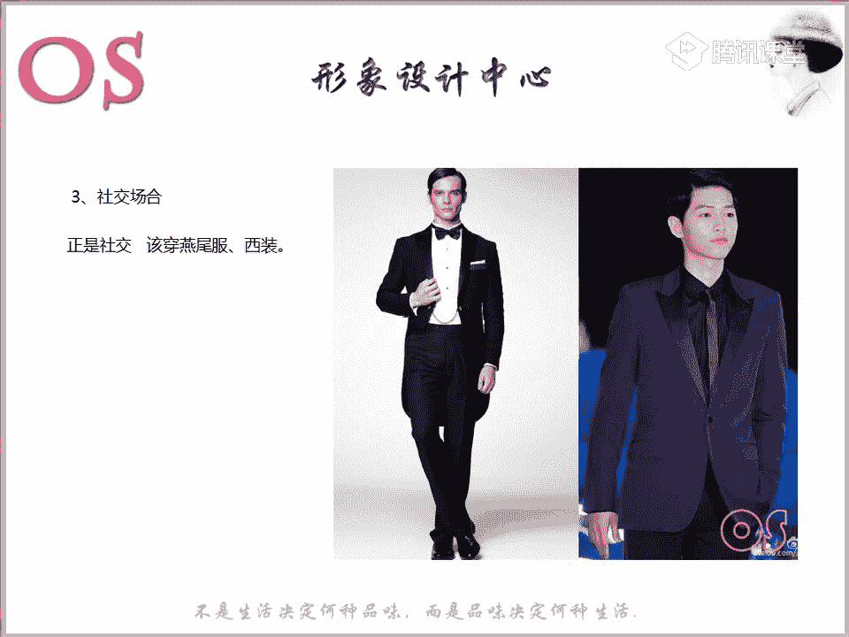

---

## 五、 总结与作业 📝

本节课我们一起学习了男士形象中至关重要的两个维度：**年龄**与**场合**。

*   **年龄**决定了我们着装的色彩明度、款式倾向和材质要求，从20岁的明亮大胆，到70岁的舒适浅淡，各有章法。
*   **场合**则是我们着装的“情境说明书”，职业、休闲、社交三大类场合下又有细分规则，从严肃职场的严谨成套，到时尚社交的大胆个性，必须严格区分。

男士受社会角色影响，需在各种场合体现完美的着装形象，这不仅能彰显个人品味，更能产生良好的社会影响。了解场合着装常识，是完善个人形象的先决之道。

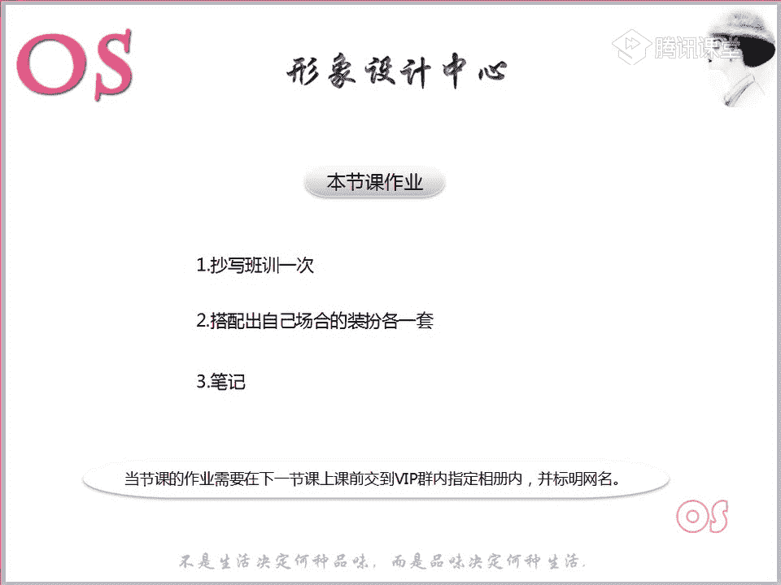

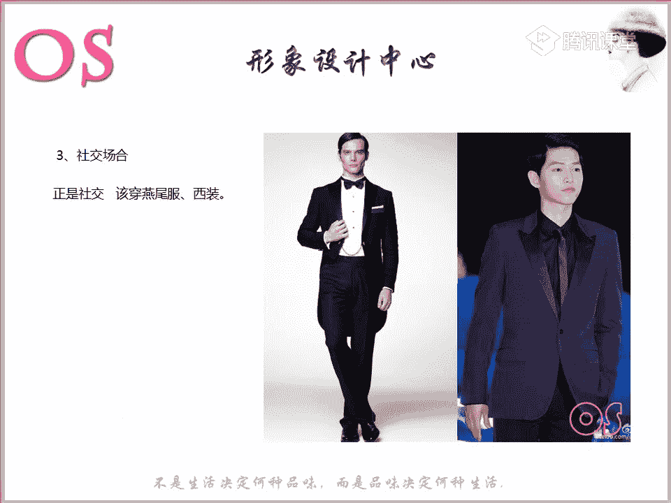

**课后作业**：
1.  **抄写班训一次**。
2.  **实操搭配**：根据你目前所处的年龄段，搭配出你**最常遇到的2-3个场合**的着装各一套（例如：职业场合一套、休闲场合一套）。拍照上传，老师会进行点评。
3.  **整理好本节课的笔记**。

请按时完成作业，将知识转化为实践。我们下节课再见！