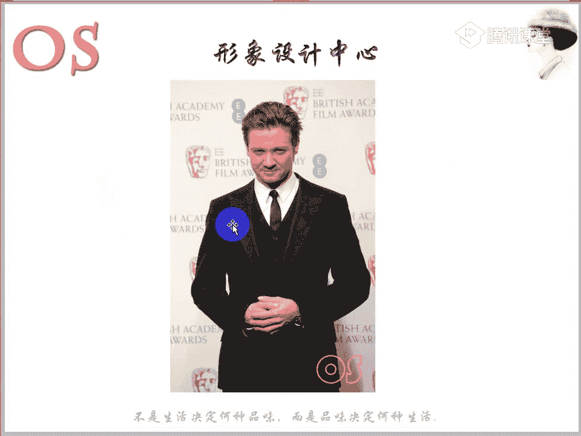
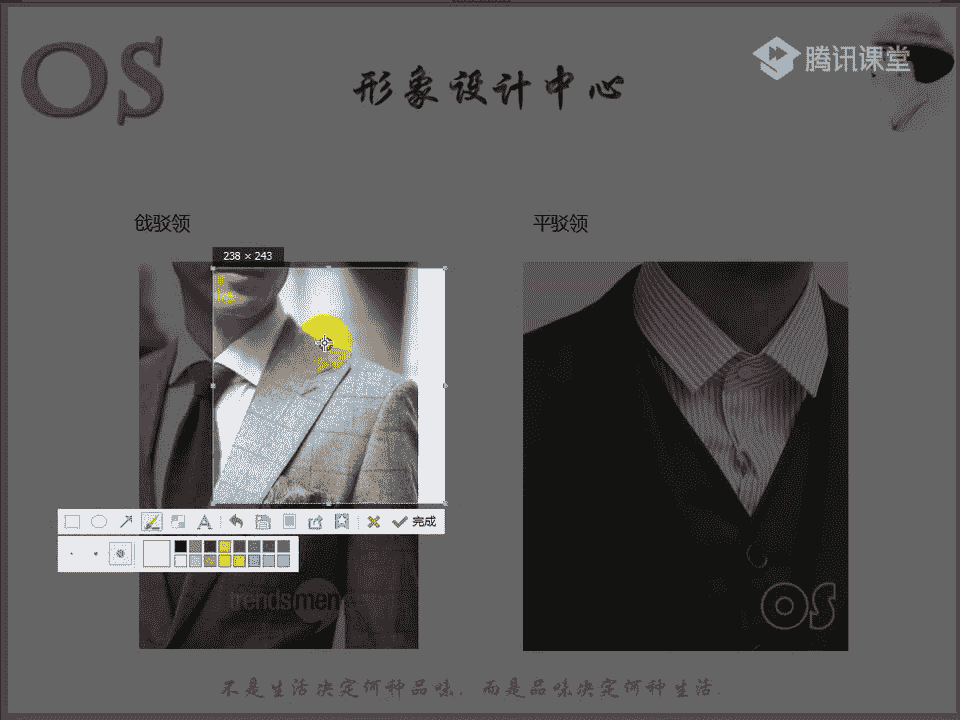
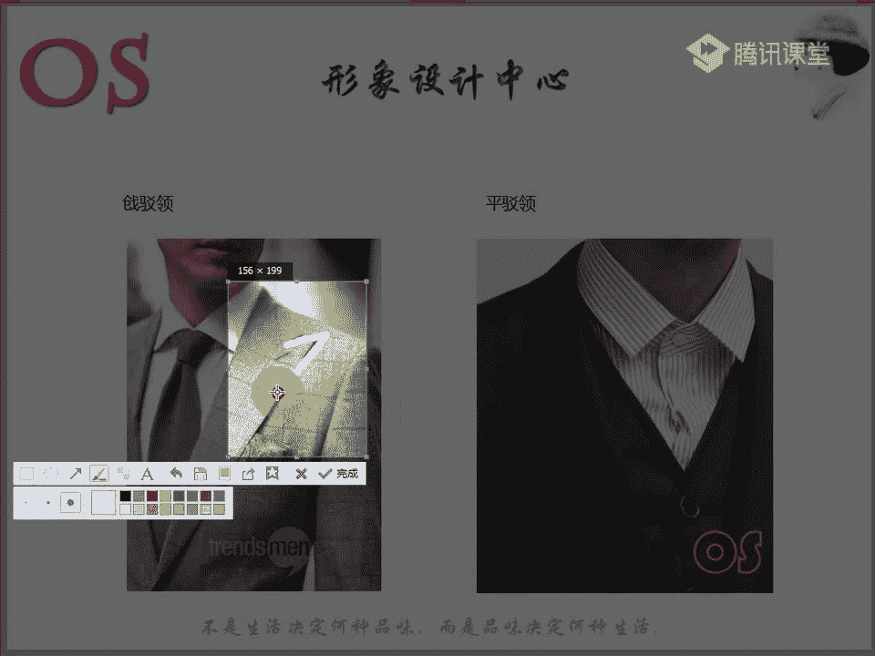
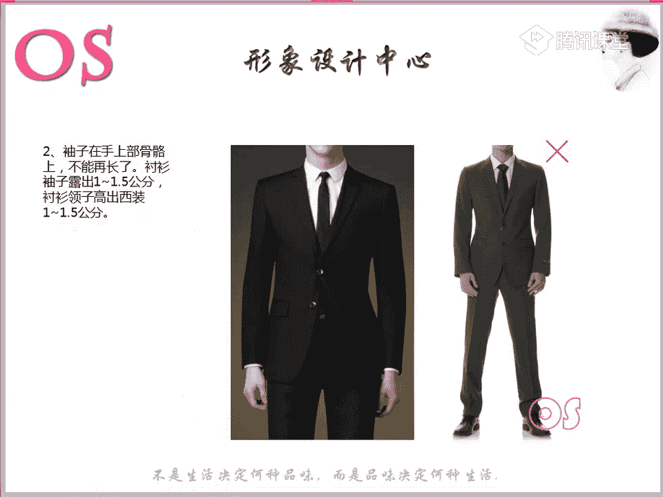

# 03OS男士形象VIP班《形象课》：第5节：正装的着装原则（一）

在本节课中，我们将要学习男士正装的核心着装原则。无论你是学生还是已经步入职场，了解如何选择一套合身、得体且符合自身风格的西装都至关重要。本节课将重点介绍西装的种类、装饰细节以及正确的穿着与选择方法。

---

## 西装领型的认知

上一节我们介绍了男士在不同场合的着装要求。在严肃职场或特定仪式（如婚礼）中，正式西装是必不可少的。在了解正式西装的种类前，我们首先需要认识西装的几种基本领型。

以下是三种常见的西装领型：

1.  **枪驳领**：其领角尖锐，视觉冲击力强。公式表示为：**领角角度 < 平驳领**。
    

2.  **平驳领**：领角角度平缓，是最常见、最经典的领型。公式表示为：**领角角度 > 枪驳领**。
    

3.  **青果领**：领面呈流畅的弧线，没有尖锐角度，常见于礼服。
    

---

## 西装的种类与特点

认识了领型之后，本节我们来看看西装的主要种类。不同种类的西装在廓形、细节和适用人群上各有不同。

以下是四种主要西装类型及其特点：

1.  **欧式西装 (T型)**
    *   **廓形**：呈明显的T字型，强调肩部，收腰收臀。
    *   **特点**：通常为双排扣、枪驳领，后摆为后开叉或不开叉。
    *   **适合人群**：身材高大、肩宽体阔的男士；或社会角色为高管、权威人士，气质雄性感强的人。

2.  **英式西装 (X型)**
    *   **廓形**：呈X型，收腰，但下摆微放（放臀）。
    *   **特点**：通常为单排扣、平驳领，后摆为单开叉或双开叉，版型修身。
    *   **适合人群**：身材匀称、气质儒雅的男士；适合职场中层管理者或机关单位人员。

3.  **美式西装 (H型/O型)**
    *   **廓形**：呈宽松的H型或O型，线条直筒，休闲感强。
    *   **特点**：通常为单排两粒扣，后摆为单开叉，适合敞开穿着。
    *   **适合人群**：年长者或身材偏胖，追求舒适度的男士。

4.  **日式改良西装 (窄版H型)**
    *   **廓形**：基于美式H型改良，版型更窄，线条更流畅修身。
    *   **特点**：更适合亚洲人身形，市面上常见的西装多属此类。

此外，还有**韩式西装**，它是在英式X型基础上改良的精短修身款式，更显年轻时尚，但正式度较低。

---

## 西装装饰的作用

了解了西装的种类，我们再来看看西装上那些看似不起眼的装饰细节，它们各有其历史和实用功能。

以下是西装上常见的四种装饰及其作用：

1.  **插花眼**：位于西装左侧驳领上的扣眼。最初用于佩戴鲜花，现代多用于佩戴徽章。
2.  **上衣袋**：位于西装左侧胸部的口袋，专用于放置**口袋巾**。最正式的颜色是白色，可用于社交场合擦拭眼镜或作为点缀。
3.  **袖口钉**：西装袖口上的扣子。起源于军装，用于防止磨损，现今主要起装饰作用，增加美感。
4.  **垫肩**：用于塑造平整、挺括的肩部线条，尤其能改善溜肩问题，帮助塑造标准体型。

---

## 西装的正确穿法与选择要点

最后，也是最重要的部分，我们来学习如何正确地穿着和选择西装。合身是西装的第一要义，以下关键尺寸必须注意。

以下是选择西装时需要关注的六个核心尺寸与细节：

1.  **衣长**：西装下摆应位于臀围线下方。**简易判断法**：自然站立，手臂下垂，衣摆边缘应与虎口保持平行。
    

2.  **肩宽**：西装肩线应比自身肩宽**超出1-2厘米**，过紧或过宽都会影响美观和活动。

3.  **袖长**：
    *   **西装袖**：长度应刚好到达手腕外侧凸起的骨骼上方。
    *   **衬衫袖**：应露出西装袖口**1-1.5厘米**。

4.  **衬衫领**：衬衫领应高出西装领**1-1.5厘米**。

5.  **领带**：长度以系好后，领带尖刚好落在腰带扣上方为宜。身高较矮者宜选较短款式（约133厘米），较高者可选较长款式（约145厘米）。

6.  **裤长与鞋袜**：
    *   **裤长**：裤脚应刚好触及鞋面，落在鞋帮处，避免堆积。
    *   **袜子**：必须选择**长袜**，颜色应深于裤子颜色，确保坐下时不露出皮肤。
    *   **鞋子**：最正式的是**系带皮鞋**，避免选择雕花过于复杂的款式。
    *   **裤中线**：西装裤的挺缝线（裤线）能显腿直。偏瘦者不宜过深，可熨烫平整；偏胖者选择有清晰裤线的裤子能显瘦。

---

## 风格与西装的选择

除了场合和身材，个人的风格也是选择西装的重要依据。男士主要分为戏剧、自然、浪漫、古典、前卫五大风格。

以下是不同风格男士选择西装的建议：

*   **戏剧型**：适合量感最大的**欧式西装(T型)**，突出强大气场。
*   **自然型**：适合休闲的**美式西装(H型)**或**日式改良版**，也可将西装拆开搭配。
*   **浪漫型**：适合**平驳领**西装，对面料要求极高，需有质感或光泽度。
*   **古典型**：最适合严谨的**英式西装(X型)**。穿着其他款式时，也需确保做工精良、剪裁合体、样式传统，推荐**三件套**（西装、西裤、马甲）穿法。
*   **前卫型**：适合**小枪驳领**、领口较小的西装，款式可修身、时尚。

---

## 正式西装与休闲西装的区分

在结束前，我们简单区分一下正式西装与休闲西装，避免在正式场合误选。

休闲西装通常具有以下一个或多个特征：
*   **明兜设计**：口袋有盖或贴在外面。
*   **明线装饰**：缝线清晰可见。
*   **设计元素**：有贴布、特殊袖口等时尚设计。
*   **面料与廓形**：面料可能不够硬挺，或廓形过于短小、宽松。

而正式西装则款式传统、廓形严谨、功能性设计（如插花眼、袖口钉）规整。

---

## 总结与作业

本节课中，我们一起学习了男士正装的三大核心知识：**西装的种类**、**装饰的作用**以及**正确的穿法与选择**。就像女士衣橱需要一条“小黑裙”一样，每位男士都应至少拥有一套合体的西装，以应对面试、年会等重要场合。

**本节课作业：**
1.  抄写班训一次。
2.  根据所学，找出（或设想）一套适合自己身材、风格与社会角色的西装图片。
3.  整理并熟记本节课的笔记要点。

选择西装时，请综合考量**场合、身材、社会角色和个人风格**，才能找到最和谐、最能彰显你魅力的那一套。

