# 形象课：1.3.6：正装着装原则（二）👔

在本节课中，我们将要学习正装着装的第二部分，重点聚焦于衬衫、领带和鞋子的分类与选择原则。我们将逐一解析男士衬衫的三大类别、不同领型的特点、领带图案的风格含义，以及各类正装鞋的适用场合。通过学习，你将能够根据自身风格和场合，精准地挑选合适的单品。

上一节我们重点分析了西装的选择，本节中我们来看看与西装搭配的衬衫、领带和鞋子。

## 衬衫的分类

首先，我们来理解衬衫的三大分类：社交衬衫、商务衬衫和休闲衬衫。

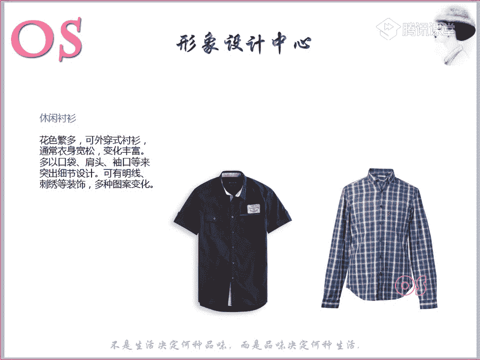

以下是三大类衬衫的核心特点：

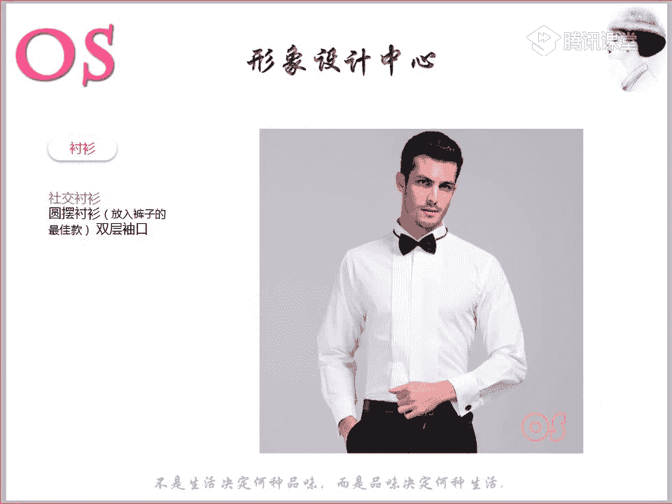

*   **社交衬衫**
    *   **下摆**：呈圆摆状，设计目的是为了更好地将衬衫下摆收入裤内。
    *   **袖口**：为双层袖口，必须搭配袖口钉使用。
    *   **场合**：专为搭配礼服（如燕尾服）或在非常正式的社交场合穿着，不适合日常商务环境。

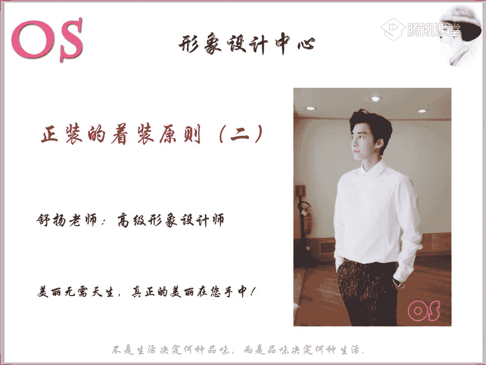

*   **商务衬衫**
    *   **颜色/图案**：以素色为主，也可有细条纹或暗格纹，图案不明显。
    *   **设计**：通常左侧有一个口袋，面料挺括精致。
    *   **场合**：配合职业西装，在商务、职场场合穿着。

*   **休闲衬衫**
    *   **设计**：设计感强，可能有明兜、明线、刺绣等装饰细节。
    *   **花色**：图案繁多，如大格纹、鲜艳花色等。
    *   **面料**：材质多样，如棉、麻等，不一定追求精细。
    *   **场合**：适合外穿，衣身较宽松，用于休闲场合。

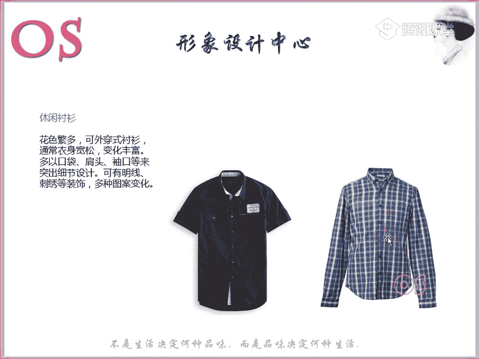

**关于衬衫下摆的穿着建议**：圆摆衬衫适合收入裤内，有助于优化身材比例。若选择外穿，衬衫长度不宜超过裤子拉链中部，以避免在视觉上显矮。

## 衬衫领型详解

了解衬衫大类后，我们深入看看衬衫的领型。不同的领型适应不同的风格与场合。

以下是十种常见衬衫领型及其特点：

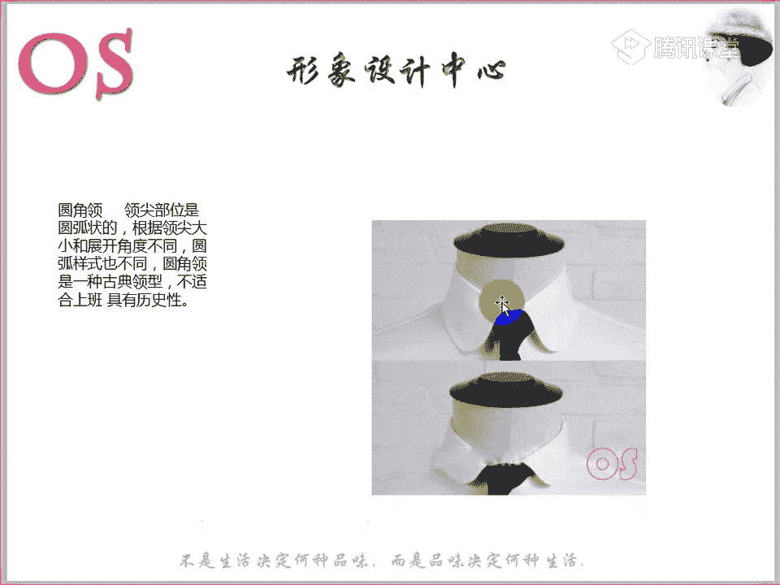

1.  **标准领**
    *   **特点**：领翼夹角在 **75度到90度** 之间，后领高度约3.5-4厘米。
    *   **风格**：最稳定、经典的领型，不受流行趋势和年龄限制，应用最广泛。

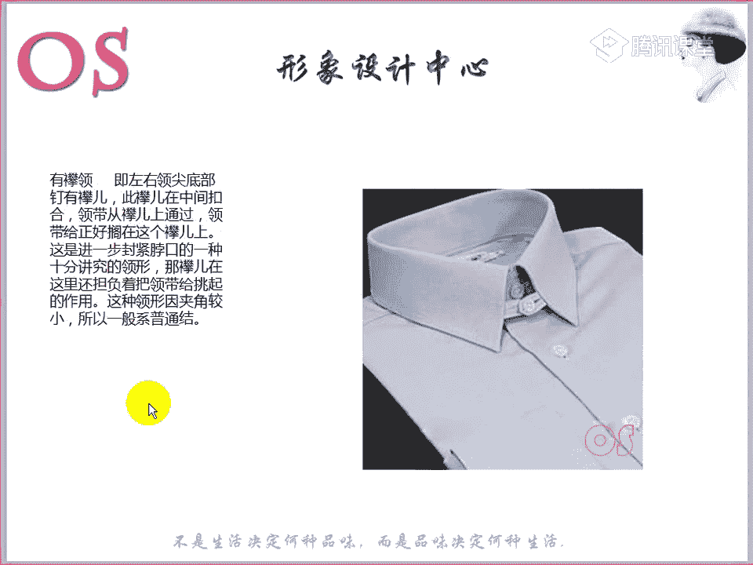

2.  **小方领**
    *   **特点**：领尖较短，领面较窄，呈现方方正正的感觉。
    *   **风格**：趋向年轻化，适合年轻人选择。

3.  **扣角领**
    *   **特点**：领尖上有一颗扣子。
    *   **风格**：休闲感强，常见于美式休闲品牌，严谨度不足，适合搭配休闲装。

4.  **宽角领（一字领/温莎领）**
    *   **特点**：领翼夹角很宽，在 **120度到180度** 之间。
    *   **风格**：需搭配较大的温莎结，个性鲜明，在意大利很受年轻人欢迎。

5.  **针孔领（夹洞领）**
    *   **特点**：领子中部有孔洞，可搭配领带夹固定领带。
    *   **风格**：非常正式，适合搭配正装，能保持领型挺括。

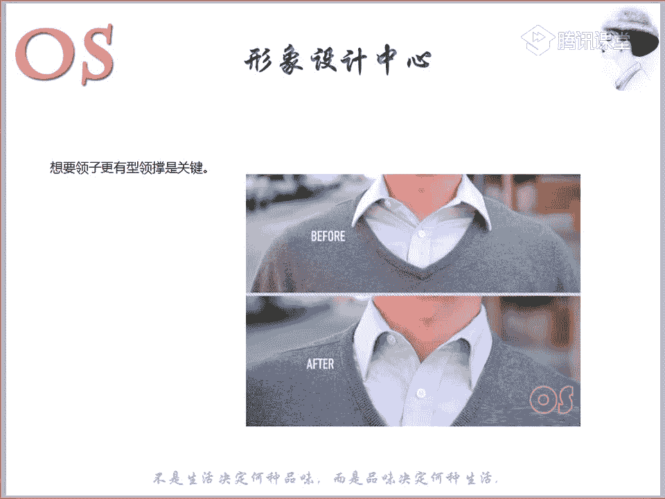

6.  **有襻领**
    *   **特点**：领尖底部有襻，扣合后作用类似针孔领。
    *   **风格**：正式，适合搭配正装，因夹角较小，适合系普通大小的领结。

7.  **尖角领**
    *   **特点**：领翼展开角度小于标准领，通常 **<90度**，领尖显得更修长尖锐。
    *   **风格**：比标准领更显精致。

8.  **圆角领**
    *   **特点**：领尖呈圆弧状。
    *   **风格**：古典领型，偏向休闲，不适合在正式商务场合搭配西装。

9.  **异形领**
    *   **特点**：领型独特，如翼领。
    *   **风格**：主要用于社交衬衫，搭配礼服和领结，不适合日常商务西装。

10. **立领**
    *   **特点**：只有领座，没有翻领，左右领片平行无叠门。
    *   **风格**：具有中式特色，温文尔雅，属于休闲款式，不适合搭配西装。

11. **牧师领（撞色领/异色领）**
    *   **特点**：领子与衣身、袖口颜色不同。
    *   **风格**：最初源于神职服饰，现在作为一种有设计感的领型存在。

## 领带图案的风格语言

领带是重要的配饰，其图案传递着不同的风格信号。

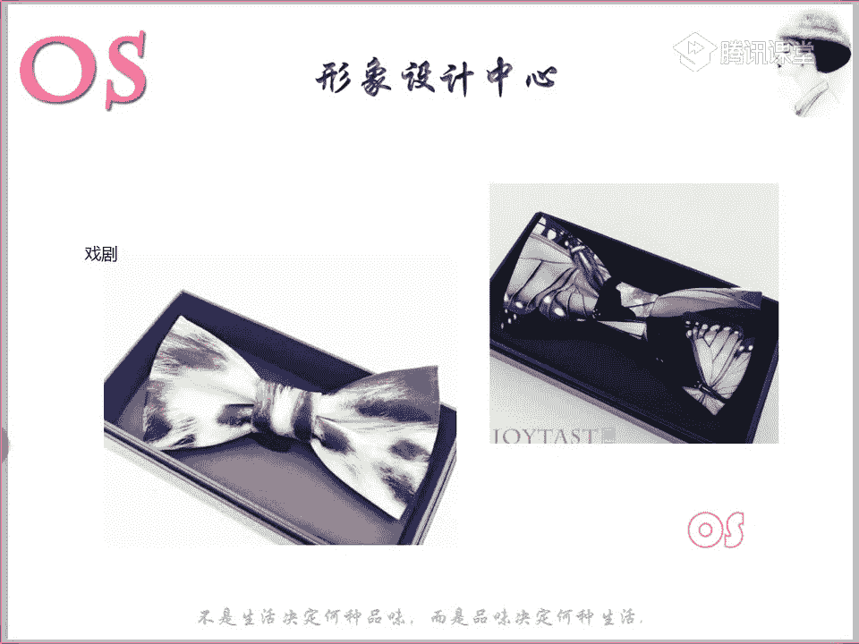

以下是主要领带图案分类及其含义：

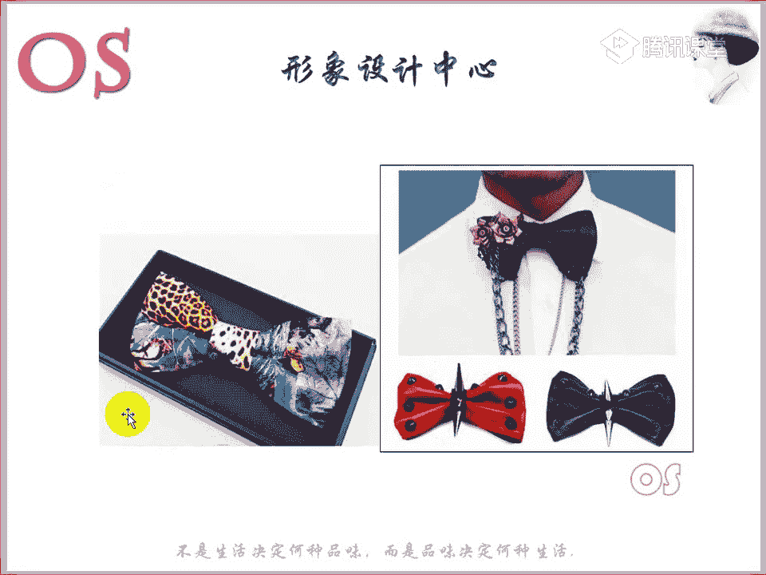

*   **小纹均匀**
    *   **特点**：图案小号、排列紧密均匀。
    *   **风格**：带来严谨感，最适合正式职场。

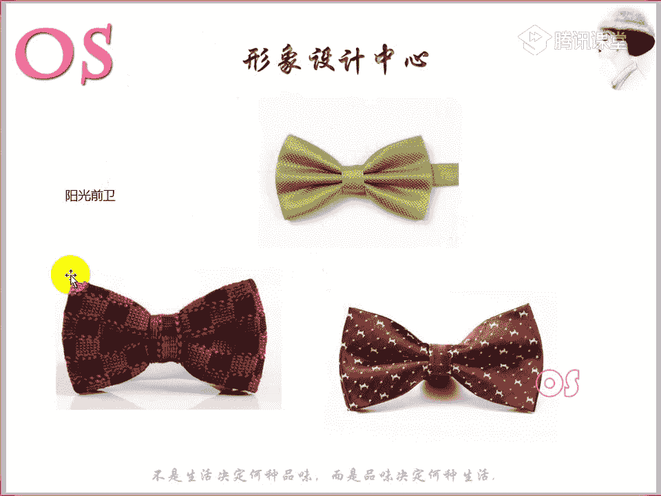

*   **小纹间隔**
    *   **特点**：图案小号，但图案间有分散感。
    *   **风格**：同样适合上班场合，严谨度略低于小纹均匀。

*   **大纹均匀**
    *   **特点**：图案较大（如拇指盖大小），排列紧密。
    *   **风格**：正式度与图案本身有关，总体显稳重，可用于一般职场。

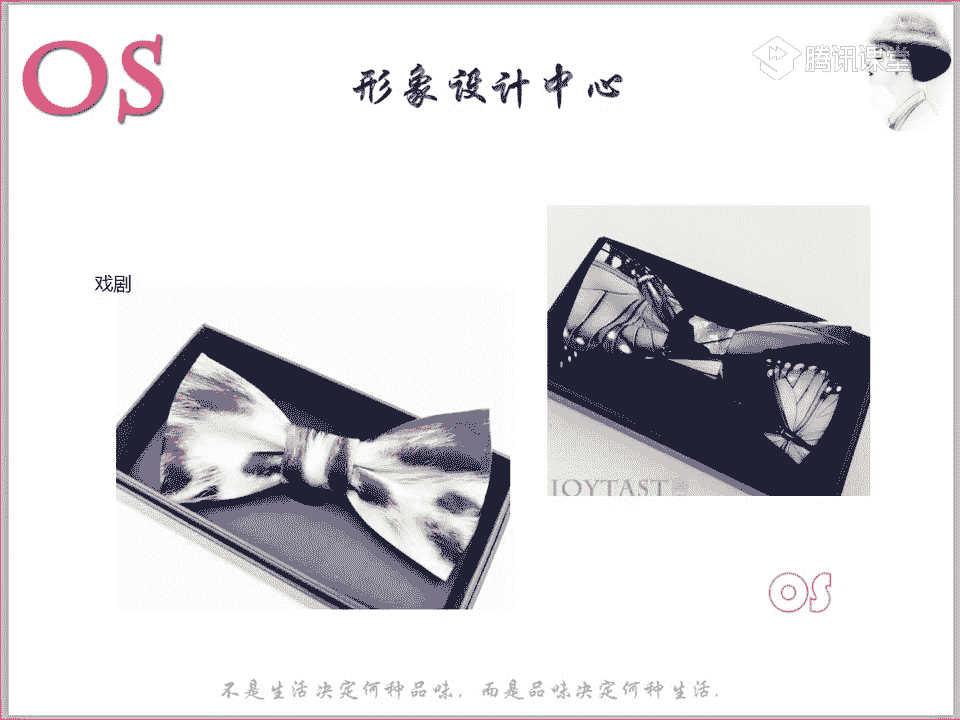

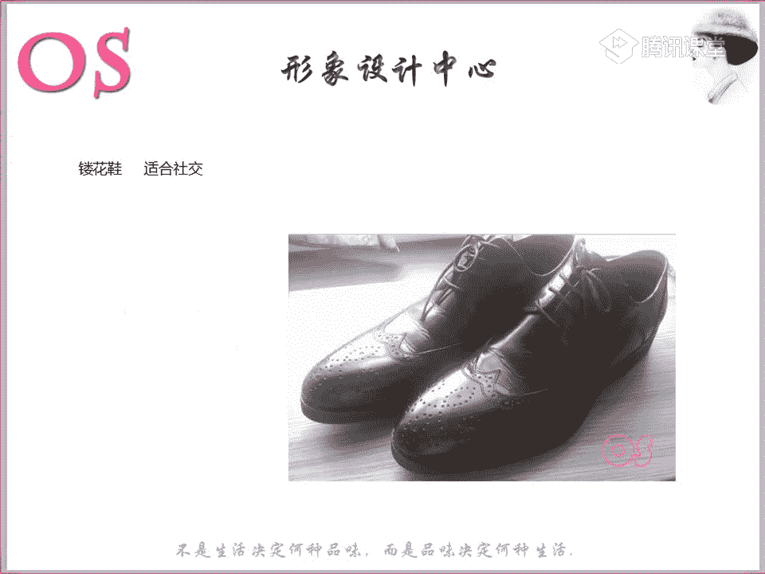

*   **斜条纹**
    *   **特点**：规则斜向条纹。
    *   **风格**：适合谈判职场或一般职场。

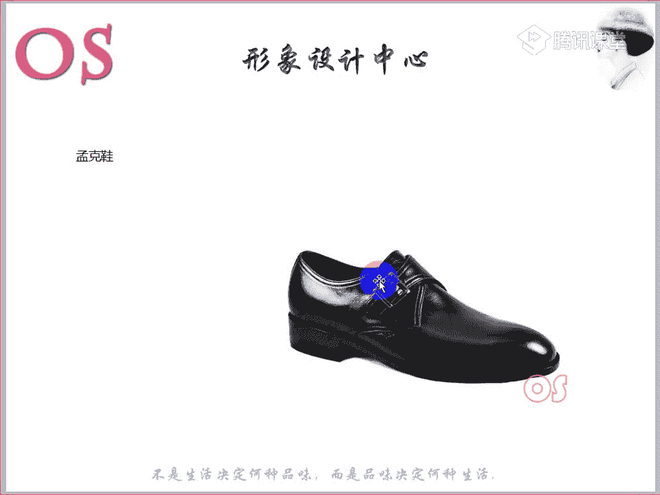

*   **无图案**
    *   **特点**：纯色，依靠色彩表达。
    *   **风格**：不适合严肃职场，适合社交场合或一般职场（搭配中性色西装）。

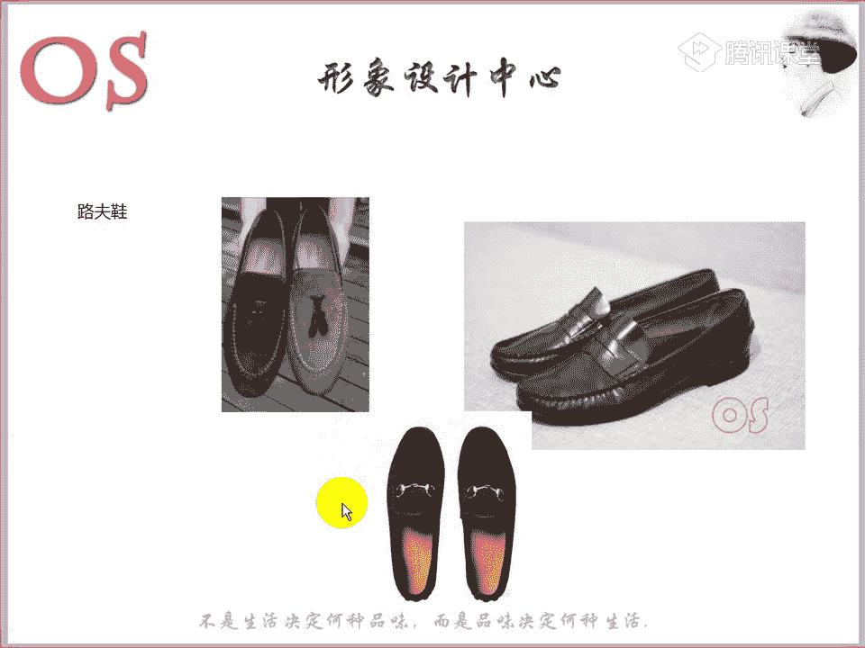

*   **自然图案**
    *   **特点**：图案抽象、模糊，带来“拙”感，不清晰。
    *   **风格**：适合年龄感较长、气质沉稳的男士。

*   **曲线图案**
    *   **特点**：图案由曲线构成，如花卉、涡纹。
    *   **风格**：减弱理性感，增添感性，适合曲线型风格男士或婚礼等场合。

*   **前卫图案**
    *   **特点**：设计个性，可能有铆钉、特殊拼接、醒目图案等。
    *   **风格**：适合时尚行业或追求个性的场合，约会时佩戴也很有趣。

## 正装鞋履指南

鞋子是整体着装的基石。以下是几种经典正装鞋款：

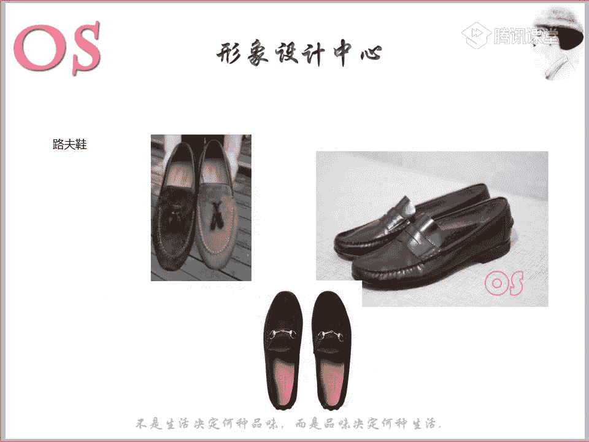

*   **牛津雕花鞋**：鞋面有精致雕花，最适合搭配礼服，用于高级社交场合。
*   **牛津素面鞋**：鞋面光滑无装饰，经典款式。
*   **横饰鞋**：鞋面有一道横向缝线装饰，适合搭配正式西装。
*   **孟克鞋**：采用扣带而非鞋带，有一扣、双扣等款式，风格复古。
*   **乐福鞋**：无鞋带的一脚蹬款式，由贵族拖鞋演变而来，休闲感较强。
*   **素面懒人鞋**：最简单的无装饰一脚蹬皮鞋，休闲属性明显。

## 风格与单品的对应关系

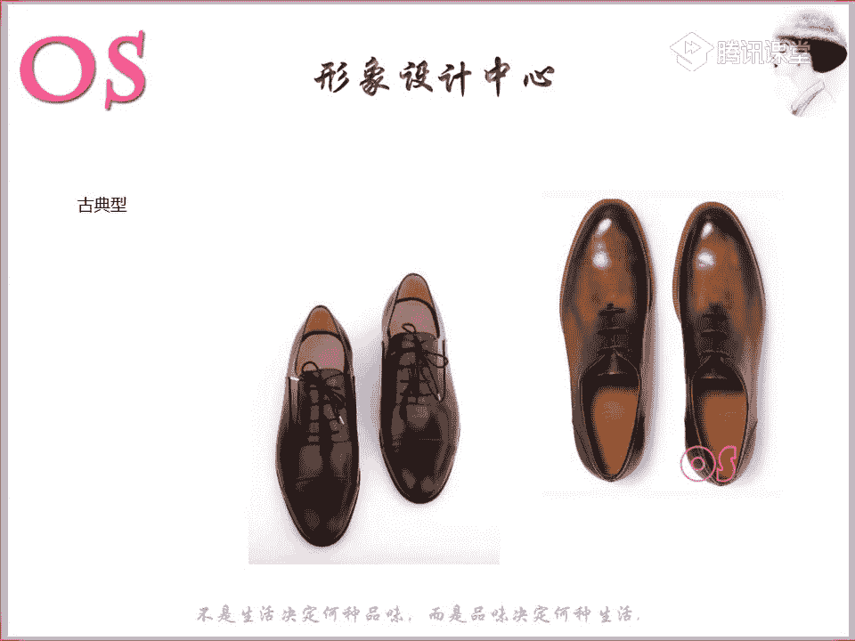

不同风格的人在选择衬衫领型、领带图案和鞋子时，有其内在的倾向性。

*   **戏剧型**：适合醒目、夸张、大气的领带/领结图案；鞋子可选择造型独特、摩登、装饰性强的款式。
*   **浪漫型**：适合华丽、曲线感强（如涡纹、花卉）的领带/领结；鞋子造型偏圆润，可有一定华贵装饰。
*   **新锐前卫型**：适合个性、时尚、光泽感强或造型独特的领带和鞋子。
*   **阳光前卫型**：适合色彩鲜明、有活力、带卡通或几何图案的领带；鞋子趋向年轻、有活力，可驾驭流行款。
*   **古典型**：适合规则、整齐、排列有序的领带图案；鞋子必须皮质精良、做工上乘、鞋型标准经典，设计可简约但不花哨。
*   **自然型**：适合图案模糊、有天然感（如格纹、条纹）的领带；鞋子应造型简洁大方，材质追求天然肌理感（如哑光皮、编织款），避免过度人工化设计。

## 实用穿着技巧

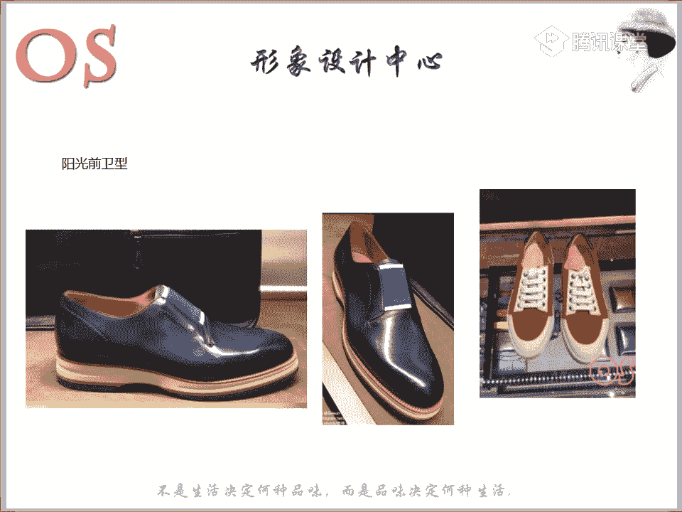

最后，分享两个提升衬衫穿着质感的小技巧：

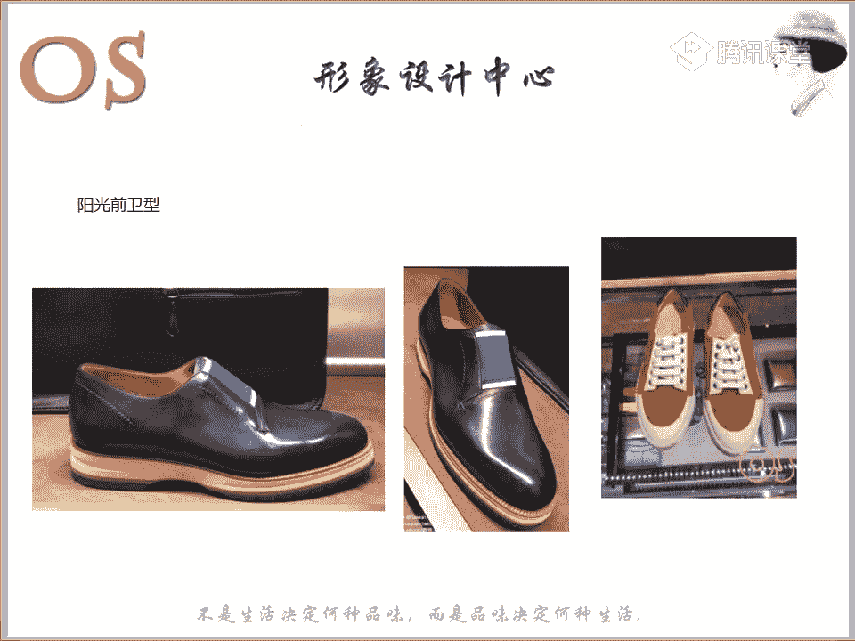

1.  **使用领撑**：许多衬衫后领下有隐藏插槽，用于放入领撑。它能在解开衬衫纽扣时，依然保持领子硬挺有型，使人看起来更精神。
2.  **内搭打底**：穿着衬衫时，尤其在夏季或易出汗的情况下，内搭一件同色系T恤或背心，可以有效避免汗渍透出或肌肤尴尬，保持全天整洁。

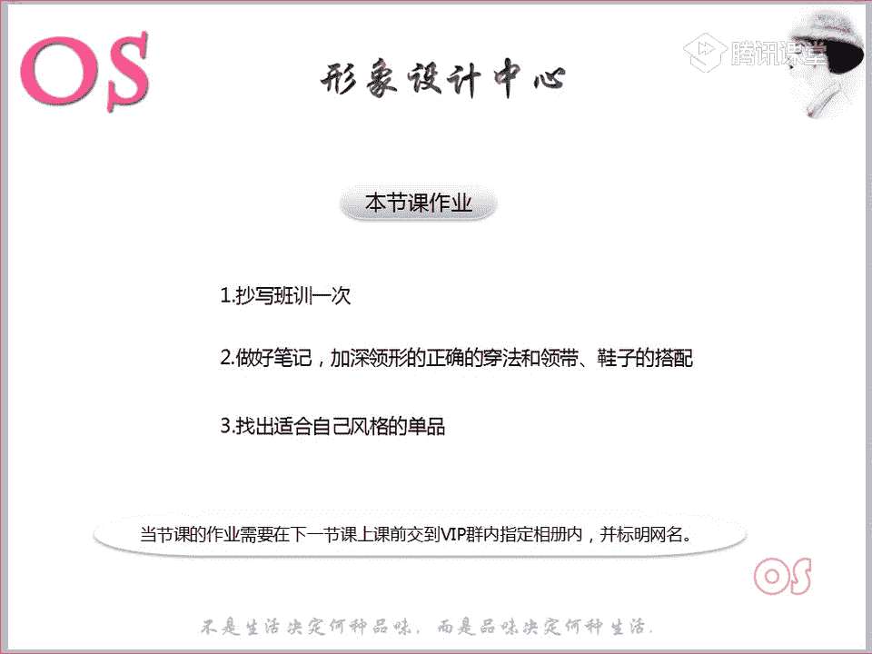

本节课中我们一起学习了男士正装着装中关于衬衫、领带和鞋子的核心知识。我们明确了三大衬衫类别的区别，认识了十余种领型的特征，解读了领带图案的风格语言，并了解了经典正装鞋款。关键在于将这些单品的选择与个人风格及具体场合相结合。请根据你的风格诊断结果，尝试寻找适合你的单品，加深理解。