# OS男士形象VIP班《形象课》：第7节、服装款式认知

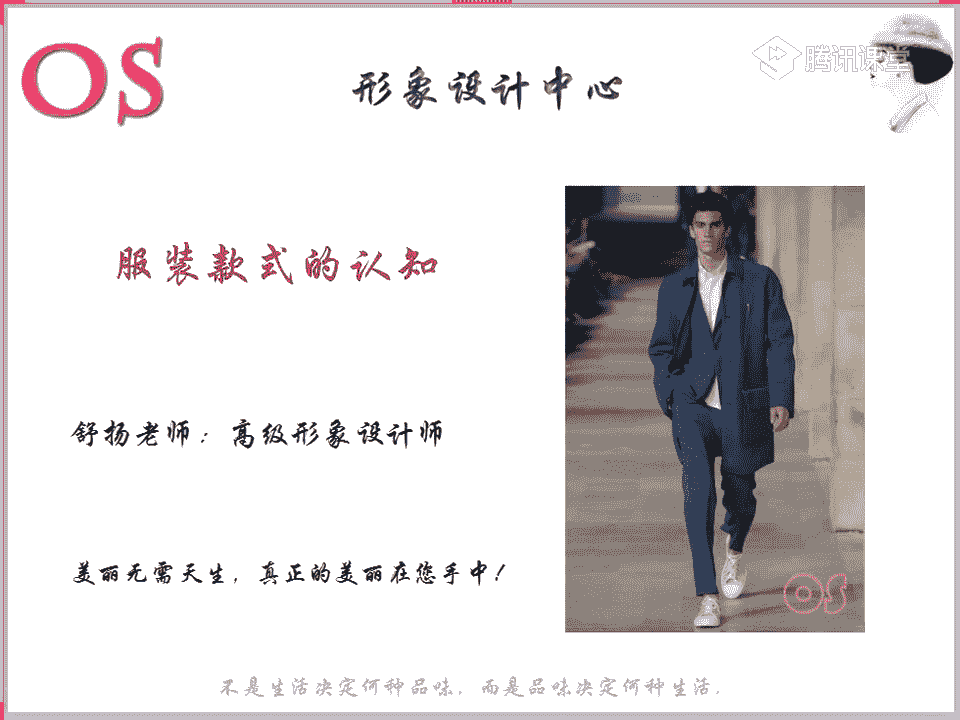

## 概述
在本节课中，我们将学习男士服装款式的系统认知。课程将从社交场合的礼服开始，逐步深入到日常外套、毛衣、马甲及裤装的分类与选择。核心目标是让大家掌握各类服装的基础款式名称、特点，并初步了解不同风格男士的适配选择，为后续深入学习服装风格打下坚实基础。

---

## 衔接与回顾：社交场合礼服
上一节我们学习了正装的穿法。本节开始，我们先补充社交场合的着装知识，特别是礼服。了解不同礼服的名称、特点与正确穿法至关重要，即使目前用不到，作为知识储备或为未来客户提供建议时都非常必要。

### 燕尾服
燕尾服是男性晚间（18点后）的第一盛装。因其后襟形似燕尾而得名。

*   **款式特点**：后襟为燕尾形。
*   **颜色与面料**：通常为黑色或深蓝色，采用精纺羊毛等毛料。
*   **搭配规范**：
    *   外套与裤子需同色同料。
    *   裤侧有缎面镶条。
    *   内搭白色翼领礼服衬衫。
    *   需佩戴白色领结。
    *   搭配U型胸衬的衬衫。
    *   配合白色或与外套同色的礼服背心（单排或双排扣）。
    *   左侧口袋装饰白色手帕。
    *   鞋子为黑色漆皮牛津鞋，搭配黑色袜子。
*   **适合场合**：晚间正式隆重的场合，如国家级庆典、婚礼、古典交际舞比赛、大型音乐会等。
*   **备注**：体型较胖者可不使用腰封，用马甲代替。

### 塔士多礼服（吸烟装）
塔士多礼服也属于晚间礼服。

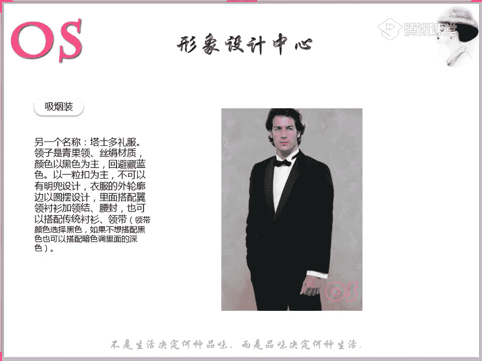

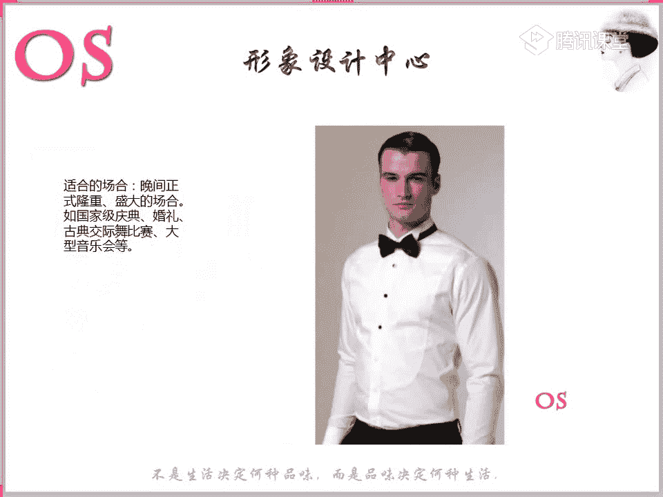

*   **款式特点**：领型为青果领（曲线型，无棱角）。
*   **细节**：
    *   领子采用丝缎材质，与衣身面料不同。
    *   颜色以黑色为主，避免藏蓝色。
    *   通常为单排一粒扣。
    *   无明兜设计。
    *   衣摆为圆摆。
*   **搭配**：可内搭翼领衬衫配领结，或普通衬衫配黑色领带（也可选用适合自己色彩季型的深色领带）。可搭配腰封。鞋子可选系带皮鞋、雕花鞋或镂空鞋。
*   **场合**：正式的宴会、舞会、剧院、颁奖典礼、鸡尾酒会等。
*   **日间变通**：在春季或夏季的白天场合，颜色可稍有变化。

### 晨礼服
晨礼服是白天（18点前）最正式的礼服。

*   **款式特点**：领型为戗驳领（领角尖锐有棱角）。前片与后片是连接在一起的，这与燕尾服不同。
*   **搭配**：可内搭翼领衬衫配领结，或普通衬衫配领带与马甲。通常搭配深灰色带竖条纹的裤子（称为“条纹裤”）。
*   **场合**：白天非常重视但未明确着装要求的场合，如授勋仪式、正式访问、午餐会、婚礼等。

### 董事套装
董事套装是白天较为简约的礼服，在现代社交场合中很常见。

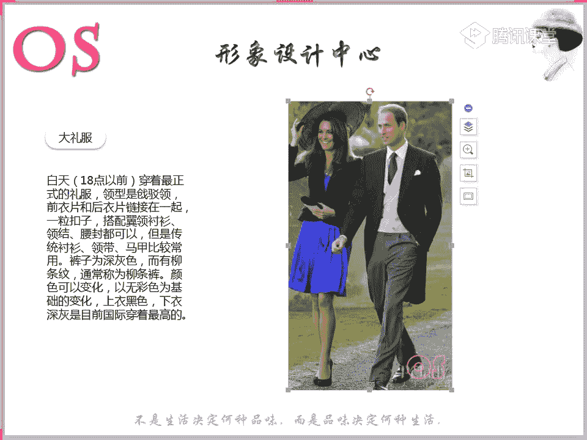

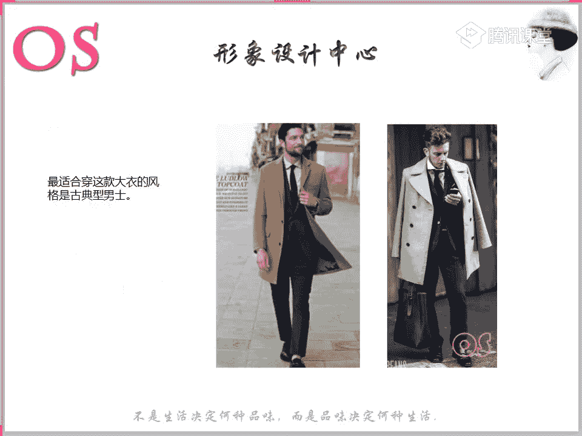

*   **特点**：形似普通西装，但更为华丽。领型变化较大（戗驳领、平驳领、青果领均可）。
*   **建议**：中国男士在需要穿着礼服的聚会场合，可用其代替。若用普通西装代替礼服，可选择窄版英式或欧式西装，但面料需增加光泽度以提升仪式感。

---

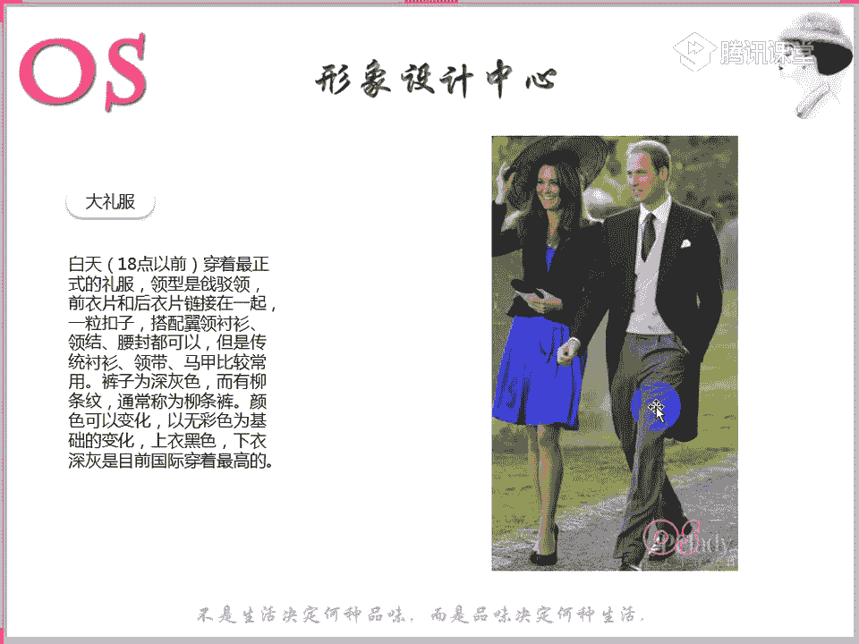

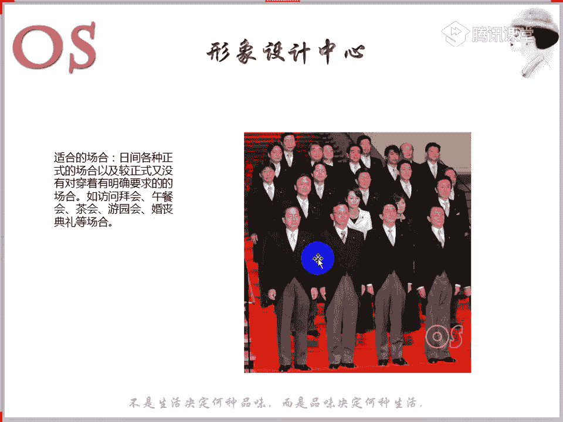

## 课程核心：服装款式认知
了解了礼服后，我们回归本节课的三个核心知识点：外套、毛衣和裤装。以下是各类基础款式的介绍。

### 一、外套
我们从大衣开始。

#### 1. 正式大衣
正式大衣可视作西装的加长版，用于搭配正装或礼服，在秋冬保暖且保持协调。

*   **特点**：西装版型的加长。
*   **领型选择**：可根据风格选择戗驳领（更时尚）或平驳领（更稳重）。
*   **最适合风格**：古典型男士。其他风格可通过调整材质、色彩来穿着。

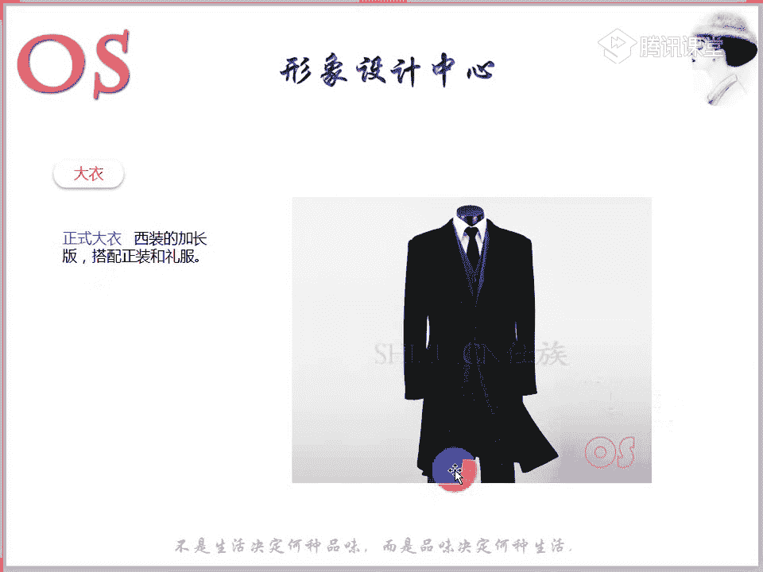

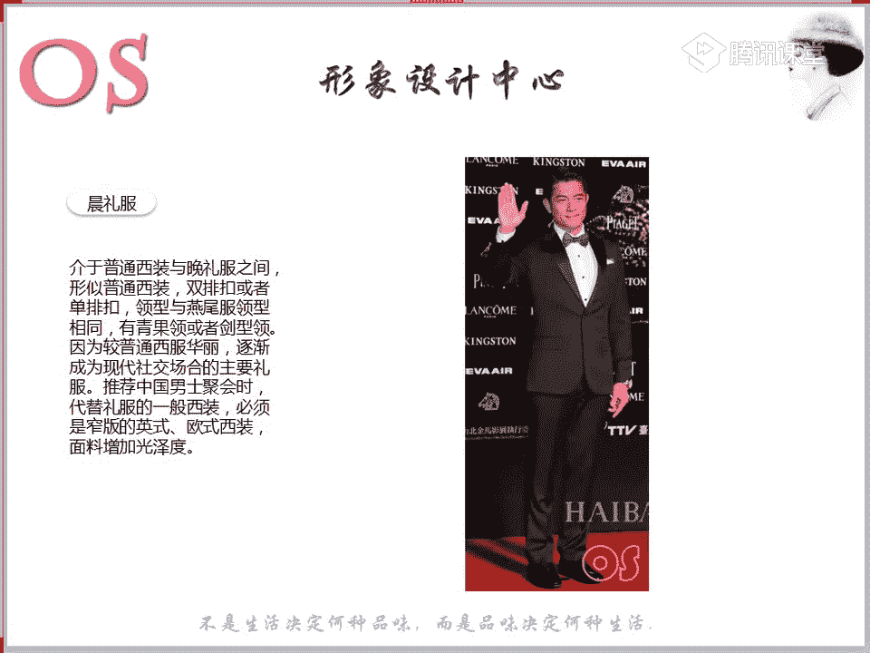

#### 2. 休闲大衣
休闲大衣种类较多，以下是几种基础款：

*   **猎装式大衣**
    *   **特点**：多口袋，整体宽松、休闲、方便。源于狩猎着装。
    *   **最适合风格**：自然型、戏剧型（量感偏大）。

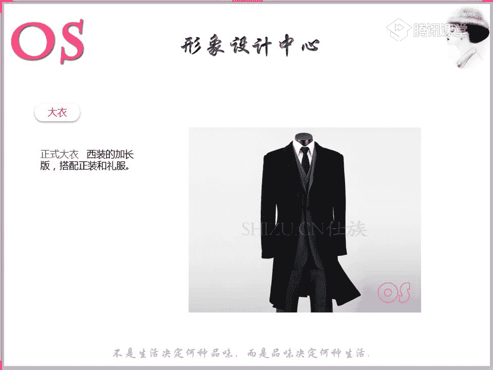

*   **军装式大衣**
    *   **特点**：多口袋、有腰带、肩部常有肩章。许多风衣由此演变而来。
    *   **最适合风格**：戏剧型、古典型。古典型选择时应避免过多明兜和胸衬。

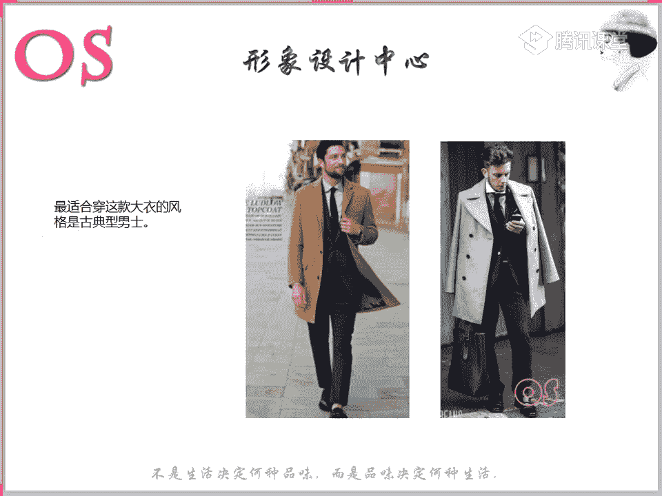

*   **马术式大衣**
    *   **特点**：最大亮点是领子常采用双色拼接，所有装饰感上移，显得年轻。
    *   **最适合风格**：浪漫型、古典型（古典型需选择短款、面料稍柔软的）。

*   **荷兰式大衣**
    *   **特点**：传统款带有帽领，以牛角扣为标志。面料常为呢子。
    *   **最适合风格**：自然型、阳光前卫型（阳光前卫型需选择短小版本）。

*   **短款大衣**
    *   **概述**：常见的短款大衣也属于此类。
    *   **风格适配**：前卫型或浪漫型男士可选左图类款式；古典型男士则应选右图类更精致、色彩沉稳的款式。**材质和色彩是影响风格适配的关键**。

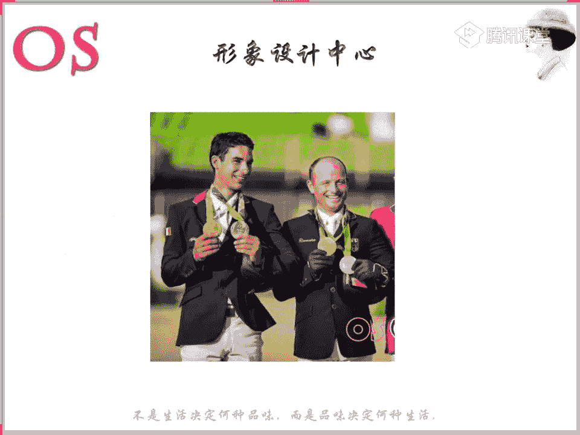

#### 3. 夹克
夹克指衣身短、袖长、休闲感强的上衣。

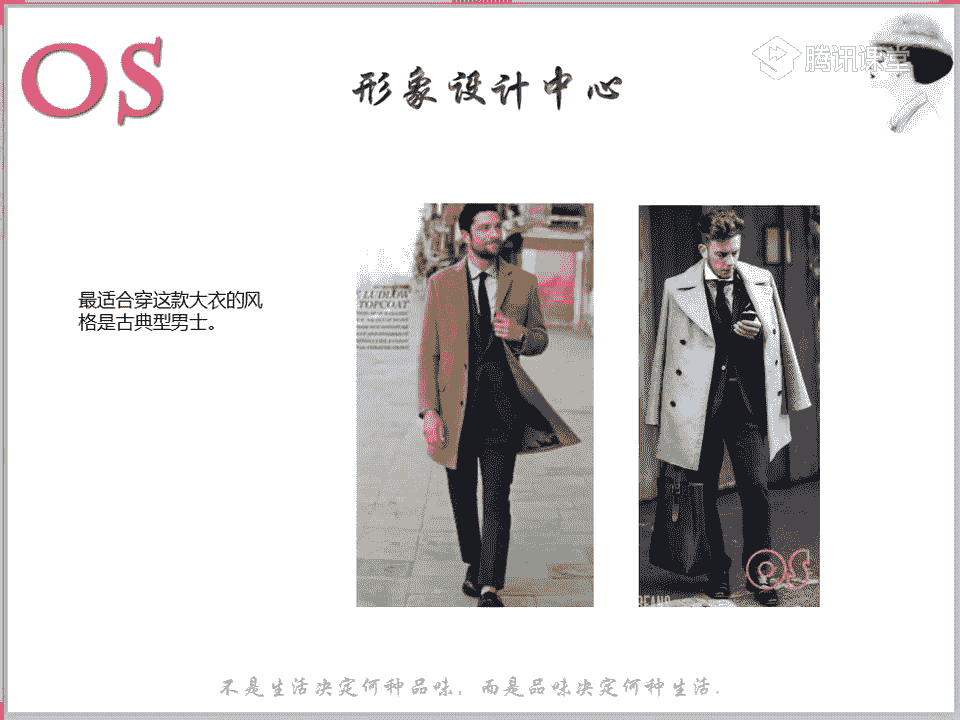

*   **双色棒球夹克**
    *   **特点**：休闲运动感强。
    *   **最适合风格**：新锐前卫型、古典型（古典型需选择精良款式）。阳光前卫型穿着也好看。
    *   **注意**：需与宽松的飞行员夹克（O型廓形）区分。

*   **商务便装夹克**
    *   **特点**：为出差等场合设计，代替西装。颜色深、材质硬挺、装饰细节少。
    *   **场合适配**：所有因工作需要的男士都可穿着。
    *   **风格偏好**：戏剧型、浪漫型、古典型最为适合。

*   **高尔夫夹克**
    *   **特点**：运动场合穿着，与商务便装类似但颜色可浅。
    *   **风格适配**：自然型、古典型。浅色、设计简洁的款式也可用于商务差旅。

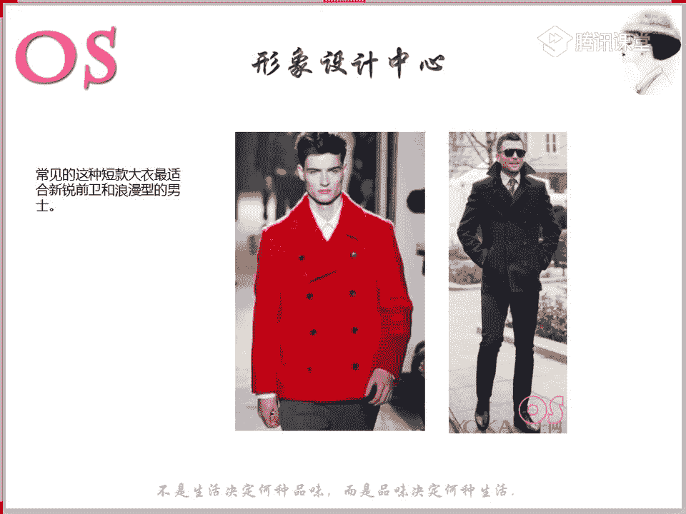

*   **艾森豪威尔夹克**
    *   **特点**：由美军夹克演变，多明兜。
    *   **风格适配**：戏剧型、新锐前卫型、自然型、阳光前卫型均可。古典型需选择精良款式。

*   **飞行员夹克**
    *   **特点**：多为暗兜，材质常含皮革或金属感，带有光泽度，整体前卫时尚。
    *   **最适合风格**：前卫型男士。

*   **海军式夹克**
    *   **特点**：设计重点在肩部和领子。
    *   **最适合风格**：浪漫型、戏剧型、自然型（在休闲场合）。

*   **连帽夹克**
    *   **特点**：带有帽子。
    *   **最适合风格**：阳光前卫型、自然型（年轻时期）。古典型应少穿（帽子破坏轮廓清晰度）。

*   **伊顿式夹克**
    *   **特点**：类似短小西装，带有学院风，显年轻活力。适用于休闲场合，正式场合不够严谨。
    *   **风格适配**：具有年轻感的风格。

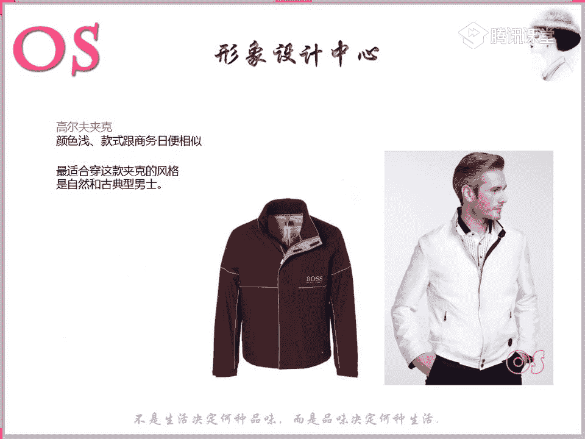

*   **运动式夹克**
    *   **特点**：为运动场合设计。
    *   **最适合风格**：自然型。若用于休闲场合，需在色彩和图案上提升时尚感。

### 二、毛衣
以下是几种毛衣款式的介绍。

*   **渔夫式毛衣**
    *   **特点**：图案丰富（如麻花编织），休闲感强，带有感性色彩。
    *   **最适合风格**：自然型、浪漫型。浪漫型需选择面料柔软的款式。

*   **斯堪的纳维亚式毛衣**
    *   **特点**：设计重点围绕肩部展开。
    *   **最适合风格**：戏剧型男士。

*   **开衫毛衣**
    *   **风格适配**：
        *   古典型：质地挺实。
        *   浪漫型：质地柔软。
        *   自然型：厚实粗犷。
        *   阳光前卫型：图案丰富、款式修身，可选有光泽或硬挺材质。
    *   **慎选风格**：戏剧型、新锐前卫型少穿。

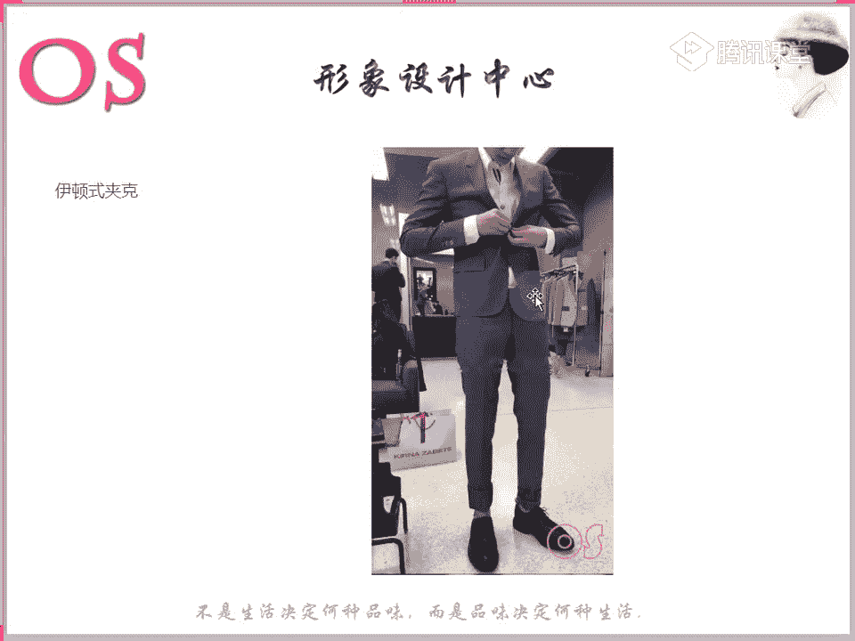

*   **领型建议**
    *   **前卫型**：适合V领毛衣。
    *   **浪漫型**：适合曲线感的法式领型。
    *   **新锐前卫型**：应注重图案和色彩的鲜明、对比感，选择动感的图案。

### 三、马甲
马甲的选择需注意款式。

*   **正式款马甲**：适合与西装搭配。最适合古典型、戏剧型、浪漫型男士。
*   **休闲款马甲**：更适合年轻、自然型的男士。其他风格需结合图案、色彩和材质选择。

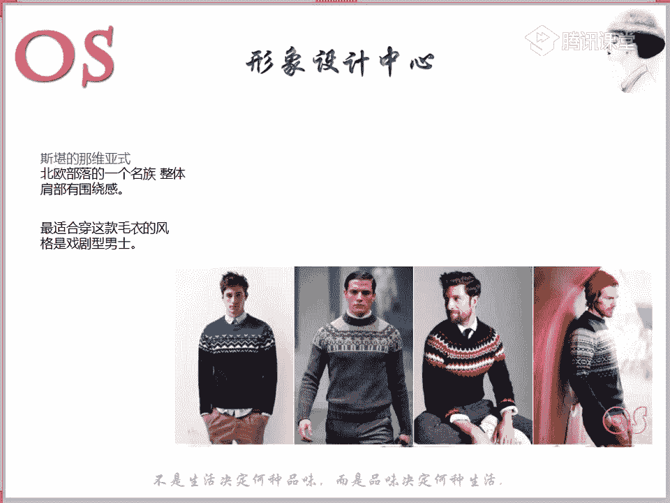

### 四、裤装
裤型对整体风格影响很大。

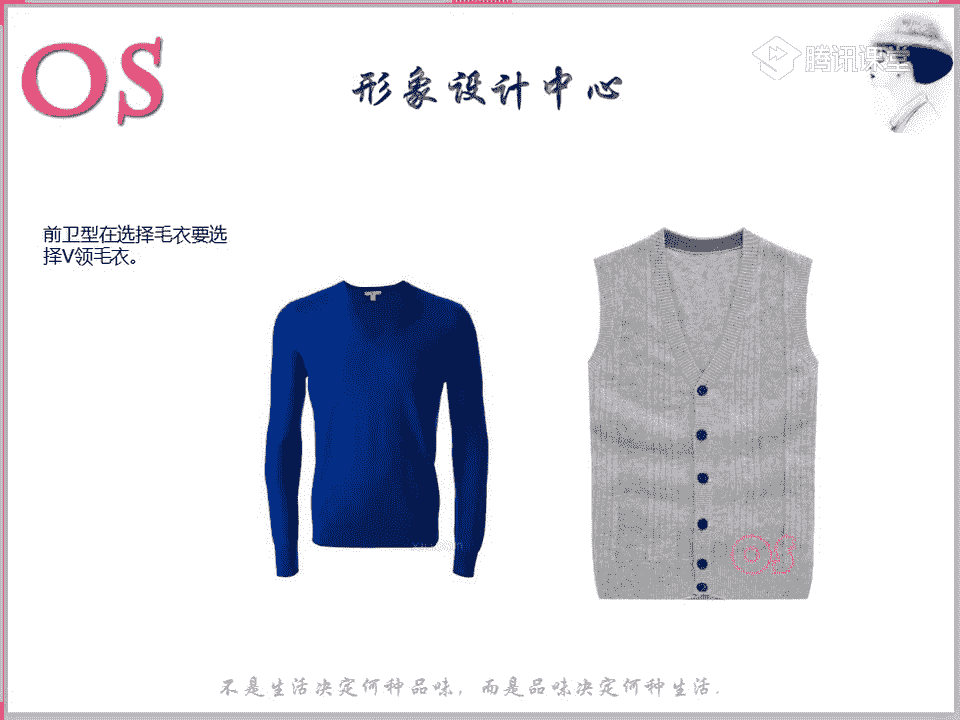

*   **锥形裤**
    *   **特点**：男士裤装中最正式的裤型，上宽下窄。
    *   **适配**：各风格男士基本都适合。
    *   **注意**：戏剧型男士因量感大，应少选（显下身量感小）。腿短或个子不高的男士搭配尖头鞋，有显高效果。

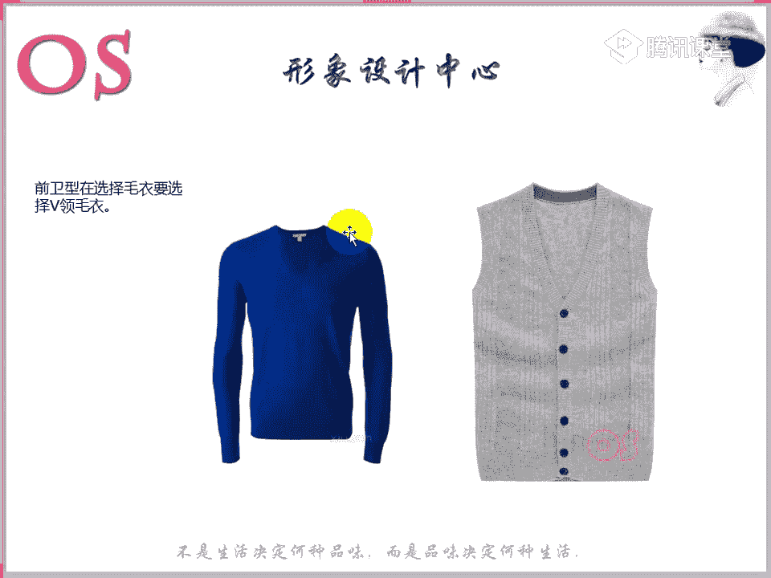

*   **喇叭裤**
    *   **特点**：裤脚微喇。
    *   **最适合风格**：戏剧型、浪漫型。戏剧型应选择合体款式，避免过于宽松。

*   **直筒裤**
    *   **特点**：裤腿上下宽度一致。
    *   **适配**：六大风格男士都适合。
    *   **注意**：新锐/阳光前卫型及个子小的男士应选择合体的小直筒。裤长不宜过长，盖过鞋帮即可。

*   **五分裤**
    *   **特点**：男士最正式的短裤。
    *   **适配**：各风格男士可根据自身调整选择。
    *   **体型建议**：腹部肥大者可考虑选择有省道（裤中线）的裤子。

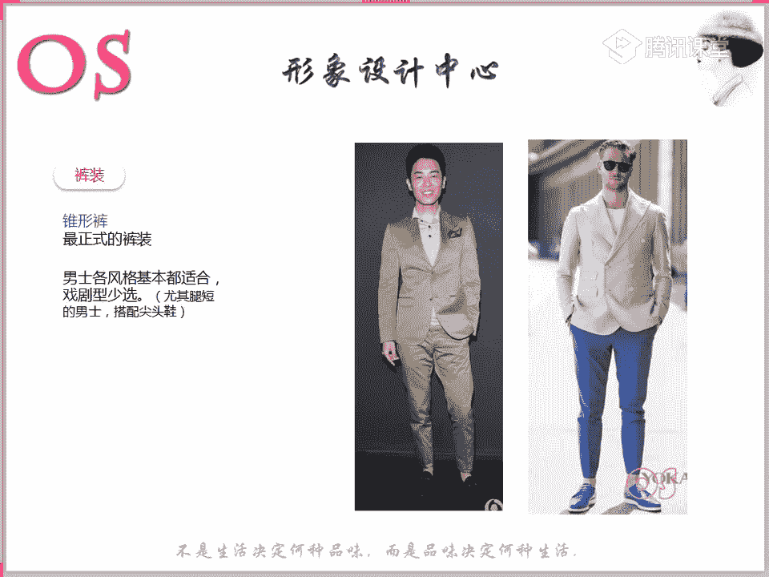

*   **抽褶裤（工装裤）**
    *   **特点**：有抽褶、多口袋，面料休闲。
    *   **最适合风格**：自然型。阳光前卫型也可选择量感偏小的款式。古典型等因不够精良应少穿。

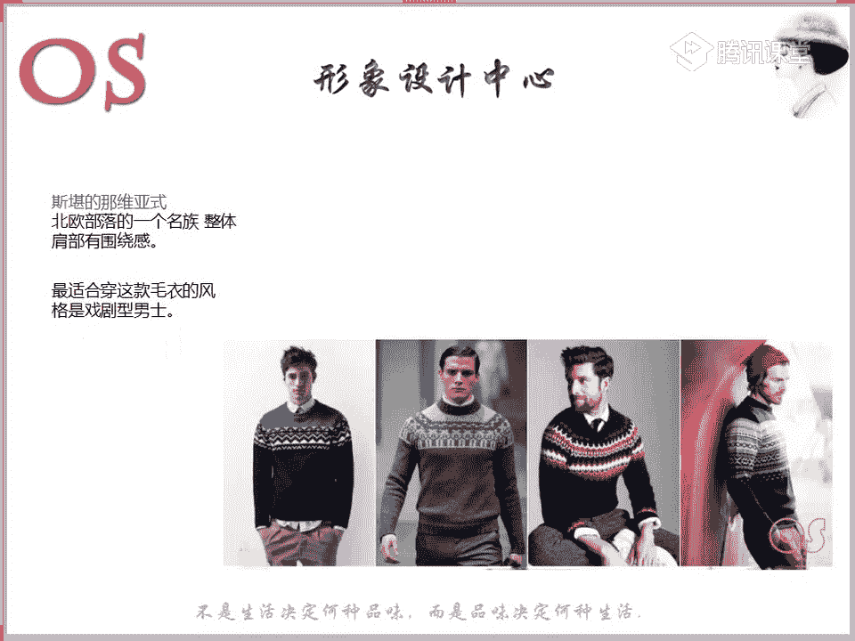

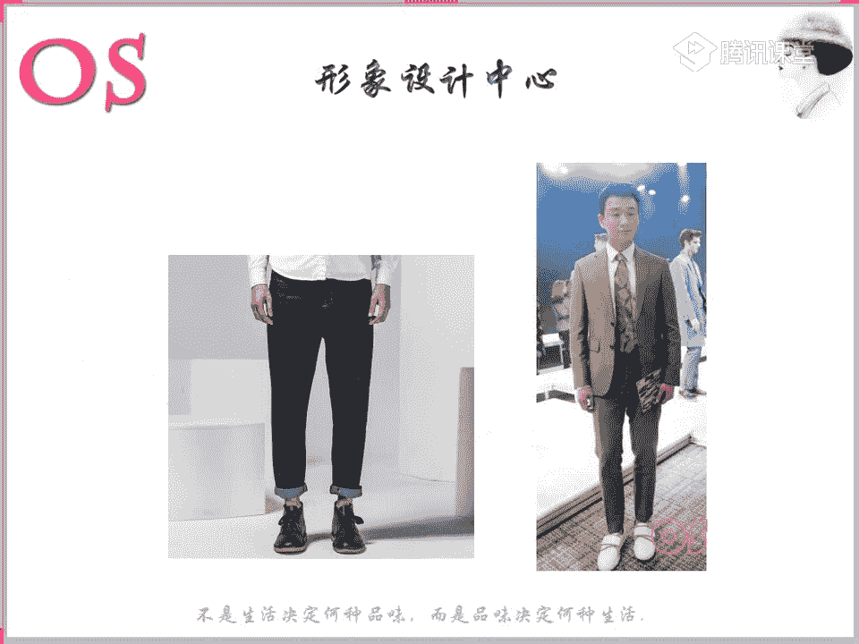

*   **翻边裤**
    *   **特点**：裤脚有设计好的翻边，常由两种面料拼接。
    *   **缺点**：易显腿短。
    *   **最适合风格**：自然型、戏剧型。
    *   **注意**：腿短者慎选。古典型切勿穿七分裤。

*   **运动裤**
    *   **建议**：仅限运动场合穿着。戏剧型、古典型、浪漫型等男士在其他场合应尽量避免。

*   **裤缝细节**
    *   **单边缝 vs 双边缝**：单边缝更精细，双边缝更粗犷。
    *   **要求**：古典型、浪漫型、新锐前卫型男士应选择单边缝的裤子。

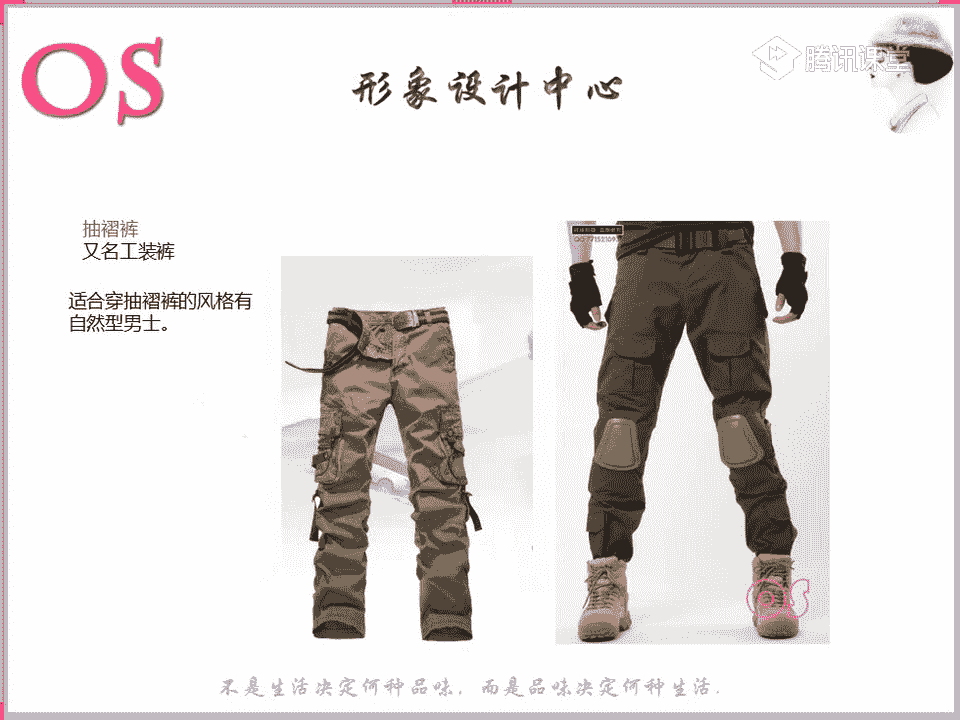

---

## 总结与作业
本节课我们一起学习了男士服装的基础款式认知。我们从社交礼服入手，系统了解了外套（大衣、夹克）、毛衣、马甲和裤装的主要类别、特点及初步的风格适配方向。

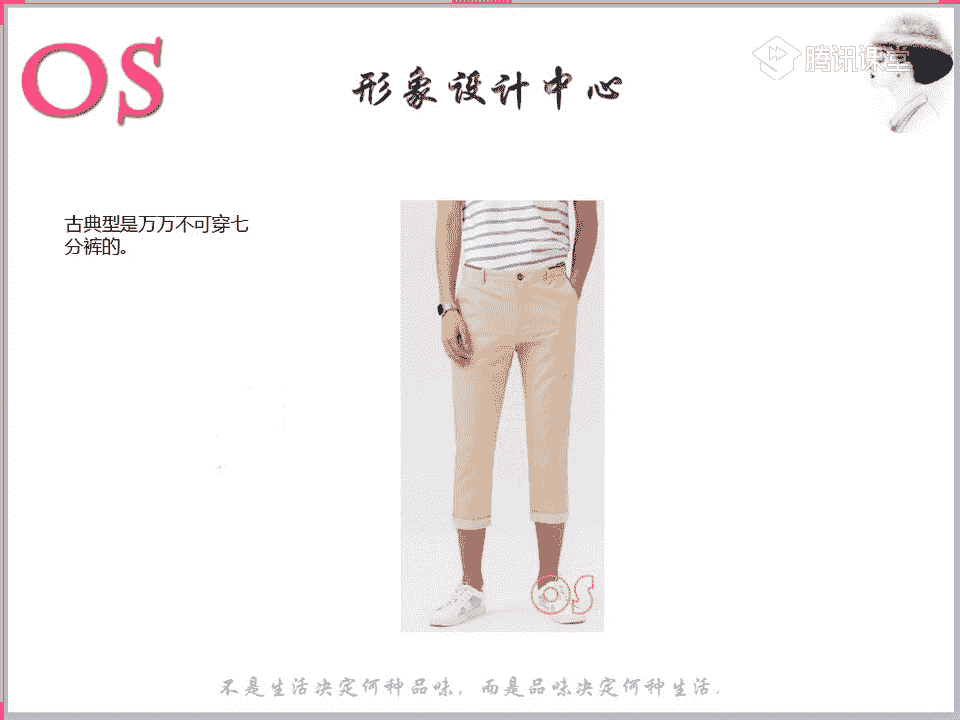

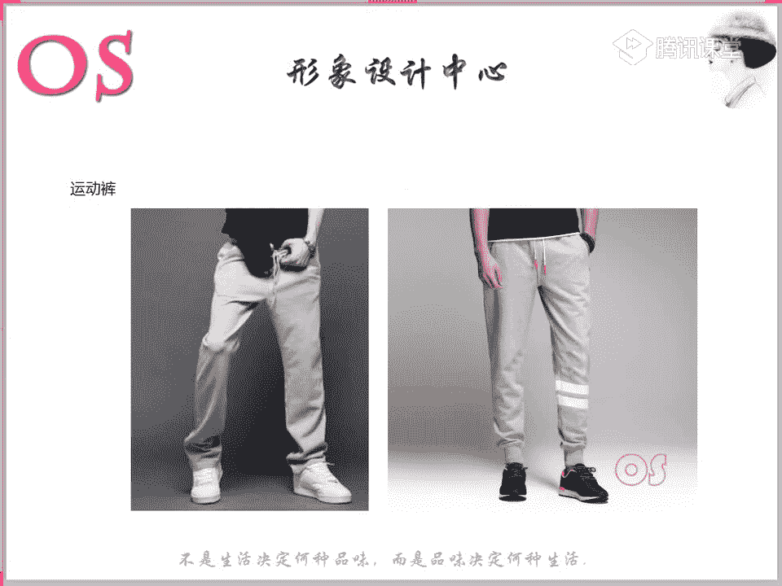

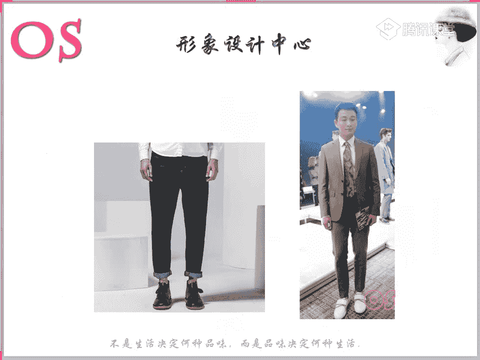

**核心要义**：今天所学的款式是“基础模板”。现代服装多在此基础上通过**材质、色彩、图案和细节设计**进行演变，从而适配不同风格。掌握基础，才能灵活运用。

### 本节课作业
1.  **抄写班训**。
2.  **整理课堂笔记**，巩固知识。
3.  **实践找款**：根据自己或模特的诊断风格，寻找适合的服装单品图片。**不必拘泥于课图中不够时尚的示例，关键在于理解款式基础，并寻找在现代设计下仍符合该款式核心特点且适合目标风格的时尚单品**。可以尝试搭配完整的一套造型。

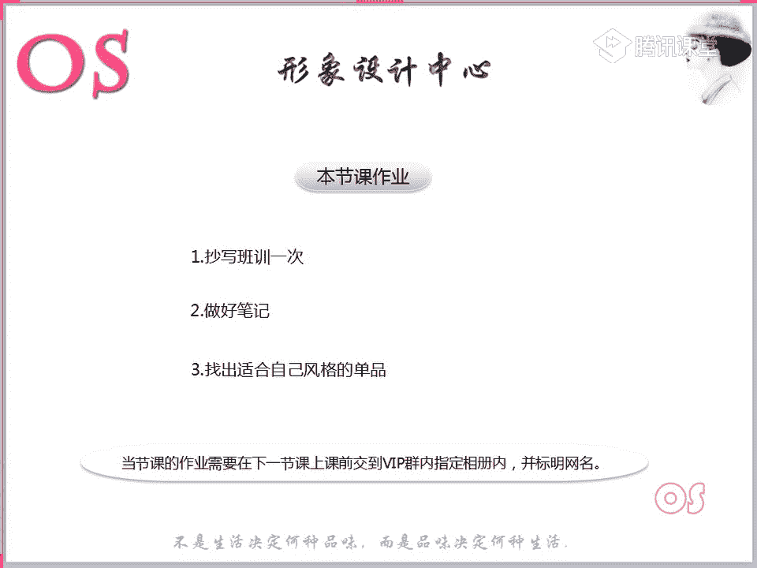

如在作业中遇到疑问，可随时以图片形式咨询老师。请按时提交作业，以便老师了解大家的学习情况。

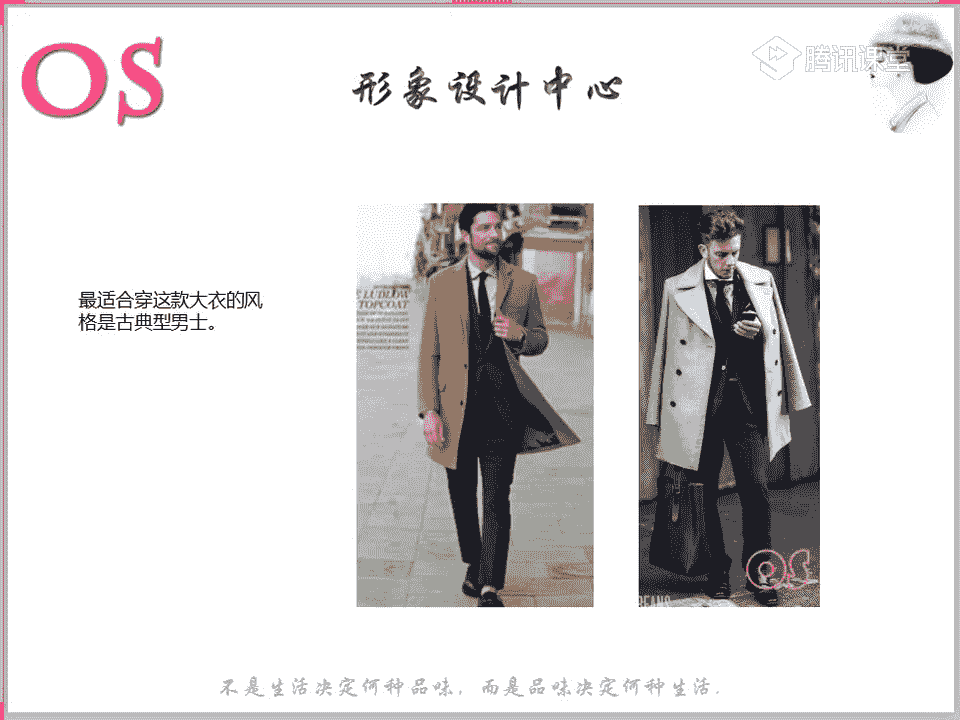

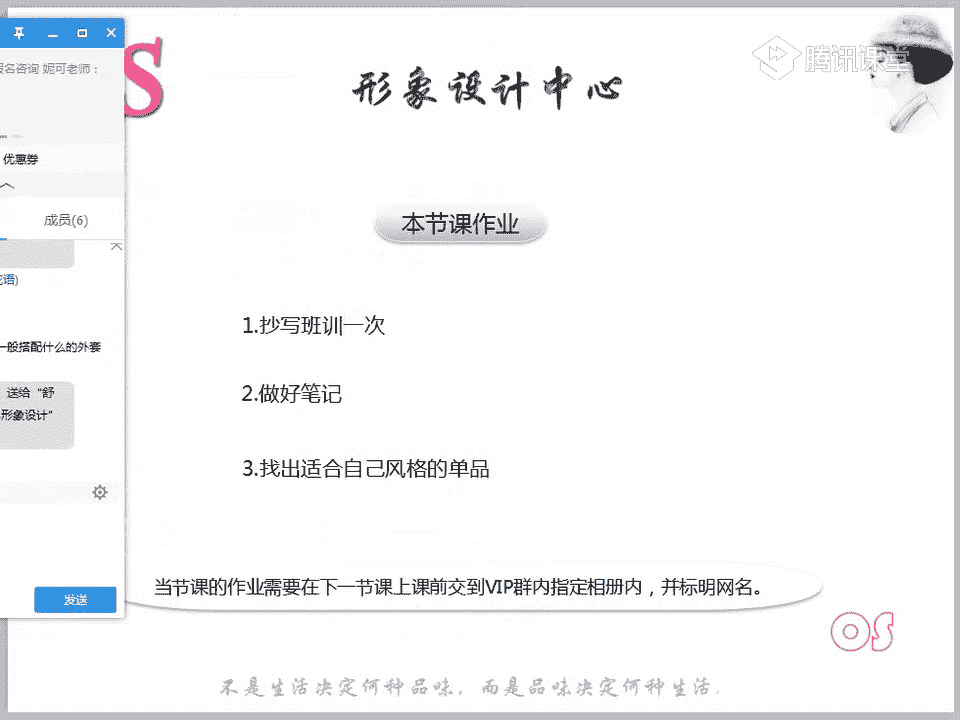

---
**备注**：文中所有 `` 为原内容中的图片引用标记，予以保留。