# 03OS男士形象VIP班《形象课》：第8节：配饰搭配技巧（一）🎩

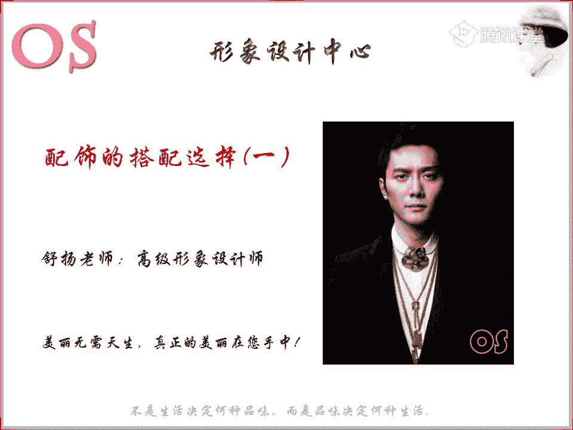

在本节课中，我们将要学习男士配饰搭配的基础知识，重点聚焦于围巾、帽子和手表的选择。我们将根据不同男士风格，详细解析如何挑选合适的配饰，以提升整体造型的精致度与和谐感。

---

## 课程概述与作业提醒

在正式上课前，需要提醒作业提交事宜。从第六节到第七节课，提交作业的同学较少。如果因过年期间事务耽搁，也请尽早补交作业。

今天是我们第八节配饰搭配课程。在今天和下一节课中，我们将系统学习男士各类配饰，包括帽子、围巾、项链、手环、胸针以及手表等。

本节课的重点是学习不同风格男士应如何选择配饰。具体内容包括：
1.  围巾的分类与选择。
2.  帽子的分类。
3.  手表的选择（涉及不同刻度、表盘大小与厚薄）。
4.  胸针的搭配认知。

本节课的要求是希望大家熟记接下来讲解的重点内容。再次强调，请尽早补交作业。

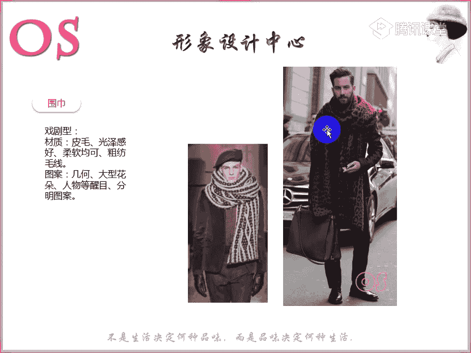

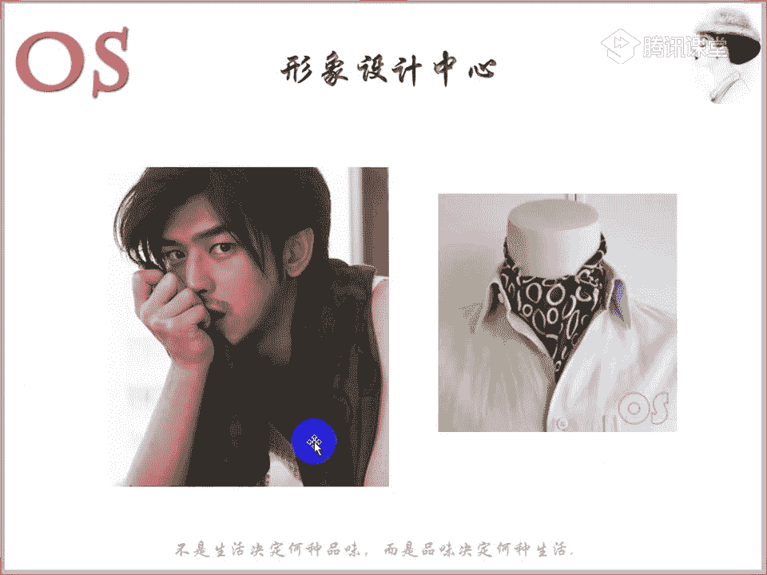

---

## 围巾的选择与搭配

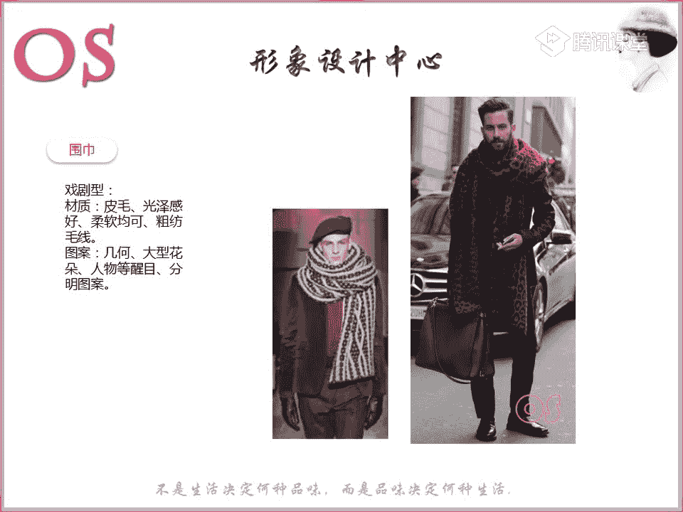

现在正式进入今天的学习重点。第一个知识点是关于围巾的选择。围巾的材质和种类非常丰富，图案也多种多样。本节课的重点是从搭配和风格认知的角度来学习。

首先，我们从量感最大的戏剧风格开始讲解。

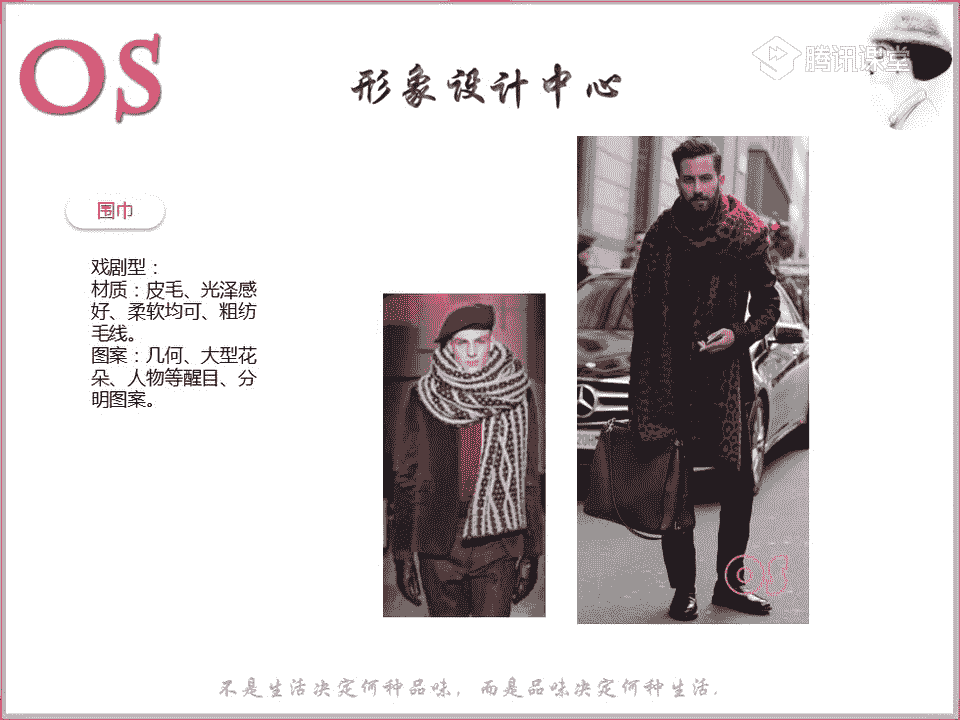

### 戏剧风格

戏剧风格男士在选择围巾时，首先要注意材质。

以下是适合戏剧风格的围巾材质关键词：
*   **皮草/皮毛**：最具代表性，非常符合戏剧风格的大气感。
*   **光泽感好**：材质的光泽度要好，但不一定需要非常强烈。
*   **柔软面料**：质地柔软的面料也可以选择。
*   **粗纺毛线**：质感粗犷，能体现戏剧风格的量感。

图案方面，戏剧风格需要醒目、大气的图案。

以下是适合戏剧风格的围巾图案要点：
*   **图案要大、要醒目**：避免过于小气的图案。
*   **几何图案**：可以选择。
*   **大型花朵/叶子**：非常适合。
*   **醒目的人物图案**：色彩鲜明的也可以。
*   **图案边界清晰**：图案与底色之间要分明，不能模糊。这与自然风格形成对比。

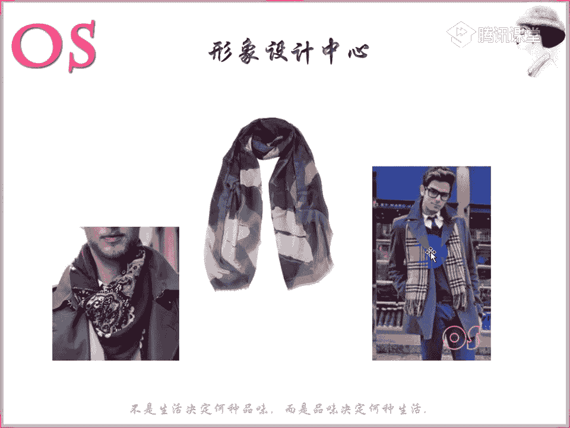

总而言之，戏剧型男士的装扮不能过于平凡、老实或小气。整体造型应能传达出醒目、装饰感强、图案大气的印象。即使是选择条纹，也要选择大气的款式。

### 自然风格

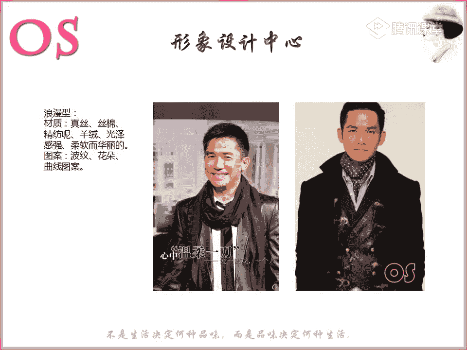

自然风格的材质与戏剧风格有相通之处（同属大量感），但也有明显区别。

以下是适合自然风格的围巾材质关键词：
*   **光泽感弱**：避免选择有光泽的面料，如真丝。
*   **麻质**：天然感强。
*   **粗毛呢/绒毛**：质地天然。
*   **天然编织感**：具有手工或天然纹理的面料。

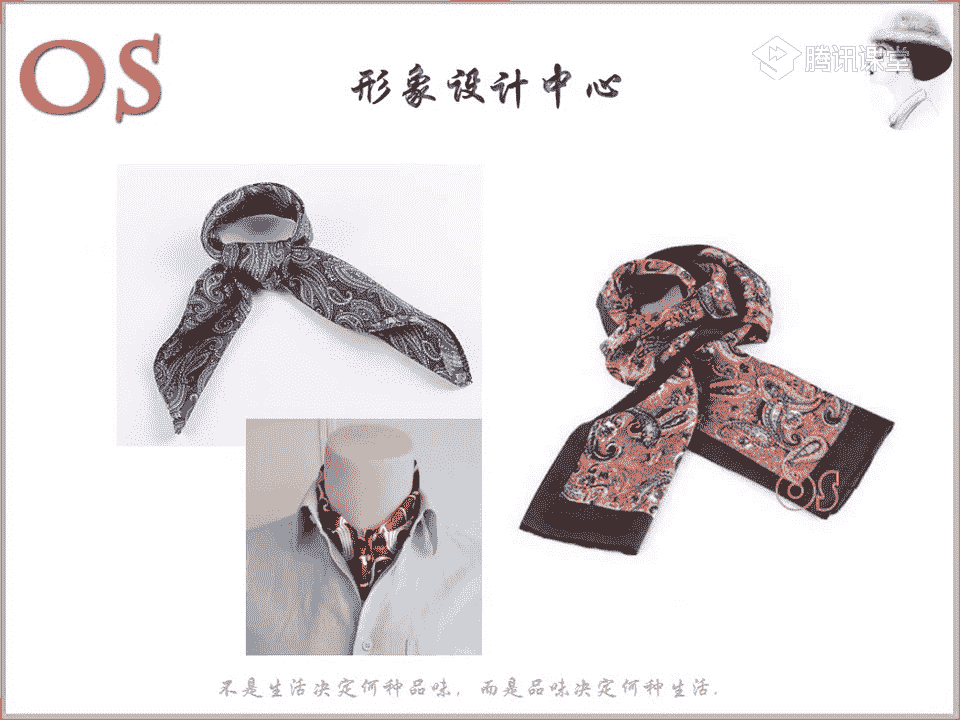

图案方面，自然风格的选择范围很广。

以下是适合自然风格的围巾图案：
*   **民族图案**
*   **条纹/方格**：自然风格穿条纹和方格衣服很好看，围巾同理。
*   **植物纹/自然风光/泼墨**
*   **几何图案**

自然风格需要回避过于华丽或特别标新立异的服饰风格。避免搭配时尚感过强、特色过于尖锐的配饰。

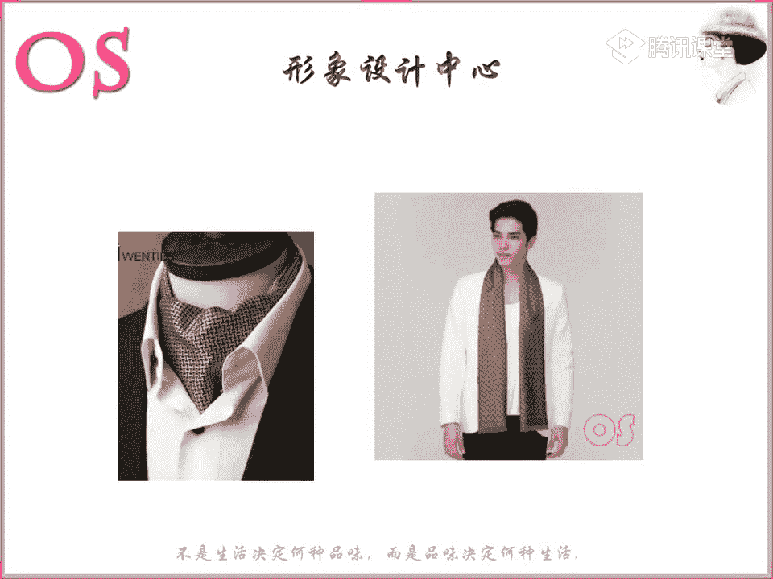

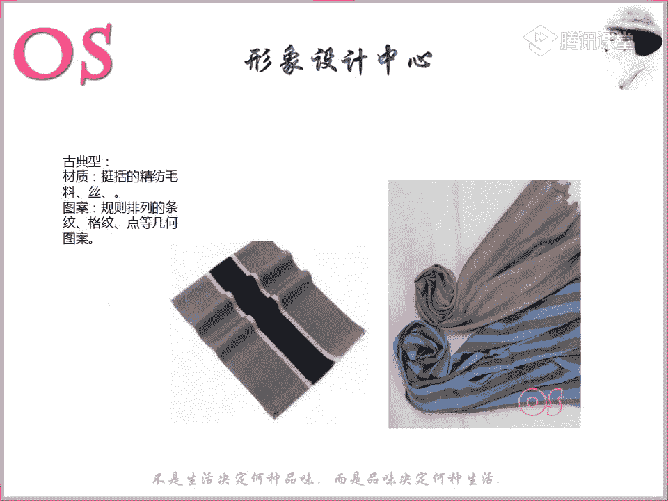

### 浪漫风格

浪漫型男士（中偏大量感）在材质上要体现感性。

以下是适合浪漫风格的围巾材质关键词：
*   **真丝**：最能表现感性。
*   **丝棉/精纺毛呢/羊绒**：光泽感强、柔软而华丽的面料。

图案方面，浪漫风格是曲线风格，因此图案也应偏向曲线。

以下是适合浪漫风格的围巾图案：
*   **波点**
*   **花朵**
*   **曲线图案**

浪漫风格需要回避过于随意、粗糙或另类个性的服饰风格。自然风格的材质如果给浪漫型人使用，效果会不理想。围巾的整体质感应体现上层、精致的关键词。

### 古典风格

古典风格在材质上要求挺括、精致。

以下是适合古典风格的围巾材质关键词：
*   **挺括**
*   **精纺毛呢**
*   **真丝**：质感好的真丝。

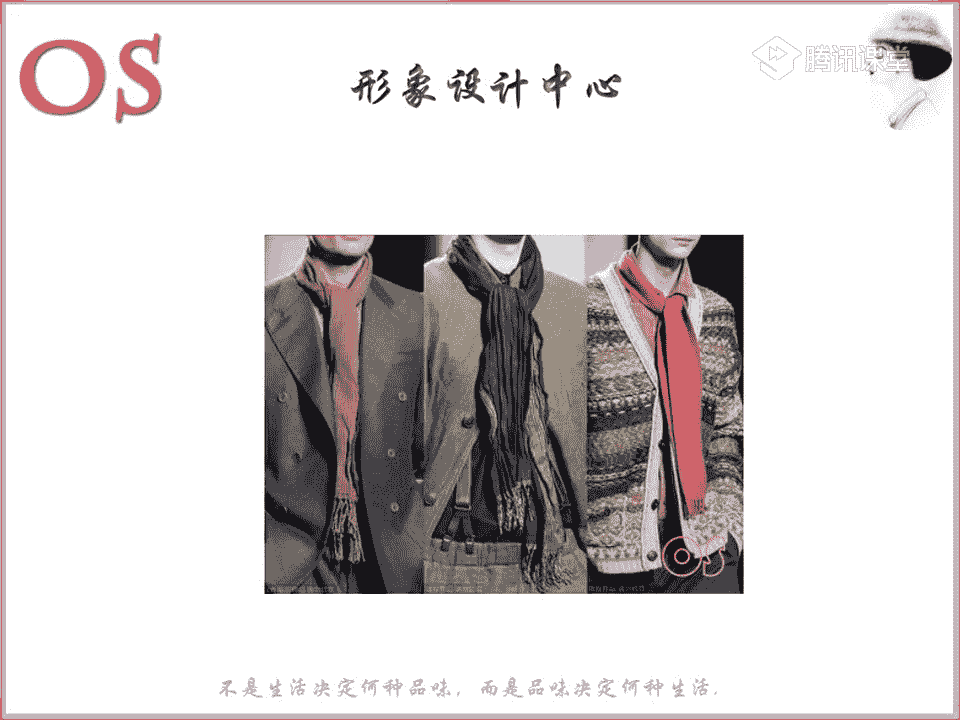

图案方面，越简单、越有规则越好。

以下是适合古典风格的围巾图案要点：
*   **简单、简洁**
*   **排列有规矩、有规则**
*   **格纹/条纹/圆点等几何图案**：非常符合，但必须简单且有规则。

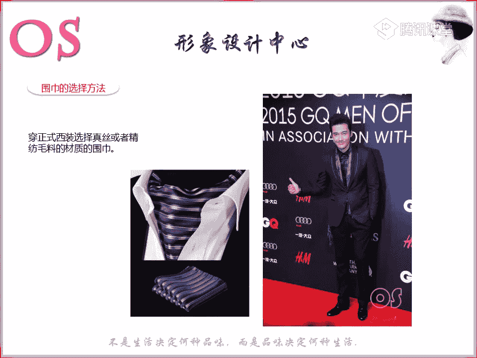

古典风格需要回避过于个性、另类、夸张醒目、随意粗糙的装扮风格。这一原则同样适用于服饰选择。

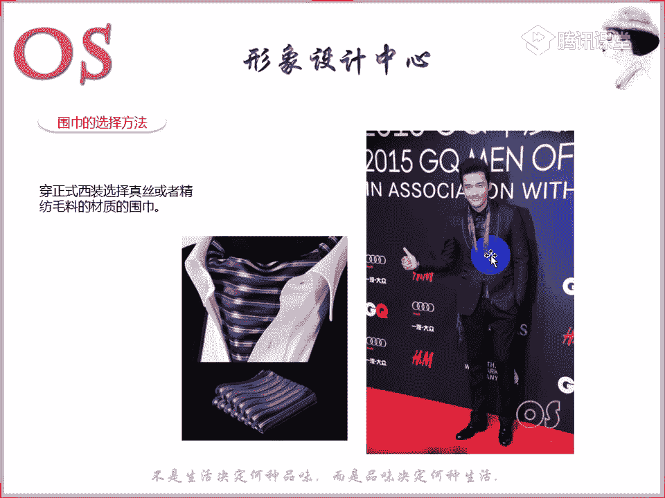

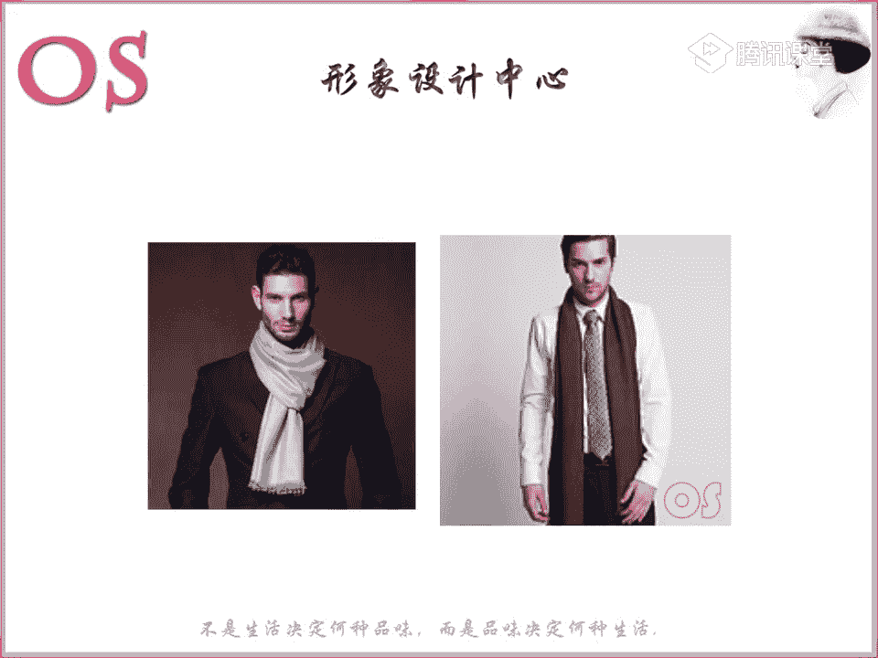

选择围巾时，材质和图案必须结合考虑。

### 新锐前卫风格

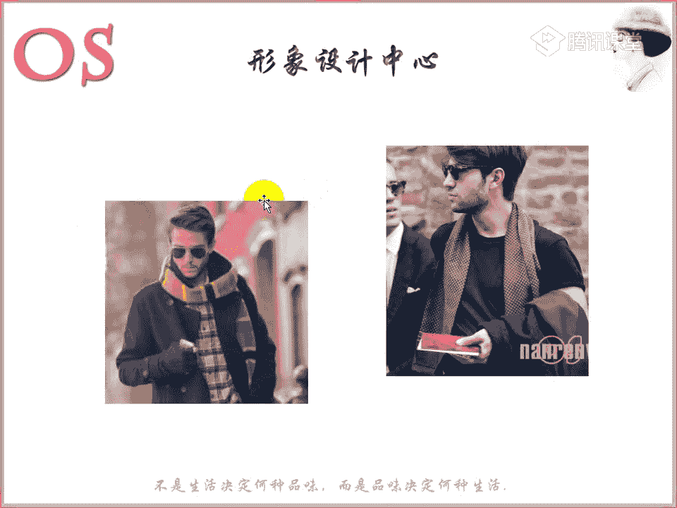

新锐前卫风格的材质要闪光、硬挺。

以下是适合新锐前卫风格的围巾材质关键词：
*   **闪光**
*   **硬挺**
*   **化纤材质**：非常适合。

图案方面，可以选择不规则、个性、抽象的图案。

以下是适合新锐前卫风格的围巾图案：
*   **不规则的条纹/格纹**
*   **怪异的图案**
*   **个性抽象的图案**

新锐前卫型通常能驾驭纯度较高的色彩。因此，可以在色彩、材质和图案上大胆结合。需要回避平淡、中庸、不流行或过于华丽、正统的服饰风格。观察其围巾量感，通常偏小，更趋向年轻化。

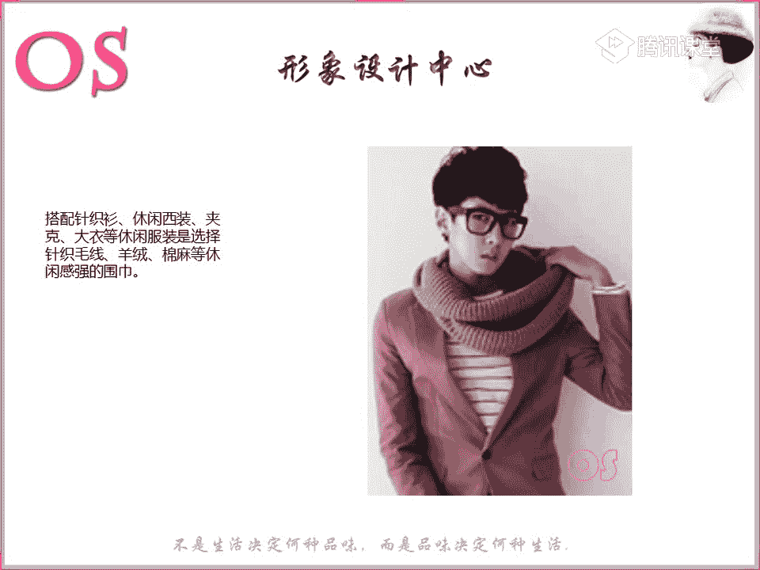

### 阳光前卫风格

阳光前卫风格在材质上可以选择毛料或有一定光泽度、硬挺的材质。

以下是适合阳光前卫风格的围巾材质关键词：
*   **毛料/毛类**
*   **闪光/硬挺**：可以适当选择有光泽度的。

图案方面，要选择个性且带有些许可爱感的图案。

以下是适合阳光前卫风格的围巾图案：
*   **个性的几何图形**
*   **抽象图案**

阳光前卫型像大男孩，平易近人且充满活力，同时带点酷感。这类围巾给年轻的自然风格男士佩戴也可以。同样需要回避中庸、平淡、不流行或正统的装束。

以上就是不同风格选择围巾的要点。大家需要记住自己风格对应的围巾关键词，并从展示的图片中感受其风格特点。

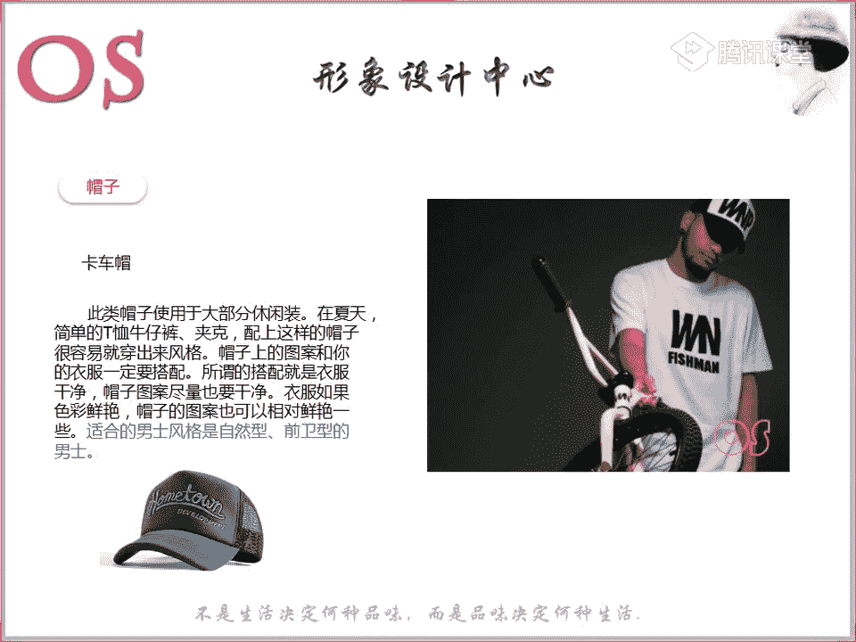

---

## 围巾的搭配方法

上一节我们介绍了不同风格如何选择围巾，本节我们来看看围巾的具体搭配方法。

### 搭配正式西装

当穿着正式西装时，可以选择以下材质的围巾与之搭配：
*   **真丝**
*   **精纺毛料**（如精纺羊绒）

在正式场合，男士需要体现庄重感。因此，即使某些风格不完全适合真丝，也可以通过调整色泽来改善。场合需求优先于个人风格。

### 搭配休闲服饰

当搭配针织衫、休闲西装、夹克或大衣等休闲服饰时，可以选择以下材质的围巾：
*   **针织毛线**
*   **羊绒/棉麻**等休闲感强的材质

此时，围巾的选择可以完全遵循个人风格原则。围巾是增加整体造型层次感的优秀单品。建议大家根据自己的风格，在图案和材质上多备几条。

**核心要点**：男士着装非常注重场合。在必须搭配正装的场合，可以暂时跳出风格限制，优先满足场合要求。在休闲场合，则完全可以按照个人风格选择围巾。

---

## 帽子的分类与选择

接下来我们学习帽子的知识。有些男士可能不太喜欢戴帽子，但也需要了解其分类与搭配。

帽子主要有以下几大类别。

### 卡车帽/棒球帽

这类帽子大多用于搭配休闲装，例如夏季的T恤、牛仔裤和夹克。

**适合风格**：自然型、前卫型。年轻的戏剧风格也可适当尝试。

**搭配要点**：
*   如果帽子图案复杂或色彩出挑，衣服应尽量低调、图案干净。
*   如果衣服简洁，帽子也应尽量简洁。
*   核心原则是保持整体平衡，避免所有部分都过于复杂。

### 平沿棒球帽

这种帽子帽檐是平的，与弯檐棒球帽不同。它非常百搭，尤其适合街头风装扮。

**适合风格**：前卫型（包括新锐前卫和阳光前卫）。

**脸型注意**：非常挑脸型。长脸型男士不建议佩戴。圆形或鹅蛋形脸型佩戴效果较好。

### 平顶帽/军帽

帽顶是平的，帽筒较低。风格介于正式与休闲之间。

**搭配建议**：可搭配休闲衬衫与休闲裤、T恤与牛仔裤、休闲皮衣或夹克。

**适合风格**：年轻的自然型、古典型、前卫型。

### 画家帽/八角帽

这类帽子略显高端，需要试戴，且帽型一定要正。

**搭配建议**：可搭配休闲正装、白衬衫、休闲西装外套、风衣、针织毛衫或皮夹克。适合塑造英伦风格。

**避免搭配**：款式太塌、没有廓形感的休闲服装（如过于休闲的T恤）。

**适合风格**：戏剧型、浪漫型、自然型、古典型。

**特别注意**：古典型和浪漫型男士在选择时，材质一定要选择精纺的，确保型好、精致。避免肌理感太强的材质。

### 爵士帽

这类帽子非常西式，驾驭难度较高。

**搭配建议**：可搭配西装马甲、衬衫、休闲西装外套、大衣等，向英伦风格靠拢。夏季的编织材质爵士帽可搭配休闲感较强的衬衫。

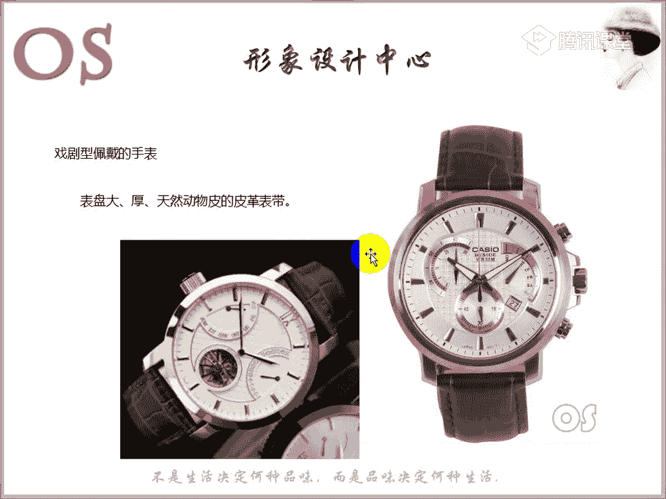

**适合风格**：任何风格都可以尝试，但需考虑个人驾驭能力。

### 毛线帽

保暖且时尚，款式多样，非常百搭。

**选择要点**：无需过多顾及风格限制，主要根据个人适合的色彩和材质来选择。

**特别注意**：古典型或浪漫型男士若选择毛线帽，材质上应选择更精密、精致的。

---

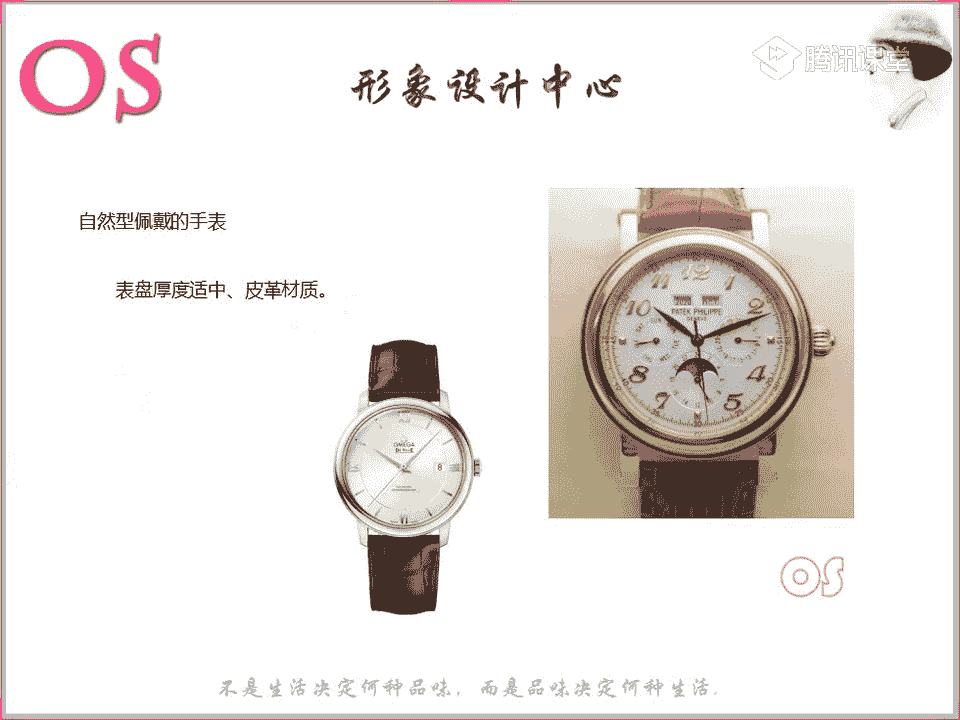

## 手表的选择

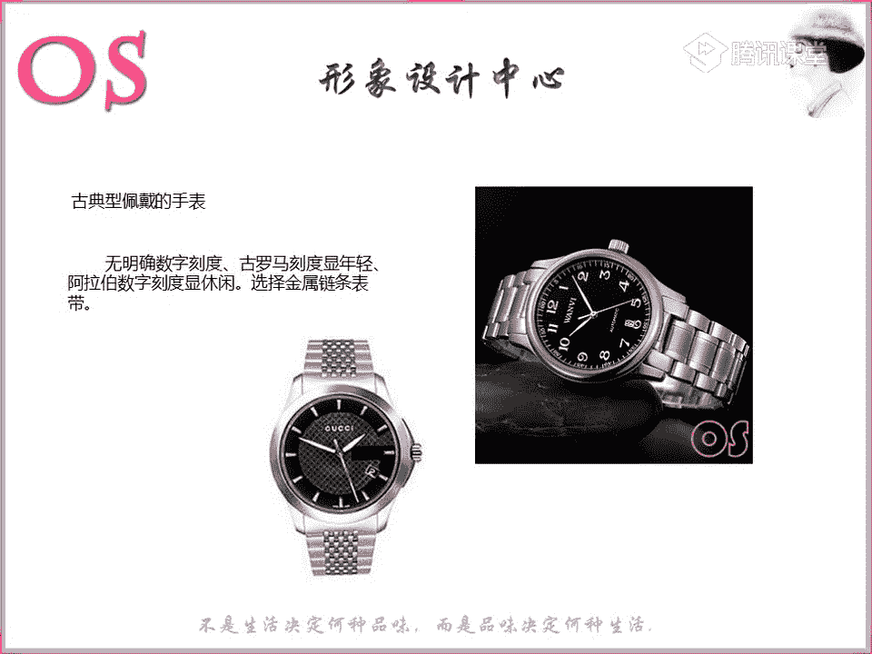

手表对男士来说是非常重要的配饰。下面我们认真来学习。

首先，了解一个基本概念：**表盘越厚，运动感越强；表盘越薄，带来的尖锐感越强**。

### 手表的刻度分类

手表刻度主要分为三大类，带来不同的视觉感受。

以下是手表刻度的三种主要类型及其风格感受：
1.  **无精确数字刻度**：表盘没有精确数字。感觉**经典、严谨**。
2.  **阿拉伯数字刻度**：带有阿拉伯数字。装饰效果突出，感觉**轻松、有运动感**。
3.  **古罗马数字刻度**：感觉**年轻、现代**。

### 手表颜色的选择

金属表带的颜色选择需与个人人体色（季型）匹配。

**选择公式**：
*   **暖色型（春季型、秋季型）男士**：适合**金色**表带。也可选择银色。
*   **冷色型（夏季型、冬季型）男士**：适合**银色**表带（如白金、铂金）。应避免金色，否则会显皮肤黑。

此原则同样适用于其他首饰的选择。

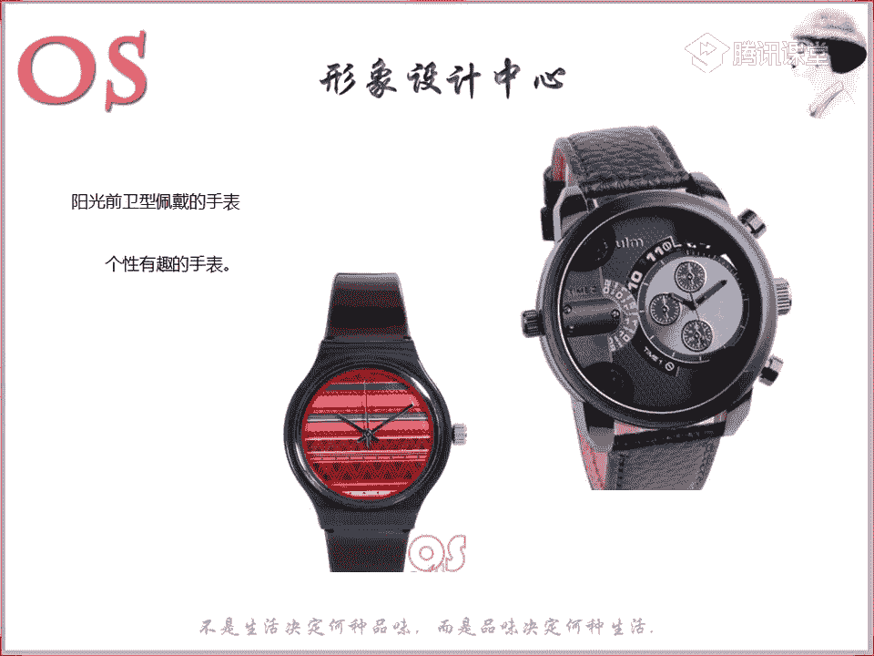

### 运动款手表

运动款手表应在穿着运动服装或休闲装时佩戴，避免与正式服装搭配。要注意场合区分。

### 各风格手表选择要点

不同风格的男士在选择手表时，侧重点不同。

以下是各风格男士选择手表的要点：
*   **戏剧风格**：
    *   表盘：选择**大**且**厚**的。
    *   表带：适合天然动物皮革表带。金属表带也可，但需保持表盘大的特点。
*   **浪漫风格**：
    *   刻度：尽量选择**古罗马数字**刻度。正式场合也可选无数字刻度。
    *   特点：浪漫风格是**最适合佩戴金表或金边手表**的风格，能戴出品味而非“土豪”感。
*   **自然风格**：
    *   表盘：厚度**适中**，大小中偏大。
    *   表带：最适合**皮革材质**（肌理感强）。
    *   刻度：更适合**阿拉伯数字**刻度（休闲感强）。
*   **古典风格**：
    *   刻度：**无精确数字刻度**最适合。古罗马刻度显年轻，阿拉伯数字刻度增加休闲感。
    *   表带：最好选择**金属链条**表带。
*   **新锐前卫风格**：
    *   表盘：选择**薄**的（带来尖锐感）。
    *   表带：不适合皮带。适合塑胶或金属材质。
*   **阳光前卫风格**：
    *   选择**个性、有趣**的手表。需有时尚度，但尖锐感不如新锐前卫型强，要相对低调一些。

### 根据场合选择手表

除了根据风格选择，还可以根据场合来搭配手表。

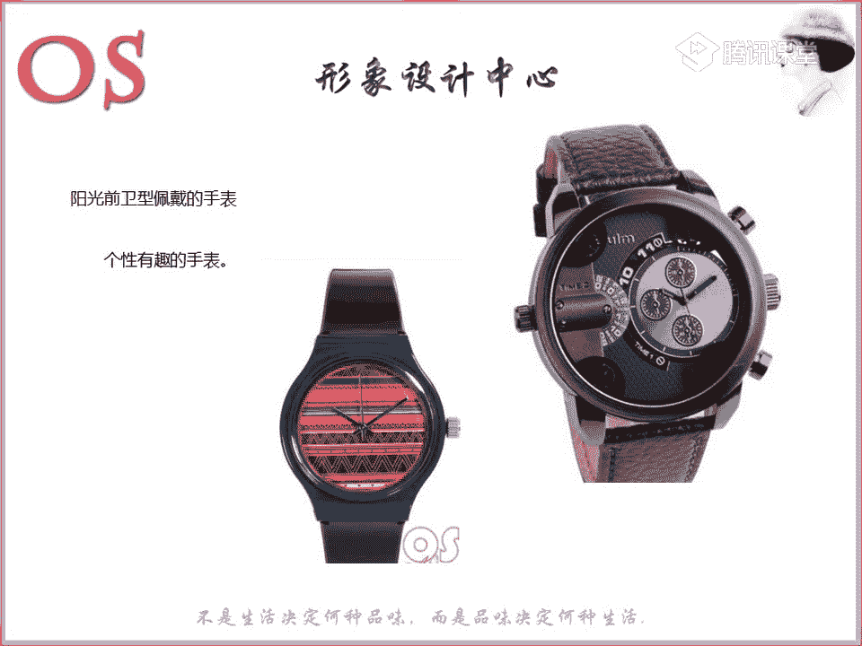

**场合选择公式**：
*   **工作/正式场合**：佩戴**无精确数字刻度**手表，体现严谨、庄重感。
*   **运动/休闲场合**：佩戴**阿拉伯数字刻度**手表。
*   **想表现年轻、现代、时尚**：佩戴**古罗马数字刻度**手表。

因此，建议男士可以根据不同场合和服装风格，多备几块手表。

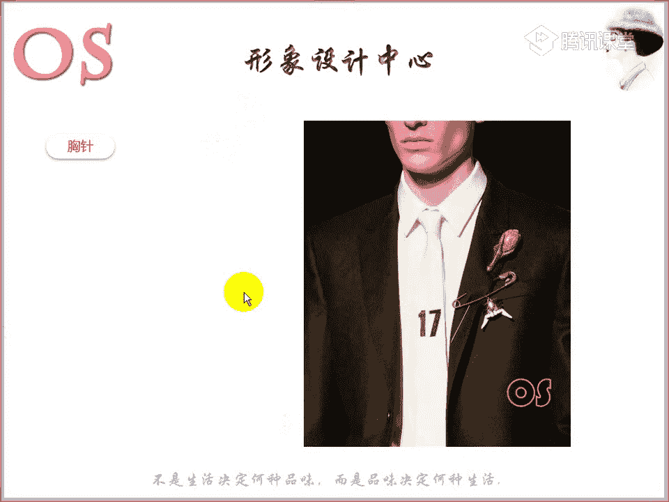

---

## 胸针的搭配认知

最后，我们补充一个常被男士忽略的配饰——胸针。男士不要认为胸针是女性的专属。例如，在2013年Prada的男士秀场上，模特就广泛使用了胸针。

### 胸针的作用

两三枚中小胸针错落排列，能带来妙趣横生的感觉，立刻提升服装的层次感和亮点。对比有胸针和无胸针的造型，效果差异显著。

### 胸针的搭配场合

胸针并非只能搭配西装。

以下是胸针的可搭配单品：
*   **西装**（正式场合更显庄重、华丽）
*   **夹克外套**
*   **毛衣**
*   **衬衫**
*   **大衣**

### 胸针的选择原则

胸针的选择原则与其他饰品（如项链）类似，需符合个人风格。

**风格选择公式**：
*   **戏剧风格**：选择**大气、醒目**的。
*   **浪漫风格**：选择**曲线图案**的。
*   **自然风格**：可选择**休闲、粗犷感**的（如图中的自行车款式）。
*   **古典风格**：选择**精致、小巧**的。
*   **前卫风格**：可选择**个性、有趣**的。

### 口袋巾的补充

顺便提一下口袋巾。口袋巾能瞬间提升西装的整体感觉。即使在休闲场合搭配西装，也可以使用。口袋巾的叠法简单（如对折后放入，或折成三角），可以增加随意感。

**关于胸针佩戴位置**：传统有“男左女右”的说法。在搭配正装时，尽量佩戴在左边；搭配休闲装时，可以更随意，甚至戴在右边。

---

## 课程总结与作业

本节课我们一起学习了男士三大配饰——围巾、帽子和手表的分类、选择及搭配方法，并初步认识了胸针这一提升品味的单品。

**核心总结**：
1.  **围巾**：根据戏剧、自然、浪漫、古典、前卫等不同风格，在材质和图案上有明确的选择指向。
2.  **帽子**：了解卡车帽、平沿帽、画家帽等主要类别的风格属性和搭配场合。
3.  **手表**：掌握刻度（无数字、阿拉伯数字、古罗马数字）带来的不同感受，以及各风格在表盘、表带上的选择要点，学会按场合搭配。
4.  **胸针**：认识到胸针对提升造型精致度的重要性，并了解其基本搭配原则。

**本节课作业**：
1.  **完成班训**。
2.  **整理好笔记**。
3.  **找出适合自己风格的三类配饰**（重点）：
    *   **围巾**：找出适合自己风格的围巾示例。
    *   **手表**：找出适合自己风格的手表示例。可以进一步细化，分别为职业场合、休闲场合、运动场合各找一款。
    *   **帽子**：可选做，不做强制要求。
    *   **胸针**：本节课暂不要求。

希望大家能将所学知识应用到实际搭配中，逐步提升个人形象。

