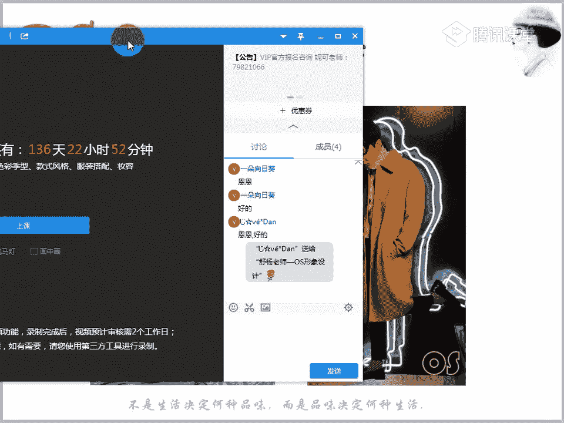

# OS男士形象VIP班《形象课》：第9节：配饰的搭配技巧（二）

## 概述
在本节课中，我们将继续深入学习男士配饰的搭配技巧。我们将重点探讨项链、皮带和包包的选择与搭配方法，并结合不同风格进行具体分析。通过学习，你将掌握如何利用配饰提升整体造型的层次感与时尚度。

---

## 一、项链的选择与搭配
上一节我们介绍了帽子、胸针等配饰，本节中我们来看看项链的搭配要点。项链是男士造型中重要的点缀，选择合适的长度和款式至关重要。

### 1. 测量脖颈长度
首先，我们需要判断自己的脖颈长度，以选择合适长度的项链。以下是测量方法：

*   **测量脸长**：从发际线到下巴尖的距离即为脸长。
*   **测量脖颈长度**：头部微微抬起，从头部与脖颈衔接处测量到锁骨头的距离。
*   **判断标准**：正常脖颈长度约等于脸长的二分之一。

### 2. 根据脖颈长度选择项链
根据测量结果，选择项链长度的原则如下：

*   **脖颈长度正常**：可随个人喜好选择各种长度。
*   **脖颈偏短**：选择稍长的项链，建议长度在20英寸至22英寸之间，避免选择过短或锁骨链。
*   **脖颈偏长**：选择较短的项链，避免选择26英寸或28英寸等过长的款式。

### 3. 项链的搭配技巧
项链不仅可以修饰脖颈线条，还能为休闲装扮增添层次感。

*   **叠戴法**：选择长短不同的项链进行叠戴，既能修饰较粗的脖颈，也能增加造型的丰富度。
*   **提升细节感**：配饰是整体造型中的点睛之笔。即使服装搭配得体，增加一件合适的配饰（如项链、亮色袜子）也能瞬间提升时尚感与品质感。

---

## 二、各风格男士的饰品选择
不同风格的男士在选择饰品时，侧重点有所不同。理解以下关键词，有助于你为任何风格挑选合适的配饰。

以下是各风格男士选择饰品的关键点：

1.  **戏剧风格**
    *   **关键词**：醒目、装饰感强、大气、粗犷、摩登、夸张。
    *   **要点**：饰品需要有存在感和时尚感，避免小气。可以尝试叠戴夸张的项链、手链或戒指。

2.  **自然风格**
    *   **关键词**：简洁、大方、天然、手工感、柔软舒适、异国风情。
    *   **要点**：造型应简单，避免过于复杂或工艺感太强。适合选择有手工质感、肌理自然的材质，如皮质、编织品等。

3.  **古典风格**
    *   **关键词**：精致、高贵感、大小适中、做工考究。
    *   **要点**：饰品量感应居中，不能过于粗犷或小气。对品质要求高，适合选择做工精致、有高级感的物件。

4.  **浪漫风格**
    *   **关键词**：夸张、华丽、中性感。
    *   **要点**：与戏剧风格同属大量感，但更强调华丽感。可以佩戴一些设计夸张、带有华丽元素（如金属扣）甚至略带中性感的饰品。

5.  **前卫风格**
    *   **新锐前卫**：关键词为怪异、酷、时尚感强、尖锐。适合造型独特、富有设计感甚至略显怪异的饰品。
    *   **阳光前卫**：关键词为时尚、独出心裁、年轻感。时尚度强，但尖锐感和夸张感比新锐前卫风格弱，更显年轻活力。

---

## 三、皮带的搭配与选择
皮带不仅是功能性单品，也是重要的装饰。选择时需考虑场合、款式与颜色。

### 1. 材质与场合
*   **高端正式**：鳄鱼皮、牛皮皮带，适合正式场合。
*   **时尚休闲**：帆布、纤维等材质，时尚元素丰富，适合休闲场合。

### 2. 搭配西装注意事项
搭配正装时，需注意以下两点：
*   **皮带扣**：应选择没有明显Logo标志的简洁款式。
*   **颜色**：皮带颜色需与皮鞋颜色保持一致。

### 3. 必备颜色推荐
男士应备有以下三种颜色的皮带，以应对不同搭配需求：
*   **黑色**：搭配正式西装的首选。
*   **棕色系**：百搭，尤其适合休闲装扮。
*   **蓝色系**（如深蓝色）：可作为特色选择，同样百搭。

### 4. 款式建议
*   建议选择带打扣眼的经典款式，避免选择锁头过于方正或设计感弱的款式。
*   在职业场合，应避免佩戴带有明显大Logo的皮带。

---

## 四、包包的选择与搭配
包包的选择同样需要根据场合和风格来决定。男士常见的包款包括双肩包、单肩包、手提包和手拿包。

### 1. 双肩包
*   **职业场合**：选择包型挺括、立体、方正、设计简约、质感好的款式。
*   **休闲场合**：可选择设计感强、有装饰性、有亮点的款式。
*   **运动场合**：侧重功能性与容量，款式通常较大。
*   **避雷提示**：应避免选择典型的“程序员书包”款式，这种包型会拉低整体形象质感。

### 2. 单肩包
*   **通用原则**：简洁款式用于职业场合，装饰细节多的款式用于休闲场合。
*   **风格结合**：例如，浪漫风格可选择带有金属扣等华丽元素的款式；自然风格可选择材质天然、造型随意的款式。
*   **搭配西装**：在正式职业场合搭配西装时，单肩包也应选择挺括、有型的款式。

### 3. 手提包
*   **正式职业场合**：首选款式，颜色以黑色为主，要求做工精致、材质硬挺。
*   **一般职业/休闲场合**：可选择棕色、深蓝色等，休闲场合还可选择“松、大、软”材质的款式。

### 4. 手拿包
手拿包实用且时尚，能避免钥匙、手机等物品破坏服装廓形。
*   **职业场合**：选择材质硬挺、有廓形的皮革手拿包。
*   **休闲场合**：在图案、色彩、材质上选择更多样化，可结合个人风格。
*   **观念更新**：手拿包并非女性专属，选对款式和拿法，能为男士造型增添时尚度。

---

## 总结
本节课我们一起学习了项链、皮带和包包这三大类配饰的搭配技巧。我们了解到，选择项链需考虑脖颈长度；皮带需匹配场合并与皮鞋颜色呼应；包包则需根据职业、休闲等不同场景以及个人风格进行选择。记住，配饰是造型中的点睛之笔，善于利用它们能显著提升你的时尚感与个人魅力。请结合自己的风格，尝试运用这些配饰，完成本节的搭配作业。