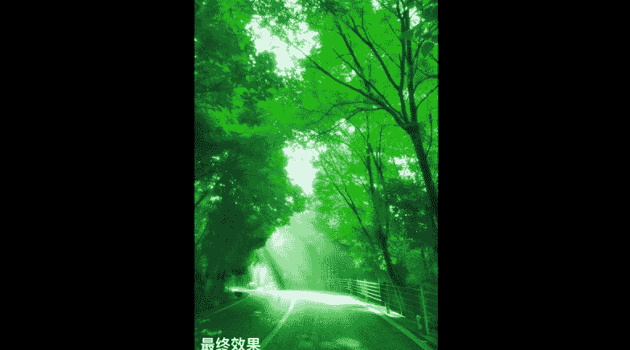

# Snapseed手机摄影后期高手速成：35：打造浪漫唯美的绿光森林 🌲✨

在本节课中，我们将学习如何使用Snapseed将一张普通的树林照片，通过一系列后期调整，打造成一幅充满浪漫与梦幻感的“绿光森林”效果。我们将重点学习**裁剪构图**、**基础调整**、**曲线调色**以及**局部处理**等核心技巧。

---

今年夏天，我在开车上山避暑途中经过一片树林。当时阳光很好，光线透过树叶洒在地面，景色非常漂亮。我立刻用手机拍下了一张照片。

肉眼看到的场景很美，但手机拍出的原片效果有所折扣。原片暗部层次不足，但其中一缕光线非常惊艳。我们将在后期增强这束光线，并将整体色调调整为绿色。

接下来，我们进入案例实操。

---

## 第一步：裁剪构图

现在这张素材照片拍摄时没有变焦，画面比较宽广。我希望突出光线部分，因此首先对构图进行裁剪。

在裁剪时，我尽量突出想要表达的部分：绿色的树林和那束漂亮的光线。

裁剪完成后，我们进入基础调整。

---

## 第二步：基础调整

上一节我们裁剪了构图，本节中我们来看看如何调整照片的明暗与色彩。首先进入“基本调整”界面。

这张照片同时包含高光和暗部，因此不能只调整“亮度”，否则整体曝光都会增加。我会考虑单独调整暗部。

以下是具体操作：
*   **增加阴影**：适当提升暗部曝光，让暗部呈现一定层次。注意不要过度调整，以免暴露手机照片的噪点。
*   **增加饱和度**：为了追求唯美的日光森林效果，将饱和度适当调高。

完成基础调整后，照片的明暗和色彩基础得到改善。

---

## 第三步：使用曲线工具营造绿色基调

基础调整后，照片已经有了基本层次。既然要打造“绿光森林”，接下来就需要为照片注入浓郁的绿色基调。这里我们使用**曲线工具**。

在曲线工具中，选择**绿色通道**。直接向上提升曲线，即可为照片整体增加绿色。

**操作示意**：`曲线工具 -> 选择绿色通道 -> 向上拉动曲线`

增加绿色后，森林的绿色效果立刻变得非常漂亮。但调整绿色通道后，整张照片包括光束部分都变绿了，这并非我们想要的效果。

---

## 第四步：使用局部工具修正光束颜色

上一节我们使用曲线为整体增加了绿色，但光束部分也因此过绿。本节中我们使用**局部工具**进行选择性修正。

局部工具可以选中特定区域进行调整。我们建立一个控制点，用双指缩放来精确选择光束的影响区域。

选中光束区域后，进行以下调整：
*   **降低饱和度**：将选中区域的饱和度降低，以消除过多的绿色。
*   **增加结构**：适当增加“结构”值，可以使光线的层次更加丰富。

**操作示意**：`局部工具 -> 在光束处添加控制点 -> 双指缩放选择范围 -> 降低饱和度，微增结构`

经过局部调整，光束恢复了原本的色调，而森林背景保持了浓郁的绿色。

---

## 第五步：添加魅力光晕增强梦幻感

经过前几步调整，绿光森林的效果已初步呈现。为了让画面更梦幻，我们最后使用“魅力光晕”工具。

魅力光晕可以为照片添加发光效果。Snapseed提供了几种光晕强度预设。

以下是选择建议：
*   第三种光晕效果比较强烈。
*   第二种效果通常已经足够。
*   可以根据个人喜好，适当调整光晕强度和饱和度。
*   “暖色调”滑块可以控制色调偏向冷暖，例如向冷色调微调，可以让画面更清新。

添加魅力光晕后，整个画面仿佛在发光，梦幻感大大增强。

---

## 工具与步骤解析

我们刚才处理案例时用到了较多工具，现在一一解析核心步骤：

**1. 裁剪**
裁剪是为了更好地满足构图需求。本例中通过裁剪，进一步突出了画面的主体：光束和绿色树木。

**2. 基本调整**
调整了**阴影**和**饱和度**。提升阴影是为了增加暗部层次；增加饱和度是为了让色彩更鲜艳。

**3. 曲线工具（关键步骤）**
通过选择**绿色通道**并提升曲线，为照片整体奠定了绿色基调。这是实现“绿光”效果的关键。

**4. 局部工具**
整体提升绿色通道后，光束部分也变绿了。使用局部工具选中光束范围，并**降低其饱和度**，从而修正了局部颜色。局部工具对于进行选择性操作非常有效。

**5. 魅力光晕**
最后添加魅力光晕滤镜，增强了画面的梦幻发光效果。这是一个“傻瓜式”操作，可根据个人口味适度选择。

---

## 总结与思考

本节课中，我们一起学习了如何打造“绿光森林”效果。我们通过**裁剪**突出主体，用**基础调整**改善明暗色彩，用**曲线工具**营造绿色基调，用**局部工具**进行选择性修正，最后用**魅力光晕**增强氛围。

最终，我们成功将一张普通的树林照片，调整成了充满浪漫与梦幻感的作品。

需要指出的是，这样独特的后期案例往往可遇不可求。这张照片是我无意中拍到的。这种具有独特光线和场景的照片，更能展现个人处理的独特性。你拍到了，就能处理出属于自己的效果。

学习照片后期美化，关键还是要进行大量练习。我们下节课再见。