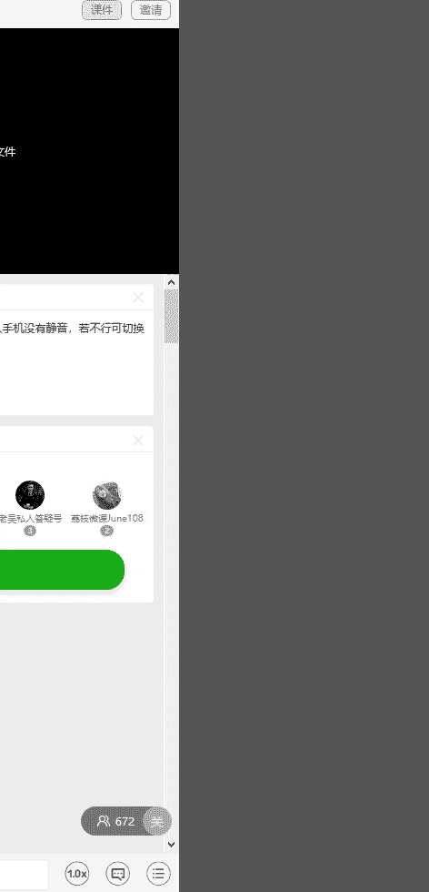
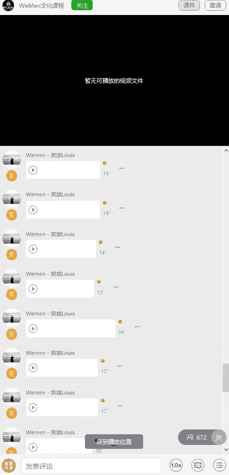

# 05wumen老吴《六节课从素人到达人》：一、把握核心 实力开启网红人生 🚀

在本节课中，我们将学习如何构建一个真实、有吸引力且具有个人特色的社交媒体形象，特别是朋友圈的定位与系统建设。这是成为网络达人的第一步。

## 课程概述

因为现代社会节奏很快，很多人没有足够时间深入了解你，他们主要通过你的朋友圈等社交媒体形象来获取信息。

以往，有人为了显得自己很厉害，会在朋友圈展示很多高格调的内容。但这容易走入一个误区：展示不属于自己的东西，导致整个朋友圈看起来非常虚假。

今天要明确一个核心观点：我们打造社交媒体形象是给别人看的，而不是给自己看的。这就像有时你只感动了自己，并未感动别人。

每个人的喜好不同，因此你需要根据目标受众的喜好来塑造形象。如今，会拍照、会修图的人越来越多。那么，如何让你的朋友圈脱颖而出，如何形成个人特色，就显得尤为重要。

## 核心要点解析

以下是构建成功社交媒体形象的几个关键步骤。

### 1. 精准自我定位：真实是基石

我见过很多人整天拍摄五星级酒店、豪华跑车、高级餐厅、游艇等高价值物品。他们满怀期待地将这些内容发到朋友圈，但收到的反馈却与预期不同。

大家都忽略了一个重要点：这些东西是否真正属于你，你又是否能驾驭它们。例如，如果你是一名朝九晚五的普通白领，生活一直很平淡，突然开始展示游艇、飞机和环球旅行，这个跨度就太大了。这时，你的社交媒体形象会与你的真实形象不匹配。

因此，准确定位自己至关重要。你需要先明白自己目前处于什么阶段，以及什么样的社交媒体形象更符合你。然后，围绕这个定位去创作内容。随着你个人能力的不断提升，你的朋友圈内容也应同步优化。这是一个循序渐进的正确道路。

你需要从内在性格、外在条件、软价值（如情商、品味）、硬价值（如财富、技能）和社交圈等方面进行详细的综合评估。公式可以概括为：

**个人定位 = 评估(内在性格 + 外在条件 + 软价值 + 硬价值 + 社交圈)**

如果你想成为不同领域的网红，必须完成这项评估。同时，要仔细思考你的强项在哪里。你有什么点是别人没有的，或者你擅长什么而别人不如你擅长。然后，将大量精力投入在这方面。无论做什么，方向都非常重要。如果一开始方向就错了，最终结果也不会是你想要的。

### 2. 内容差异化：寻找你的独特点

当你仔细观察每位网红的社交媒体形象时，会发现他们都有独特的特点。性格上也是如此。你不能因为某人发的内容多就认为他受欢迎，发得少就不受欢迎。

大家可以发现，网红的照片都非常高清。这是我们打造社交媒体形象的一个重要部分：图片不能模糊。

从市面上的手机和拍摄设备来看，苹果手机是比较好的选择。很多网红都用苹果手机拍摄服装等照片。当然，条件更好的人会用单反相机，但单反需要专业摄影师配合，显得不切实际。因此我推荐使用苹果手机，因为它拍出的照片在颜色和质感上通常优于其他手机。

网红们除了用苹果手机拍照，如果需要自拍，有些人会使用美图手机。所以，这些网红通常配备这两类手机。

照片的清晰度除了依赖好的设备，还需要会修图。因为每张图片在经过后期加工后，可以变得更加清晰。这将在后续的修图课程中详细讲解。

### 3. 照片叙事性：内容大于形式

讲完照片清晰度，我们来看下一个重点：照片的内容。这也是很多人忽略的一点。

我之前出过相关的拍照修图课程，发现很多人学会后，照片拍得很高清，修图也很好，但出现了一个重要问题：照片所表达的内容让人看不懂。

这是与别人区分开来的关键点：你为什么拍这张照片？它想表达什么？如果连你自己都要思考很久，或者别人看不明白，你就需要重新思考这张照片的意图。

很多人会进入一个误区：看到网红摆个姿势拍出漂亮照片，就去模仿。但很多时候，你只模仿了表面，没看到照片的内涵。

仔细观察那些网红的照片，即使是街头随拍，其实也拍了很多张，然后从中挑选出最自然的一张。那些看上去很自然的照片，正是通过这种不断“随意”拍摄捕捉到的。他们会在构图好的地点反复拍摄，捕捉自己最自然的一刻，然后发布出来。而你如果只是找到同样的场景，摆同样的姿势，感觉是不会一样的。

一张好的图片会讲故事，本身就有灵魂。你看一眼就会被吸引，就是因为很自然，很有感觉。不要以为这些有感觉的照片只拍了一张就成功了。

### 4. 场景与造型搭配：营造整体氛围

第三个重点是穿衣搭配和场景选择。有时，如果你要去一个地方拍照，但穿了与场景不匹配的衣服，拍出的照片会缺乏融合感。

例如，如果你计划明天去一家咖啡厅拍网红风格的照片，就需要先了解咖啡厅的装修风格和色调，然后穿着相匹配的衣服前往。我知道很多女网红都是这样做的：约上三两闺蜜，提前准备好衣服，精心挑选最合适的一套，然后去那里喝下午茶、拍照。这些都是有讲究的。

不同场景穿不同的衣服，请务必记住这一点。

除了服装造型，还要注意脖子以上的打扮。比如发型，以及是否佩戴眼镜等装饰，更进一步可以化点妆。这样会让你拍出的照片更接近网红风格。如果你不习惯化妆，可以通过一些修图软件来达到类似效果，这也会在后续课程中讲到。

### 5. 寻找或培养摄影师：合作出精品

第五个重点是你需要有一个会拍照的摄影师，这个人也可以是你的朋友。

如果身边没有这样的人怎么办？你可以自己去培养。或者，当你掌握了本套课程的所有内容后，你可以指导一个陌生人来帮你拍摄。

以我自己为例，我常年到处旅游和工作，很多时候身边没有固定的人帮我拍照。这时，我就会找路人帮忙。

找路人很有讲究：第一，我会找穿着比较时尚的，或者带有艺术气息的，或者长得还不错的人。通常这些人拍出的照片比较好。

如果没有遇到这样的路人，也没关系。比如你很想记录某个场景，可以在有路人时请求帮助，让他帮你拍几十张。你要指导他，告诉他人物在画面中的比例大概多少，整张图要从什么角度拍。你心里要先有这些概念，然后指导他来拍。他拍了几十张后，你道谢，等他离开后再看照片。如果这些照片不是你想要的，没关系，等下一个路人来帮你拍。

例如，我在新加坡金沙酒店泳池边的一张照片，找了三个路人帮忙，拍了大概一百多张，最后才挑出一张。

随着你拍摄水平和被拍经验越来越丰富，效率会越来越高。如果你想变得会拍照或很会上镜，一定要大量实践，也不要太在意路人的眼光。因为有些人在拍照时会担心身边的人如何看待自己，从而害羞或不够自信，导致拍出的照片不够好。

## 网红形象的共通点

我综合了男生和女生网红的朋友圈及社交媒体形象，发现他们有一些共通点。接下来与大家分享：

1.  **基本都有健身习惯**。好的身材能驾驭更好的衣服，同时修炼气质，让人变得更加自律。
2.  **都很会穿搭衣服**。所以穿搭也是一门需要学习的课程。
3.  **彼此都很会拍照修图**。这不用说，是我们的课程核心内容。
4.  **身边朋友的水平都差不多**。看他的朋友圈，你就知道他身边都是什么样的人。
5.  **都很爱旅游**。旅游可以开拓视野，同时拍到很多漂亮照片，也是提升自己的方式。

## 内容创作的进阶思维

我们一定要善于思考。拍照片要从特别的点切入，而不是按照常规流程。千篇一律的照片没有吸引力。

例如，大家都去健身。在你还没有八块腹肌、很好胸肌或前凸后翘身材时，你没办法直接展示身材，但又想表明自己在坚持健身，怎么办？

你可以从幽默搞笑的角度切入，给大家带来欢乐。这样大家同时也能知道你有在坚持健身。隔一段时间后，你再把健身成果发出来，这样就形成了明显的对比。大家会觉得你这个人很不错，一直在坚持，而不是纯粹去健身房拍照装样子。

## 社交属性与互动性

我们的朋友圈等社交媒体形象，其实就是个人的对外窗口。既然要对外宣传，就带有社交属性。因此，请务必记住：你发布的任何内容，最好都具有互动性。

如何进行社交，会在我的另外的社交课程中讲到，包括公众号的一些推文，都会讲解如何做好社交以及需要注意的事项。你再结合我们的拍照修图课程，相信很快就能变得像网红一样受欢迎。

## 总结与行动指南

本节课中，我们一起学习了构建网红级社交媒体形象的核心要点：**精准的自我定位、高清有质感的视觉呈现、富有叙事性的内容、用心的场景造型搭配，以及寻找合适的拍摄伙伴**。

当你有了这些概念和思路后，就要去定位自己，看看想走什么类型的网红风格。有人喜欢小清新、文艺、酷、阳光，或是暗黑系等等。然后，根据你选择的风格、个人性格喜好及生活方式，去定制你的朋友圈形象。

从**衣食住行、兴趣爱好、工作和社交圈**这四个主要板块入手，用多元化的内容打造你专属的网红形象。

有人可能会说，有些人不用做这些社交形象，但依然很受欢迎。这是为什么？因为他的个人品牌在线下已经深入人心，大家都知道他是谁。所以他不做朋友圈也没关系。很多企业家或高层次人士的朋友圈常常空空如也。

我们只要努力，有一天也能成为像他们一样的人。但在那之前，我们要从基础做好，争取在众多竞争者中脱颖而出。因为很多人没有强大的实力、背景或价值去支撑，所以只能通过优质的社交媒体形象去吸引别人，别人也只能通过这个窗口了解你。

当你把精心打造的照片发上朋友圈后，会发现大家看你的目光都会变得不一样。当然，前提是这些照片不能是很刻意地装样子，让人反感。

例如，一个阳光运动型男孩，他朋友圈的内容可能包括打篮球、踢足球、与球友的合照，以及一些笑得很阳光开朗的照片。

---

**本节课中我们一起学习了**：如何通过真实定位、优质内容、场景搭配和社交互动，系统性地打造一个具有吸引力和个人特色的社交媒体形象，为开启网红之路打下坚实的基础。记住，**真实是起点，特色是武器，坚持是路径**。