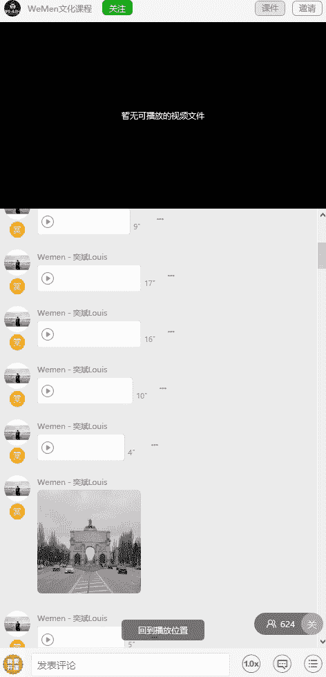
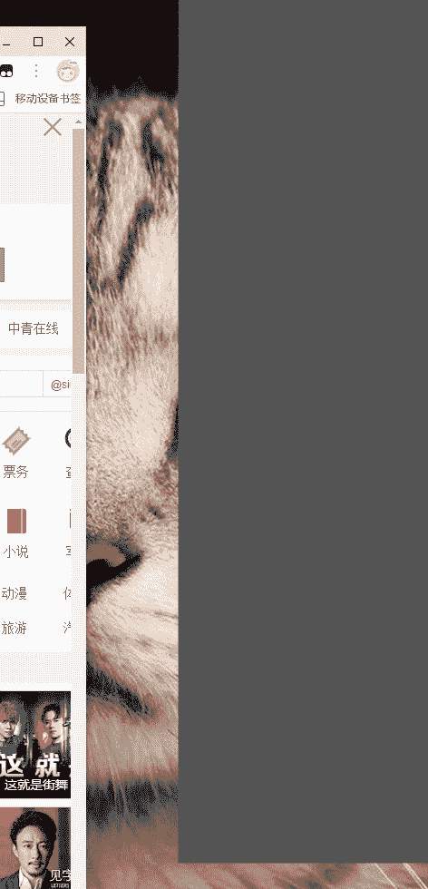

**05wumen老吴《六节课从素人到达人》：二、多种网红构图 打造独特魅力**

在本节课中，我们将学习多种实用的摄影构图方法。构图是安排画面中元素位置的艺术，旨在更好地表达主题并增强美感。掌握这些方法能显著提升照片的视觉效果。

---

### **对称式构图**

对称式构图利用画面中景物存在的对称关系来构建画面。这种构图方式能带来稳定、正式和均衡的视觉感受。

操作起来很简单，只需找到具有对称性或明显中轴线的地方即可拍摄。

---

### **汇聚线构图**

汇聚线构图是指利用画面中向同一方向延伸并最终汇聚于一点的线条元素进行构图。

这种构图能产生强烈的视觉冲击力，并使画面更具空间感和立体感。

以下是汇聚线构图的案例图示：

---

### **三分构图法（九宫格构图）**

三分构图法是将画面的横向和纵向各平均分成三份，线条交叉处被称为“趣味中心”。

观看照片时，视线通常会首先被吸引到趣味中心。因此，拍照时应尽量将主体安排在趣味中心附近。

这种构图法也被称为九宫格构图、井字型构图或黄金分割构图，是最常用的构图方法之一。

**如何找到黄金分割点？**
许多手机和相机都内置了构图辅助线功能。开启后，屏幕上会显示网格线以辅助构图。例如，在苹果手机的“设置”>“相机”>“构图”中，开启“网格”选项即可。

---

### **对角线构图法**

对角线构图法是将主体安排在画面的对角线上，使其呈现对角关系。

这种构图能增强画面的纵深感和立体感，线条可以引导观众视线，让画面看起来更动感、更有活力，从而达到突出主体的效果。

在拍摄长条形物体（如器皿）时，我常使用此方法，因为它能让物体显得更立体。

---

### **延伸对角线构图**

延伸对角线构图是对角线构图的一种变体，它并非完全规则的对角线，但被许多网红广泛使用。

操作并不复杂：只需将九宫格网格向左或向右旋转约30到45度，即可形成此类构图。

---

### **框架式构图**

框架式构图是一种经典方法，指利用主体周围的框架元素（如窗户、门框、洞口）进行构图。

这类似于为画作装上画框，能将观众的视线聚焦于框内的主体。

---

### **三角形构图法**

三角形构图法通常用于拍摄实物。将三个重要的物体按三角形布局摆放，可以形成视觉上的联动，使画面显得丰富而稳定。

---

### **俯拍式构图**

俯拍式构图能够方方正正、一目了然地展现主体，常用于拍摄食物。

具体方法是：站立拍摄，使手机与桌面保持平行。这样拍出的图片看起来更舒服。注意四周要留有空间以避免压迫感，物体之间也应保持适当间隙。

---

### **局部特写构图**

这种构图方式在拍摄实物时，不会将整个盘子拍入画面。

拍摄角度接近90度垂直向下，能营造出纵深感。当盘子过大或桌面有其他杂物时，此法尤为适用，能拍出很有意境的照片。

---

### **竖列式构图**

竖列式构图有点像九宫格构图，适用于拍摄实物或长柱形物品。

这种方法能突出物品的层次感，但不太推荐用于拍摄人物，因为它可能会产生压缩感。

---

### **五五开构图法**

五五开构图法常用于拍摄景观。例如，以海平面或天际线作为画面的中轴线。

这种构图能使画面呈现出和谐、平衡的效果。

---

### **拍摄细节补充**

学完构图方法后，还需注意以下拍摄细节：

**1. 清洁镜头**
拍摄前务必检查相机或手机镜头是否有指纹或污渍。脏镜头会导致照片模糊。

**2. 保持水平**
拍摄时，需确保画面中有一条水平或垂直线作为参照，避免将图片拍歪。无论画面中是否有人物，水平线都应保持水平。

**3. 人像拍摄角度**
拍摄人像时，避免从过高角度向下拍，这会产生压缩感。同时，不要让模特的头部顶到画面上边缘，否则会产生压迫感。

**4. 注重光线**
构图和光线是构成照片的两大核心元素，需同等重视。

---

### **总结与建议**

本节课我们一起学习了对称式、汇聚线、三分法、对角线等多种网红构图技巧，并了解了关键的拍摄细节。

要提升拍摄水平，建议多观摩网红或摄影大师的作品，分析他们的构图方式和内容表达手法。通过不断练习，你的照片质感将快速提升，个人风格也会逐渐凸显，从而与他人区分开来。

