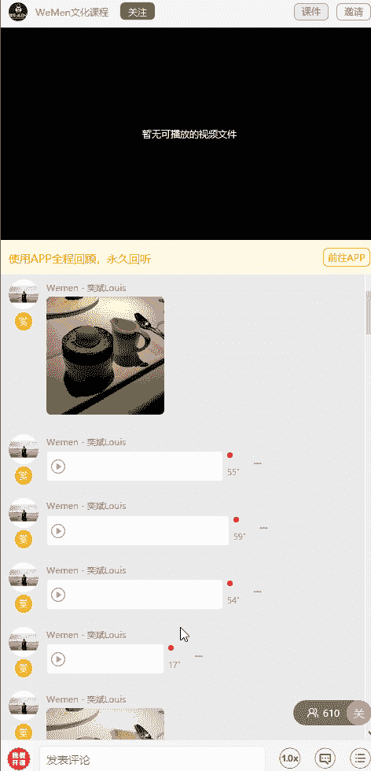
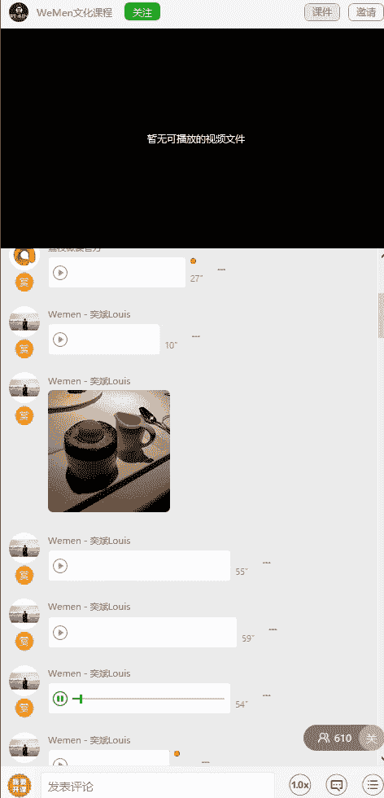
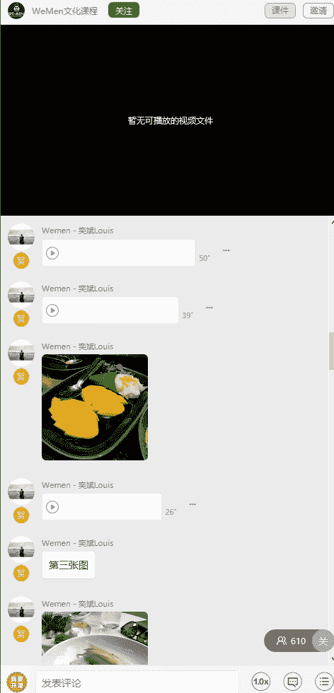
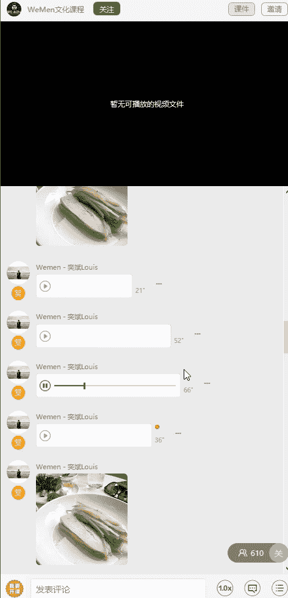
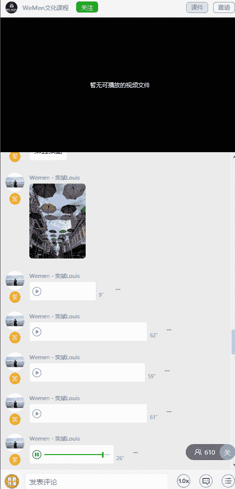
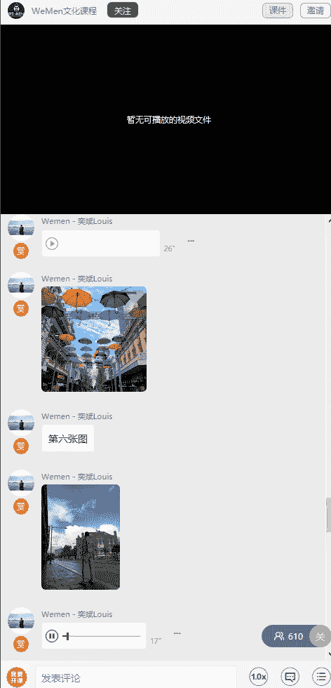
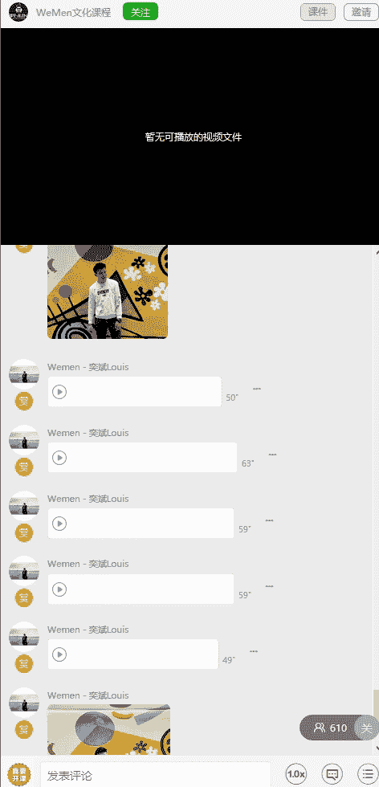

# 05wumen老吴《六节课从素人到达人》：五、如何轻松carry朋友圈 且看八大类修图实操案例 📸

在本节课中，我们将通过八个具体的修图案例，学习如何将不同类型的照片（如食物、风景、人像等）修得干净、美观，从而轻松提升朋友圈的图片质量。课程将使用Instagram、VSCO、Snapseed和美图秀秀等常见工具，并详细讲解每一步的操作逻辑。

---

## 案例一：室内甜品照片修图 🍰

上一节我们介绍了课程概述，本节中我们来看看如何修一张在室内灯光下拍摄的甜品照片。这类照片通常光线不足，需要后期提亮和调色。

首先，我们使用Instagram（简称Ins）进行修图。如果无法使用Ins，VSCO是很好的替代工具。

以下是修图的具体步骤：

1.  **选择滤镜**：浏览并点击不同的滤镜，观察效果。对于这张甜品图，`Reyes`滤镜效果不错。
2.  **调整滤镜强度**：将滤镜强度降低至**60%**左右，避免效果过重。
3.  **调整基础参数**：
    *   **锐度**：直接拉到最高（**100**），检查是否有过多噪点。
    *   **亮度**：适当提高亮度。
    *   **高光**：提亮后，如果照片过曝，可以减弱高光，让光线柔和。
    *   **对比度**：向右微调，可以让照片更干净，消除“薄纱”感。
    *   **结构**：适当增加（例如**8**），让食物细节更突出。
    *   **暖色调**：由于原图偏黄，向左微调，减少暖色调。
    *   **饱和度**：根据情况，如果颜色过艳可稍作减弱。

完成以上调整后，照片会变得更加明亮、干净且富有食欲。最后点击“下一步”保存即可。

---

## 案例二：芒果糯米饭修图 🥭

接下来，我们处理另一张食物照片——芒果糯米饭。这张图同样存在餐厅暖光导致颜色偏黄的问题。

我们继续使用Ins进行修图。

以下是修图的具体步骤：

1.  **选择滤镜**：尝试不同滤镜后，`Ludwig`滤镜在修食物时表现很好，它能突出食物本身，颜色鲜艳而不夸张。
2.  **调整滤镜强度**：将强度设为**80%**。
3.  **调整基础参数**：
    *   **锐度**：拉至最大。
    *   **结构**：先增加结构，让画面清晰。
    *   **对比度**：稍微降低一点。
    *   **高光**：适当降低，避免过曝。
    *   **亮度**：最后再提亮整体亮度。
    *   **暖色调**：向左（冷色调）调整，可以让糯米饭看起来更白。
    *   **饱和度**：向右微调，恢复芒果鲜艳的颜色。
    *   **光影**：可稍作减弱。

调整完成后，对比原图，照片去除了多余的黄色，整体更加清爽明亮。如果觉得太亮，可以再次微调高光。

---

## 案例三：户外餐厅食物修图 🌿

现在，我们来看一张在户外餐厅拍摄的食物照片。环境光不同，修图策略也需调整。

我们仍然使用Ins。

以下是修图的具体步骤：

1.  **选择滤镜**：`Hudson`滤镜效果不错，但注意其自带颗粒感。
2.  **调整滤镜强度**：将强度降低至**50%-60%**，以减少颗粒感。
3.  **调整基础参数**：
    *   **锐度**：调至最高。
    *   **亮度**：整体提亮。
    *   **对比度**：向右调整，消除“薄纱”感，让画面干净。
    *   **结构**：适当增加。
    *   **饱和度**：稍作增加，避免画面过于素雅。
    *   **高光**：减弱，防止餐盘反光过强。
    *   **光影**：可适当增加（如**15**），为照片添加一层若有若无的明亮感。

经过调整，户外食物的照片会显得干净、自然且有层次。

---

## 案例四：海边风景修图 🌊

前面三节我们学习了食物修图，本节中我们进入风景修图，看看如何修一张海边照片。

我们使用Ins，因为海的颜色因人而异，可以多尝试不同滤镜。

以下是第一种修图方案：

1.  **选择滤镜**：选择一个喜欢的蓝色调滤镜。
2.  **调整滤镜强度**：设为**85%**左右。
3.  **调整基础参数**：
    *   **锐度**：最高。
    *   **亮度**：+8
    *   **对比度**：+15
    *   **结构**：+7
    *   **暖色调**：向左（冷色调）调整，让天空更蓝。
    *   **饱和度**：稍作加强，让天空和沙滩植物颜色更鲜明。
    *   **高光**：减弱，避免刺眼。

以下是第二种修图方案（使用`Juno`滤镜）：

1.  **选择滤镜**：使用`Juno`滤镜。
2.  **调整参数**：同样调整锐度、亮度、对比度、结构、饱和度。
3.  **关键操作**：大幅减弱**高光**，这能让沙滩的层次感立刻分明。

**经验分享**：如果多个滤镜效果都好，可以分别保存，最后对比选择最喜欢的一张发布。

---

## 案例五：方形构图街景修图 🌂

本节我们处理一张长方形的街景图，并学习如何将其裁剪为更紧凑的方形构图，以及使用Snapseed进行调色。

首先，使用Snapseed的裁剪功能，将图片裁成正方形，突出伞和天空。

以下是后续的调色步骤：

1.  **使用“曲线”工具**：整体提亮偏暗的图片。
2.  **使用“突出细节”工具**：
    *   **锐化**：增加清晰度。
    *   **结构**：稍作增加。
3.  **使用“调整图片”工具**：
    *   **饱和度**：增加到**40**左右，让伞和天空的颜色更突出。
    *   **氛围**：+10，增强天空效果。
    *   **高光**：-20，让云层更有层次。
    *   **阴影**：减弱，使观众注意力集中在画面中心的伞和天空。
    *   **亮度**：稍作提亮。

经过调整，照片从灰暗变得色彩鲜明、主体突出。

---

## 案例六：阴天路边背景修图 🏙️

接下来，我们拯救一张在阴天拍摄、背景灰暗的路边照片。

我们使用Ins来提升画面。

以下是修图的具体步骤：

1.  **选择滤镜**：`Juno`或`Hefe`滤镜可以改善灰暗色调。
2.  **调整滤镜强度**：设为**65%**左右。
3.  **调整基础参数**：
    *   **锐度**：最高。
    *   **亮度**：提高，补偿光线不足。
    *   **对比度**：向右增加，让画面更扎实。
    *   **结构**：稍作增加。
    *   **暖色调**：向右微调，为灰暗的天空和路面增添一点色彩。
    *   **饱和度**：增加，让天空颜色更明显。
    *   **高光**：减弱。
    *   **光影**：增加，整体提亮。

调整后，照片的灰暗感消失，色彩和层次感得到增强。

---

## 案例七：室内人像修图（肤色校正） 💁

从本节开始，我们进入人像修图。首先处理一张室内拍摄、肤色偏红偏暗的人像照片。

修图分为两步：**整体调色**和**面部精修**。

**第一步：整体调色（使用Snapseed + Ins）**

1.  先用Snapseed的“曲线”工具整体提亮照片。
2.  将图片导入Ins，尝试滤镜。`Reyes`滤镜可能加重脸红，需降低强度或更换滤镜。
3.  调整参数：提高**锐度**和**亮度**使皮肤变白，降低**对比度**，增加**光影**来中和红色。

**第二步：面部精修（使用美图秀秀 + Snapseed）**

1.  **美图秀秀**：
    *   **面部重塑**：调整脸型、眼睛大小、嘴唇形状。
    *   **瘦脸瘦身**：手动微调脸部轮廓。
    *   **亮眼**：涂抹眉毛、眼睛、鼻子、嘴巴和脸部轮廓，使其更清晰。
    *   **祛痘祛斑**：去除脸部瑕疵。
2.  **Snapseed**：
    *   **局部**工具：提亮脸部或鼻子，增强立体感。

通过以上步骤，可以有效地校正肤色并美化五官。

---

## 案例八：街拍人像修图（综合处理） 👤

最后，我们综合处理一张偏暗的街拍人像照片，涉及调色、美颜和细节调整。

**第一步：整体调色（使用Ins）**

1.  **选择滤镜**：例如`Aden`滤镜。
2.  **调整参数**：强度可稍高（如**90%**）。提高**亮度**和**光影**使皮肤变白，调整**暖色调**减少泛黄，增加**饱和度**和**结构**，降低**高光**。

**第二步：面部精修（使用美图秀秀）**

1.  **面部重塑**：瘦脸、放大眼睛。
2.  **祛痘祛斑**：自动或手动去除瑕疵。
3.  **去黑眼圈**：淡化眼周暗沉。
4.  **瘦脸瘦身**：微调嘴角（制造微笑唇）、整理头发线条，让脸型更完美。

完成这些步骤后，一张原本普通的街拍照就会变得光彩照人。

---

## 总结 📝

本节课中，我们一起学习了八种常见场景的修图方法：
1.  **室内食物**：重点在于提亮、去黄、增强细节。
2.  **暖光下食物**：用冷色调中和黄色，恢复食物本色。
3.  **户外食物**：保持干净，适当增加自然感。
4.  **海边风景**：尝试不同滤镜，通过减弱高光增强层次。
5.  **街景构图**：先裁剪再调色，突出主体。
6.  **阴天风景**：提高亮度与饱和度，拯救灰暗画面。
7.  **室内人像**：先校正偏色肤色，再精细美化五官。
8.  **街拍人像**：综合调色与全面部修饰。

核心原则是：**保持图片干净，颜色不失真，在还原真实的基础上进行美化**。掌握这些案例的思路后，你就能灵活应对大部分日常照片的修图需求。