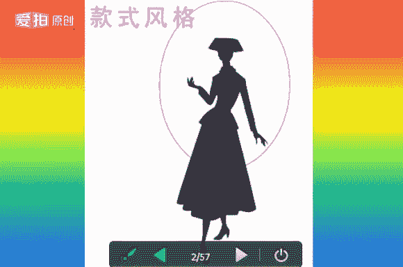
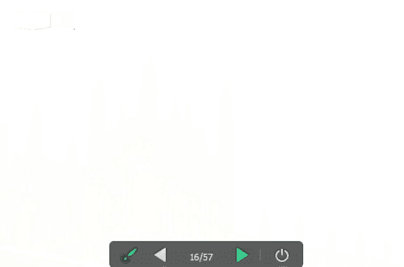

# 个人形象班：1.06：女士款式风格（一）

在本节课中，我们将要学习女士服装款式风格的基础知识，重点了解少女型、少年型、前卫型和自然型这四种风格的特征、装扮要点及搭配技巧。通过学习，你将能够初步识别不同风格的特点，并为后续深入学习打下基础。

## 课程导入与回顾

各位同学晚上好。能听到老师声音的同学请回复“1”。首先，欢迎新同学加入我们的VIP课程。本课程会系统讲解个人形象塑造的基础知识点，每一节都是重要环节。希望新同学认真听讲领悟，老同学可以反复复习直至掌握。课后如有疑问，可通过QQ、微信或QQ群与老师交流，我会尽快回复。

现在开始上课。我是娜娜老师，今天将和大家共同学习“服装搭配中的女士款式风格”，这是我们的第六节课。

在开始新内容前，我们先简要回顾前五节课的基础：
*   第一课：对色彩的认识。
*   第二课：服装搭配的配色。
*   第三课：体型基础（春季型与夏季型）。
*   第四课：体型基础（秋季型与冬季型）。
*   第五课：款式风格的定义。

风格在生活中无处不在，是共性与特性的体现。今天，我们将聚焦于女士的款式风格。

## 女士风格分类概述

许多人在购物时常有困惑：不知道适合穿什么，或在店里觉得好看，回家后却觉得衣服颜色或款式奇怪。这通常是因为没有找准自己的“季型”（如秋季型、春季型）和适合的“款式风格”。学习本节课后，你将能更好地诊断适合自己的风格。

女士风格分类体系，传统上归纳为“八大款”。目前新的体系则简化为“六大款”，其中少女型与少年型有结合，自然型与优雅型有结合。但为了讲解更细致，我们今天的PPT仍以八大款为基础进行学习。

## 少女型风格详解

首先，我们来思考：少女型风格给人什么样的感觉？请用形容词描述。

少女型风格给人的印象是可爱、甜美、圆润、天真、年轻。它是**曲线型**风格，属于**小量感**。

少女型可细分为：
*   **大少女型**：气质更清纯、圆润，有邻家姐姐的感觉，属于**中大量感**。代表明星如林心如。
*   **小少女型**：气质更甜美、天真，属于**中小量感**。代表明星如刘亦菲。

### 风格特征与装扮要点

以下是少女型风格的具体特征与装扮要点：

**1. 人体特征**
*   **面部**：轮廓圆润，脸庞偏小，五官秀气、小巧。
*   **身体**：小骨架，身材不高。
*   **性格**：活泼。

**2. 整体氛围**
给人天真无邪、甜美可爱的印象。

**3. 装扮要点**
*   **服装剪裁**：合体或略微宽松。
*   **身材修饰**：强化身材曲线，但不过分强调胸部、腰部和臀部。
*   **款式造型**：适合穿A字造型的上衣或裙子，以及带有褶皱、花边的款式。
*   **装饰细节**：衣服上可多用蝴蝶结、飘带等小巧的图案装饰。

### 搭配要素详解

掌握了基本特征后，我们来看看少女型风格在服装各要素上的具体选择。

**适合的款式**
公主裙、背带裤、背带裙、百褶裙、贝壳衫、连衣裙、泡泡袖、蛋糕裙、七分裤、荷叶边、花瓣袖、蕾丝等。注意：少女型的蕾丝不特别要求质感，这与优雅型不同。

**适合的颜色**
高纯度、高明度的色彩组合，或柔和浅淡的色彩，如粉色、紫色、浅黄色等。

**适合的面料**
柔软的面料，如针织、毛织、兔毛、羊毛、平绒、棉麻等天然面料。

**适合的图案**
可爱的小图案，如小花朵、小动物、小圆点、心形、蝴蝶结、卡通图案等。偏成熟的少女可选择小花瓣状花朵。

### 打扮诀窍

最后，我们总结一下少女型风格的打扮诀窍：

1.  **服装**：适合曲线型剪裁的服装，如圆领套装、衬衣、连衣裙、背带裤/裙、喇叭袖、短款上衣。可巧妙运用蕾丝花边（不要求高质感）和碎花棉布。
2.  **妆面**：用色柔和，化妆重点在于强调睫毛和嘴唇。
3.  **发型**：适合小碎卷烫发、编发或梳马尾。
4.  **年龄感处理**：对于稍成熟的少女型，可选择中性色，减少过分可爱的装饰，在成人化基础上突出年轻可爱。
5.  **核心原则**：回避过于成熟或成人化的装扮，突出活泼可爱的形象。

## 少年型风格详解

上一节我们学习了曲线感的少女型，本节我们来看看直线感的少年型。少年型风格给人帅气、干练、利落、中性、年轻的感觉。它是**直线型**、中性化（非男性化）的风格，属于**中小量感**。

少年型可细分为：
*   **俊秀少年型**：帅气、干练、利落、年轻，属**中小量感**。
*   **睿智少年型**：知性、成熟、稳重、干练利落，英气十足，属**中大量感**。代表明星如关之琳。

### 风格特征与装扮要点

以下是少年型风格的具体特征与装扮要点：

**1. 人体特征**
*   **面部**：五官有力度，轮廓分明。
*   **身体**：身材直线感强。
*   **性格**：直爽、中性、年轻。体态语言潇洒利落。

**2. 整体氛围**
帅气、干练。

**3. 明星代表**
马伊琍、关之琳、梁咏琪。

**4. 装扮要点**
*   **服装剪裁**：合体。
*   **身材修饰**：弱化身材曲线，不强调胸部和臀部，但可稍收腰。
*   **款式偏好**：非常适合裤装。若穿裙子，应简洁、短小，装饰宜用直线条。
*   **细节元素**：可运用拉链、肩章、贴袋等细节突出干练利落的氛围。

### 搭配要素详解

接下来，我们分析少年型风格的具体搭配要素。

**适合的款式**
背带裤、卫衣、马甲、牛仔装、热裤、风衣、T恤、直筒裤、板鞋、双排扣外套、短外套、小西服、鸭舌帽等。棒球服在休闲场合非常合适。

**适合的颜色**
中高明度，纯度不限。可用明快、有韵律的色彩，并辅助使用黑白灰等无彩色。为体现知性干练，可多用蓝色。基本色为中性色（黑白灰），可小面积使用。

**适合的面料**
硬挺、光泽度较高的面料，如皮革、涂层面料，以及牛仔、棉麻等天然织物。牛仔是少年型的绝佳选择。

**适合的图案**
条纹、格子、小格纹、字母、几何图形等直线感强的图案。

**适合的饰品**
金属质感（金、银、铜）或皮革装饰，强调直线感，如方形、菱形、十字架、五角星等造型。

### 打扮诀窍

以下是少年型风格的完整打扮指南：

1.  **服装**：适合直线剪裁服装。套装可选无领或直身裙。裤装应突出帅气，可将上衣扎进裤子。着装细节可强调明兜、明线、多拉链，以展现干练风格。
2.  **场合搭配**：
    *   **休闲场合**：可轻松搭配休闲裤、牛仔、阔腿裤等。
    *   **职场场合**：最好选择套装，搭配无领或多扣款式裙子，以及中性中跟的方口皮鞋和长挎包。
3.  **鞋子**：以中跟为主，鞋头方正，适合系带鞋。各类靴子、罗马鞋、尖头板鞋皆可。冬季可选皮革短靴，避免长靴。
4.  **包包**：中性化、方正的包包，装饰以拉链、扣环、贴袋等细节为主。
5.  **妆面**：不宜过浓。可稍强调眼影，重点刻画眉毛和眼线。嘴唇保持光泽即可。用色理性，可多用无彩色，弱化眼影。
6.  **发型**：适合短发。长发以直发为主，可扎马尾。烫发以直线烫为主。

## 前卫型风格详解

前面我们学习了少女型和少年型，本节我们来看看更具个性的前卫型。请思考：前卫型风格给你什么样的感觉？

前卫型风格个性、时尚、标新立异、古灵精怪、年轻。它是**直线型**风格，属于**中小量感**。

### 风格特征与装扮要点

以下是前卫型风格的具体特征与装扮要点：

**1. 人体特征**
*   **面部**：线条清晰，五官精致，骨骼偏小。
*   **身体**：身材骨感。
*   **性格**：开朗，观点超前，略带叛逆。

**2. 整体氛围**
给人个性、时尚、古灵精怪的感觉，视觉年龄比实际年龄显小。

**3. 明星代表**
章子怡、王菲、张柏芝、莫文蔚。

**4. 装扮要点**
*   **服装剪裁**：合体，可包体也可宽松。
*   **身材修饰**：强化身材线条。
*   **流行关联**：装扮需与流行趋势紧密结合，每年每季都需调整。
*   **款式核心**：体现反传统模式，常采用不对称、非常规剪裁。

### 搭配要素详解

下面我们具体看看前卫型风格的搭配要素。

**适合的款式**
带有铆钉的外套、牛仔上衣、露肩装、露背装、短裙、不对称设计、靴裤、超短皮裤等。前卫型人士驾驭能力较强，能尝试多种款式（除极度戏剧化款式外）。

**适合的颜色**
可大量运用高纯度色彩和黑白灰等无彩色。对于另类前卫型，黑色是极佳的表现色。

**适合的面料**
光泽度高的面料（亮光优于亚光），以及高科技面料，如涂层面料、化纤、鳄鱼皮纹等。

**适合的图案**
几何图形、不规则字母排列、动物纹、不对称图案等，一切以突出个性和时尚感为目的。

### 打扮诀窍

以下是前卫型风格的打扮核心：

1.  **服装**：适合短小精悍、新颖别致的服装。套装必须选择直线剪裁。多采用不对称、不规则设计，在细节上体现与众不同。
2.  **风格本质**：前卫型人是潮流的追随者，各种反传统、小众的款式都能被他们驾驭得独具匠心。
3.  **职业装**：应突出短小利落。在领、袖、扣子等细节上可选择别致、不规则的剪裁和个性化图案。
4.  **饰品**：造型独特，材料多样，装饰位置可反传统，以突出个性为要。
5.  **鞋子**：高、中、低跟皆可，尖头鞋尤其适合。鞋面可有铆钉、流苏等装饰，但不宜过于肥大。
6.  **包包**：大小适中，有无装饰均可。有装饰时可选金属材质。
7.  **妆面**：化妆重点在眼睛。用色可个性化，以突出时尚和叛逆感。
8.  **发型**：可尝试各种流行发型，如超级短发等。

## 自然型风格详解

学习了前卫型，我们最后来看自然型。请思考：自然型风格给你什么样的感觉？

自然型风格随意、亲切、大方、朴实、潇洒。它介于**直线型与曲线型之间**，属于**中间型**。

自然型可细分为：
*   **清新自然型**：随意、亲切、大方、朴实、潇洒，**偏直线**。
*   **异域自然型**：带有民族风情、欧化或野性美感，**偏曲线**。

### 风格特征与装扮要点

以下是自然型风格的具体特征与装扮要点：

**1. 人体特征**
*   **面部**：五官及面部呈直线感。
*   **身体**：身材以直线为主，步态潇洒。
*   **性格**：开朗、随和。

**2. 整体氛围**
带给人亲切、随意、大方的感觉，有如邻家姐妹。

**3. 明星代表**
刘若英、徐静蕾、李丽珍。

**4. 装扮要点**
*   **服装剪裁**：适合宽松剪裁，避免包体。
*   **款式风格**：适合休闲感强的服装，避免严谨、板正的款式。
*   **整体要求**：简洁、不留刻意痕迹，追求大方和谐。
*   **核心原则**：宽松舒适才能体现随意大方和亲切感。

### 搭配要素详解

下面分析自然型风格的具体搭配要素。

**适合的款式**
运动服、A字裙、直筒裤、开衫、针织衫、运动套装、V领衫、无袖衫等带有明兜明线的休闲款式。

**适合的颜色**
中低纯度、中低明度的色彩，采用弱对比组合。大地色系是首选。

**适合的面料**
亚光或亮光面料皆可，适合粗纺毛呢、毛衣、牛仔、帆布、棉麻、手编织物等天然织物。棉麻是自然型的首选面料。

**适合的图案**
边缘粗糙的几何图形、自然花草、异域图案、古朴文字、民族风图案等。

**适合的饰品**
木质、皮绳、亚金、骨铜、贝壳、藏饰等质朴天然的饰品。

### 打扮诀窍

以下是自然型风格的打扮指南：

1.  **服装**：适合穿“大一号”的舒适外套，留有活动余地。可敞开外套，翻出衬衣领，营造随意感。套头高领毛衣、针织T恤搭配牛仔能彰显潇洒。
2.  **裙裤装**：适合直线剪裁的A字裙、吊带长裙、异国风长裙。棉麻、牛仔、灯芯绒、磨砂皮都是好选择。格纹、条纹、几何图形可偶尔搭配。务必回避过分修饰或花哨的款式。
3.  **妆饰**：
    *   适合化淡妆，使用质朴的木质、铁质、贝壳类、民族风饰品。
    *   自然型人是唯一“不化妆也能出门”的类型，应淡化眼影和口红。
4.  **发型**：层次碎发，随意披肩，营造一种“凌乱美”。
5.  **鞋子**：适合中低跟、坡跟、粗方跟等有体积感的鞋子。

## 色彩冷暖区分练习

在课程的最后，我们进行一个简单的色彩冷暖区分练习，帮助巩固色彩知识。

请看以下几组颜色，尝试区分哪边是冷色调，哪边是暖色调：
1.  两组蓝色图片：均属于**冷色调**。
2.  蓝色与红色竖排：属于**冷暖色调**（蓝色调冷，红色调暖）。
3.  白色与翠绿：白色是**冷色**，翠绿是**暖色**。
4.  淡蓝色：属于**暖色系**。
5.  米黄与漂白：米黄是**暖色**，漂白是**冷色**。
6.  深粉与深紫：深粉是**冷色系**，深紫是**暖色系**。
7.  两组黄色：左边**冷色系**，右边**暖色系**。
8.  蓝绿色两组：均属于**暖色系**（左边略有冷倾向）。
9.  深紫与浅紫：深紫是**暖色**，浅紫是**冷色**。
10. 两组类似蓝色：均属于**暖色系**（右边有冷倾向）。

## 风格识别小测试

现在，让我们运用今天所学的知识，识别以下图片的主要风格倾向：
1.  戴眼镜的蓝色穿搭：结合了少年型的直线剪裁与少女型的曲线元素，属于**结合款**。
2.  黄色穿搭与另一套搭配：直线剪裁、明线贴袋，属于**少年款**。
3.  带有自然花草、古朴文字图案的穿搭：属于**自然款**。
4.  个性、不对称的穿搭：属于**前卫款**。

## 课程总结与作业

本节课中，我们一起学习了女士四大款式风格：少女型、少年型、前卫型和自然型。我们详细探讨了每种风格的人体特征、整体氛围、装扮要点，以及具体的款式、颜色、面料、图案和打扮诀窍。

本周日的课程将继续讲解女士的另外四大款式风格。

**课后作业**：
请分析并找出符合“女士四大款”（即本节课所学的少女、少年、前卫、自然型）的服装图片，并对图片中的款式、颜色进行分析。完成后请发送至老师邮箱。

课件录音将于明天上传，供大家复习。谢谢大家的聆听。