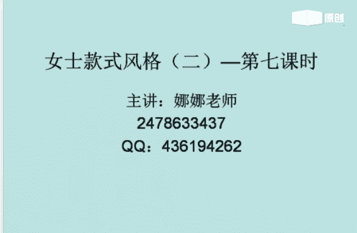
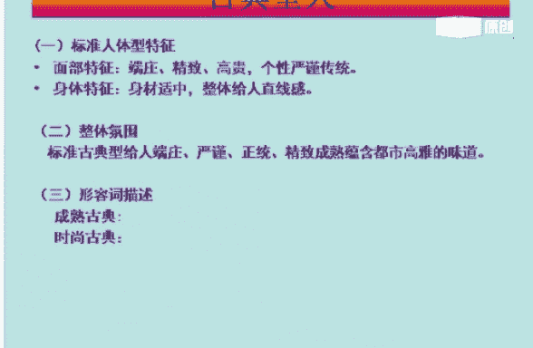
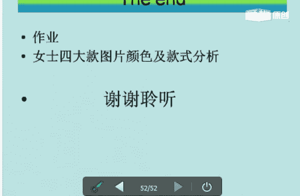

# 个人形象班：1.6：女士款式风格（二）第八课

在本节课中，我们将要学习女士款式风格中的四大类型：古典款、优雅款、浪漫款和戏剧款。我们将详细解析每种风格的人体特征、整体氛围、装扮要点以及适合的服装、色彩、面料和配饰，帮助你系统地掌握如何为不同风格的女士进行形象定位与搭配。

上一节我们介绍了女士风格的基础分类，本节中我们来看看具体的四大风格类型。

## 风格分类概述

综合人体型的特征，女士的风格主要分为八大类。本节课重点讲解其中的四类：古典款、优雅款、浪漫款和戏剧款。人体型的特征主要由三个部分决定：
*   **面部**：占70%，包括轮廓与五官。
*   **性格**：占10%，指个人的气质与内在取向。
*   **身材**：占20%，指高矮胖瘦等体型特征。

## 古典款风格 🏛️

古典款风格给人以端庄、正统、精致、高贵且成熟的感觉。它是**直线型**风格，属于**中量感/重量感**。

### 标准人体型特征
*   **面部特征**：端庄、精致、高贵、个性严谨传统。
*   **身体特征**：身材适中，整体呈直线感，属于中小量感。
*   **整体氛围**：端庄、严谨、正统、精致、成熟，蕴含都市高雅的女人味。

### 风格细分与代表人物
古典款可细分为成熟古典与时尚古典。
*   **成熟古典**：形容词为端庄、精致、高贵、正统、严谨。代表人物有杨澜、敬一丹、刘佳。
*   **时尚古典**：形容词为大家闺秀、大气。代表人物有董洁、蒋雯丽。

### 装扮要点
由于古典型人属于传统型，装扮上需注意：
*   无需刻意强调身材曲线，但需**强调腰线**。
*   领口不宜过低。
*   装饰宜少，适合精致做工。
*   面料需选择**高档面料**。
*   穿职业装最拿手，穿裙装比裤装更漂亮。

以下是古典款适合的具体元素：

**适合的款式及细节**
*   千鸟格纹
*   一步裙
*   毛衫开衫
*   职业套装
*   连身连衣裙
*   旗袍
*   大衣、风衣
*   直板裤
*   标准V领、一字领、小衬衣领

**适合的色彩**
*   中纯度、中明度的理性色彩。
*   淡雅、干净、端庄、素雅的颜色。

**适合的面料**
*   精致的精纺织物、亚光面料、纯天然织物、精致毛料。
*   例如：精织棉、麻、丝绸、细毛料。

**适合的图案**
*   以素色为主。
*   图案中小，排列整齐，如花点、条格。
*   **千鸟格**是首选。

**适合的饰品**
*   传统饰品，如玉镯、珍珠项链、银饰。
*   真皮腰带、表带。
*   无边或金银细边眼镜。

**适合的鞋子**
*   中低跟、经典的浅口皮鞋。
*   鞋跟不宜过高，装饰宜少，做工需精良。

**适合的包包**
*   造型简洁，皮质精细。
*   真皮且少装饰，包带不宜过粗。

**适合的化妆**
*   妆面不宜过分突出某个部分。
*   整体用色柔和，妆面必须**精致**。

**适合的发型**
*   直发、卷发皆可。
*   卷发线条大小需适中，发量感适中。
*   需有一丝不苟、精心打理的感觉。

## 优雅款风格 💐

优雅款风格给人以优雅、温柔、精致、女性化且成熟的感觉。它是**曲线型**风格，属于**中小量感**。

### 标准人体型特征
*   **面部特征**：线条柔美圆润，五官精致。
*   **身体特征**：身材圆润，性格温柔内敛，走路轻盈。
*   **整体氛围**：轻盈、精致、温柔、富有女人味。

### 风格细分与代表人物
优雅款可细分为成熟优雅与时尚优雅。
*   **成熟优雅**：属于中大量感，形容词为精致、优雅、内敛、小家碧玉。代表人物有赵雅芝。
*   **时尚优雅**：属于中小量感，偏曲线型。代表人物有林志玲、刘嘉玲。

### 装扮要点
优雅型人的装扮需注意：
1.  剪裁要合体，但**不要强化胸部和臀部**。
2.  应适当展现**性感关节点**，如肩、锁骨、手腕、脚踝。
3.  裙装比裤装更合适。
4.  可多用飘带、丝巾、镂空面料来营造飘逸氛围。

以下是优雅款适合的具体元素：

**适合的款式及细节**
*   **蕾丝**是首选。
*   针织衫、毛衫、连衣裙。
*   碎花衬衣、一步裙。
*   荷叶边、飘带、灯笼袖。

**适合的色彩**
*   中高明度、中低纯度的色彩。
*   以冷色为主，适合渐变配色。

**适合的面料**
*   轻薄、天然的织物。
*   适合亚光、柔软的面料，拒绝粗糙硬挺。
*   例如：丝、纱、棉、麻、针织、毛织、雪纺。

**适合的图案**
*   碎花、点状、水滴状、晕染的图案。
*   小而纤细的图案。

**适合的饰品**
*   精巧、易碎、轻盈、精致的饰品。
*   最好选择**圆弧形**造型。

**适合的鞋子**
*   中低跟，鞋头圆润。
*   鞋面装饰纤巧，鞋带细窄。

**适合的包包**
*   色泽淡雅，质地细腻。
*   皮质柔软，做工精致。
*   可使用精细的金属链。

**适合的化妆**
*   适合**淡妆**。
*   淡化眉峰，强调睫毛，弱化眼影。
*   唇色淡雅有光泽，妆面必须精致。

**职业装搭配建议**
*   选择偏曲线剪裁、雅致上品的西装套装。
*   在领部、口袋等细节处可使用花边、褶皱装饰。
*   腰部或臀围需收得合体。
*   回避尖锐锋利的剪裁。

**发型建议**
*   **卷发**更适合优雅型。
*   线条需柔和，可披发或松松地盘发。
*   拒绝粗糙、笨重和中性化的发型。

## 浪漫款风格 🌹

浪漫款风格给人以华丽、夸张、迷人、女性化且成熟的感觉。它是**曲线型**风格，属于**中大量感**。

### 标准人体型特征
*   **面部特征**：轮廓圆润，偏曲线型。
*   **身体特征**：身材丰满圆润，女人味十足，眼神妩媚迷人。
*   **整体氛围**：华丽、多情、性感、夸张、大气。

### 风格细分与代表人物
浪漫款可细分为罗曼款与浪漫款。
*   **罗曼款**：偏曲线，如梦幻公主，属于中小量感。代表人物有伊能静。
*   **浪漫款**：华丽、夸张、性感、迷人，属于重量感。代表人物有舒淇、宋祖英、田海蓉。

### 装扮要点
浪漫型人的装扮需注意：
1.  剪裁上**强调身材曲线**（胸、腰、臀），服装需包身或合体。
2.  在领、袖、扣等细节上可采用**蕾丝**。
3.  多用飘带等女性化细节，**裙装比裤装更适合**。

以下是浪漫款适合的具体元素：

**适合的款式及细节**
*   大摆裙、鱼尾裙、花苞裙、阔腿裤。
*   皮草、华丽夸张的晚礼服。
*   多层次花朵、收腰设计、花瓣状飘带、花边、褶皱。

**适合的色彩**
*   **纯度高的粉色**最能体现浪漫。
*   金色、银色，多用较强对比。
*   紫色和金属色也特别适合。

**适合的面料**
*   细腻、精致、光泽感强的面料。
*   例如：丝绒、绸缎、皮革、金银丝织物、蕾丝、刺绣、真丝。

**适合的图案**
*   成熟、写实的花朵图案。
*   大气、梦幻的图案。

**适合的饰品**
*   华丽、繁杂、曲线设计的饰品。
*   适合钻石、水晶、宝石。

**适合的鞋子**
*   细高跟鞋。
*   鞋面装饰宜多，如珠饰、刺绣、亮片、蕾丝、蝴蝶结。

**适合的包包**
*   软皮类包，装饰性强。
*   方形、圆形皆可，或有花纹、花朵装饰。

**休闲装搭配建议**
*   选择华美、夸张、曲线感剪裁的服装。
*   蓬松带褶皱的流畅长裙是首选，质地需柔软。
*   垂感好的宽松裤子可搭配多装饰的上衣。
*   可用大披肩搭配长款毛衣或毛裙。

**职场装搭配建议**
*   面料倾向于柔和、华丽。
*   款式细节上突出浪漫氛围，但**不宜过于华丽或性感**。
*   套装选择应有弧线，强调腰部和臀部曲线。

**适合的化妆**
*   妆面精致艳丽。
*   突出眼睛的妩媚感，唇色可选火红色，妆面可浓艳。

**适合的发型**
*   卷曲的发型，散乱或整齐皆可。
*   适合**大波浪**，需有体积感、空间感和弹力感。

## 戏剧款风格 🎭

戏剧款风格给人以夸张、大气、醒目、有存在感且成熟的感觉。它是**直线型**风格，属于**大量感**。

### 标准人体型特征
*   **面部特征**：线条清晰，轮廓分明，五官立体，很有气场。
*   **身体特征**：骨感、高大，给人醒目、夸张、大气的印象。
*   **整体氛围**：量感十足，醒目夸张。

### 风格细分与代表人物
戏剧款可细分为大戏剧与小戏剧。
*   **大戏剧**：夸张、大气、醒目、华丽、有存在感，属于大量感。代表人物有蔡琴、毛阿敏、韦唯。
*   **小戏剧**：属于中大量感。

### 装扮要点
戏剧型人的装扮需注意：
1.  强化**领部**和**腰部**的造型。
2.  衣服尺寸可略为放大。
3.  身材好者可穿包体服装。
4.  可利用花边、褶皱、流苏、垫肩等突出女性化细节。

以下是戏剧款适合的具体元素：

**适合的款式及细节**
*   **皮草**是首选。
*   大脚裤、宽翻边裤、紧身牛仔裤。
*   大西服领、枪驳头、扇袖、宽袖、流苏。
*   阔腿裤。

**适合的色彩**
*   鲜艳、饱和的色彩，颜色越亮选择越多。
*   可大量运用黑白灰进行搭配。

**适合的面料**
*   垂坠、弹力、硬挺的毛织面料。
*   例如：编织面料、皮革、貂毛。

**适合的图案**
*   夸张、华丽的大图案。
*   颜色反差大的图案，几何图形、建筑图案、大花卉等繁杂图案。

**适合的饰品**
*   大而醒目的饰品，多层次项链，宽腰带。
*   饰品越靠近脸部应越大，可有亮光。

**适合的鞋子**
*   高跟鞋，粗跟细跟皆可。
*   也很适合长筒靴和平底鞋。
*   鞋面需有醒目装饰，鞋底可稍厚重。

**适合的包包**
*   包包需有体积感。
*   装饰宜多，以体现大气。

**适合的化妆造型**
*   强化五官，强调立体感。
*   用色需隆重、夸张。

**适合的发型**
*   长发、短发、直发、卷发皆可。
*   需突出夸张感和量感，避免紧贴头皮。
*   适合大波浪、超高发型，发量感要大。

**休闲装搭配建议**
*   体现夸张、独特、时尚感。
*   选择宽大、时髦的服饰，如大开领、宽松袖搭配阔腿裤。
*   可驾驭直线或曲线剪裁，长裙短裙皆可极致，偶尔尝试男士打扮也别有风格。

**职场装搭配建议**
*   选择时尚、带有锐利感的职业套装，裙子裤子皆可。
*   搭配醒目图案的丝巾、饰品和大方正正的公文包。
*   适合穿宽大外套，西服可加厚垫肩，衣领敞开，显得潇洒。
*   穿套装会显得更大气体干练。

**化妆与色彩建议**
*   选择较为饱和、有冲击力的色彩。
*   可使用能起到对比效果的颜色。

## 课程总结

本节课中我们一起学习了女士四大款式风格：古典款、优雅款、浪漫款和戏剧款。我们详细探讨了每种风格的人体特征、氛围形容词、装扮要点，以及从服装款式、色彩、面料到饰品、鞋包、妆发的全套搭配逻辑。理解并掌握这些风格的核心特征，是进行精准个人形象定位与搭配的关键。希望大家能反复学习，并在实践中灵活运用。