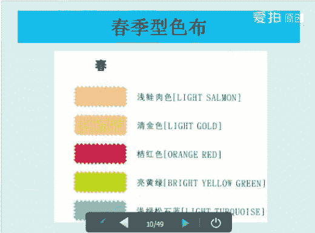
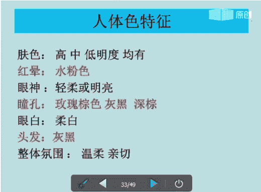
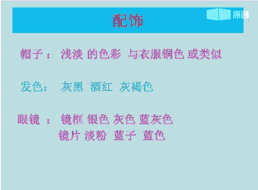

# 个人形象班：06：季型基础-春夏 第三课

在本节课中，我们将要学习色彩搭配与个人季型分析的基础知识，特别是春季型和夏季型的特点、鉴定方法以及搭配技巧。课程内容从色彩的基本属性开始，逐步深入到人体色特征、视觉平衡原理，并详细讲解如何为不同季型的人进行色彩诊断与搭配。

## 色彩的基本属性

上一节我们介绍了对色彩的认识，本节中我们来看看色彩的冷暖与轻重属性。

### 色彩的冷暖
色彩能给人带来冷暖的感觉。以黄色为基调的颜色给人温暖的感觉，属于暖色。以蓝色为基调的颜色给人清冷的感觉，属于冷色。

### 色彩的轻重
色彩也能给人带来轻重的感觉。颜色较浅的会给人淡雅、洁净、轻盈、明亮的感觉，属于“轻”色。颜色较深的会给人沉稳、浓烈、厚重的感觉，属于“重”色。

## 人体色特征

了解了色彩的基本属性后，我们来看看如何将这些属性应用到人身上。人体色特征是我们进行季型分析的基础。

人体色包括肤色、发色、唇色、瞳孔色、眼白色和红晕色。这些是与生俱来、相对恒定的特征。其中，肤色所占比例最大，也相对最稳定。

影响肤色的体内有三种色素：
1.  **血红色素**：影响肤色的冷暖。
2.  **核黄素（胡萝卜素）**：影响肤色的黄调。
3.  **黑色素**：主要影响皮肤的明度（即白皙或黝黑的程度）。

这三种色素的混合比例不同，就形成了不同的人体色特征。

### 肤色的划分
肤色可以从色相和明度两个维度来划分。
*   **色相**：黄种人的肤色主要集中在黄色相和红色相区域，如棕色、酒红色、粉色、象牙色等。肤色也分冷暖。
*   **明度**：指肤色的明暗程度。皮肤越白，明度越高；皮肤越黑，明度越低。

### 眼睛的纯度
眼睛的纯度是决定用色纯度的关键之一，主要由以下两点决定：
1.  眼球与眼白的对比度。
2.  眼神的锋利程度。

以下是判断标准：
*   眼神力度小、温和柔软，则纯度低。
*   眼神力度大、锋利锐利，则纯度高。

## 视觉平衡原理

为什么冷型人要穿冷色，暖型人要穿暖色？其核心原理是为了达到视觉上的**和谐与平衡**。

我们可以这样理解：美的状态是健康、自然、瑕疵淡化、光彩匀整的。理想的肤色位于中性肤色区间。

*   当暖基调的颜色（如衣服）靠近冷色调的皮肤时，会产生“冷残相”叠加，可能使肤色趋向中性，看起来和谐。
*   反之，如果冷色调皮肤再叠加冷色，则可能让皮肤看起来发青、发黑，产生不协调感。

因此，为了视觉和谐：
*   **冷型人**：如果想穿暖色衣服，建议搭配在下身（裙子、裤子）、鞋子或包包上，避免在脸部附近（如上衣、围巾）使用。
*   **暖型人**：同理，建议避免在脸部附近使用冷色调的衣物。

## 四季色彩理论简介

四季色彩理论是根据季节带给人的心理感受，将色彩分为四组，便于记忆和应用。

1.  **春季型**：暖色调中较轻的一种。氛围是朝气、明媚、年轻、活泼、温暖。
2.  **秋季型**：暖色调中较重的一种。氛围是成熟、稳重、华丽、浓郁、丰收。
3.  **夏季型**：冷色调中较轻的一种。氛围是清凉、凉爽、淡雅、柔美。
4.  **冬季型**：冷色调中较重的一种。氛围是强烈、个性、饱和、寒冷。

## 色彩鉴定流程与方法

本节我们将学习如何进行专业的色彩鉴定，这是找到个人季型的关键步骤。

### 鉴定的基本要求
为了保证鉴定准确，需要满足以下条件：

**对环境的要求：**
1.  在自然光下进行。
2.  室内墙壁最好为白色，避免周围色彩反射干扰。
3.  环境温度适宜，避免过冷过热影响肤色。

**对被鉴定者的要求：**
1.  以本身肤色为基准，需彻底卸妆。
2.  不能涂抹防晒霜。
3.  皮肤不能处于暴晒后或过敏期。
4.  需摘掉有色的隐形眼镜。
5.  如果纹了眉毛、眼线或唇，会影响判断。
6.  鉴定时脖子上不要佩戴任何首饰。

### 鉴定流程概述
专业的色彩鉴定遵循以下流程：
1.  电话预约鉴定时间。
2.  准备鉴定专用物品和工具（如色布、白围布等）。
3.  接待客户，讲解四季色彩理论基本原理。
4.  收取费用。
5.  用白围布遮挡客户上身服饰色彩，填写登记表。
6.  为客户卸妆，整理头发。
7.  观察客户的人体色特征（肤色、唇色、发色等）。
8.  使用色布进行冷暖测试（如对比春季型与夏季型色布）。
9.  使用色布进行轻重测试（如对比秋季型与冬季型色布）。
10. 用口红或金属色布进行验证。
11. 用色布反推验证结果，得出正确结论。
12. 用更多色布为客户找出适合的色调。
13. 向客户讲解鉴定报告，分析服装色彩搭配。
14. 预约下次服务时间，将客户资料录入电脑。

### 冷暖测试要点
使用色布测试时，主要观察客户面部在色布映衬下的变化：
1.  **光泽**：适合的色布会让皮肤健康光亮；不适合则显得暗沉。
2.  **匀整**：适合则肤色均匀；不适合则面部斑驳。
3.  **透明度**：适合则皮肤透润；不适合则显得毛孔堵塞。
4.  **立体感**：适合则内轮廓突出，光彩集中；不适合则光点散乱。
5.  **瑕疵**：适合则瑕疵淡化；不适合则瑕疵明显。
6.  **红晕**：适合则红晕自然扩散；不适合则红晕突出或满面通红。
7.  **眼睛**：适合则眼睛有神上扬；不适合则焦点下移，无精打采。
8.  **表情**：适合则表情柔和；不适合则表情呆板或不悦。

### 专业工具：肤色色票与色布
肤色色票对应四季属性，是辅助诊断的工具。例如春季型肤色可能包括淡牙色、浅象牙色等。

专业色布是色彩鉴定的必需工具，通常一组有20块，分为春、夏、秋、冬四组，每组5块，顺序一般为粉、红、黄、绿、蓝。通过快速在客户身上比对色布，可以科学地找出其适合的色彩群。

## 春季型详解

现在，我们进入本节课的重点之一：春季型。春季型属于暖色系，整体给人年轻、朝气、生动的感觉。

### 春季型人体色特征
*   **肤色**：高明度或中明度（即偏白）。
*   **红晕**：珊瑚粉、桃粉色。
*   **眼睛**：眼神轻盈好动，瞳孔呈棕色或棕黄色，眼白为湖蓝色。
*   **头发**：发质较细软。
*   **整体氛围**：娇气、活力、生动。

### 春季型色彩搭配技巧
以下是春季型人着装的用色原则：
1.  适合鲜艳、明亮的色彩群，应以清浅、明亮、温暖、靓丽为主。
2.  色彩群中没有黑色，可用较深的蓝色或棕色代替。
3.  选择蓝色时，应选有光泽感的暖调蓝色，如暖灰、黄调蓝。
4.  适合浅暖灰和中暖灰，但必须带有明亮感。浅水蓝色和桃粉色也是好选择。
5.  适合泛黄的白色（如米白、奶油白），纯白色更适合冬季型。

### 春季型细分与搭配
春季型内部还可细分为三种类型，搭配原则略有不同：

1.  **亮春**
    *   **特征**：中高明度、中高纯度暖基调。头发可能是光茶色或黄溢色，对比感强。
    *   **搭配**：适合鲜艳明亮的色彩，采用清晰明了、有对比效果的搭配原则，突出朝气与俏丽。

2.  **淡春**
    *   **特征**：高明度、中低纯度暖基调。眼神轻盈柔和，头发柔软，肤色白皙均匀透明。
    *   **搭配**：适合浅淡明亮的色彩，采用渐变搭配或邻近色搭配，显得柔和。

3.  **柔春**
    *   **特征**：中明度、中低纯度暖基调。肤色为白皙象牙色，头发棕色，眼神稳重。
    *   **搭配**：适合浅淡柔和的色彩，采用中度对比原则，可使用色相环上间隔4-7格的中差色相配色。

### 春季型四季用色指导
*   **春天**：选用明亮鲜艳的颜色，如浅粉色、桃粉色、淡黄绿色、亮蓝色。
*   **夏天**：选用浅淡柔和的颜色，如浅暖灰、淡紫色、柔和的红色（与桃粉搭配）。
*   **秋天**：选用浅驼色、金棕色、橙色、暖玫瑰色、宝石蓝、绿松石蓝。注意棕色不宜过深，绿松石蓝与橙色搭配很出彩。
*   **冬天**：可以选用一些亮色，如紫色、灰色、灰蓝色作为大衣颜色。

### 春季型配饰选择
*   **帽子**：可与服装形成对比或统一。禁用黑色，过深的颜色会显得怪异。可用类似色搭配（如明黄配紫罗兰）或同色系搭配（如深橘色配橙色）。
*   **发色**：适合棕色、铜色、金色等暖色调。
*   **眼镜**：镜框颜色尽量与眉毛或头发颜色相近、明度协调。肤色浅选浅框，肤色深选深框。
*   **首饰**：适合黄金、宝石类饰品，避免铂金（属冷色调）。
*   **鞋包**：鞋子可选米色、浅驼色；休闲场合可选黄色，约会场合可选绿色。包包与鞋子颜色呼应，整体达到和谐统一。

### 春季型男士
春季型男士眼睛明亮，皮肤白皙。适合用温暖明亮的色彩来表现朝气与活力，搭配上应遵循鲜明对比的原则。适合的颜色包括暖灰、浅肤色、酒红色、棕蓝色、浅绿松石蓝等。

## 夏季型详解

接下来，我们学习夏季型。夏季型属于冷色系，整体给人温柔、亲切、雅致的感觉。

### 夏季型人体色特征
*   **肤色**：明度涵盖高、中、低，肤质轻薄，表现为乳白色或健康的小麦色。
*   **红晕**：水粉色。
*   **眼睛**：眼神轻盈明亮，瞳孔呈玫瑰棕色或灰色，眼白为柔白色。
*   **头发**：以灰黑色为主。
*   **整体氛围**：温柔、亲切。

### 夏季型色彩搭配技巧
以下是夏季型人着装的用色原则：
1.  适合轻柔、淡雅的色彩，以清新、雅致、和谐为主。
2.  不适合穿黑色，尤其不适合藏蓝色。如需深色，可用灰蓝色、蓝灰色或紫罗兰色代替。
3.  穿灰蓝色和蓝灰色会显得高雅、有女人味。不同深浅的灰蓝色可与不同深浅的紫色搭配。
4.  不太适合穿棕色和黄色（这些是秋季型颜色）。如果喜欢，可放在下装或鞋子上。
5.  乳白色、淡蓝色、淡粉色、浅葡萄紫等都是很好的选择。
6.  非常适合蓝紫色系的大衣或套装，能烘托雅致感。

### 夏季型细分与搭配
夏季型内部也可细分为三种类型：

1.  **淡夏**
    *   **特征**：高明度、中低纯度冷基调。眼神柔和，头发柔软呈灰色，肤色乳白。
    *   **搭配**：适合浅淡明亮的色彩，采用渐变搭配或邻近色搭配。

2.  **亮夏**
    *   **特征**：中高明度、中高纯度冷基调。眼睛明亮，头发灰黑。
    *   **搭配**：适合鲜艳明亮的色彩，采用清晰对比的搭配原则，突出娇气与活力。

3.  **柔夏**
    *   **特征**：中明度、中低纯度冷基调。肤色带灰调，眼神稳重，脸颊有淡雅的水粉红晕。
    *   **搭配**：适合浅淡柔和的色彩，采用中度对比原则，可使用中差色相配色。

### 夏季型四季用色指导
*   **春天**：选用柔和的颜色，如淡粉色、柔薰衣草色、清水绿色。
*   **夏天**：选用浅淡柔和的颜色，多用于裙子、衬衫、背心。
*   **秋天**：适合灰蓝色、牡丹紫色等，可与浅淡鲜明的颜色搭配。
*   **冬天**：可选用大胆的颜色，如深灰蓝色、深蓝紫色作为外套大衣的首选色。

### 夏季型配饰选择
*   **帽子**：通常与衣服同色系、同色调，或采用类似色。主要来源于类似色搭配或支配配色方案。
*   **发色**：适合灰黑色、灰褐色、酒红色。妆面色彩应轻柔淡雅，与肤色、发色呼应。
*   **眼镜**：镜框颜色尽量与眉毛或头发颜色相近、明度协调。肤色浅可选柔和粉色、银色镜框；肤色深可选红色或蓝色镜框。
*   **首饰**：适合白金、银饰及清澈淡雅的宝石。避免黄金饰品，会显得庸俗。
*   **鞋包**：鞋子可选乳白色、蓝灰色等柔和色彩。休闲场合可搭配银色、明亮的蓝/黄/紫色；约会场合可选淡粉色、玫瑰粉。避免黑色鞋子。包包选择淡雅明亮的颜色，最好能与衣服、鞋子颜色呼应，达到统一和谐。

## 课程总结

本节课中我们一起学习了个人形象中关于春季型和夏季型的核心知识。我们从色彩冷暖轻重的基础概念出发，深入探讨了人体色特征的构成与分析，理解了视觉平衡的原理。随后，我们系统学习了四季色彩理论，并详细掌握了为春季型和夏季型进行色彩鉴定的完整流程、观察要点及专业工具的使用。最后，我们分别剖析了春季型和夏季型的人体特征、细分类型、四季用色策略以及具体的服装、配饰搭配技巧。

通过本课的学习，希望大家能够初步掌握判断个人色彩倾向的方法，并为后续更深入的造型搭配打下坚实的基础。