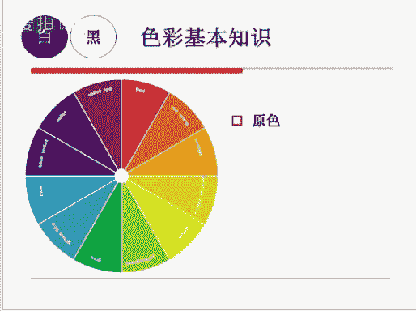
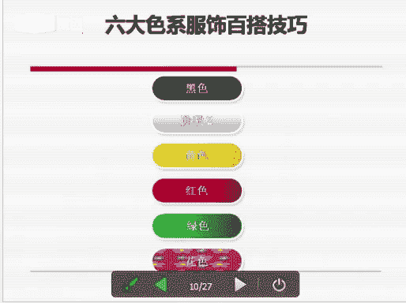
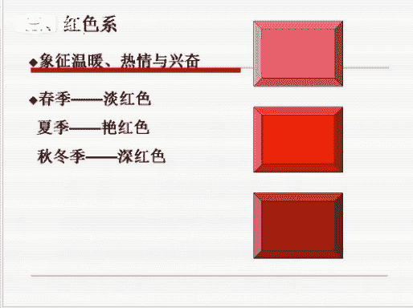
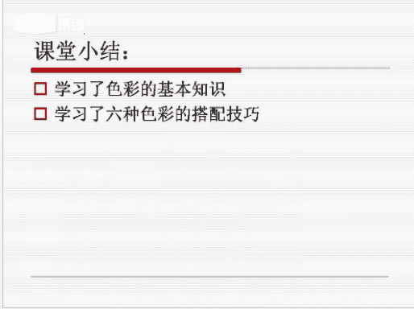

# 个人形象班：服装搭配技巧-第十二课：服装色彩搭配

在本节课中，我们将要学习服装色彩搭配的核心知识与实用技巧。课程分为两个主要部分：首先，我们将回顾并巩固关于色彩的基础知识；其次，我们将深入探讨六种具体的服装配色技巧，帮助你轻松掌握搭配要领。

## 第一部分：色彩基础知识回顾

上一节我们介绍了款式风格，本节中我们来看看色彩的基础理论。理解色彩是进行有效搭配的第一步。

### 1. 三原色

三原色是指不能通过其他颜色混合得到的基本颜色。它分为两个系统：

*   **色光三原色**：红、绿、蓝。这是基于光学理论的原色系统。
*   **色料三原色**：红、黄、蓝。这是基于颜料或染料理论的原色系统。

### 2. 混合色

混合色是在原色的基础上演变而来的。以下是混合色的基本概念：

*   **间色（二次色）**：由两种原色混合而成的新颜色。
    *   **公式**：`原色A + 原色B = 间色`
*   **复色（三次色）**：由间色与其他颜色（原色或间色）混合而成。
    *   **公式**：`间色 + 其他颜色 = 复色`

将复色继续与其他颜色混合，可以得到二次复色、三次复色等，依此类推。

## 第二部分：服装配色方法与技巧

掌握了色彩基础后，我们进入实践环节。以下是几种常用的服装配色方法。

### 1. 协调色搭配法

协调色搭配使用同一种色素或接近的色素，通过颜色的深浅、明暗变化进行组合。它能营造出和谐、统一的视觉效果。

**协调色搭配主要分为两类：**

*   **同类色搭配**：指同一种颜色不同明暗、深浅的搭配。例如：青色配天蓝色，墨绿色配浅绿色，咖啡色配米色，深红色配浅红色。
    *   **效果**：柔和、文雅。
*   **近似色搭配**：指色相环上相邻的两种颜色进行搭配。
    *   **效果**：自然、和谐、柔和。

### 2. 对比配色法

对比配色法利用色相环上对比强烈的颜色（如对比色、补色）进行搭配，能产生醒目、时尚的视觉效果。

**在色相配色中，对比效果由弱到强可分为：**

*   **中差色相配色**：在色相环上间隔4-7格的颜色搭配。效果时尚、稳重。
*   **对照色相配色**：在色相环上间隔8-10格的颜色搭配。效果鲜艳、强烈，容易引人注目，但也可能造成视觉疲劳。
*   **补色色相配色**：在色相环上处于相对位置（间隔约11-12格）的颜色搭配。例如：红色与绿色，橙色与蓝色，黄色与紫色。
    *   **效果**：对比极为强烈、醒目。

## 第三部分：搭配注意事项与核心技巧

了解了基本方法后，我们来看看实际操作中的注意事项和一些百搭技巧。

### 搭配注意事项

1.  **控制色彩数量**：全身大面积色彩最好控制在3-4种以内，以避免杂乱。
2.  **讲究呼应协调**：搭配时，注意让服装、配饰（如包包、鞋子、腰带）的颜色相互呼应，以达到和谐统一的美感。
3.  **善用安全色**：黑色、白色、灰色、牛仔蓝属于“安全色”，它们几乎可以与任何颜色搭配，且不易出错，是构建衣橱的基础。

### 六大色系百搭技巧

以下是针对常见色系的具体搭配建议：

1.  **黑色系 🖤**
    *   **特性**：庄重、神秘、高贵，具有视觉收缩效果。
    *   **搭配技巧**：
        *   可与任何色彩组合，能衬托其他颜色。
        *   与纯色（如玫红色）搭配，时尚感强。
        *   `黑色 + 白色` 是永恒的经典搭配。
        *   搭配有彩色（鲜艳颜色）显得明亮、活泼。

2.  **白色系 ⚪**
    *   **特性**：洁净、明亮、神圣，能提升整体明亮度。
    *   **搭配技巧**：
        *   与任何颜色组合都会显得明快、干净。
        *   是中和造型、消除沉闷感的“特效药”。
        *   在职场搭配中显得干练（如白衬衫配包裙）。
        *   需用有彩色的配饰（丝巾、腰带等）点缀，避免单调。

3.  **红色系 🔴**
    *   **特性**：温暖、热情、兴奋，极具视觉冲击力。
    *   **搭配技巧**：
        *   `红色 + 黑色/白色` 是最简单经典的搭配。
        *   深红色（如酒红）更适合搭配深灰色，显得柔和、高级。
        *   粉红色系搭配显得活泼、年轻，具有少女感。

4.  **黄色系 💛**
    *   **特性**：明亮、华贵、欢乐，是所有有彩色中最亮的颜色。
    *   **搭配技巧**：
        *   `浅黄色 + 白色` 清爽宜人，适合夏季。
        *   `黄色 + 牛仔蓝` 时尚休闲，适合多种场合。
        *   深彩度的黄色（秋冬季）搭配时，需注意整体色彩的厚重感与平衡。

5.  **绿色系 💚**
    *   **特性**：自然、和平、清新，视觉上最舒适。
    *   **搭配技巧**：
        *   搭配 `白色` 或 `灰色` 最安全，不会出错。
        *   可尝试搭配浅蓝色或低彩度的黄色，但对驾驭能力要求较高。
        *   深绿色搭配黑色、灰色或中明度黄色，效果和谐。

6.  **花色系 🌸**
    *   **特性**：图案复杂，可能呈现精致、浪漫或活泼等不同感觉。
    *   **搭配技巧**：
        *   **首要原则**：搭配纯色（素色）单品。例如，花色上衣配纯色下装，或反之。
        *   注意“上浅下深”或“上深下浅”的视觉平衡。
        *   避免选择过于复杂或颜色过于浓艳的花色搭配，容易显得俗气。

---

本节课中我们一起学习了服装色彩搭配的核心知识。我们从色彩的三原色和混合色等基础概念回顾开始，进而学习了协调色与对比色两大配色方法。最后，我们详细剖析了黑、白、红、黄、绿、花色六大色系的特性与实用搭配技巧，并强调了控制色彩数量、讲究呼应和善用安全色等重要原则。掌握这些知识，你将能更有信心地运用色彩，打造出和谐又具个人风格的着装。