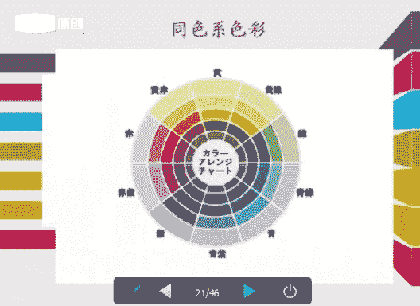
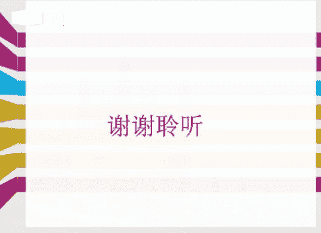

# 个人形象班：06：服装色彩搭配技巧

在本节课中，我们将要学习服装色彩搭配的核心知识与实用技巧。课程将涵盖色彩基础、搭配方法、穿搭原则以及男士着装禁忌，帮助你建立系统的搭配逻辑，告别盲目购物。

## 第一部分：色彩基础知识回顾

上一节我们介绍了服装搭配的理论基础，本节中我们来看看色彩的基本属性。掌握这些是进行有效搭配的前提。

**原色**是指不能用其他颜色混合而成的色彩，属于基本色。公式表示为：`原色 ∈ {红, 黄, 蓝}`（色料三原色）或 `原色 ∈ {红, 绿, 蓝}`（色光三原色）。

**色相**是指色彩的相貌和名称，例如红、橙、黄、绿、蓝、紫。

**明度**是指色彩的明暗程度。颜色中混合的白色越多，明度越高；混合的黑色越多，明度越低。在油彩色中，黄色明度最高，紫色明度最低。

**纯度**（也称彩度）是指色彩的鲜艳饱和程度。色彩越接近纯色，纯度越高；混合的其他颜色越多，纯度越低。五彩色（黑、白、灰）只分明度，不分纯度。

**色调图**展示了明度与纯度共同作用形成的色彩调子。其纵轴表示明度变化，横轴表示纯度变化。理解色调有助于把握色彩的整体倾向。

## 第二部分：服装颜色搭配技巧

理解了色彩基础后，我们进入实战环节，学习几种核心的配色方法。

以下是五种常用的色彩搭配技巧：

1.  **近似色搭配**
    在色相环上选择相邻或角度接近的颜色进行搭配，例如蓝色配绿色、橙色配红色。这种搭配和谐、稳定，不易出错。

2.  **对比色搭配**
    在色相环上选择相距120度到180度的颜色进行搭配，例如紫色配黄色。这种搭配对比强烈、醒目时尚，但对驾驭能力要求较高。

3.  **互补色搭配**
    在色相环上选择直接对立的颜色进行搭配，例如红色与蓝绿色。效果同样强烈醒目。对于如“红配绿”这类经典互补色，可以加入黑、白、灰等无彩色进行过渡，使搭配更协调。代码逻辑可理解为：`搭配 = 颜色A + 颜色B + 分离色(黑/白/灰)`。

4.  **同色系搭配**
    选择同一色相下，不同明度或纯度的颜色进行搭配，例如深灰、中灰、浅灰的组合。这种搭配高级、统一，是凸显质感的优选。

5.  **上下呼应搭配**
    也称为“三明治搭配法”，指服装的整体色彩在上下或配饰间形成呼应，例如鞋子与包包同色、腰带与丝巾同色。这能增强造型的整体感和精致度。

## 第三部分：需要注意的穿搭原则

学会了配色技巧，我们还需要掌握一些通用的穿搭原则，以确保整体造型的和谐与得体。

以下是四个重要的穿搭原则：

1.  **全身颜色不超过三种**
    对于初学者，建议全身主色不超过三种（黑、白、灰不计入内），以保持视觉上的简洁与高级感。

2.  **避免上下装花纹图案完全一致**
    上衣和下装若采用完全相同的花纹或图案，容易显得呆板怪异。建议采用“上花下素”或“上素下花”的搭配方式。

3.  **善用黑、白、灰进行调和**
    黑、白、灰属于无彩色，是永恒的经典搭配色，可以与任何颜色搭配。当两种颜色搭配不协调时，加入黑、白、灰作为过渡色或隔离色，能有效提升和谐度。

4.  **巧用小配饰打破沉闷**
    如果衣柜里的衣服色彩不够丰富，可以通过更换不同的配饰（如项链、腰带、丝巾、手包、帽子）来为造型注入新意，实现“一衣多穿”。

## 第四部分：男士穿衣七大禁忌

最后，我们特别为男士总结了一些常见的着装误区，帮助大家避免踩坑。

以下是男士着装中需要避免的七个问题：

1.  **外套过于冗长**
    过长（尤其是及膝或过膝）的夹克或外套容易显得拖沓、臃肿，破坏身材比例。应选择合身、精干的短款款式。

2.  **皮带款式与场合不符**
    休闲款皮带（如针扣、编织款）不适合搭配正式西裤；正式皮带（如板扣、光面款）也不应搭配牛仔裤。皮带款式宜简洁，装饰不宜过多。

3.  **混搭风格混乱**
    避免将正式衬衫与牛仔裤、运动鞋进行混搭，同时搭配夸张的腰带，会导致风格不伦不类。应保持风格统一：正装配皮鞋，休闲装配休闲鞋。

4.  **领带过长或衬衣下摆外露**
    领带长度应以尖端刚好触及皮带扣为准。衬衣下摆应完全扎进裤腰，且选择合身款式，避免因过长而在腰部堆积造成累赘。

5.  **衬衣面料软塌、领口紧闭**
    软塌无型的衬衣面料以及只系一粒扣的穿法显得不够精神。选择挺括面料的衬衣，并解开第一粒扣，能更显潇洒与活力。

6.  **西装不合身**
    西装过大或过小都会影响形象。合身的西装肩线应刚好落在肩头，衣长盖过臀部，扣上纽扣后不会产生紧绷的“X”形褶皱。

7.  **裤脚堆积过长**
    过长的裤脚在鞋面堆积，会显得邋遢且腿短。无论是西裤还是休闲裤，都应修改至合适的长度，确保裤脚自然垂落在鞋面。

---

本节课中我们一起学习了色彩的三属性（色相、明度、纯度）、五种实用的配色方法（近似色、对比色、互补色、同色系、上下呼应）、四项通用的穿搭原则以及男士着装的七大禁忌。掌握这些知识，你将能更自信地选择适合自己的服装，构建和谐、得体的个人形象。