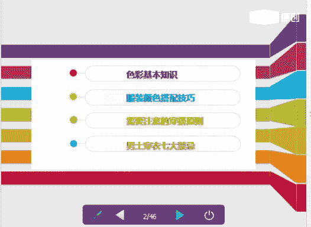
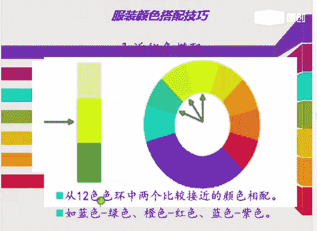
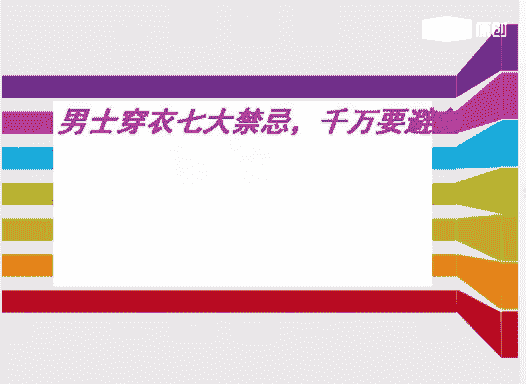

# 个人形象班：1.06：服装色彩与搭配技巧

## 概述
在本节课中，我们将学习服装色彩的基础知识、搭配技巧、穿搭原则以及男士穿衣的禁忌。课程内容旨在帮助大家理解色彩原理，掌握实用的搭配方法，从而提升个人形象。

---

## 第一部分：色彩基础知识回顾

上一节我们介绍了课程的整体框架，本节中我们来回顾一下色彩的基础知识，这是进行有效搭配的基石。

### 1. 三原色
三原色是指无法通过其他颜色混合而成的颜色。它分为两个系统：
*   **光的三原色**：**红、绿、蓝**。
*   **染料三原色**：**红、黄、蓝**。

### 2. 色彩三属性
色彩可以通过三个基本属性来区分和描述。

**色相**
色相是色彩的名称和相貌，与明度、纯度无关。例如：红色、蓝色、橙色。基本色相包括红、橙、黄、绿、蓝、紫。

**明度**
明度指色彩的明暗程度。在纯色中加入白色，明度提高；加入黑色，明度降低。
*   **公式**：`纯色 + 白色 -> 高明度`；`纯色 + 黑色 -> 低明度`。

**纯度**
纯度指色彩的鲜艳和饱和程度。色彩越接近纯色，纯度越高；混合的其他颜色越多，纯度越低。
*   **注意**：黑、白、灰属于无彩色，没有纯度，只有明度。

### 3. 色调图（PCCS色调图）
色调是明度与纯度混合后形成的色彩整体倾向。同一色调的颜色具有一致的明度和纯度特点。
*   **纵轴**：表示明度变化，上方明度高，下方明度低。
*   **横轴**：表示纯度变化，左侧纯度高，右侧纯度低。
*   **核心概念**：所有色调（如V调、S调、B调等）都由原色调（V调）通过加入不同比例的白、灰、黑演变而来。

---

## 第二部分：服装颜色搭配技巧

掌握了色彩的基础属性后，我们来看看如何将这些知识应用到实际的服装搭配中。以下是几种核心的搭配方法。

**近似色搭配**
在色相环上，位置相邻的颜色进行搭配。例如：蓝色与绿色、橙色与红色。

**对比色搭配**
在色相环上，相距120度到180度的颜色进行搭配，视觉效果强烈。例如：紫色与黄色、宝蓝色与橘红色。

**互补色搭配**
在十二色相环上，处于对立位置的颜色。例如：红色与绿色、紫色与黄绿色。搭配时可采用“分离配色”技巧，在两色之间加入无彩色（黑、白、灰）来调和。

**同色系搭配**
使用同一色相中，不同明度的颜色进行搭配。例如：在灰色系中，选择深浅不同的灰色单品组合。

**上下呼应搭配**
也称为“三明治搭配法”，指服装的某个部分（如上衣）与另一部分（如鞋子）在颜色上相互呼应，使整体造型和谐统一。全身颜色最好不超过三种。

---

## 第三部分：需要注意的穿搭原则

了解了具体的搭配技巧后，我们还需要遵循一些基本的穿搭原则，以确保整体造型不出错。

**全身颜色不超过三种**
当你不确定自己的风格时，将全身颜色控制在三种以内是最安全的选择。建议以黑、白、灰等无彩色为主，再搭配一至两个有彩色。

**避免上下装花纹/图案完全相同**
如果上装选择了花纹或图案，下装应选择素色；反之亦然。上下同时使用复杂图案容易显得杂乱不协调。

**善用黑白经典搭配**
黑色与白色是永恒的经典，可以与任何颜色搭配，并能起到调和与分离的作用，让整体造型显得自然和谐。

**巧用配饰点缀**
当服装色彩比较单一时，可以利用配饰进行点缀，起到画龙点睛的作用。实用的配饰包括：
*   **腰带**：能明确腰线，提升精神感。
*   **丝巾**：为颈部增添色彩和层次。
*   **包包/鞋子**：与服装其他部分颜色呼应。

---

## 第四部分：男士穿衣七大禁忌

最后，我们特别为男同学总结了一些常见的穿衣禁忌，帮助大家避免搭配误区。

**1. 夹克忌过长**
选择短款、合身的夹克会更显精神；过长、过肥的款式会破坏身材比例，显得臃肿。

**2. 忌复杂皮带与错误裤型**
职场着装应选择简洁的皮带，避免过多装饰。裤子宜选择合身的竖条纹款式，更显利落。

**3. 忌风格混搭不协调**
避免将正式的衬衫与休闲的牛仔裤、运动鞋混搭，会造成既不正式也不休闲的尴尬感。应保持上下装风格一致。

**4. 忌衬衫过长、领带过长**
衬衫下摆不宜过长，应选择合身或收身款式。领带长度应适中，尖端刚好触及皮带扣为宜。

**5. 忌衬衫领子软塌**
穿着西装时，应搭配挺括的硬领衬衫，软塌的领子会显得不够精神。

**6. 忌西装不合身**
西装最重要的是合身，尤其是第一颗扣子的位置要合适。过于宽大的西装会导致重心下移，显得拖沓。

**7. 忌西裤过长、搭配休闲鞋**
西裤长度应刚好触及鞋面，过长会堆积在脚踝处。西裤应搭配皮鞋，而非休闲鞋。

---

## 总结
本节课我们一起学习了色彩的三原色、三属性等基础知识，掌握了近似色、对比色、互补色等多种服装搭配技巧，了解了全身颜色不超过三种等基本穿搭原则，并特别指出了男士穿衣需要避免的七大禁忌。希望大家能将这些知识运用到日常穿搭中，逐步提升个人形象。