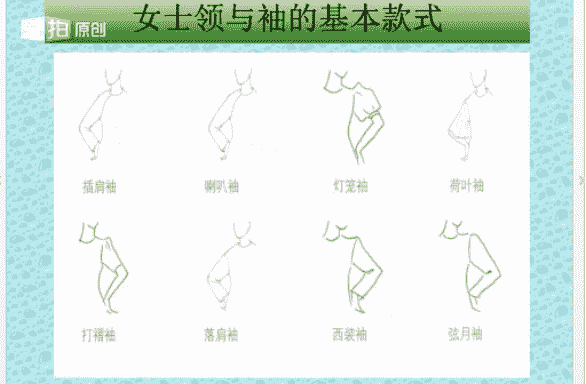

# 个人形象班：1.06：款式风格基础-第五课 🎨

在本节课中，我们将要学习款式风格的基础知识。风格是塑造个人形象的核心，理解其构成要素，能帮助我们更精准地选择服装与配饰，展现独特的个人魅力。本节课将系统介绍风格的定义、构造以及如何应用于服装分析。

## 风格的定义

上一节我们介绍了色彩与四季型人的基础，本节中我们来看看风格是什么。风格在我们的生活中无处不在，任何事物、行业或流派都有其独特的风格。例如，在服装、配饰、艺术、建筑和音乐等领域，风格都扮演着重要角色。

风格可以定义为：一个时代、民族、流派或个人在其文化或文艺作品中所表现出的**主要思想与艺术特点**。简单来说，风格就是**共性**与**特性**的结合。

与风格含义相近的词语包括：风度、品格、气魄、风采、风韵、主义、流派等。

## 风格的构造

理解了风格的定义后，我们来看看风格是如何被构造出来的。风格的构造源于物体造型的主要特征给人带来的心理感受。我们对物体的最初认识，通常来自其造型。

物体的造型主要由三个要素组成：
1.  **色彩**：指色相、明度和纯度。
2.  **形状**：指轮廓、量感和比例。
3.  **材质**：指纹理、光滑度、硬度和透明度等。

在风格构成中，各要素的视觉影响力占比为：
*   色彩：**65%**
*   形状：**25%**
*   材质：**10%**

## 形状的三要素：轮廓、量感、比例

形状是风格构造的关键部分，它本身又包含三个核心概念：轮廓、量感和比例。

### 轮廓

轮廓是构成任何形状的边界线或外形线。我们根据视觉感受，将轮廓分为三类：
*   **直线形**：轮廓有棱有角，例如五角星。
*   **曲线形**：轮廓圆润，呈花瓣状或可爱的小动物形状。
*   **中间形**：轮廓中直线与曲线混合，难以明确划分为直线或曲线。

### 量感

量感是视觉和触觉对物体规模、程度、速度等方面的感觉。它是对物体大小、多少、长短、粗细、方圆、厚薄、轻重、快慢、松紧等量态的认识。
*   **大量感**：指体积大、规模大的物体。
*   **小量感**：指体积小、规模小的物体。

### 比例

比例是指总体中各个部分的数量占总体数量的比重，它反映了总体的构成和结构。
*   **正常比例**：给人舒适、和谐、平和的感受。
*   **特殊比例**：给人怪异、独特、时尚、另类的感受。

## 物体风格的判断

任何物体（包括服装）的风格，都可以通过其色彩、形状和材质来分析。以下是两种典型风格的示例：

### 少女风格（可爱型）
*   **风格联想**：小巧、童趣、天真、轻巧、乖巧、顽皮、古灵精怪、讨人喜欢。
*   **典型用色**：中高明度、鲜艳的色彩，色相偏暖，常以橙色系为主导。
*   **典型形状与图案**：曲线形轮廓，小量感。图案多为小花朵、小圆点、蝴蝶结等。
*   **典型材质**：触感柔软、轻盈、毛茸茸的面料，如泡泡纱、棉布、雪纺。

### 优雅风格
*   **风格联想**：温柔、女性化、温软、精致、细腻、优雅。
*   **典型用色**：中明度、中纯度，色彩偏冷，以紫色和蓝色为主，整体感觉柔和、成熟、雅致。
*   **典型形状与图案**：曲线形轮廓，中量感。图案带有流线感，如漩涡状花草或细小、随意分布的图案。
*   **典型材质**：轻柔、细腻、触感柔和的面料，如雪纺、真丝。

## 女装的特征分析

了解了物体风格的判断方法，我们将其应用到具体的女装上。女装的基本组成部分包括：上衣、裙子、裤子、鞋子、包包和饰品。

分析服装的直曲与量感时，应从其**剪裁、图案、面料**三个核心组成部分入手。

### 上衣
上衣由领、袖、衣片和饰物（如扣子、口袋）组成。
*   **领子的直曲**：由领面外轮廓线和领口线的直曲决定。有棱角的为直线形，圆润的为曲线形。
*   **领子的量感**：由领口开合的大小决定。开口大，量感大；开口小，量感小。
*   **袖子的直曲**：由肩与袖形成的角度及袖口轮廓线决定。
*   **袖子的量感**：由袖面的宽幅和裁剪的松紧度决定。
*   **衣片的直曲**：由衣服边缘的外轮廓线、分割线及装饰物轮廓决定。
*   **衣片的量感**：由衣片的幅度和装饰物的大小决定。幅度越大、装饰越多，量感越大。

### 下装（裙子与裤子）
*   **裙/裤的直曲**：由外在轮廓线条决定。
*   **裙/裤的量感**：从心理感受判断。款式夸张、体积大为大量感（如大百褶裙、阔腿裤）；款式轻盈、简洁为小量感（如一步裙、小脚裤）。

### 图案
*   **图案的直曲**：
    *   直线形图案：条纹、方格、几何图形、字母、猛兽类图形（如蜘蛛）。
    *   曲线形图案：圆点、水滴、花朵、可爱的小动物图形。
*   **图案的量感**：
    *   大量感图案：对比强烈、花朵大、格纹大、醒目、夸张、繁杂的图案。
    *   小量感图案：对比弱、花朵小、格纹小、简洁的图案。

### 面料
*   **面料的直曲**：
    *   直线形面料：硬挺、不易起皱，如皮革、牛仔布。
    *   曲线形面料：柔软、细腻、轻盈、飘逸，如雪纺、真丝。
*   **面料的量感**：
    *   大量感面料：纹路粗犷、挺括、厚重。
    *   小量感面料：轻盈、飘逸、薄透。

## 配饰的风格分析

风格的一致性也体现在配饰上。鞋子、包包、饰品、眼镜、手表乃至发型和妆面，都可用直曲和量感来分析。
*   **直曲判断**：观察物品的外轮廓线条。有棱角、方正为直线形；圆润、有弧度为曲线形。
*   **量感判断**：观察物品的体积、装饰的繁简与醒目程度。体积大、装饰夸张为大量感；体积小、装饰精致为小量感。

## 人体型的特征

最终，服装与配饰的风格需要与人的自身特征相和谐。人体型的特征主要由面部轮廓、身材高矮胖瘦以及性格倾向决定。
*   **影响占比**：面部（70%），其中眼神影响性格的50%；身材（20%）；性格（10%）。

### 面部的直曲与量感
*   **面部的直曲**：由面部骨骼形态和五官线条取向决定。
    *   直线形：五官轮廓分明，骨感强，有力度。
    *   曲线形：五官圆润，面部丰满。
    *   **眼神是重要判断依据**：眼神力度大、有穿透力，偏直线形；眼神柔和、含蓄，偏曲线形。
*   **面部的量感**：由五官比例大小和脸型骨架大小决定。眼神力度越大，量感越大。

### 身材的直曲与量感
*   **身材的直曲**：主要由肩、腰、胯形成的线条决定。
    *   直线形身材：平肩，身材呈H型。
    *   曲线形身材：肩部圆润，身材呈S型。
*   **身材的量感**：由骨骼大小、轻重、厚薄决定。通常，胖比瘦、高比矮、骨骼大比骨骼小的人量感更大。

### 性格的直曲
*   **直线形性格**：个性直率、大方、鲜明、张扬，给人干练、利落的中性化感觉。
*   **曲线形性格**：温柔、内敛、含蓄、优柔，女性化感觉更强。
*   性格还可通过语音语调、书写字体和语言氛围来判断。

---

本节课中我们一起学习了款式风格的基础知识。我们明确了风格是共性与特性的结合，并深入探讨了构成风格的三大要素：色彩、形状和材质。我们重点学习了如何通过轮廓、量感、比例来分析形状，并将这套方法应用于服装、配饰乃至人体特征的分析中。理解这些基础概念，是后续学习具体女士与男士款式风格的重要前提。下节课，我们将开始学习女士的款式风格分类。