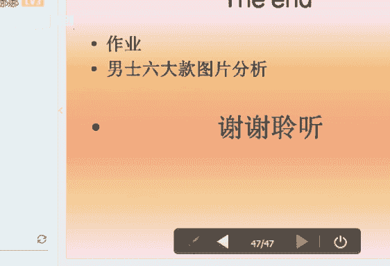

# 个人形象班：06：男士款式风格-第七课

## 概述
在本节课中，我们将要学习男士服饰的款式风格分类。通过学习，你将能够识别并理解六大男士风格的特征、服饰要点和搭配原则，从而找到最适合自己的着装风格。

---

## 课程导入
上一节我们介绍了女士的款式风格。本节中，我们来看看男士的款式风格分类。男士风格同样基于人体型的特征进行分析，主要分为六大类。

## 男士款式风格分类
男士款式风格与女士一样，都是通过分析面部轮廓、身材特征和性格取向来确定的。男士风格主要分为以下六类：
*   戏剧型
*   浪漫型
*   古典型
*   自然型
*   阳光前卫型
*   新锐前卫型

## 风格鉴定方法
以下是三种鉴定个人款式风格的方法：

**1. 解读法**
解读法是根据顾客与生俱来的形体特征、外在气质和整体氛围，用贴切的形容词进行描述，进而判断其服饰风格。

**2. 排除法**
排除法是首先分析顾客的型特征，得出其轮廓、量感等信息，然后对照个人款式风格进行逐一排除，以确定风格趋向。需要注意的是，男士的直曲主要体现在**线条的硬朗与柔和程度**上。

**3. 工具法**
工具法是使用色彩顾问专用的款式风格鉴定工具，找出与顾客型特征相匹配的信息，从而进行人的服饰风格判断。

## 六大风格详解

### 1. 阳光前卫型 🎨
阳光前卫型给人以年轻、个性、时尚、调皮可爱的感觉。

**标准特征：**
*   线条：比较明朗。
*   五官：偏小。
*   身材：小骨架，显得活泼。

**服饰要点：**
以下是阳光前卫型的服饰搭配要点：

*   **细节**：在领、袖、扣等细节部位应体现当季流行元素。
*   **款式**：适合小领口或拉链式西服，以衬托年轻感。在休闲场合可选择时尚休闲装或紧身上衣。
*   **色彩**：适合采用**对比色彩组合**或具有视觉冲击力的鲜艳色彩。
*   **面料**：适合选择棉、毛、各类皮革及闪光硬挺的化纤面料。
*   **图案**：适合个性化或可爱的几何条纹、格子、小动物及抽象类图案。
*   **配饰**：应选择造型独特、时尚新潮的饰品，鞋类装饰感要强，包包可选斜挎包、双肩包或多袋包。
*   **发型**：适合当季流行的发型。

### 2. 新锐前卫型 🎸
新锐前卫型个性锐利、时尚、年轻，带有些许叛逆感。

**标准特征：**
*   面部轮廓：分明。
*   五官：个性立体。
*   身材：匀称、骨感、小骨架。

**服饰要点：**
以下是新锐前卫型的服饰搭配要点：

*   **细节**：在领、袖、扣、图案等细节部分表现当季流行元素。适合小枪驳头领、多粒扣、合体收身的西服套装，以及尖领、立领衬衫。
*   **色彩**：适合极具时尚感和前卫感的色彩，善于使用**无彩色和金属色**。
*   **面料**：首选皮革、硬挺化纤及闪光的各种流行新型面料。
*   **图案**：适合不规则条纹、格子、抽象几何图形或怪异的动物类等个性化图案。
*   **配饰**：适合造型怪异、时尚感强的鞋子和公文包。
*   **发型**：适合个性化、时尚感强的发型与发色。

### 3. 自然型 🌿
自然型给人以亲切、随意、成熟、大方、可信赖的感觉。

**标准特征：**
*   面部线条：相对柔和。
*   神态：轻松自然。
*   身材：带有运动感。

**服饰要点：**
以下是自然型的服饰搭配要点：

*   **款式**：西装造型应简单大方，突出随意感。不适合方领、宽长领或尖领衬衫，也不太适合过于收身的西服套装。适合上下分身搭配与敞开衣扣的穿着方式。
*   **色彩**：适合比较柔和的色彩，避免过于靓丽鲜艳。
*   **面料**：首选**棉、麻**等天然质感的面料。
*   **图案**：适合条纹、边缘粗糙的几何图形、民族图案或自然花草图案。
*   **配饰**：饰品造型应简单，可带有异域风情。鞋子和包包造型简洁，皮质柔软。
*   **发型**：适合自然随意、带有运动感的发型。

### 4. 古典型 🏛️
古典型给人以成熟、端庄、正统、高贵、严谨的感觉。

**标准特征：**
*   面部线条：适中。
*   五官：端正。
*   体型：匀称适中，给人以高贵与正式感。

**服饰要点：**
以下是古典型的服饰搭配要点：

*   **细节**：服饰做工需精良，剪裁合体。适合传统样式的西装、三件套西装，以及标准领形或立领衬衫。
*   **色彩**：适合偏理性的色彩，如**灰色、深藏蓝、蓝灰、米色、驼色**。
*   **面料**：适合挺括的精纺毛料、丝织物、针织物及细腻的软皮革。
*   **图案**：适合排列整齐、中规中矩的条纹或格纹图案。
*   **配饰**：适合精致高贵、样式经典、做工精良的饰品。适合质量上乘的皮鞋和方正规整、大小适中的公文包。
*   **发型**：适合规矩整齐的三七分或四六分发型。

### 5. 浪漫型 💖
浪漫型给人以夸张、大气、成熟、华丽、性感的感觉。

**标准特征：**
*   面部与五官线条：柔和。
*   轮廓：不应急。
*   眼神：柔和性感。
*   身材：成熟饱满。

**服饰要点：**
以下是浪漫型的服饰搭配要点：

*   **细节**：适合做工精致、垂感好的西服套装，以及标准领、领扣领、立领衬衫。领带适合花型、漩涡型等曲线感强或图案华丽的款式。
*   **色彩**：适合**鲜艳、饱和、华丽**的色彩。
*   **面料**：适合光泽感强、柔软华丽的面料，如真丝、精纺羊绒。
*   **图案**：适合花朵、水波纹等曲线感强的图案。
*   **配饰**：适合夸张华丽、金属圆润的饰品。鞋面可有较多装饰，款式线条柔和，皮质柔软。包包适合多华丽扣式的皮包，拼接款式是首选。
*   **发型**：适合柔软蓬松的卷发或长发。

### 6. 戏剧型 🎭
戏剧型给人以成熟、夸张、大气、醒目、气场强大的感觉。

**标准特征：**
*   面部轮廓：线条分明、硬朗。
*   五官：夸张立体。

**服饰要点：**
以下是戏剧型的服饰搭配要点：

*   **细节**：适合欧式宽大西服、大开领、双排扣等款式，以及大方领、大尖角领衬衫。驾驭能力强，也可尝试立领、枪领等。
*   **色彩**：适合**对比色彩组合**和高纯度的色彩。
*   **面料**：适合粗纺的高档面料、幅度宽的皮革。
*   **图案**：适合大图案、抽象的几何图形、动物、建筑、花卉等。
*   **配饰**：适合造型独特、装饰感强、引人注目的饰品。鞋包可选择当季流行且带有夸张装饰的款式。
*   **发型**：长短卷发均可，但一定要夸张，如背头、发髻等。

---

## 总结
本节课中我们一起学习了男士六大款式风格：阳光前卫型、新锐前卫型、自然型、古典型、浪漫型和戏剧型。每种风格都有其独特的特征、服饰要点和搭配逻辑。关键在于理解**线条的硬朗与柔和**是区分男士风格的核心，并通过分析面部、身材和整体氛围来找到最适合自己的风格。课后请多搜集图片进行分析练习，以巩固所学知识。