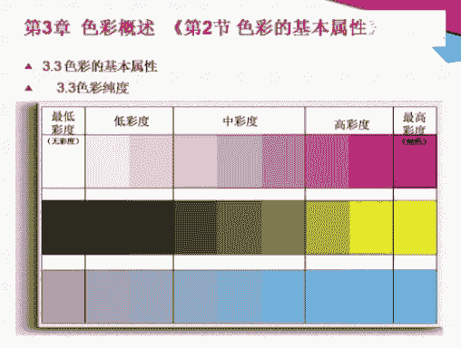
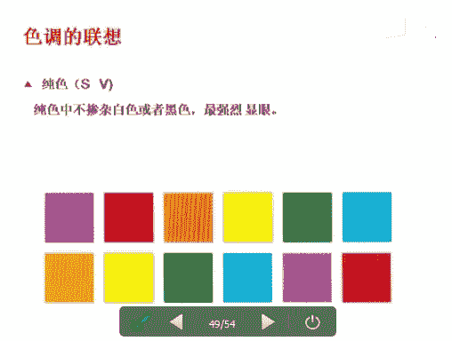
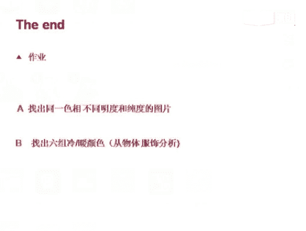

# 个人形象班：01：色彩基础理论

在本节课中，我们将要学习色彩的基础理论，这是个人形象与服饰搭配的基石。课程将涵盖四季色彩理论、色彩的基本属性、分类以及色彩的心理感受，帮助你建立系统的色彩认知。

## 第一章：四季色彩理论

上一节我们介绍了课程概述，本节中我们来看看什么是四季色彩理论。

四季色彩理论将人与生俱来的肤色、发色、瞳孔色等人体色特征，与自然界纷繁的色彩科学相对应，归纳出和谐搭配的规律。该理论由美国色彩大师卡罗尔·杰克逊女士创立，她通过大量测试，将常用色按基调的冷暖、明度和纯度进行划分，对应形成春、夏、秋、冬四大色彩群。

以下是四季色彩理论的要点：
*   **春季型**：色彩明亮、鲜艳、温暖，给人以活力、清新的感觉。
*   **夏季型**：色彩柔和、淡雅、凉爽，给人以温柔、宁静的感觉。
*   **秋季型**：色彩浓郁、厚重、温暖，给人以成熟、稳重的感觉。
*   **冬季型**：色彩鲜明、对比强烈、冷峻，给人以冷艳、利落的感觉。

每个人都能在四季色彩中找到最适合自己的色彩群，从而实现服饰、妆容与自身条件的和谐统一。

## 第二章：认识色彩

理解了四季色彩理论后，我们进入本章，来深入认识色彩本身。

### 第一节：光与色

人们凭借光来辨别物体的颜色和形状。1666年，牛顿使用三棱镜将白光分解为光谱，揭示了光的色彩本质。

光由不同波长的电磁波组成，人眼可见的光谱波长范围在 **380nm 至 780nm** 之间。其中，红色波长最长，紫色波长最短。

### 第二节：色彩的识别与分类

识别色彩需要三个要素：**光、物体、眼睛**。物体本身不发光，其颜色是光投射到物体上，经过吸收和反射后，进入人眼所产生的感觉，这被称为“物体色”。例如，苹果呈现红色，是因为它吸收了红色以外的所有色光，只反射红光。

眼睛的结构类似于照相机：晶状体如同镜头，瞳孔如同光圈，视网膜如同胶卷。视网膜上的视锥细胞能感知红、绿、蓝三色光。

根据光源不同，我们看到色彩的形式也不同：
*   **光源色**：光源本身的色彩，如太阳光（自然光）或灯光（人工光）。
*   **透过色**：光线穿透透明或半透明物体后呈现的色彩，例如蓝色的饮料瓶。
*   **表面色**：光线在物体表面反射后展现的色彩，例如红色的苹果。

色彩可以分为以下几类：
*   **有彩色**：带有色彩感的颜色，如红、橙、黄、绿、蓝、紫。
*   **无彩色**：黑、白、灰。它们只有明度变化，没有色相和纯度，是百搭色。
*   **金属色**：金、银、铜等特殊色，常作为点缀色提升时尚感。

### 第三节：色彩的三属性

颜色可以通过三个属性来精确描述和区分，即色相、明度和纯度。

**1. 色相**
色相是色彩的名称和相貌，如红色、蓝色。它与明度、纯度无关，由光的波长决定。波长长的是红色，波长短的是紫色。色相按顺序排列形成色相环。
在色相环中：
*   相距约30度的颜色为**同类色**。
*   相距约50度的颜色为**类似色**。
*   相距90-180度的颜色为**对比色**或**互补色**。

**2. 明度**
明度指色彩的明暗程度。物体反射所有光线时呈白色（高明度），吸收所有光线时呈黑色（低明度）。颜色越浅白，明度越高；颜色越深暗，明度越低。在色相环中，黄色明度最高，蓝色明度最低。

**3. 纯度**
纯度指色彩的鲜艳程度，也称饱和度。色彩越接近纯色，纯度越高；混合的其他颜色越多，纯度越低。纯度也分为高、中、低等级。无彩色（黑白灰）没有纯度，只有明度。

## 第三章：色彩的视觉与心理效应

掌握了色彩的基本属性，本节我们来看看色彩如何影响我们的视觉感知和心理感受。

### 第一节：色彩的视觉现象

色彩会受到周围环境的影响，产生一些视觉错觉现象。
*   **残像**：长时间注视一种颜色后，将视线移至白色表面，眼前会出现该颜色的互补色。例如，注视红色30秒后看白墙，会看到绿色。
*   **色相对比**：某种色彩受周围色彩影响，使得两色对比看起来更加强烈。背景色面积越大，对前景色的影响也越大。
*   **前进色与后退色**：暖色系（如红、橙）给人向前凸出的感觉，是前进色；冷色系（如蓝、紫）给人向后收缩的感觉，是后退色。
*   **膨胀色与收缩色**：同样大小的形状，明亮的颜色看起来比暗色显大（膨胀），冷色比暖色显小（收缩）。
*   **轻色与重色**：明度高的浅淡色彩感觉轻盈、柔和；明度低的深暗色彩感觉沉重、坚硬。

### 第二节：色彩的联想与象征

色彩能引发人们特定的心理联想和情感反应。
*   **红色**：联想到火焰、国旗。象征热情、生命、危险。
*   **橙色**：联想到橙子、柿子。象征温暖、欢快、平凡。
*   **黄色**：联想到阳光、香蕉。象征明亮、愉悦、智慧。
*   **绿色**：联想到草木、春天。象征和平、安全、生命，有助于缓解视觉疲劳。
*   **蓝色**：联想到天空、大海。象征冷静、理性、信赖。
*   **紫色**：联想到紫罗兰、丁香。象征高贵、优雅、神秘。
*   **白色**：联想到白云、雪花。象征纯洁、神圣、洁净。
*   **黑色**：联想到黑夜。象征庄重、权威、恐怖，也极具时尚感。
*   **灰色**：联想到迷雾。象征含蓄、严谨、高级。

### 第三节：色调的联想

将明度和纯度结合，可以形成不同的色调，带来不同的印象。
*   **淡色调 (P, Lt)**：纯色中加入大量白色。感觉温柔、纤细、雅致，常用于婴儿用品。
*   **淡浊色调 (Ltg, Sf)**：纯色中加入白色和少量灰色。感觉成熟、高级、有深度，常用于高档商品。
*   **纯色调 (S, V)**：不掺杂黑白的强烈色彩。感觉鲜艳、醒目、有活力。
*   **明色调 (B)**：纯色中加入白色。感觉干净、欢快、明朗。
*   **浊色调 (L, D)**：纯色中加入灰色。感觉素雅、稳重、成熟。
*   **暗色调 (Dp, Dk)**：纯色中加入黑色。感觉严肃、庄严、有力。

---

本节课中我们一起学习了色彩的基础理论。我们从四季色彩理论入手，理解了个人与色彩的对应关系；随后深入认识了色彩产生的原理、分类方法以及核心的三大属性：色相、明度和纯度；最后探讨了色彩如何影响我们的视觉和心理，包括各种视觉现象以及不同色彩和色调所引发的情感联想。这些知识是后续学习服饰搭配、个人风格诊断的坚实基础。请尝试从生活中找出同一色相不同明度/纯度的例子，或分析六组冷暖色在服饰上的应用，以巩固所学。下节课我们将进入更实用的配色技巧学习。