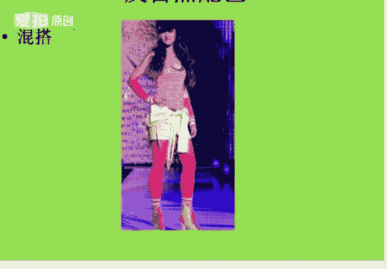
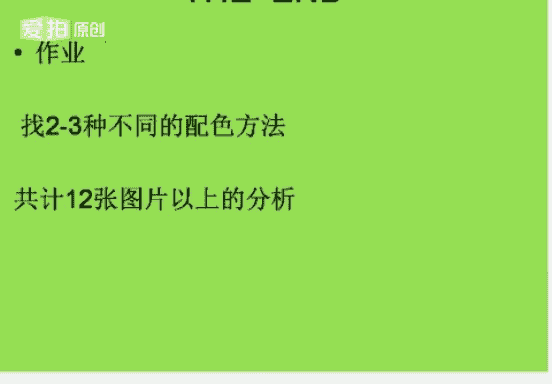

# 个人形象班：06：色彩基础-配色-第二课 🎨

在本节课中，我们将要学习服装搭配中的核心——配色方法。我们将从色相、明度、纯度等基础概念出发，系统地学习各种配色法则，帮助你理解如何将不同的色彩和谐地组合在一起，以应对不同的场合和风格需求。

---

## 认识PCCS色相环

上一节我们介绍了对色彩的基本认识，本节中我们来看看配色的具体方法。首先，我们需要回顾一个重要的工具——PCCS色相环。

PCCS色相环是日本色彩研究所的配色体系。在这个色相环中，最亮的颜色是位于正上方的黄色，最暗的颜色是位于黄色正下方的紫色。居于中间明度的颜色是绿色。理解色相环上颜色的位置关系，是进行所有配色操作的基础。

---

## 色相配色

色相配色是指利用色相环上不同颜色之间的差异进行搭配，从而形成对比效果的方法。我们将色相环上任意两个或三个颜色并置在一起，因为它们的差别而形成色彩对比现象，这就称为色相配色。

色相对比的强弱，取决于颜色在色相环上所处的位置。任何色相都可以作为主色，与其他颜色形成同一、类似或对比的关系。

以下是色相配色的三种主要类型：

### 1. 同一色相配色
同一色相配色是指色相相同，但明度和纯度不同的颜色进行搭配。
*   **公式**：`色相(H)相同，明度(V)和纯度(C)不同`。
*   **感觉**：单纯、雅致、含蓄、统一。
*   **缺点**：可能缺乏变化，显得单调呆板。
*   **技巧**：需要通过调整明度和纯度的变化来增强配色的生动性。例如，同是紫色，可以用深浅不同的紫色进行搭配。

### 2. 类似色相配色
类似色相配色是指在色相环上相邻1到3格内的颜色进行搭配。
*   **公式**：在色相环上选取相邻1-3格的颜色。
*   **感觉**：自然、和谐、柔和、有质感。
*   **特点**：对比度较弱，视觉效果舒适。

### 3. 对比色相配色
对比色相配色能造成强烈的变化感和视觉刺激。在色相环上，颜色之间的距离越远，对比效果越明显。对比色相配色又细分为三种：

**中差色相配色**
在色相环上间隔4到7格的颜色进行搭配。
*   **感觉**：时尚、稳重、柔和，属于中偏弱对比。

**对照色相配色**
在色相环上间隔约8到10格的颜色进行搭配。
*   **感觉**：效果强烈、令人兴奋，但容易产生视觉疲劳。例如黄色与宝蓝色的“撞色”搭配。

**补色色相配色**
在色相环上处于直径两端、相隔11格的颜色进行搭配。
*   **公式**：色相环上间隔180度的颜色，如红与绿、橙与蓝、黄与紫。
*   **感觉**：对比极为强烈、醒目。

---

## 明度配色

上一节我们学习了基于色相的配色，本节中我们来看看基于明度的配色。明度是指色彩的明暗程度。在色相环中，黄色的明度最高，紫色的明度最低。色彩的立体感和空间关系主要依靠明度差异来实现。

根据两色之间的明度差异，我们可以划分出10种明度调子：

以下是10种明度调子的具体介绍：

1.  **高长调**：大面积高明度色 + 小面积低明度色。感觉反差大、对比强、活泼刺激。
2.  **高短调**：大面积高明度色 + 小面积高明度色。感觉优雅、柔和、高贵，形象分辨率低。
3.  **高中调**：大面积高明度色 + 小面积中明度色。感觉对比明显、愉快、辉煌。
4.  **中长调**：大面积中明度色 + 小面积高明度色或低明度色。感觉稳重、有力度。
5.  **中短调**：大面积中明度色 + 小面积中明度色。感觉模糊、含蓄，但也可能呆板、不协调，不建议使用。
6.  **中中调**：大面积中明度色 + 小面积高明度或低明度色。感觉丰富、饱满。
7.  **低长调**：大面积低明度色 + 小面积高明度色。感觉强烈、有爆发性，但也可能压抑。
8.  **低短调**：大面积低明度色 + 小面积低明度色。感觉阴暗、低沉、有分量，也可能显得迟钝忧郁。
9.  **低中调**：大面积低明度色 + 小面积中明度色。感觉朴实、厚重、有力。
10. **最长调**：高明度色与低明度色各占一半。感觉强烈、锐利、简洁、时尚，但也可能空洞生硬。

---

## 纯度配色

接下来，我们学习以纯度调子为主的配色方法。纯度是指色彩中包含色相的程度，即色彩的鲜艳程度。色彩越接近纯色，纯度越高；混合的其他颜色越多，纯度越低。纯度分为高、中、低三种。

纯度配色的关系同样分为同一、类似和对比。

以下是纯度配色的三种类型：

1.  **同一纯度配色**：相同纯度的色彩搭配。例如高纯度配高纯度，中纯度配中纯度，低纯度配低纯度。
2.  **类似纯度配色**：相邻纯度等级的色彩搭配。例如高纯度配中纯度，中纯度配低纯度。
3.  **对比纯度配色**：纯度差异大的色彩搭配。例如高纯度配低纯度。

**注意**：无彩色（黑、白、灰）只有明度，没有纯度。

---

## 色调配色

色调配色是以PCCS色调图为基础，综合考虑色彩的明度和纯度属性进行的搭配。色调图将颜色按明度和纯度的组合进行分类（如Vivid鲜色调、Light浅色调、Dark深色调等）。

以下是色调配色的三种方法：

1.  **同一色调配色**：相同色调的色彩搭配。色彩群统一和谐，易形成柔和之感。即使色相对比，也在统一的色调下产生变化感。
2.  **类似色调配色**：相邻色调的色彩搭配。感觉和谐、有层次。
3.  **对比色调配色**：相距较远的色调色彩搭配。对比强烈，视觉冲击力大。

---

## 典型配色方法

掌握了基础原理后，我们来看一些具体、实用的典型配色方法。

以下是几种常用的配色方法：

*   **两色配色**
    *   **无彩色 + 无彩色**：如黑、白、灰之间的搭配。营造沉稳、专业、干练的氛围。需在明度上拉开距离。
    *   **无彩色 + 有彩色**：如黑白灰与任何颜色的搭配。醒目、专业。夏季用淡色调显清新，高纯度有彩色搭配无彩色则显精致典雅。
    *   **有彩色 + 有彩色**：两种或多种颜色的搭配。显得时尚、丰富。

*   **单色系法**：特指在明亮浅淡的调子上，通过微妙改变同一色相的明度或纯度来营造色彩感觉。极具轻柔淡雅的美感，适合内敛的女性。

*   **改变面积**：通过调整不同颜色在搭配中所占的面积比例来达到视觉平衡。在服装配色中，上下装色彩的面积比例通常遵循2:3、3:5或5:8等序列关系。

*   **节奏配色**：色彩有规律地反复变化，形成连续的美感。可以分为色相节奏、明度节奏和纯度节奏。

*   **点缀配色**：在整体服装中，用小面积的配饰（如首饰、包包、丝巾）亮色来提亮，起到画龙点睛的作用。通常在深色中用亮色点缀，在无彩色中用有彩色点缀。

*   **渐变配色**：色彩按照某种规律（明度、纯度或色相）进行有次序的递增或递减变化。色相渐变时，选择范围不宜大于45度，且颜色最好在4个以内。

*   **支配配色**：使用一种起主导作用的色彩来统一整体画面，获得整体的统一感和调和感。常用于海报设计。

*   **分离配色**：在两个对比色之间加入第三个颜色（通常是无彩色，如白、灰、黑），使两色关系更清晰或更紧凑。灰色效果最柔和。

*   **三角与四角配色**：在色相环上选取构成正三角形的三种颜色进行搭配，称为三角配色；选取构成正方形或长方形的四种颜色进行搭配，称为四角配色。可以用统一的色调来协调。

*   **反自然配色**：一种打破常规的混搭方法，传递个性、挑战、时尚另类的信息，强调自由和个性表达。

---

本节课中我们一起学习了服装配色的核心体系。我们从色相、明度、纯度的基础概念出发，深入探讨了同一、类似、对比等多种配色关系，并介绍了十多种实用的具体配色方法。理解这些原理和方法，能帮助你有章法地组合色彩，创造出和谐、得体且富有个人风格的着装。请尝试运用2-3种不同的配色方法完成搭配练习。