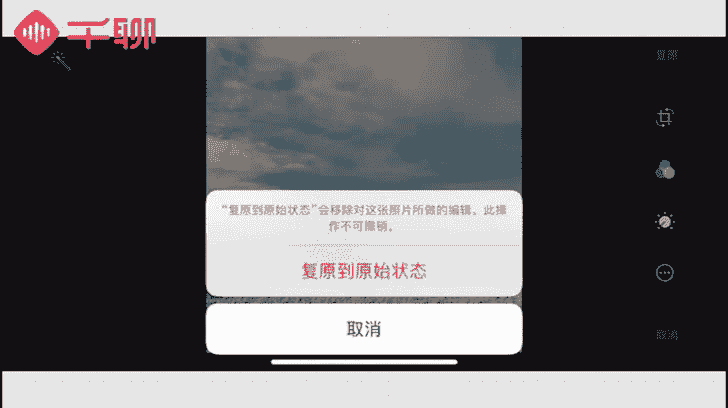
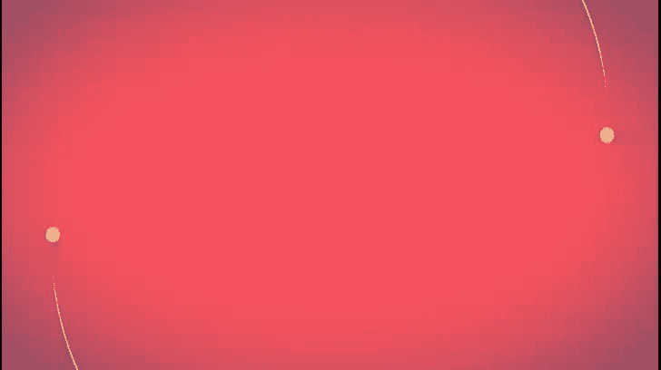

《明星之摄影课》：07：手机拍摄高逼格照片：第三课：【光线捕捉】找到最适合的光影，提升照片故事感

在本节课中，我们将要学习摄影中一个至关重要的概念——曝光。掌握如何理解和运用光线，是提升照片质感与故事感的关键。我们将从认识不同光线环境开始，学习如何在各种条件下控制曝光，并探索一些特殊光线下的创意拍摄技巧。

上一节课我们介绍了构图的原则。本节中，我们来看看如何通过控制曝光来驾驭光线。

如果是单反摄影，影响曝光的参数非常多，例如**光圈、快门、ISO感光度**，以及在拍摄过程中调节**曝光补偿**。但如果是手机摄影，我们无需了解如此繁杂的参数。

我们只需要侧重于对摄影曝光的认知，以及学习如何使用手机选择合适的曝光进行拍摄。相信大家在日常生活中经常用手机拍照，例如记录美食、展览、旅行风景或进行自拍。

这些场景都很常见。但大家可能注意到，在室内光线不足的地方，拍出的照片会显得特别暗或不够清晰。在户外日光强烈时，又容易拍出过曝的照片。这些都是常见的曝光问题。

那么，如何保证拍摄的画面质量呢？这在很大程度上取决于我们如何了解并运用好曝光。

接下来，我们先介绍拍摄中可能遇到的光线和场景。首先，日常室外光线主要分为两种：晴天光线充足的场景，和阴天光线不足的场景。

但晴天也分很多时间段。拍摄时需要充分了解每个时间段光线带来的效果。晴天时光线非常充足，拍摄出的画面效果明亮，色彩鲜明，整体感觉透亮清新。

例如这张照片，天空湛蓝，视野通透，建筑色彩突出。由于建筑遮挡部分阳光，船只形成了明显的阴影，使得整张照片看起来既透亮又立体。

但在光线充足的情况下，需要注意两个问题。首先，光线太强容易造成高光过曝，需要控制画面曝光度。拍摄时应尽量避免光线直射镜头，否则极易过曝且难以调整。

其次，应避免在正午日照强烈时拍摄。因为光线过于充足和强硬，会导致明暗对比过于强烈，容易丢失画面细节，且后期难以弥补。如果希望保留细节，建议让曝光度稍低一些。

拍摄了曝光度较低的照片后，可以通过后期调整照片的亮度和对比度，将画面曝光调节到正常水平，同时保留更多细节。

我们通过一张曝光不足的照片来演示如何通过后期调整曝光。可以点开iPhone自带的照片编辑功能。

然后点开太阳图标。在“光效”选项后有一个下滑三角，点开它。

这张照片的问题是暗部不够亮，但为了保持天空亮度，导致暗部细节丢失。我们主要通过调整“阴影”部分。

将过于暗的暗部调亮。这样可以看到画面已经和谐很多。

然后，可以稍微调整一点“高光”。让亮部的颜色也能还原一些。

这样，一张照片的调整就完成了。

大家可以看一下调整前后的对比。那么，曝光过高的照片是否就完全不好呢？其实并非如此，有时我们反而可以利用过曝让画面更简洁干净。

举个例子。有时我们需要干净的白色背景、墙面或桌面，希望呈现非常纯净的白色。正常曝光可能难以实现，这时曝光过度就可以帮助我们。

我们可以利用手机将曝光稍微调高一点。这样就能呈现出特别白净的效果。

或者，当远处景物比较杂乱时，也可以通过曝光过度，规避掉远处杂乱的颜色，从而拍摄出干净好看的画面。

说完光线充足的环境，我们再来说说光线条件较弱的环境。例如阴雨天气或采光不好的室内，都容易出现曝光不足的情况。

很多人会直观认为阴雨天光线不好，不适合拍照。但其实每个特定的光线下都可以拍出美丽的风景。

虽然阴天环境光线较弱，但会显得非常柔和，不刺眼。在这种光线下拍照，画面会给人一种平和安静的感觉。稍有不足的是，阴天环境下光影不明显，缺乏鲜明对比，照片可能立体感稍弱。

大家可以看这张在阴天户外拍摄的图片。天空和草丛都蒙上了一层灰灰的阴影感，整个画面没有过亮，也没有明显的黑影，光线分布比较平均均匀。

当然，这个前提是光线仍能满足基本拍摄要求。如果遇到光线实在太差的情况，我们可以使用闪光灯进行曝光补偿。

大家是否还记得第一节课讲过的手机自带闪光灯的使用？当时提到，如果距离拍摄物过近，很容易造成对比过强或前景过曝。

因此，解决方案是让镜头离拍摄物品稍微远一些，这样闪光灯折射出的光线拍到物品上会比较柔和。这个小技巧大家后来有好好使用吗？

以上我们主要讲解了现实生活中常见的光线条件，以及如何在这些条件下拍出好看的照片。光影效果是摄影最重要的环节之一，利用不同的光影，可以创作出极具创意的照片。

下面教大家几个特殊光线条件下的拍摄技巧。第一个是很多人喜欢的侧光和逆光拍摄。什么是侧光以及逆光呢？大家可以看下面这张示意图来简单理解。

我们用画面中的笑脸代表一个人，三角形指的方向是人的正面。在人的正面，我们用一台手机拍照。用一个小太阳代表光源位置。如果光源在图中位置一照射，我们称之为顺光，因为它是顺着拍摄方向照在人脸上的，这样拍人的正面时，脸部光线充足。

顺光拍摄比较简单。与之相对应的光线条件是逆光。逆光的光源在拍摄主体的背部，如图中位置三。逆光拍摄时，人物脸部由于没有足够光线照射会显得较暗，而人物背景由于光线直射会非常明亮，这样拍出的照片就是逆光照片。

逆光照通常背景比较清晰，而拍摄主体不清晰，只保留轮廓，容易丢失细节。如果拍摄主体亮度过低，呈现黑色轮廓，就形成了我们所说的剪影照。

除了顺光以及逆光，图中光源出现的其他位置都称之为侧光，如图中左右两边框起来的位置。如果是从斜后方照射过来，就是侧逆光。如果是从斜前方照射过来，就是侧顺光，这都非常好理解。

通过字面意思可以明白，侧光效果由于光线从一边照射过来，容易形成明暗对比，增加拍摄对象的立体感。一般落日黄昏时，因为光线是斜射的，所以很容易拍摄出侧光效果。

像上面这张图，侧光拍摄带来的明显光影效果，会让整个画面显得非常有质感。

如果在拍摄人像时，想要人物的脸部轮廓比较立体，也可以使用侧光来拍摄。这样会有一些明暗对比，人物脸部轮廓也会非常立体好看，但一定要把光源的曝光把握得比较准确。同时，如果有光源从侧边照过来，可以让脸部更加柔和，会有一些逆光加光影的效果。

逆光、侧光这些专业名词，大家刚接触可能有些难以理解。没关系，我们一步一步来帮助大家加深理解。

大家可以看到这张照片，它是在黄昏时逆光拍摄的一个坐在凳子上的雕塑。整张照片最亮的部分是雕塑后面的背景，而画面中的男孩和树干都比较暗。这样，照片会更有氛围感，让我们能从中看到一些故事和神秘的感受。

那么，如何拍出一张好看的逆光或侧光照片呢？其实很简单，基本操作是在拍摄时，将测光点定在亮处，以背景高光的地方为测光标准。如果以前面暗的地方为主体测光点，很容易就会把亮的地方过曝。

测光点确定之后，可以根据画面目前的曝光情况，拖动小太阳图标来调节曝光，调节到你觉得背景不过于刺眼，同时前景的拍摄主体相对比较清晰，就可以按下快门了。这样我们就完成了逆光的拍摄。

大家要常常练习，多拍照片，多多对比，锻炼对光线的感知。这样慢慢就会形成意识，更容易找到最适合的曝光程度了。

根据上面的内容，我们可以总结一下，拍摄时究竟如何选择光线比较好呢？推荐大家按照自己想要的拍摄效果来选择。

如果希望拍摄效果阳光、青春、有活力。那么这种风格一定要找充足的光线，能够表达阳光活力一面的光线来拍摄。

如果你想拍摄有意境、环境感非常强的照片。我们可能会选择低光或弱一点的光线来拍摄。

当我们选择了合适的光线来表达拍摄内容之后，还可以选择手机自带的滤镜或调色软件来丰富画面。让画面调整到最佳状态，更加完整，色调更加统一。如果有一些前期不足，通过后期App也可以把它修饰得更好。

其实光线对摄影的重要性，大家是知道的。没有光就没有影像。所以通过这一节课，最重要的是把握光线，一定要好好学好。因为它可以给我们的整个照片提升质感。所以大家一定要把光影运用好，然后运用到自己的照片中，形成一种风格。

好了，又到布置作业的时候了。这次和以前一样，我们要在光线充足以及逆光这两种光线条件中任选一种，拍摄你认为最满意的照片，放到作业卡中。老规矩，会在优秀学员中选择礼物送出。好好做作业，期待看到你们有故事的光影作品。

下一节课我们将着重讲色彩的运用。色彩对于整个片子的调性来说是极其重要、带有情绪的一课，希望大家能够好好积极准备。期待我们下次见面。

**本节课总结：**
本节课我们一起学习了摄影中关于曝光的核心知识。我们认识了晴天与阴天等不同光线环境的特点及拍摄注意事项，学习了通过后期调整曝光的方法，并深入探讨了侧光与逆光这两种特殊光线的定义、效果及拍摄技巧。关键在于理解光线、控制曝光，并多加练习以培养对光影的感知，从而提升照片的质感与故事感。