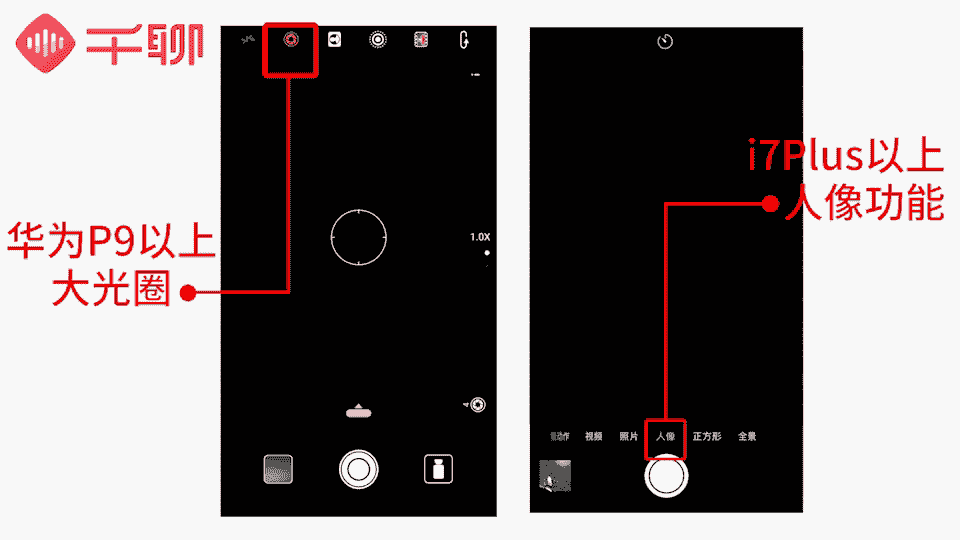

# 明星之摄影课：07：手机拍摄高逼格照片：第五课【人像摄影】把握五大要素，成为朋友中最会拍照的人

在本节课中，我们将深入学习人像摄影。这是手机摄影中至关重要的一课，目标是掌握核心技巧，让你能拍出自然好看的人像照片，成为朋友圈中的摄影高手。我们将从五个关键要素入手，系统性地讲解如何把人拍得更好看。

上一节课我们探讨了色调如何为照片增添温度与内涵。可以说，色彩是照片中蕴含情绪与故事的最佳呈现方式。前四节课我们主要讲解了基础的拍摄技巧和入门操作。本节课，我们将提升难度，从具体场景出发，学习如何拍出既好看又富有格调的人像照片。

人像摄影的核心是什么？核心是人必须拍得好看。风景可以普通，但人像必须出色，否则很容易引起被拍者的不满。本节课的核心目标，就是学会如何把人拍得好看、好看、再好看。掌握这些技巧，能让你的闺蜜不再抱怨，也能让你的男朋友不再把你拍丑。

拍出一张自然好看的人像照，是手机摄影中最基本，但也最常被忽视的要求。很多朋友在拍照时容易遇到问题：画面缺乏焦点、人物表情僵硬、手抖导致模糊，或者构图不佳导致主体不突出、画面元素杂乱。面对这些情况，请务必记住以下五个关键词。它们是提升你拍摄技术的核心要点。

以下是五个关键要素的详细介绍。

## 一、光线 🌞

在第三节课中，我们强调了合适的光影对照片的重要性，并介绍了不同光线条件下的拍摄方法。拍摄人像也不例外，光线是人像摄影中至关重要的武器。

我们拍照时主要会遇到三种光线效果：顺光、侧光和逆光。

*   **顺光拍摄**：光线从拍摄者背后照向被摄主体。在这种条件下拍出的照片比较平和，人物与背景的对比不强烈，主要侧重于表现人物的整体形象或人物与环境的关系。
*   **侧光拍摄**：光线从侧面照向被摄主体。这会使人物立体感明显，显得更真实、厚重。侧光主要分两种：
    *   **前侧光（45度角）**：光线来自被摄主体前方约45度角。这种光线打在脸上，既保证光线充足，又能带来立体感，非常适合人像拍摄。
    *   **正侧光（90度角）**：光线来自被摄主体正侧面。这种光线容易形成“阴阳脸”（半边脸亮、半边脸暗），除非追求特殊效果，平时较少使用。
*   **逆光拍摄**：光线从被摄主体背后照向镜头。这种光线更容易营造梦幻、温暖的氛围。一个常用技巧是让被摄者的头部稍微遮挡住光源最亮的部分，从而在人物轮廓周围形成一圈好看的光晕。

此外，让人物的眼睛里有光（即“眼神光”）是一个特别的技巧。眼睛是心灵的窗户，能传达丰富的情感。在拍摄正面照时，多关注被摄者的眼睛，确保眼神光清晰，能让照片中的人物看起来更有神采。

## 二、对焦 📸

对焦是确保人物清晰的关键。一般人像摄影的对焦点都在人物身上，但根据构图不同，对焦点的选择也有讲究。

就像眼神光一样，眼睛常常是对焦的重要位置。

*   **拍摄半身照或特写时**：对焦点应定在人物的眼睛附近，确保眼睛清晰，这样整张照片的焦点就落在了人物身上。
*   **拍摄远距离全身照时**：对焦点可以在人物身上，但选择上半身（如胸部或脸部）比对焦在腿部更好，除非是拍摄行走等特殊动态场景。

人像摄影中常追求背景虚化的效果，以更好地突出人物主体。现在很多手机都具备大光圈模式或长焦镜头（如华为P系列的大光圈、iPhone 7 Plus以上的长焦镜头），可以直接实现背景虚化。

以下是使用iPhone人像模式的简单步骤：
1.  打开相机的“人像”模式。
2.  像平时一样构图。
3.  根据环境调整光线，可利用HDR功能确保曝光准确。
4.  手机会自动对焦到人物身上，保持镜头稳定后按下快门即可。

拍出的照片背景会自动虚化，人物主体突出。

有些朋友会使用后期App（如美图秀秀）的一键虚化功能。但需要注意的是，很多App的虚化效果比较生硬，不如拍摄时自然形成的景深有层次感。如果虚化圈调整不当，反而会削弱主体的视觉效果。因此，建议尽量在拍摄前期就利用手机功能做好背景虚化，慎用后期调节，使用时也要注意不要冲淡主体。

## 三、角度 📐

角度选择是摄影师需要重点思考的问题，它直接关系到如何最大程度展现被摄者最美的一面。这里从常见的拍摄需求出发，介绍几个好看的角度。

**1. 如何拍出“大长腿”：**
*   **拍摄角度**：避免使用45度俯拍或过度仰拍。尽量采用“马步蹲”的姿势，保持相机与被摄者腰部或腿部平视。
*   **脚部位置**：将脚置于取景框的底部边缘。巧用广角镜头的透视特性，可以有拉长腿部线条的视觉效果。尝试将脚放在画面边缘与放在居中位置，对比效果显著。
*   **比例分布**：人物在画面中的比例很重要。头顶上方的留白约占画面的三分之一为佳，脚部尽量向画面底部延伸。搭配短款上衣和高腰裤/裙，可以进一步优化身材比例。

**2. 如何让脸看起来更瘦：**
*   **拍摄侧脸或回头照**：只露出半张脸或3/4侧脸。被摄者可以了解自己哪边脸更上镜。
*   **利用手或头发遮挡**：用手轻轻托住下巴，或将长发拨到前面，稍微低头，可以遮挡部分下颌骨，让脸部视觉上更消瘦。
*   **使用道具**：可以用道具（如书本、杯子、树叶）挡在镜头前制造前景，或让模特手持道具遮挡部分脸颊。**注意**：对焦点仍需在人物眼睛上，而非遮挡物上。

## 四、构图 🖼️

人像摄影的构图可分为两种情况：

*   **人物占据画面主体时**：可以运用一般的构图法则。例如，将人物眼睛或身体关键部位放在画面的**黄金分割点**或**三分线**上，遵循这些基本法则就能拍出好看的照片。
*   **拍摄远距离环境人像时**：需要注意画面的视觉引导，否则人物容易淹没在环境中。常用的引导方法有：
    *   **线条引导**：利用环境中的道路、栏杆、墙壁等线条，将观众的视线引向人物。
    *   **景框引导**：利用门框、窗户、树枝等自然形成的“框”，将视觉焦点锁定在框内的人物身上。

## 五、和谐 🤝

“和谐”包含两点：画面整体的协调性，以及人物姿态的自然度。

*   **人物与环境的协调**：主要通过服装色彩搭配和道具运用来建立和谐的调性与画面。选择一个适合主题的场景，并让被摄者的着装与环境搭配统一，这样拍出的画面会更完整、有风格。恰当的道具能配合环境和情绪，提升画面层次感和丰富度。
*   **拍摄双方的配合**：最重要的是建立信任感。让被摄者完全信任你，才能降低其防备和不自信，在镜头前更自然地展示自己。沟通是关键，可以让被摄者融入环境，做一些自在的动作（如喝咖啡、看书），捕捉其自然状态。

掌握了以上五个关键点，我们来看看在一些常见难题场景中如何应用技巧。

## 场景应用：摆拍与抓拍

很多人觉得自己“不上镜”，这通常是因为缺乏“镜头感”。镜头感是指在镜头前能自然呈现较好状态的能力。

*   **对于镜头感强的人**：摆拍不是问题，关键是找好角度并避开自身缺陷。如何摆拍好看？我们已经学习了拍出大长腿和显瘦的技巧，运用即可。
*   **对于镜头感不强或害羞的人**：可以用抓拍代替摆拍，表情和动作会更自然。一个常用技巧是**不直视镜头**。让被摄者忽略镜头的存在，认真做另一件事（如看书、赏景），摄影师则在一旁捕捉其自然瞬间。

**抓拍**能捕捉不经意的瞬间，带来惊喜，效果更自然。它考验摄影师的观察力、判断力和行动力。
*   **准备要快**：缩短打开相机的路径（如iPhone点亮屏幕后右滑），以便迅速抓住瞬间。
*   **培养发现力**：多观察生活中有趣的瞬间或美好事物，多看优秀摄影作品，提升审美。
*   **保持冷静**：按下快门的瞬间要笃定，避免因匆忙影响画质。
*   **制造时机**：如果难以抓拍意外瞬间，可以主动创造。让被摄者做一连串动作，使用手机的**连拍功能**记录整个过程，然后从中挑选最满意的一张。

## 场景应用：旅行与聚会照

**1. 如何拍出高逼格旅行照（非普通游客照）：**
*   **避开常规位置**：不要直接站在标志性建筑物旁拍照。
*   **避开人群**：尽量选择人少的角度或时机。如果避不开，可等待人群稀疏的瞬间快速抓拍，后期通过App加暗角或重新构图来弱化背景人群的存在感。
*   **融入环境**：采用“你玩你的，我拍我的”方式。让被摄者尽情享受旅行，摄影师负责抓拍其自然状态，这样的照片更有生活气息和感染力。
*   **创意纪念照**：可以拍摄一些有个人特色的细节，如自己的鞋子与当地地面的结合，或用对自己有纪念意义的小物件与地标合影，这样的照片独特且有意义。

**2. 如何拍好集体合照：**
集体照人物较多，一般较少使用虚化，更侧重整体构图和风格统一。
*   **画面干净**：确保背景没有多余杂物。
*   **服装统一**：尽量让每个人的服装风格保持一致，视觉效果会更好。
*   **排列有序**：人物尽量聚集，动作风格一致。排列时可按身高，中间高两边低，形成有美感的构图。使用自拍杆时，矮者半蹲在前，高者站两侧或后方。所有人看镜头时，应微收下巴，避免过度仰头导致脖子不自然。

## 总结

本节课中，我们一起学习了手机人像摄影最重要的五个核心要素：**光线、对焦、角度、构图与和谐**。我们详细探讨了每种光线的特点与应用，对焦点的选择技巧，如何通过角度优化身材与脸型，构图的基本法则与视觉引导，以及如何营造画面与人物姿态的和谐感。此外，我们还针对摆拍、抓拍、旅行照和集体照等具体场景，提供了实用的拍摄技巧。

希望大家通过本课的学习，能够掌握把人拍好看的方法，多多练习，成为朋友圈中最会拍照的人。

**本期作业**：提交一张你认为最好看的、非自拍的他人人像照片。

下一节课，我们将探讨“自拍的小心机”，敬请期待。