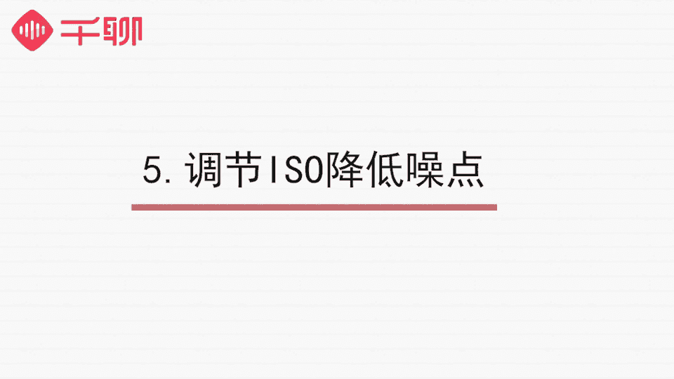

# 明星之摄影课：08：夜景拍摄

在本节课中，我们将学习如何在光线不足的夜晚，使用手机拍摄出清晰、高质量的照片。我们将逐一解决夜景拍摄中常见的曝光不足、画面模糊和噪点多等问题。

---

上节课我们介绍了静物拍摄的技巧。本节中，我们来看看手机摄影中颇具挑战性的一环——夜景拍摄。许多人在夜晚拍照时，常遇到照片漆黑、模糊或充满噪点的问题。本教程将通过解决这些具体问题，帮助你掌握弱光环境下的拍摄方法。

夜景拍摄面临诸多不利条件。回忆之前课程，摄影的三要素是**曝光、对焦和构图**。夜间环境最缺乏的就是光线，这会导致照片出现以下三个主要缺陷：

以下是夜景拍摄的三个常见问题：
1.  **曝光不足**：光线达不到要求，照片会一片漆黑，缺乏细节。
2.  **画面模糊**：光线不足时，快门速度降低，手持拍摄的轻微抖动就会导致成像模糊。
3.  **噪点过多**：手机感光元件在弱光下会提升感光度（ISO）来补偿曝光，这会产生大量噪点，影响画质。

那么，如何规避这些问题，拍出清晰、低噪点的夜景照片呢？我们从以下几个方面入手。

---

### 一、适合夜景拍摄的环境

首先，并非所有夜晚都适合拍摄。我们需要选择天气晴朗的夜间进行拍摄。晴天的空气通透度高，能有效减少光线散射，让拍出的照片更清晰。

### 二、寻找合适的光源

光线是夜景拍摄的命脉。为了确保拍摄质量，可以遵循以下三个原则：

以下是寻找光源的三个原则：
1.  **把握黄金时段**：尽量在太阳刚落山，天空尚有余晖，而城市灯光陆续亮起时拍摄。此时的自然光线均匀柔和，能保证画面质量。
2.  **主动寻找人造光源**：若必须在完全入夜后拍摄，需主动寻找光源。城市的路灯、商店橱窗的灯光都是常用且理想的光源。
3.  **控制光线角度与强度**：找到光源后，需注意光线强度适中，避免过曝。尽量与光源保持一定距离，镜头不要正对强光。例如，拍摄车流时，应选择人行天桥或路边建筑内，而非直接站在马路边，以避免车灯直射导致过曝。

**曝光调节**是夜景拍摄的关键。在弱光下，手机会默认提高曝光值，导致亮部过曝。此时需要手动调节曝光补偿（通常是一个“±”图标或滑块），将曝光值拉低，直到亮部细节清晰、暗部也不至于完全丢失细节为止。

如果拍摄夜景人像，最好为人物找到一个聚焦的光源。例如，让人物站在路灯下，让光线打在脸部或身上，而周围环境较暗。这样能形成强烈的视觉焦点，使照片更具表现力。

### 三、防止画面抖动

夜间光线不足，手机会降低快门速度以获得更多进光量，但这使得照片极易因抖动而模糊。解决方法就是保证拍摄时手机绝对稳定。

手持拍摄通常难以满足稳定性要求，按下快门的动作本身就会引起抖动。因此，必须借助工具。

以下是防止抖动的两种方法：
*   **使用三脚架**：这是最有效的解决方案。将手机固定在三脚架上，能彻底杜绝抖动。
*   **寻找临时支撑点**：若无三脚架，可将手机倚靠在栏杆、矮墙、窗沿上，或利用其他物品将手机夹稳。

此外，尽量使用外接设备触发快门，避免触碰手机机身。
*   **蓝牙遥控器**：通过蓝牙连接手机，远程控制快门。
*   **耳机线控**：大部分手机的耳机音量键（通常是降低键）可以充当快门键。例如，iPhone耳机和大部分安卓耳机都支持此功能。

使用这些外接设备，能最大程度减少机身震动，确保画面清晰。

### 四、延长曝光时间

为了在弱光下获得清晰明亮的照片，我们可以延长曝光时间。这需要用到手机的**慢门（长曝光）摄影**功能。

华为手机相机自带“流光快门”模式。苹果用户可使用系统自带的 **Live Photo** 功能拍摄后，在相册中将效果选择为“长曝光”，或下载如 **Slow Shutter** 这类专业长曝光应用。

下面以拍摄车流光轨为例，演示操作：

1.  **固定机位**：找到合适位置，用三脚架或上述方法将手机牢牢固定。
2.  **开启功能**：
    *   **iPhone (使用Live Photo)**：打开相机，确保顶部的 **Live Photo**（实况照片）图标为黄色开启状态。正常拍摄即可，事后在相册中向上滑动该照片，在“效果”中选择“长曝光”。
    *   **使用Slow Shutter等APP**：打开应用，固定好手机后，按下快门开始曝光，待车流划过形成理想光轨后，再次按下快门结束曝光。
3.  **控制曝光时间**：曝光时长由你控制。时间过长会导致过曝，过短则无法形成光轨效果。需要根据现场车流速度和光线多次尝试。例如，在示例场景中，**4秒**左右的曝光时间效果较佳。

**公式**：`光轨效果 = 固定机位 + 慢速快门 + 移动光源`

慢门摄影不仅适用于车流，还可用于拍摄如丝般的水流、瀑布，或创作光绘涂鸦，功能非常强大。华为的“流光快门”模式还预设了车水马龙、光绘涂鸦等场景参数，使用起来更加便捷。

### 五、调节ISO以降低噪点

夜间照片噪点多的主要原因是手机自动提升了ISO（感光度）来补偿曝光。ISO值越高，画面越亮，但噪点也越多。

**公式**：`画质 ≈ 1 / ISO` （ISO越高，画质通常越差）

如何解决？现在许多安卓手机的原生相机**专业模式**支持手动调节ISO。此外，也可以使用第三方APP，如 **ProCam**、**NightCap** 等。

以下是调节ISO的建议：
*   **调节方法**：在相机的手动或专业模式中找到 **ISO** 选项进行调节。
*   **参数范围**：拍摄夜景时，ISO值不宜过高。通常将ISO控制在 **200至800** 之间，能在保证画面亮度的同时，有效控制噪点水平。
*   **灵活调整**：具体数值需根据环境光线反复测试和对比，选择成像效果最佳的组合。

---

### 总结

本节课我们一起学习了手机夜景拍摄的核心技巧。我们来总结一下要点：

以下是夜景拍摄的五个核心要点：
1.  **选择晴朗天气**：保证环境通透，避免照片朦胧。
2.  **主动寻找并控制光源**：光线是夜景的命脉，要善用黄金时段和人造光，并注意光线角度与强度。
3.  **确保手机绝对稳定**：使用三脚架、遥控器或耳机线控来避免抖动，这是获得清晰照片的基础。
4.  **善用慢门长曝光**：利用手机自带功能或APP（如Live Photo、Slow Shutter、流光快门）拍摄车流光轨、水流等特效，并精确控制曝光时间。
5.  **手动控制ISO**：在专业模式或第三方APP中将ISO值设置在合理范围（如200-800），以有效减少画面噪点。

记住这五个要点，你就能在夜晚也能用手机创作出清晰、富有意境的摄影作品。

**课后作业**：请运用本节课所学知识，拍摄一张构图完整、画面清晰的夜景照片。