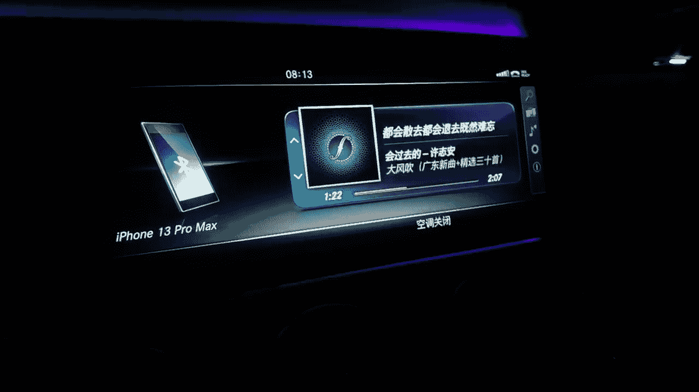
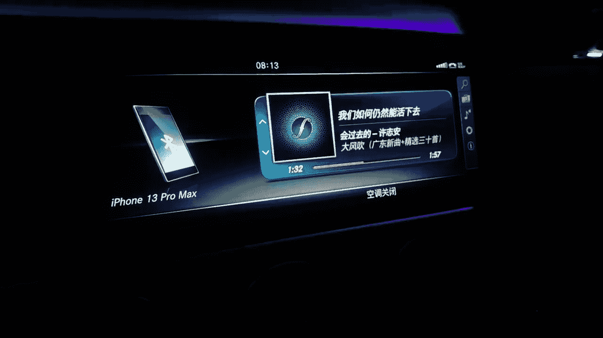
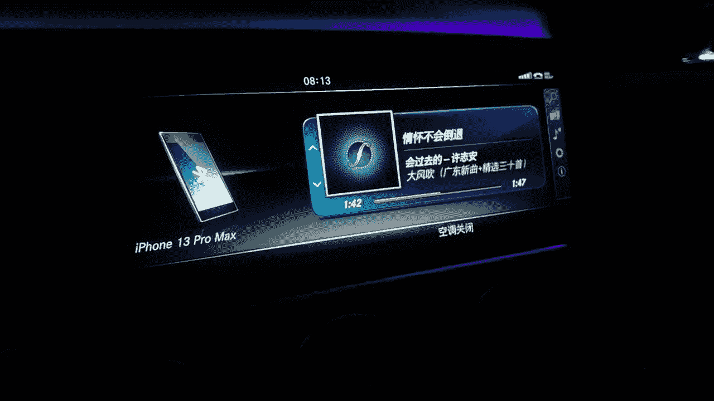

# 男哥展示面：1.08：展示面更新与思考

在本节课中，我们将学习如何更新和优化个人展示面，并通过一系列图片示例来探讨展示面背后的思考逻辑。我们将分析不同场景下的展示面元素，帮助你理解如何构建更具吸引力的个人形象。

---

上一节我们介绍了展示面的基础概念，本节中我们来看看具体的更新实例与思考过程。

以下是一组展示面更新的图片示例，我们将逐一分析其特点。

**思考展示面的目的？**

这张图片引导我们思考展示面的核心目的：展示面不仅仅是照片的堆砌，更是个人生活、品味和价值的窗口。

此图展示了一个社交或休闲场景。环境布置和人物状态传递出轻松、有格调的氛围。

这张图片可能突出了特定的活动或兴趣爱好，通过场景化的内容增加个人形象的丰富度和真实感。

此处展示的可能是旅行或户外探索场景。广阔的背景和人物姿态能体现冒险精神和对生活的热爱。

这张图侧重于细节展示，如美食、饮品或精致物品，用以传达良好的生活品质和审美。

此场景可能涉及社交互动或团体活动，展示个人的社交能力和圈子价值。

这张图片或许展示了个人在专业或技能方面的场景，体现实用价值和才华。

最后一张图可能以艺术或抽象的方式收尾，强调整体展示面的风格一致性与独特个性。

---

本节课中我们一起学习了如何通过具体的图片案例来更新和思考个人展示面。关键在于理解每张图片所传递的**价值信号**（如生活品质、兴趣爱好、社交能力），并有意识地将这些元素组合，构建一个立体、吸引人的个人形象。记住，展示面的核心公式是：**真实生活 + 价值展示 = 有效吸引力**。持续更新并反思你的展示面，使其与你个人成长同步。